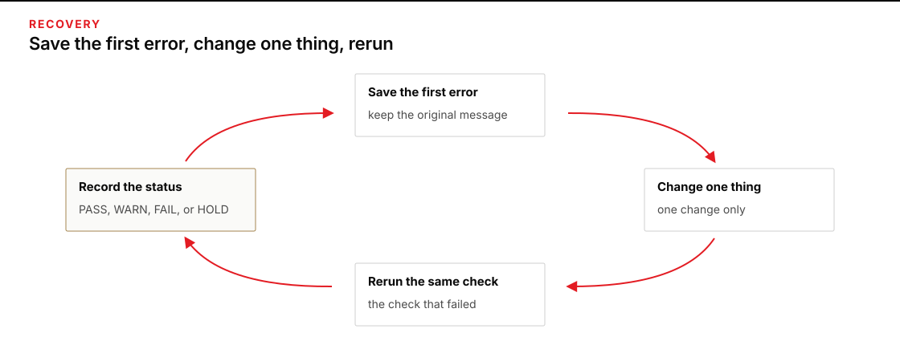
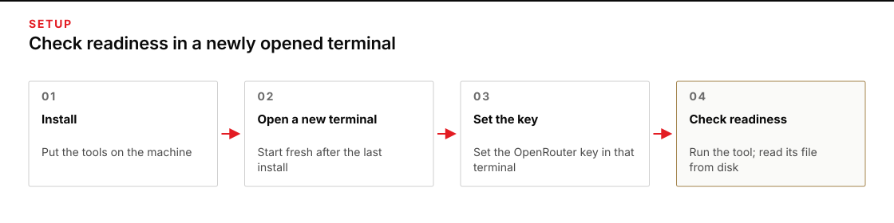

# Module 0 · Set up the harness and direct bounded work

Direct Oh My Pi to draft an internal email, then check every material claim against the supplied North Shelf facts. You decide what to delegate, set the limits, and accept the email only for its stated use.

First make the tools ready: install what is missing, reopen your terminal, and run a readiness check in which the model reads a fresh token and writes a real file through the course launcher. Complete the local n8n setup in the same platform guide before Module 6. OMP readiness, n8n readiness, and a checked email are separate results.

Allow 1–3 hours for setup. The bounded-work assignment has one three-hour facilitated session, including two hours of practice. These are planning allowances, not measured completion times.

## Start here

Choose one path and stay in it. A **terminal** is the text window where you enter commands; the **shell** is the program, such as PowerShell or Bash, that runs them.

| Your machine | Use this guide |
|---|---|
| Windows, native OMP with a WSL Ubuntu bridge for n8n | [Windows · PowerShell OMP and local n8n](platforms/windows-powershell.md) |
| Windows with or willing to install WSL 2 | [Windows · WSL 2 with Ubuntu](platforms/windows-wsl.md) |
| Mac | [macOS](platforms/macos.md) |
| Ubuntu desktop | [Ubuntu](platforms/ubuntu.md) |
| Arch Linux desktop | [Arch Linux](platforms/arch-linux.md) |

If you are unsure which Windows path to use, choose WSL when your organization permits it and you are comfortable restarting the machine. Choose PowerShell to keep OMP, Python, Git, credentials, and course work native to Windows; that guide uses WSL Ubuntu only for n8n. Both Windows routes require approved WSL 2 and Docker Desktop for n8n. If WSL is blocked, retain the native OMP result and record n8n HOLD until the owner resolves the prerequisite. Do not complete both OMP routes.

## What you will install

- Git and a **checkout**: the local copy of the private course repository.
- Python 3.12 or newer.
- Oh My Pi (`omp`) pinned at version 18.3.5.
- Local n8n **2.41.5**, using the full official Docker stack and a working modern `docker compose` plugin. Each platform guide contains its complete n8n path.

The platform steps preserve **PATH**, the saved list of folders your shell searches for commands. They check it in an independently opened terminal, not just the window that ran the installer.

You need GitHub read access to `TheHolofex/AIHB_OCT_2026`. The hosted-course password does not provide it. Each path first checks existing approved Git credentials; GitHub CLI (`gh`) is a conditional browser-login helper only if that access check fails. It is not an AI runtime requirement.

The readiness check runs a small, provider-billed task through `shared/run_omp.py`, using OpenRouter and `openrouter/anthropic/claude-sonnet-4.6`. Use an account you are authorized to charge and your own [OpenRouter key with a US$40 per-key ceiling](shared/CREDENTIALS.md). The provider and model are fixed; if you lack account or repository access, resolve that prerequisite with its owner before continuing.

Module 6 uses the local visual workflow editor without a paid model call. No n8n Cloud signup or Assistant provider key is required. Keep Assistant off and workflows unpublished; do not copy the OpenRouter key into n8n.

## Before the first command

- Reserve a restart window.
- Connect to a stable network.
- Keep at least 15 GB free; WSL should have 25 GB.
- Have administrator approval for operating-system packages.
- Obtain device-owner approval for the full stack’s privileged Docker-in-Docker runner, Docker access, and applicable Docker Desktop licensing. If approval is denied, record n8n HOLD.
- Preserve existing Docker contexts, containers, volumes, applications, and setup attempts. Resolve an occupied port 5678 or existing `$HOME/n8n-course` with its owner before installation.
- Keep credentials in the approved password manager or secure handoff.
- **Do not paste a key into a command, Markdown file, shell profile, screenshot, ticket, or repository.**
- If a managed laptop says that policy blocks a step, stop and save the exact message for whoever supports your machine.

## When a step fails

Save the first error message before you change anything, then work from [When setup stops](shared/TROUBLESHOOTING.md). Change one thing, and run the check that failed again.

*Save the first error, change one thing, and rerun the same check.*

Figure text

Save the first error message. Change one thing. Run the same check again.

## Ready means observable

The OMP setup check requires a terminal you opened after the last install to show these values:

*Run the readiness check from a terminal you opened after the last install.*

Figure text

Install the tools. Open a new terminal. Set the OpenRouter key in that terminal. Run the readiness check and read its file from disk. A tool saying done is not the same as a file on disk.

- `origin` reporting `https://github.com/TheHolofex/AIHB_OCT_2026.git`, `git rev-parse HEAD` reporting a 40-character id (the setup check prints the first 12); `git status --short` is reported for information only — unrelated changes are preserved and do not block setup or QA;
- an absolute Python executable reporting 3.12 or higher, selected by the platform's resolver and saved as `PY` (`$PY` in PowerShell);
- the Oh My Pi version string `omp/18.3.5`, and the absolute path the command resolved to, as printed by the setup check;
- the word `SET` from the key check in that same terminal — and the key value itself printed nowhere;
- one result file — `from-omp.txt` — read back from disk, written by the tool through the course launcher during the readiness check;
- the expected absolute tool path found without repairing PATH in that new terminal; and
- a setup report saved outside the checkout with no key, token, or password in it.

The setup report records the version, path, repository and key-presence observations as PASS, WARN or FAIL. The separate `verify_tool_proof.py` command checks the tool-written file, its token and the saved execution evidence, then reports `READINESS CHECK PASS` or `READINESS CHECK HOLD`. A passing setup report does not replace the live readiness check.

A **receipt** records what a run actually used and did: its inputs, tool calls, results, and file effects. Keep receipts and your **work folder**—the editable exercise copy—outside the checkout so a correction cannot overwrite the supplied inputs or an earlier attempt.

Open the result file and read it back before you accept it: a tool saying “done” is not the same as a file on disk.

## Local n8n readiness for Module 6

Complete your platform guide’s n8n path as an ordinary user. On the native PowerShell route, run only the n8n steps in the selected WSL Ubuntu; keep the earlier OMP environment intact. The fresh destination is `$HOME/n8n-course` in the intended shell, outside the checkout.

Record **n8n READY** only after observing all of these separately from the OMP report and live OMP proof:

- The intended new shell passes `docker info` and `docker compose version` against the approved local engine. Modern Compose can report version 5; legacy `docker-compose` alone is insufficient.
- The running n8n reports exactly `2.41.5`, and the published browser port is exactly `127.0.0.1:5678`.
- All six services appear: `n8n`, `runners`, `sandbox-api`, `sandbox-runner-1`, and `searxng` remain running; the one-shot `sandbox-certs` shows `Exited (0)`. Health checks are healthy where shown.
- At `http://localhost:5678`, the local owner can reopen a named blank, unpublished readiness workflow after reload. Assistant remains off.
- The same workflow survives the course stack’s ordinary `down` then `up -d`, using the same approved engine, directory, recorded project name, and named data volumes. Use the guide’s `course_n8n` helper; preserve `.course-project` across restarts. Never use `down -v`.

For the observed fresh-instance UI, complete **Set up owner account → Next**. If the optional survey appears, continue with **Get started**; choose **Skip** on the free-license offer and **Set up later in Settings** on the Assistant screen. From **Overview**, select **Build a workflow** on an empty instance. Click the workflow title, enter **Module 6 readiness**, and press **Enter**. The editor saves automatically; no mandatory **Saved** label is needed. Reload and confirm the name and blank canvas remain. Use an existing local login for an existing instance; never reset its owner. Preserve an existing workflow with that name and use a distinct name if it contains work.

These UI and runtime observations come from Apple Silicon only. They do not establish execution on other platforms; each learner must complete the checks on their own device. If the UI differs or any check fails, record **n8n HOLD** and use [When setup stops](shared/TROUBLESHOOTING.md). An n8n HOLD does not erase an OMP pass, and an OMP pass does not establish n8n readiness.
