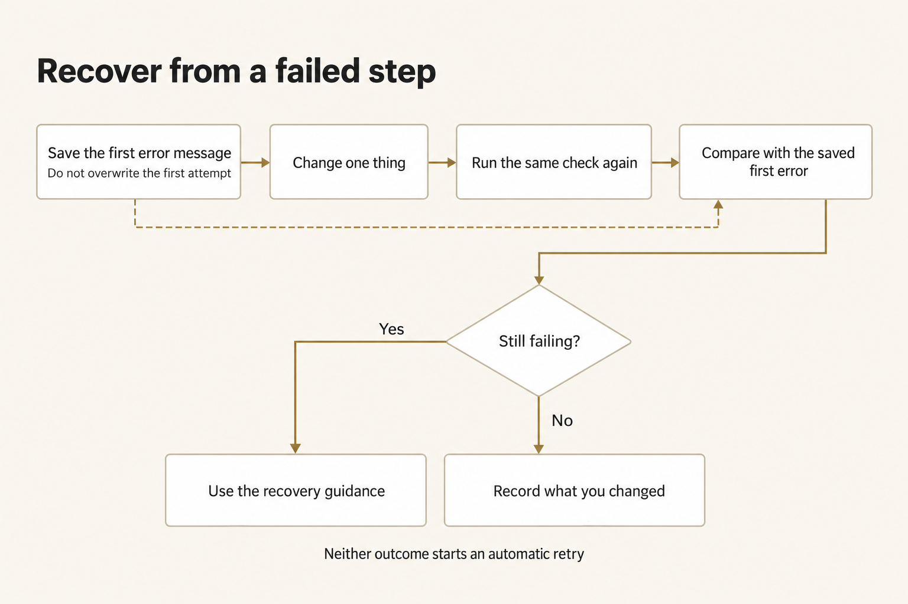
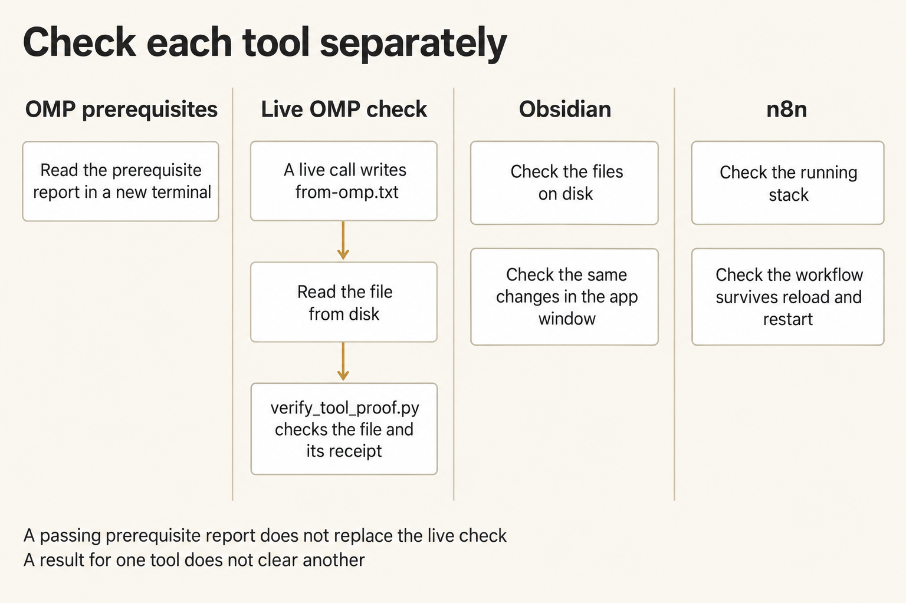

# Module 0 · Set up the harness and direct bounded work

Ask Oh My Pi to draft an internal email, then check every important claim against the supplied North Shelf facts. You decide what to delegate, set the limits, and accept the email only for its stated use.

First get the tools ready: install what is missing, reopen your terminal, and run a readiness check. In that check, the model reads a fresh token and writes a real file through the course launcher. Complete local Obsidian setup before Module 2 and local n8n setup before Module 7 in the same platform guide. Check OMP, Obsidian, and n8n readiness separately, and keep those checks separate from the checked email.

Allow roughly one to three hours for setup, and more if downloads, desktop readiness, or owner approvals take longer. The bounded-work assignment takes about three hours. These are rough estimates, not measured times.

## Start here

Choose one path and stay in it. A **terminal** is the text window where you enter commands; the **shell** is the program, such as PowerShell or Bash, that runs them.

| Your machine | Use this guide |
|---|---|
| Windows, native OMP with a WSL Ubuntu bridge for n8n | [Windows · PowerShell OMP and local n8n](platforms/windows-powershell.md) |
| Windows with or willing to install WSL 2 | [Windows · WSL 2 with Ubuntu](platforms/windows-wsl.md) |
| Mac | [macOS](platforms/macos.md) |
| Ubuntu desktop | [Ubuntu](platforms/ubuntu.md) |
| Arch Linux desktop | [Arch Linux](platforms/arch-linux.md) |

If you are unsure which Windows path to use, choose WSL if your organization permits it and you are comfortable restarting the machine. Choose PowerShell if you want to keep OMP, Python, Git, credentials, and course work native to Windows; that guide uses WSL Ubuntu only for n8n. Both Windows routes require approved WSL 2 and Docker Desktop for n8n. If WSL is blocked, keep the native OMP result and record n8n HOLD until the owner resolves that requirement. Do not complete both OMP routes.

## What you will install

- Git and a **checkout**: the local copy of the private course repository.
- Python 3.12 or newer.
- Oh My Pi (`omp`) pinned at version 18.3.5.
- Local Obsidian for Module 2: a **vault** is a folder of linked Markdown notes on your laptop. For a fresh install, use release **1.13.7**; if Obsidian is already installed, keep it and record the version it reports.
- Local n8n **2.41.5**, using the full official Docker stack and a working modern `docker compose` plugin. Each platform guide contains its complete n8n path.

The platform steps keep **PATH**, the saved list of folders your shell searches for commands. They check it in a new terminal window opened after the install, not just the window that ran the installer.

You need GitHub read access to `TheHolofex/AIHB_OCT_2026`; the hosted-course password does not give you that access. Each path first checks whether your approved Git credentials already work. Use GitHub CLI (`gh`) for browser login only if that check fails; you do not need it to run the AI.

The readiness check runs a small task through `shared/run_omp.py`, using OpenRouter and `openrouter/anthropic/claude-sonnet-4.6`. OpenRouter bills it to the account behind your key, so use an account you are authorized to charge and your own [OpenRouter key](shared/CREDENTIALS.md). The provider and model are fixed. If you lack account or repository access, ask its owner to resolve that requirement before continuing.

Module 7 uses the local visual workflow editor without a paid model call. No n8n Cloud signup or Assistant provider key is required. Keep Assistant off and workflows unpublished; do not copy the OpenRouter key into n8n.

## Before the first command

- Reserve a restart window.
- Connect to a stable network.
- Keep at least 15 GB free; WSL should have 25 GB.
- Have administrator approval for operating-system packages.
- Obtain device-owner approval for the full stack’s privileged Docker-in-Docker runner, Docker access, and applicable Docker Desktop licensing. If approval is denied, record n8n HOLD.
- Keep existing Docker contexts, containers, volumes, applications, and setup attempts. Resolve an occupied port 5678 or existing `$HOME/n8n-course` with its owner before installation.
- Keep credentials in the approved password manager or secure handoff.
- **Do not paste a key into a command, Markdown file, shell profile, screenshot, ticket, or repository.**
- If a managed laptop says that policy blocks a step, stop and save the exact message for whoever supports your machine.

## When a step fails

Save the first error message before you change anything, then work from [When setup stops](shared/TROUBLESHOOTING.md). Change one thing, and run the check that failed again.

*Save the first error before changing anything, change one thing, and rerun the same check.*

Figure text

Keep the first error and do not overwrite the first attempt. Change one thing, run the same check, then compare the result with the saved first error. If the problem remains, use the recovery guidance; if it is resolved, record what changed. Neither outcome starts an automatic retry.

## Ready means observable

The OMP setup check requires a terminal you opened after the last install to show these values:

*The prerequisite report, live tool write, and two application checks each show something different. One check cannot stand in for another.*

Figure text

Check each tool on its own. In a new terminal, inspect the prerequisite report. A live OMP call must write a file and produce a receipt; open the file from disk to check it. A setup report marked PASS cannot replace that live check. For Obsidian, check both the files on disk and what you see in the app window. For n8n, check both the running stack and whether the workflow stays saved in the browser. A result for one tool cannot clear another.

- `origin` reports `https://github.com/TheHolofex/AIHB_OCT_2026.git`, and `git rev-parse HEAD` reports a 40-character id (the setup check prints the first 12). `git status --short` is for information only: keep unrelated changes, which do not block setup or QA;
- the platform's resolver selects an absolute Python executable reporting 3.12 or higher and saves it as `PY` (`$PY` in PowerShell);
- the setup check prints the Oh My Pi version string `omp/18.3.5` and the absolute path it found for the command;
- the key check shows `SET` in that same terminal, without printing the key itself anywhere;
- the tool writes one result file, `from-omp.txt`, through the course launcher during the readiness check, and you read it from disk;
- the expected absolute tool path is found in that new terminal without repairing PATH; and
- the setup report is saved outside the checkout and contains no key, token, or password.

The setup report shows PASS, WARN or FAIL for the version, path, repository, and whether the key is present. Run `verify_tool_proof.py` separately to check the tool-written file, its token, and the saved record of the run; it then reports `READINESS CHECK PASS` or `READINESS CHECK HOLD`. Even a passing setup report does not replace the live readiness check.

A **receipt** records what a run actually used and did: its inputs, tool calls, results, and file effects. Keep receipts and your **work folder**—the editable exercise copy—outside the checkout so a correction cannot overwrite the supplied inputs or an earlier attempt.

Open the result file from disk and read it before you accept it: a tool saying “done” is not the same as a file on disk.

## Set up local Obsidian

Use Obsidian to follow links, edit local notes, and see changes made outside the app. Allow roughly 15 to 30 minutes after installation for this check. No provider call is needed. Obsidian stores notes as [local Markdown files and refreshes external changes](https://github.com/obsidianmd/obsidian-help/blob/master/en/Files%20and%20folders/How%20Obsidian%20stores%20data.md).

Complete **Set up local Obsidian** in your existing guide: [native Windows](platforms/windows-powershell.md#set-up-local-obsidian), [WSL Ubuntu](platforms/windows-wsl.md#set-up-local-obsidian), [macOS](platforms/macos.md#set-up-local-obsidian), [Ubuntu](platforms/ubuntu.md#set-up-local-obsidian), or [Arch](platforms/arch-linux.md#set-up-local-obsidian). Follow its install, hash, display, and approval steps before opening the practice vault. The [release and asset table](shared/VERSIONS.md#local-obsidian-for-module-2) identifies the exact fresh downloads. Keep personal vaults, installed versions, and application profiles.

On the WSL route, run Linux Obsidian and the helper in the same Ubuntu Linux home as OMP. WSLg requires [Windows 10 build 19044+ or Windows 11 and WSL 2](https://learn.microsoft.com/en-us/windows/wsl/tutorials/gui-apps). Do not open a WSL UNC path in native Windows Obsidian or copy the vault to `/mnt/c`. On the native PowerShell route, Obsidian and course work stay native to Windows; the separate Ubuntu bridge remains for n8n only.

Keep **Settings → Community plugins → Restricted mode** on in the practice vault. Under **Settings → Core plugins**, turn **Sync** off if it is on. No Obsidian account, community plugin, or MCP service is required. Keep the existing [hidden-input credential procedure](shared/CREDENTIALS.md); never put a key in a note or another secret file.

In your platform guide, create one fresh vault, follow its links, save an edit, watch for a change made to a file outside Obsidian, save again, and close and reopen the same vault. Keep that attempt and note what you saw. Do not create a second practice vault by following another platform's instructions.

Record **Obsidian READY** only after both disk passes and a separate check in the Obsidian window. Note the platform and architecture, app version, practice-vault location, link you followed, first saved edit, changed token shown in the app, second saved edit, and same reply visible after reopening. Record who watched and the date, and keep credentials out of any screenshot. A disk PASS or an `.obsidian` folder alone cannot show what happened in the app. If that window check is missing or fails, record **Obsidian HOLD**; keep the OMP and n8n results and every attempt. Use [Obsidian troubleshooting](shared/TROUBLESHOOTING.md#when-local-obsidian-stops) for the named failure.

## Local n8n readiness for Module 7

Complete your platform guide’s n8n path as an ordinary user. On the native PowerShell route, run only the n8n steps in the selected WSL Ubuntu; keep the earlier OMP environment intact. The fresh destination is `$HOME/n8n-course` in the intended shell, outside the checkout.

Record **n8n READY** only after checking all of the following. Keep these checks separate from the OMP report and live OMP proof:

- The intended new shell passes `docker info` and `docker compose version` against the approved local engine. Modern Compose can report version 5; the older `docker-compose` command on its own isn't enough.
- The running n8n reports exactly `2.41.5`, and the published browser port is exactly `127.0.0.1:5678`.
- All six services appear: `n8n`, `runners`, `sandbox-api`, `sandbox-runner-1`, and `searxng` remain running; the one-shot `sandbox-certs` shows `Exited (0)`. Health checks are healthy where shown.
- At `http://localhost:5678`, the local owner can reopen a named blank, unpublished readiness workflow after reload. Assistant remains off.
- The same workflow survives the course stack’s ordinary `down` then `up -d`, using the same approved engine, directory, recorded project name, and named data volumes. Use the guide’s `course_n8n` helper; keep `.course-project` between restarts. Never use `down -v`.

On a fresh instance with the UI shown, complete **Set up owner account → Next**. If the optional survey appears, continue with **Get started**. Choose **Skip** on the free-license offer and **Set up later in Settings** on the Assistant screen. From **Overview**, select **Build a workflow** on an empty instance. Click the workflow title, enter **Module 7 readiness**, and press **Enter**. The editor saves automatically, so you do not need to see a **Saved** label. Reload and check that the name and blank canvas remain. If an instance already exists, use its local login and never reset its owner. If a workflow with that name already contains work, leave it in place and use a different name.

The n8n app and stack were checked only on Apple Silicon, so you still need to run these checks on your own device. If the UI differs or any check fails, record **n8n HOLD** and use [When setup stops](shared/TROUBLESHOOTING.md). Keep an OMP pass even if n8n is on HOLD; an OMP pass does not show that n8n is ready.
