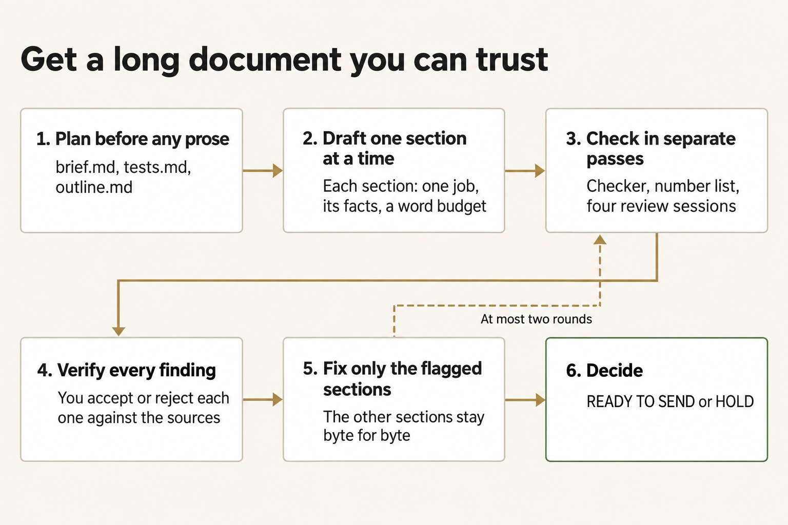
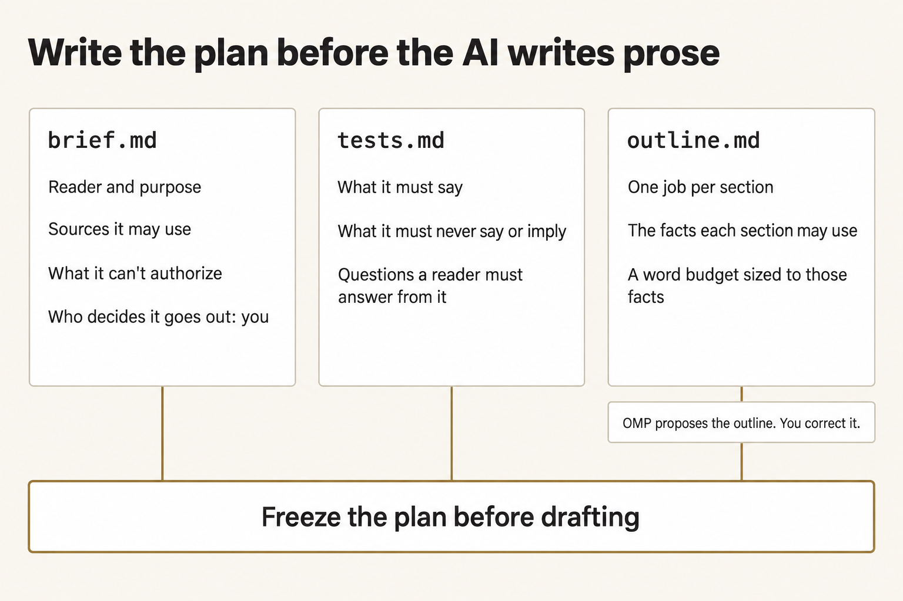
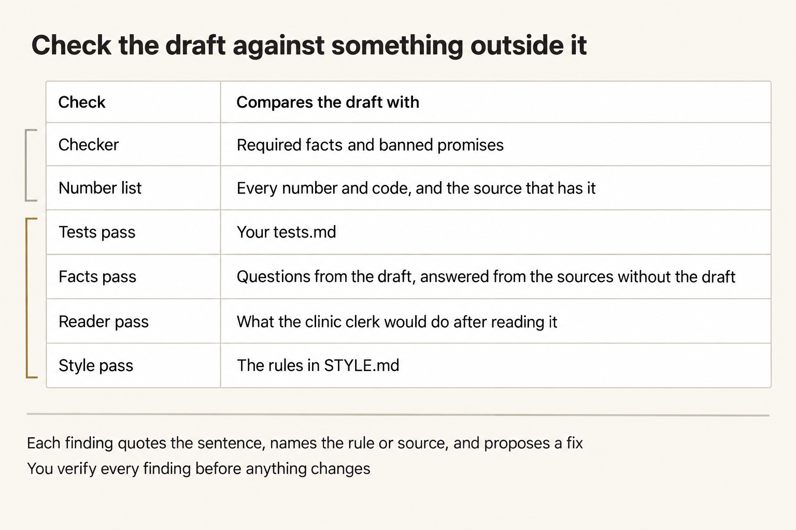

# Module 0 · Get a long document you can trust from AI

You're the Harbor Depot inventory clerk. The Field Clinic S-3 supply clerk has sent five questions about North Shelf, a request for 40 water-treatment kits. You'll have Oh My Pi write a status brief of 500 to 900 words that answers them from six source files. Then you'll check it, fix what's wrong, and decide whether you'd send it.

A long document goes wrong in ways a short one doesn't. Ask for the whole thing in one prompt and you get smooth prose that's hard to check: a fact with no source, a section that repeats another, a sentence that promises what no source says. Ask the same chat whether its draft is good and you'll mostly hear yes. What works is a plan you write before any prose, one limited job for each AI session, checks that compare the draft with something outside it, and fixes that touch only what's broken.



*Plan first, draft one section at a time, check in separate passes, verify every finding, fix only the flagged sections, and decide.*

<details markdown="1">
<summary>Figure text</summary>

Six steps in order. 1. Plan before any prose: brief.md, tests.md, and outline.md. 2. Draft one section at a time: each section has one job, its facts, and a word budget. 3. Check in separate passes: the checker, the number list, and four review sessions. 4. Verify every finding: you accept or reject each one against the sources. 5. Fix only the flagged sections: the other sections stay byte for byte. 6. Decide: READY TO SEND or HOLD. A dashed arrow runs from step 5 back to step 3, labeled "At most two rounds."

</details>

North Shelf is fictional, and the brief never leaves your work folder. It isn't a release, a vehicle assignment, a permit, a receipt, or a dispatch. `HOLD` is a valid outcome when a check fails, a source is missing, or a sentence could be misread.

Plan for about three hours (a rough estimate). The AI work is 14 short paid sessions; in one test run they cost about US$1 in total and took about 10 minutes. Most of your time goes into writing the plan, reading, and checking.

## 1. Create the work folder

Finish your [setup path](../README.md) and its checks first. A **terminal** is the text window where you enter commands; use it as your ordinary user, with the verified Python interpreter—the program that runs the supplied Python commands. If a command can't be found, check setup; **PATH** is the list of folders the terminal searches for programs. A **checkout** is the local copy of the course repository. A **work folder** holds the copies and outputs for one attempt. These commands work from any directory. They create the work folder `W` and the evidence folder `E` beside it, outside the checkout, and copy in the request, the style rules, the checker, and the six source files. Earlier attempts stay untouched.

Every AI step runs through `scripts/longform.py`, which starts one session of the course launcher, `shared/run_omp.py`, for each job. The launcher uses your OpenRouter key and the fixed model `openrouter/anthropic/claude-sonnet-4.6`, and lets each session write only the files that job needs. You enter the key at the end of this step, after the folder exists.

**Terminal: Bash or zsh, ordinary user.**

```bash
R="$HOME/Documents/AIHB_OCT_2026"
PY="$(for candidate in python3.12 python3 python; do "$candidate" -c 'import sys; sys.exit(1) if sys.version_info < (3, 12) else print(sys.executable)' 2>/dev/null && break; done)"
[ -n "$PY" ] || echo 'HOLD: Python 3.12 or newer is required.' >&2
M="$R/AI_Harness_Bootcamp_2/module-00-setup"
RUN="$(date -u +%Y%m%dT%H%M%SZ)-$$"
mkdir -p "$HOME/course-evidence" && printf '%s\n' "$RUN" > "$HOME/course-evidence/module-00-run" && printf 'RUN=%s\n' "$RUN"
W="$HOME/course-evidence/module-00-$RUN/work"
E="$HOME/course-evidence/module-00-$RUN/evidence"
"$PY" -c "from pathlib import Path; import shutil,sys; source,w,e=map(Path,sys.argv[1:]); w.mkdir(parents=True,exist_ok=False); e.mkdir(parents=True,exist_ok=False); [shutil.copyfile(source/name,w/name) for name in ('REQUEST.md','STYLE.md','check_artifact.py')]; shutil.copytree(source/'sources',w/'sources'); print(w); print('\n'.join(sorted(p.relative_to(w).as_posix() for p in w.rglob('*'))))" "$M/shared/case" "$W" "$E"
```

**Terminal: PowerShell, ordinary user.**

```powershell
$R = "$HOME\Documents\AIHB_OCT_2026"
$PY = $(foreach ($candidate in 'python3.12','python3','python') { try { $resolved = & $candidate -c 'import sys; sys.exit(1) if sys.version_info < (3,12) else print(sys.executable)' 2>$null; if ($LASTEXITCODE -eq 0 -and $resolved) { $resolved.Trim(); break } } catch {} })
if (-not $PY) { throw 'HOLD: Python 3.12 or newer is required.' }
$M = "$R\AI_Harness_Bootcamp_2\module-00-setup"
$RUN = [guid]::NewGuid().ToString('N')
New-Item -ItemType Directory -Force -Path "$HOME\course-evidence" | Out-Null; Set-Content -LiteralPath "$HOME\course-evidence\module-00-run" -Value $RUN; "RUN=$RUN"
$W = "$HOME\course-evidence\module-00-$RUN\work"
$E = "$HOME\course-evidence\module-00-$RUN\evidence"
& $PY -c "from pathlib import Path; import shutil,sys; source,w,e=map(Path,sys.argv[1:]); w.mkdir(parents=True,exist_ok=False); e.mkdir(parents=True,exist_ok=False); [shutil.copyfile(source/name,w/name) for name in ('REQUEST.md','STYLE.md','check_artifact.py')]; shutil.copytree(source/'sources',w/'sources'); print(w); print('\n'.join(sorted(p.relative_to(w).as_posix() for p in w.rglob('*'))))" "$M\shared\case" "$W" "$E"
```

**Expected:** The terminal prints `RUN=` and this attempt's identifier, then the full path of the work folder, then ten names: `REQUEST.md`, `STYLE.md`, `check_artifact.py`, `sources`, and the six files `sources/S1-request.md` through `sources/S6-clinic-message.md`. Open that folder in your editor; the page calls it `W` from here on.

**Stop:** A destination exists, copying fails, or a source is missing.

**Recovery:** Keep the partial attempt. Repair the path or prerequisite, then repeat the block with a new `RUN`. Don't delete earlier work or change the source checkout.

### If you open a new terminal

Every command on this page uses the variables from the block above. A closed terminal forgets these variables. In a new terminal, run this block to reload them for the same attempt instead of preparing another one. It reads the attempt identifier that the first block saved.

**Terminal: Bash or zsh, ordinary user.**

```bash
R="$HOME/Documents/AIHB_OCT_2026"
PY="$(for candidate in python3.12 python3 python; do "$candidate" -c 'import sys; sys.exit(1) if sys.version_info < (3, 12) else print(sys.executable)' 2>/dev/null && break; done)"
[ -n "$PY" ] || echo 'HOLD: Python 3.12 or newer is required.' >&2
RUN="$(cat "$HOME/course-evidence/module-00-run")"
M="$R/AI_Harness_Bootcamp_2/module-00-setup"
W="$HOME/course-evidence/module-00-$RUN/work"
E="$HOME/course-evidence/module-00-$RUN/evidence"
printf '%s\n' "RUN=$RUN" "W=$W"
```

**Terminal: PowerShell, ordinary user.**

```powershell
$R = "$HOME\Documents\AIHB_OCT_2026"
$PY = $(foreach ($candidate in 'python3.12','python3','python') { try { $resolved = & $candidate -c 'import sys; sys.exit(1) if sys.version_info < (3,12) else print(sys.executable)' 2>$null; if ($LASTEXITCODE -eq 0 -and $resolved) { $resolved.Trim(); break } } catch {} })
if (-not $PY) { throw 'HOLD: Python 3.12 or newer is required.' }
$RUN = (Get-Content -LiteralPath "$HOME\course-evidence\module-00-run" -Raw).Trim()
$M = "$R\AI_Harness_Bootcamp_2\module-00-setup"
$W = "$HOME\course-evidence\module-00-$RUN\work"
$E = "$HOME\course-evidence\module-00-$RUN\evidence"
"RUN=$RUN"; "W=$W"
```

**Expected:** The terminal prints `RUN=` followed by the identifier you saw when you prepared this attempt, then `W=` followed by the existing work folder.

**Stop:** The identifier differs from the one you recorded, or the folder named after `W=` doesn't exist.

**Recovery:** A different identifier means a later attempt overwrote the saved marker; set `RUN` by hand to the value you recorded and run the block again. A missing folder means the attempt was never prepared, so prepare it with the first block.

### Enter your key in this terminal

The launcher reads your OpenRouter key only from this terminal's environment, so a new terminal starts without it. Enter the key through a hidden prompt and make it available to the commands you run here. Paste the first command by itself and press Enter. Type or paste the key at the prompt, which shows nothing, and press Enter again. Then paste the second block.

**Terminal: Bash or zsh, ordinary user.**

```bash
IFS= read -r -s OPENROUTER_API_KEY
```

**Terminal: PowerShell, ordinary user.**

```powershell
$secret = Read-Host 'OpenRouter key' -AsSecureString
```

**Expected:** The terminal waits silently for the key, then returns to its ordinary prompt without showing the value.

**Stop:** Characters appear as you type, or you're not sure which program is reading the input.

**Recovery:** Cancel with Ctrl+C and close that terminal. If the value was shown, revoke the key at OpenRouter and use a replacement.

**Terminal: Bash or zsh, ordinary user.**

```bash
export OPENROUTER_API_KEY
if [ -n "${OPENROUTER_API_KEY:-}" ]; then printf 'SET\n'; else printf 'MISSING\n'; fi
```

**Terminal: PowerShell, ordinary user.**

```powershell
$bstr = [IntPtr]::Zero
try {
  $bstr = [Runtime.InteropServices.Marshal]::SecureStringToBSTR($secret)
  $env:OPENROUTER_API_KEY = [Runtime.InteropServices.Marshal]::PtrToStringBSTR($bstr)
} finally {
  if ($bstr -ne [IntPtr]::Zero) { [Runtime.InteropServices.Marshal]::ZeroFreeBSTR($bstr) }
  if ($secret) { $secret.Dispose() }
  Remove-Variable secret,bstr -ErrorAction SilentlyContinue
}
if ([string]::IsNullOrWhiteSpace($env:OPENROUTER_API_KEY)) { 'MISSING' } else { 'SET' }
```

**Expected:** `SET`. That proves the key is present in this terminal; it doesn't prove the key is valid.

**Stop:** `MISSING`, or any part of the key appears in the output.

**Recovery:** Repeat the hidden prompt in this terminal. Never print the environment to troubleshoot a key, and never save the key in a file or a shell profile.

## 2. Read the request and the sources

You can't judge a draft against sources you haven't read, so read them before any AI runs. Open `W/REQUEST.md` and all six files in `W/sources/`. `S6-clinic-message.md` holds the clinic clerk's five questions; the brief has to answer each one, or say plainly that the sources don't. For each source, note what it can establish and what it can't. The yard board shows where a truck is parked; it doesn't assign one. A count shows custody; it isn't a release.

Then open `W/check_artifact.py` and read its opening comment. It says what the checker can catch and what it can't. You'll need that in step 4.

**Expected:** For each source, you can say one thing it establishes and one thing it doesn't. You know which of the clinic's questions the sources can't fully answer.

**Stop:** Two sources contradict each other, or the request asks for something the sources can't support.

**Recovery:** Write the conflict or gap down. A gap in the sources is something the brief must say plainly; it isn't something the AI should fill.

## 3. Write the brief

Every AI session you run reads `brief.md`, so it's the job description. Write it before any draft exists, so you judge the draft against what you asked for instead of against how smoothly it reads. Create `W/brief.md` with these labels, each on its own line, and answer each one from what you read:

```text
Reader:
What the reader must know:
What the reader must do, and must not do yet:
Sources it may use:
Length and shape:
What it can't authorize:
Sensitive data:
Disclosure:
Who decides whether it goes out:
```

These lines are also the minimum responsibility screen you'll apply to every case in this course: which sources you may use, what sensitive data is involved, who's affected, whether you'll tell the reader that AI drafted it, what the work can't authorize, and who decides whether it goes out. A line you can't answer is a reason to hold before any draft exists. You're the clerk who'd send this brief, so the last line names you. Any release of the kits is Ivo Marsh's call, and no brief can change that.



*Write brief.md, tests.md, and outline.md, and freeze them before any drafting.*

<details markdown="1">
<summary>Figure text</summary>

Three files make the plan. brief.md holds the reader and purpose, the sources it may use, what it can't authorize, and who decides whether it goes out: you. tests.md holds what the brief must say, what it must never say or imply, and the questions a reader must be able to answer from it. outline.md gives each section one job, the facts it may use, and a word budget sized to those facts; OMP proposes the outline and you correct it. All three feed one bar: freeze the plan before drafting.

</details>

**Expected:** Each label has an answer someone could act on: the reader by role, the five questions, the six source files, 500 to 900 words in 5 or 6 sections, what the brief can't authorize, whether you'll say that AI drafted it, and you as the person who decides whether it goes out.

**Stop:** An answer is vague, such as "the clinic" or "be accurate", or you're leaving the send-or-hold call to someone else.

**Recovery:** Rewrite the line until someone with only this file and the sources could tell whether a draft meets it.

## 4. Write the tests

Write down what a correct brief must do, as lines a reviewer can check against the draft alone. In step 10, a separate session checks the draft against exactly these lines, so a test you skip here is a check nobody runs. Create `W/tests.md` with these three headings and at least two tests under each. Start from these examples:

```text
# Tests

## Must say
- The request is for 40 water-treatment kits for Field Clinic S-3 from Harbor Depot.

## Must never say or imply
- That the kits will arrive during the documentation window.

## A reader must be able to answer
- Who decides whether the kits are released?
```

Add your own lines under each heading. Cover every fact a reader would act on, every promise the sources don't make, and each of the clinic's five questions. Write at least two tests for things the checker's opening comment says it can't catch, such as a sentence that hints at a pickup without using the word.

**Expected:** `tests.md` has the three headings, each with at least two lines that start with `- `, and every line can be checked by reading the draft.

**Stop:** A test needs outside knowledge to check, such as "the tone is right", or a test asks for a fact the sources don't contain.

**Recovery:** Rewrite the test as something a reader could find, or fail to find, in the draft.

## 5. Get an outline, correct it, and freeze the plan

The outline is the cheapest place to fix a document. A wrong fact in the plan takes one line to fix; the same fact in prose takes a rewrite and a recheck. Have OMP propose an outline from your brief, your tests, and the sources. The helper runs one launcher session that may write only `outline-proposed.md`, then copies it to `outline.md` for you to correct.

**Terminal: Bash or zsh, ordinary user.**

```bash
"$PY" "$M/scripts/longform.py" outline "$W" "$E"
```

**Terminal: PowerShell, ordinary user.**

```powershell
& $PY "$M\scripts\longform.py" outline "$W" "$E"
```

**Expected:** `RUNNING outline`, and about a minute later `PASS: complete guarded OMP turn`, then `PASS: OMP wrote outline-proposed.md; your copy to correct is outline.md`, then `Receipts:` and a folder in `E`. A **receipt** records a run's inputs, tool calls, and file effects.

**Stop:** A `HOLD` line before the run names a missing label or test heading, the key, or `omp`; a `HOLD` after the run means the file is missing or doesn't match its receipt.

**Recovery:** Fix what the `HOLD` line names and run the same command again. Keep the failed receipts, and don't write `outline-proposed.md` yourself.

Open `W/outline.md`. Each section has a heading such as `## 1. The request` and three lines: `Job:` what the section does for the reader, `Facts:` the source facts it may use, each with its file, and `Words:` its budget. Correct the outline in your editor until all of this is true:

- Every fact on a `Facts:` line is in the source it names. Delete any fact that isn't.
- Each section has one job, and no two sections do the same job.
- A fact the reader doesn't need is gone, even if it's true.
- Each budget fits the facts the section has. A section with three short facts can't fill 150 words without padding.
- The budgets add up to 500 to 900.
- Each of the clinic's five questions is answered in a section you can name.
- One section says what the clinic must not do yet, and the last section gives the paperwork contact.

Keep `outline-proposed.md` as OMP wrote it, so you can see later what you changed. Then freeze the plan.

**Terminal: Bash or zsh, ordinary user.**

```bash
"$PY" "$M/scripts/longform.py" freeze "$W" "$E"
```

**Terminal: PowerShell, ordinary user.**

```powershell
& $PY "$M\scripts\longform.py" freeze "$W" "$E"
```

**Expected:** `PLAN FROZEN:` and the title, then a table of the sections with their budgets and `Facts:` lines, and the total. The helper saved a **hash**, a fingerprint calculated from a file's bytes, of `brief.md`, `tests.md`, and `outline.md` in `E/plan.json`.

**Stop:** A `HOLD` line names a missing label, a missing test heading, a section without `Job:`, `Facts:`, or `Words:`, or a total outside 500 to 900.

**Recovery:** Fix the file the `HOLD` line names and freeze again. You can freeze again until you draft the first section. After that, the drafting steps refuse to run on a changed plan.

## 6. Draft the first section and read it

Have OMP write section 1, and only section 1, in a new session. That session reads the brief, the outline, the style rules, and the sources, quotes the source lines it will use, and writes `draft/v1/01.md`. It may write that file and nothing else.

**Terminal: Bash or zsh, ordinary user.**

```bash
"$PY" "$M/scripts/longform.py" draft "$W" "$E" --section 1
```

**Terminal: PowerShell, ordinary user.**

```powershell
& $PY "$M\scripts\longform.py" draft "$W" "$E" --section 1
```

**Expected:** `PASS: OMP wrote draft/v1/01.md` and the receipts folder, then what the session wrote besides the file, including the source lines it quoted, and `Sections still to draft:` with the other section numbers.

**Stop:** A `HOLD` line, or the session quoted no source lines.

**Recovery:** Fix what the `HOLD` line names and run the same command again. If the section exists but the session quoted nothing, read the section against the sources yourself and note it.

Open `W/draft/v1/01.md`. Compare it with section 1 of your outline: does it do the `Job:`, use only facts on its `Facts:` line, and come close to its `Words:`? Check each sentence against the lines the session quoted, then against the source file itself. Then open the receipts folder. `result.json` says whether the run stayed inside its limits, and `guard.jsonl` records every file the session read and the one it wrote.


*Distinguish the model's words, the actual file, the harness's recorded behavior, and the decision a person owns.*

<details markdown="1">
<summary>Figure text</summary>

Each of four layers gives its own evidence. The model gives the text it generated. The interface gives the file written to disk. The harness gives enforced permissions and run receipts. The person owns interpretation and the decision to use the result. Generated text isn't a verified fact, and a receipt shows what ran, not that the result is right. No layer's success carries over to the next. Evidence from any layer can support one recorded capability or one recorded limit.

</details>

If anything in section 1 is wrong, create `W/notes.md`, quote the sentence, and say what's wrong and which source shows it. Don't edit the section; you'll fix it with the other findings in step 12.

## 7. Draft the remaining sections

Each remaining section gets its own session. A session reads the plan, the sources, and the sections already written, so it can avoid repeating them, and it writes one file.

**Terminal: Bash or zsh, ordinary user.**

```bash
"$PY" "$M/scripts/longform.py" draft "$W" "$E" --rest
```

**Terminal: PowerShell, ordinary user.**

```powershell
& $PY "$M\scripts\longform.py" draft "$W" "$E" --rest
```

**Expected:** A `PASS: OMP wrote draft/v1/NN.md` line for each remaining section, then `ASSEMBLED draft-v1.md` and a table of each section's budget and actual words, with the total. The helper builds `draft-v1.md` from the outline's title and headings and the section files.

**Stop:** A `HOLD` line for any section. The sections after it aren't drafted.

**Recovery:** Fix the cause, often the key or the network, and run the same command again. It skips the sections already written.

Read `W/draft-v1.md` from top to bottom, the way the clinic clerk would. Add anything wrong to `notes.md`. Compare each section's words with its budget. Far under usually means the facts ran out, which is fine. Far over usually means padding or a fact from nowhere.

## 8. Run the checker, then make it fail on purpose

The checker compares the draft with the facts it knows and the promises it rejects. It's quick and literal, so it catches a wrong number well and misses a wrong meaning easily.

**Terminal: Bash or zsh, ordinary user.**

```bash
"$PY" "$W/check_artifact.py" "$W/draft-v1.md"
```

**Terminal: PowerShell, ordinary user.**

```powershell
& $PY "$W\check_artifact.py" "$W\draft-v1.md"
```

**Expected:** A `PASS:` or `FAIL:` line for each check, then a last line that says the mechanical requirements passed or that some failed. Both endings say this is practice only.

**Stop:** A `FAIL:` line.

**Recovery:** A `FAIL:` line is a finding, not a verdict. Read the sentence it quotes and check it against the sources. If the draft is wrong, add the finding to `notes.md`. If the draft is right and the checker misread the wording, write that down too: it's a limit of the checker, and it belongs in your decision. Don't edit the checker.

A check you've never seen fail might not be checking anything. Make a copy of the draft with one known error and confirm that the checker rejects it. The block below changes the on-hand count from 27 to 28 in `checker-test.md` only. It also records the hash of `draft-v1.md`, so you can confirm later that the original never changed.


*A rejected known-bad copy shows that this check catches that error; it doesn't show that the original is correct.*

<details markdown="1">
<summary>Figure text</summary>

Keep the original, draft-v1.md, and the test copy, checker-test.md, separate. Keep the original unchanged and record its hash; later, confirm that the hash is unchanged. Separately, make a copy, add one deliberate error, and run the same checker on it. Expect the checker to reject the copy. The rejection shows that the check can catch that error. It doesn't show that the original is correct.

</details>

**Terminal: Bash or zsh, ordinary user.**

```bash
"$PY" -c "from pathlib import Path; import hashlib,re,sys; w,e=map(Path,sys.argv[1:]); raw=(w/'draft-v1.md').read_bytes(); bad,n=re.subn(r'\b27\b','28',raw.decode('utf-8')); n or sys.exit('HOLD: the count 27 is not in draft-v1.md'); f=(w/'checker-test.md').open('x',encoding='utf-8'); f.write(bad); f.close(); h=(e/'original-draft-v1.sha256').open('x'); h.write(hashlib.sha256(raw).hexdigest()+'\n'); h.close()" "$W" "$E" &&
"$PY" "$W/check_artifact.py" "$W/checker-test.md"
```

**Terminal: PowerShell, ordinary user.**

```powershell
& $PY -c "from pathlib import Path; import hashlib,re,sys; w,e=map(Path,sys.argv[1:]); raw=(w/'draft-v1.md').read_bytes(); bad,n=re.subn(r'\b27\b','28',raw.decode('utf-8')); n or sys.exit('HOLD: the count 27 is not in draft-v1.md'); f=(w/'checker-test.md').open('x',encoding='utf-8'); f.write(bad); f.close(); h=(e/'original-draft-v1.sha256').open('x'); h.write(hashlib.sha256(raw).hexdigest()+'\n'); h.close()" "$W" "$E"
if ($LASTEXITCODE -ne 0) { throw 'The checker test copy was not made.' }
& $PY "$W\check_artifact.py" "$W\checker-test.md"
```

**Expected:** `FAIL: on-hand 27` and a last line saying a mechanical requirement failed. That's the result you want: the checker catches this error. `draft-v1.md` is unchanged.

**Stop:** The wrong copy passes the on-hand check, the block refuses because `checker-test.md` already exists, or it can't find 27.

**Recovery:** If the copy passes, the checker can't be trusted on this count; write that in `notes.md` and rely on the number list in step 9. If 27 isn't in the draft at all, that's a finding: S2 says 27 kits are on hand. Don't keep inventing errors until one fails.

## 9. List every number and code

Numbers, times, phone numbers, and codes are where a fluent draft goes wrong. The helper lists every one in the draft, where it appears, and which source files contain it. It runs on your computer and doesn't call the model.

**Terminal: Bash or zsh, ordinary user.**

```bash
"$PY" "$M/scripts/longform.py" ledger "$W" draft-v1.md
```

**Terminal: PowerShell, ordinary user.**

```powershell
& $PY "$M\scripts\longform.py" ledger "$W" draft-v1.md
```

**Expected:** A table with each number or code, the section and line where it appears, and the sources that contain it, then a count of how many aren't in the sources.

**Stop:** `NOT IN SOURCES` beside any number or code.

**Recovery:** Check each one. A number the AI calculated, such as a difference or a number of weeks, is a calculation you must check yourself, and the brief must present it as a calculation, not as a source fact. A number from nowhere is a finding. Check the numbers that are in the sources too: 40 is in S1, but "40 kits on hand" would still be wrong. Add each finding to `notes.md`.

## 10. Run the review sessions

Now have the draft checked by sessions that didn't write it. A model reading its own draft in the same chat tends to approve it. Each review session here starts fresh, gets only the files it needs, and checks the draft against something outside it.



*Check the draft against something outside it: the checker, the number list, and four review sessions.*

<details markdown="1">
<summary>Figure text</summary>

A table of six checks and what each compares the draft with. Checker: required facts and banned promises. Number list: every number and code, and the source that has it. Tests pass: your tests.md. Facts pass: questions from the draft, answered from the sources without the draft. Reader pass: what the clinic clerk would do after reading it. Style pass: the rules in STYLE.md. The first two run on your computer; the last four are review sessions. Each finding quotes the sentence, names the rule or source, and proposes a fix. You verify every finding before anything changes.

</details>

- **Tests pass.** The session gets the draft and your `tests.md`. It marks each test `MET`, `NOT MET`, or `UNCLEAR`, quotes the sentence that shows it, and proposes a fix.
- **Facts pass.** One session turns every factual claim in the draft into a question. A second session answers those questions from the sources without seeing the draft or its claims. An answer written while looking at the draft tends to repeat the draft's mistakes.
- **Reader pass.** A session plays the clinic clerk and lists everything it would do after reading the brief, with the sentence that led to each action.
- **Style pass.** The session gets the draft and `STYLE.md`. Style comes last, because polishing a sentence that's wrong is wasted work.

**Terminal: Bash or zsh, ordinary user.**

```bash
"$PY" "$M/scripts/longform.py" critique "$W" "$E" --draft v1 --round 1
```

**Terminal: PowerShell, ordinary user.**

```powershell
& $PY "$M\scripts\longform.py" critique "$W" "$E" --draft v1 --round 1
```

**Expected:** Five `PASS: a new session wrote review/r1/...` lines and `MERGED review/r1/facts-pass.md`, then `CRITIQUE ROUND 1 COMPLETE` with a count for each pass: tests not met or unclear, claims and `NOT IN SOURCES` answers, reader actions, and style findings. The review files are in `W/review/r1/`.

**Stop:** A `HOLD` line for any session.

**Recovery:** Fix the cause and run the same command again. It skips the passes that already finished.

## 11. Verify every finding

A reviewer can be wrong. It can flag a correct sentence, quote the wrong one, or propose a fix that adds a new error. Accept a finding only when you can point to the source line, the test, or the style rule it rests on.


*A source can support the stated fact without supporting the action a reader might infer from it.*

<details markdown="1">
<summary>Figure text</summary>

A material claim leads to its source and locator (line or paragraph), and then to the quoted support. Sort the support into what the quote establishes and what it doesn't establish. What it doesn't establish can't support an action a reader might infer. Both sides go to human interpretation. Mechanical checks also inform human interpretation, but they don't support an inferred action.

</details>

Work through each file in `W/review/r1/`, then your `notes.md`:

- `tests-pass.md`: for each `NOT MET` or `UNCLEAR`, read the quoted sentence and the test yourself.
- `facts-pass.md`: compare each claim with the answer from the sources. A different answer, or `NOT IN SOURCES`, is a finding, unless the answering session misread a source; check the line it cites.
- `reader-pass.md`: for each action, ask whether the sources allow it. If the clerk would send a vehicle, schedule kit use, or tell patients water is coming, the sentence that led there needs a fix, even if every word in it is true.
- `style-pass.md`: accept a style fix only if the rule really applies and the fix changes no fact.
- `notes.md`: your own findings from steps 6 to 9.

Create `W/review/r1/fixes.md` in this form. Each accepted finding names its section number, quotes the sentence, gives the fix, and says why. Each rejected finding gets one line and a reason.

```text
# Fixes, round 1

## Accepted

Section: 4
Quote: "Paste the exact sentence from draft-v1.md."
Fix: Say what to change, in a sentence.
Why: Name the source line, test, or style rule.

## Rejected

- reader-pass, "would call on Saturday": the brief gives Thursday and Friday; the session misread it.
```

**Expected:** Every finding from the review files and your notes appears once: under `## Accepted` with a section number, quote, fix, and reason, or under `## Rejected` with a reason.

**Stop:** You're accepting a finding because a reviewer said so, without checking the source, or a fix would add a fact no source contains.

**Recovery:** Reread the source line and decide yourself. If you can't tell, the finding stays open, and it goes into your decision as a reason to hold. If you accept no finding at all, write `None` under `## Accepted`, skip step 12, and use `v1` wherever steps 13 and 14 say `v2`.

## 12. Revise only the flagged sections

Fix the accepted findings and nothing else. The helper copies every section that no accepted finding names into `draft/v2/` unchanged. One session rewrites only the named sections, following only your accepted fixes. Then the helper assembles `draft-v2.md` and shows what changed.

**Terminal: Bash or zsh, ordinary user.**

```bash
"$PY" "$M/scripts/longform.py" revise "$W" "$E" --from v1 --to v2 --fixes review/r1/fixes.md
```

**Terminal: PowerShell, ordinary user.**

```powershell
& $PY "$M\scripts\longform.py" revise "$W" "$E" --from v1 --to v2 --fixes review/r1/fixes.md
```

**Expected:** `PASS: OMP rewrote section(s)` with the numbers you named, `ASSEMBLED draft-v2.md` with the word table, then `SAME` or `CHANGED` for each section, the changed lines, and how many sections changed. Only sections you named can show `CHANGED`.

**Stop:** A `HOLD` line, or a changed section contains a change that no accepted fix asked for.

**Recovery:** For a `HOLD`, fix the cause and run the same command; an incomplete `draft/v2` is moved into `E/failed` first. For an unasked change, record it in `notes.md`. It's a finding for the next round.

Read every changed line. Did each change do what its fix asked, and nothing else? Then run the checker and the number list on the new version.

**Terminal: Bash or zsh, ordinary user.**

```bash
"$PY" "$W/check_artifact.py" "$W/draft-v2.md"
"$PY" "$M/scripts/longform.py" ledger "$W" draft-v2.md
```

**Terminal: PowerShell, ordinary user.**

```powershell
& $PY "$W\check_artifact.py" "$W\draft-v2.md"
& $PY "$M\scripts\longform.py" ledger "$W" draft-v2.md
```

**Expected:** The checker passes, or fails only where you've recorded a checker limit, and the number list shows no unexplained `NOT IN SOURCES`.

**Stop:** The revision added an error, or it changed a sentence no fix asked for.

**Recovery:** Run at most one more round. Run `critique` with `--draft v2 --round 2`, verify its findings in `review/r2/fixes.md`, and run `revise` with `--from v2 --to v3 --fixes review/r2/fixes.md`. Then add 1 to each version number in steps 13 and 14. Stop after the second round: each revision can add a new error, so more rounds don't guarantee a better brief. If a material problem remains, your decision is `HOLD`.

## 13. A fact changes: revise only what depends on it

Facts change after a first draft. A recount of pen 4 is in the course files. Copy it into your work folder and read it.

**Terminal: Bash or zsh, ordinary user.**

```bash
"$PY" "$M/scripts/longform.py" reveal "$W" "$E"
```

**Terminal: PowerShell, ordinary user.**

```powershell
& $PY "$M\scripts\longform.py" reveal "$W" "$E"
```

**Expected:** The text of the changed input, then `REVEALED CHANGED_INPUT.md` with the time.

**Stop:** A `HOLD` line saying `CHANGED_INPUT.md` is already in the work folder.

**Recovery:** Keep the copy you have. It's the same file, and the helper doesn't replace it.

Before you run anything else, decide which sections must change. Find every sentence in `draft-v2.md` that uses the on-hand count, including any sentence that does arithmetic with it. Create `W/change-fixes.md` in the same form as your fixes, with one block for each section that must change. Under a last heading, list what must stay the same:

```text
# Fixes, changed input

## Accepted

Section: 2
Quote: "Paste the exact sentence from draft-v2.md."
Fix: Change the on-hand count from 27 to 19, and anything that depends on it.
Why: CHANGED_INPUT.md: the pen 4 recount is 19.

## Must stay the same

- The request is for 40 water-treatment kits.
```

Finish the list under `## Must stay the same`: everything a recount doesn't touch, such as custody not being a release, who owns the release, the window, and the contact. The revision changes only the sections under `## Accepted`.


*Find the sections that use the new fact, rewrite only those, copy the rest unchanged, and expect the old checker to fail on the stale count.*

<details markdown="1">
<summary>Figure text</summary>

A new fact, 19 kits on hand, leads to finding the sections whose Facts line uses the on-hand count. Those sections are rewritten; every other section is copied unchanged. Both feed a comparison in which unchanged sections match byte for byte. A second row reads right to left: the checker still expects 27, so the new version fails that one check. Don't edit the checker to hide the failure.

</details>

**Terminal: Bash or zsh, ordinary user.**

```bash
"$PY" "$M/scripts/longform.py" revise "$W" "$E" --from v2 --to v3 --fixes change-fixes.md
```

**Terminal: PowerShell, ordinary user.**

```powershell
& $PY "$M\scripts\longform.py" revise "$W" "$E" --from v2 --to v3 --fixes change-fixes.md
```

**Expected:** `CHANGED` only for the sections you named, and each change is the count and what depends on it. Every other section shows `SAME`.

**Stop:** A changed section altered a fact the recount doesn't touch.

**Recovery:** Keep `draft-v3.md` and record the unwanted change in `notes.md`. It's a reason to hold until a round 2 fix removes it. Don't edit the draft files by hand.

Now check the new version, and confirm that the first draft never changed.

**Terminal: Bash or zsh, ordinary user.**

```bash
"$PY" "$W/check_artifact.py" "$W/draft-v3.md"
"$PY" "$M/scripts/longform.py" ledger "$W" draft-v3.md
"$PY" -c "from pathlib import Path; import hashlib,sys; w,e=map(Path,sys.argv[1:]); same=hashlib.sha256((w/'draft-v1.md').read_bytes()).hexdigest()==(e/'original-draft-v1.sha256').read_text().strip(); print('ORIGINAL UNCHANGED' if same else 'HOLD: draft-v1.md changed'); sys.exit(not same)" "$W" "$E"
```

**Terminal: PowerShell, ordinary user.**

```powershell
& $PY "$W\check_artifact.py" "$W\draft-v3.md"
& $PY "$M\scripts\longform.py" ledger "$W" draft-v3.md
& $PY -c "from pathlib import Path; import hashlib,sys; w,e=map(Path,sys.argv[1:]); same=hashlib.sha256((w/'draft-v1.md').read_bytes()).hexdigest()==(e/'original-draft-v1.sha256').read_text().strip(); print('ORIGINAL UNCHANGED' if same else 'HOLD: draft-v1.md changed'); sys.exit(not same)" "$W" "$E"
```

**Expected:** `FAIL: on-hand 27`, because the checker still expects the old count; every other check gives the same result it gave for `draft-v2.md`. In the number list, 19 is found in `CHANGED_INPUT`. A number the brief calculates from the new count, such as the shortfall, shows `NOT IN SOURCES`; check that arithmetic yourself. Then `ORIGINAL UNCHANGED`.

**Stop:** Another check changed its result, 27 still appears as the current count, or the last line is `HOLD: draft-v1.md changed`.

**Recovery:** Trace each failure to the changed fact or to a fact that should have stayed the same. Don't edit the checker to hide the stale count.

## 14. Decide whether you'd send it

You'd send `draft-v3.md` to the Field Clinic S-3 supply team under your name, so the call is yours. In `W/decision.md`, write `READY TO SEND` or `HOLD` on the first line. Under it, list the evidence for the call, each item pointing to a file in `W`:

- what the checker reported for `draft-v3.md`, and what `checker-test.md` showed;
- what the number list showed;
- what each review pass found, and which findings you accepted and rejected;
- which sections changed for the recount, and how you confirmed the others didn't;
- any sentence the clinic clerk could still misread, or how you checked that none remains;
- any checker limit you found.

For `HOLD`, say exactly what must change before the brief could go.

**Expected:** `decision.md` starts with `READY TO SEND` or `HOLD`, and each reason under it points to a file in `W`.

**Stop:** A material claim lacks support, a test is still `NOT MET`, or the clerk could take the brief as a release, a pickup time, or a delivery promise.

**Recovery:** Write `HOLD` and name the fix. A passing checker and reviewers who found nothing don't settle a sentence you haven't checked yourself.

## 15. Write the handoff

The next reader has your folder and nothing else. Write `W/handoff.md` with the purpose, the source boundary, where the plan, the versions, and the reviews are, the checks you ran and what they showed, your decision, one thing you saw the AI do well and one place it failed in this attempt, anything unresolved and who can resolve it, and the first file the next reader should open.

Before you stop, confirm that `W` holds `brief.md`, `tests.md`, `outline-proposed.md`, `outline.md`, `draft-v1.md`, `draft-v2.md`, `draft-v3.md`, the `draft` folder with a folder for each version, `notes.md`, `checker-test.md`, `review/r1/` with `fixes.md`, `CHANGED_INPUT.md`, `change-fixes.md`, `decision.md`, and `handoff.md`. Confirm that `E` holds `plan.json`, `original-draft-v1.sha256`, `change.json`, and the `receipts`, `packets`, and `prompts` folders.

<details class="rf-stretch" markdown="1">
<summary>Optional stretch: compare with a one-prompt draft</summary>

## Ask for the whole brief at once

See what the plan bought you. Give a fresh session only the request and the sources, and ask for the whole brief in one prompt. The block below makes a separate folder for it, so the session can't read your plan or your drafts. In your editor, save this as `W/oneshot-prompt.txt`:

```text
Read REQUEST.md and every file in sources/. Write the status brief that
REQUEST.md asks for and save it to oneshot.md using course_write. Do not
write any other file. After writing, report the path only.
```

**Terminal: Bash or zsh, ordinary user.**

```bash
"$PY" -c "from pathlib import Path; import shutil,sys; w=Path(sys.argv[1]); o=w.parent/'oneshot'; o.mkdir(); shutil.copyfile(w/'REQUEST.md',o/'REQUEST.md'); shutil.copytree(w/'sources',o/'sources'); print(o)" "$W" &&
"$PY" "$R/shared/run_omp.py" --workdir "$W/../oneshot" --prompt "$W/oneshot-prompt.txt" --evidence "$E/oneshot" --allow-write oneshot.md
```

**Terminal: PowerShell, ordinary user.**

```powershell
& $PY -c "from pathlib import Path; import shutil,sys; w=Path(sys.argv[1]); o=w.parent/'oneshot'; o.mkdir(); shutil.copyfile(w/'REQUEST.md',o/'REQUEST.md'); shutil.copytree(w/'sources',o/'sources'); print(o)" "$W"
if ($LASTEXITCODE -ne 0) { throw 'The one-prompt folder was not made.' }
& $PY "$R\shared\run_omp.py" --workdir "$W\..\oneshot" --prompt "$W\oneshot-prompt.txt" --evidence "$E\oneshot" --allow-write oneshot.md
```

**Expected:** The path of the new `oneshot` folder beside `W`, then `PASS: complete guarded OMP turn`. The brief is in that folder as `oneshot.md`.

**Stop:** The folder already exists, or the launcher holds.

**Recovery:** Keep what's there. Read the `HOLD` line, fix the cause, and run the launcher line again with a new `--evidence` folder name.

Run the checker on `oneshot.md`, read it against your `tests.md`, and copy it into `W` if you want the number list for it. In `W/oneshot-comparison.md`, note what the one-prompt draft got wrong or left out that your plan prevented, and anything it did better.

</details>
