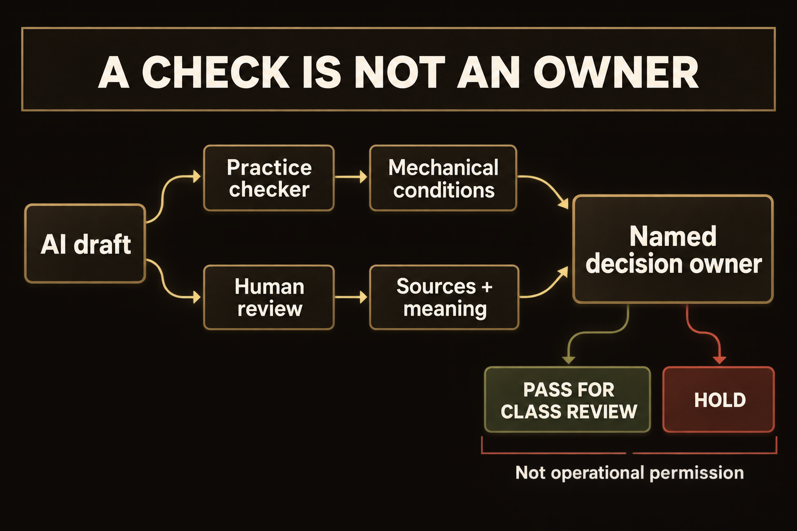
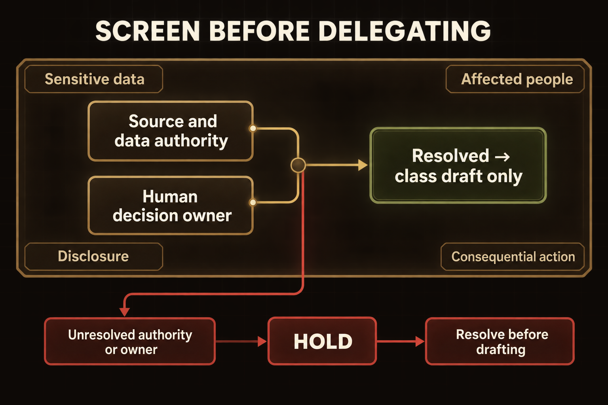
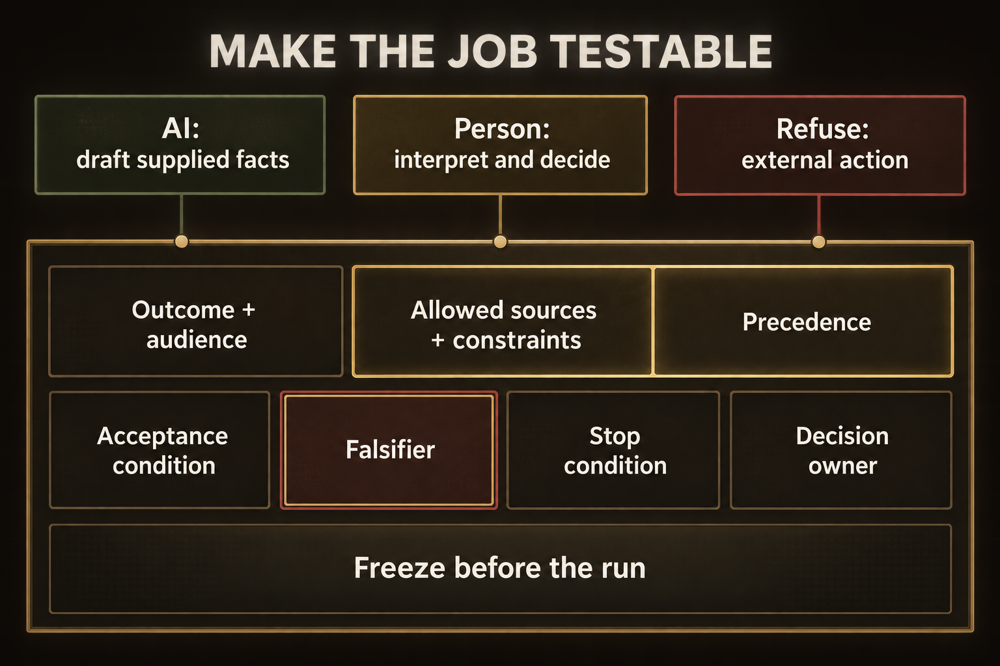
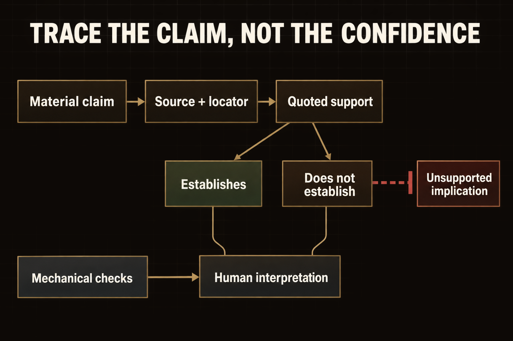
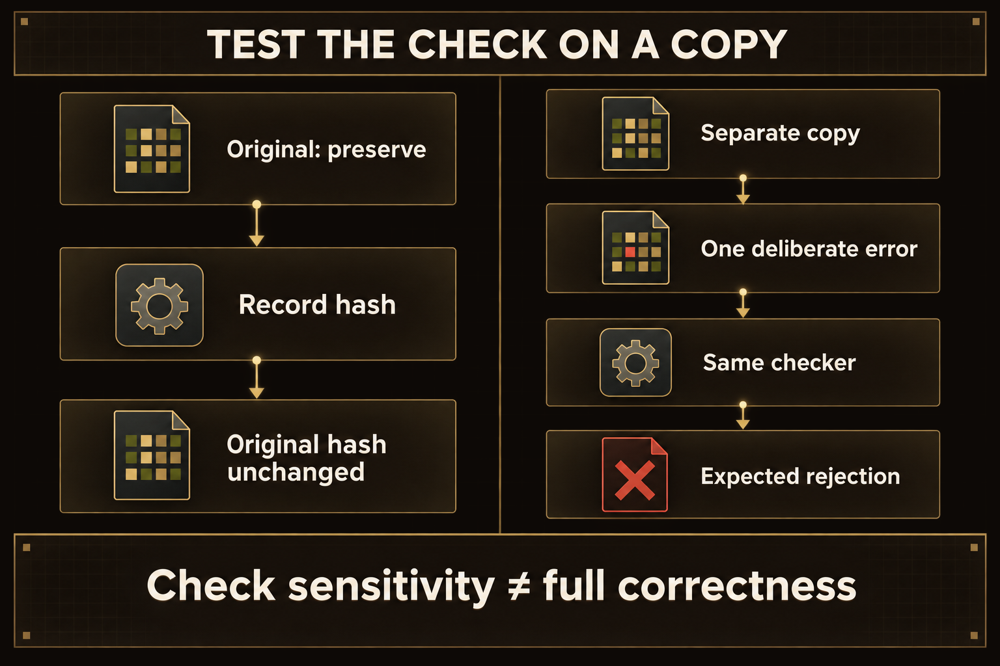
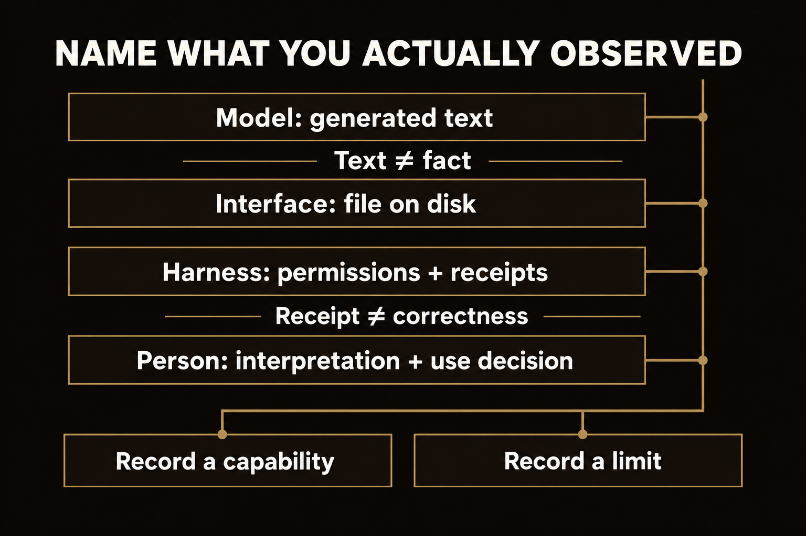
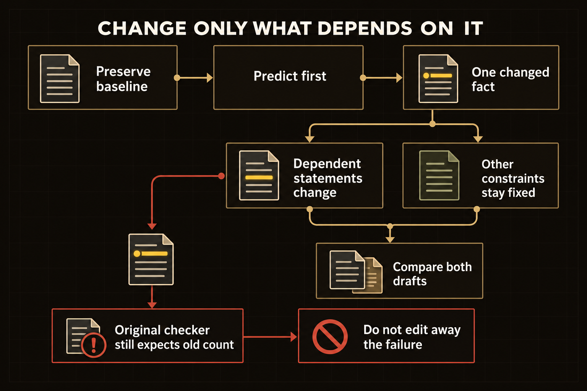

# Module 0 · Give AI a clear, limited job

Draft a checked internal email about North Shelf for the Field Clinic S-3 supply clerk. Decide what to delegate to AI, what judgment to keep, and what use to refuse. Give the tool clear limits, check the saved email against the packet, and decide whether named class participants may read it. Then change one supplied fact while preserving the other facts and limits.

North Shelf is fictional. The email stays with named class participants. It is not a release, vehicle assignment, permit, receipt, dispatch, or public movement order. `HOLD` is a valid outcome when a prerequisite, material fact, or decision owner is unresolved.

Plan for about three hours. That is a rough estimate, not a measured time. Aim to have a first checked draft within roughly the first hour. Use the rest of your time to demonstrate a failing check, apply the changed input, compare the drafts, and record the handoff.

## 1. Create the four-file work folder

Machine readiness is a prerequisite: finish the appropriate [setup path](../README.md) and its checks before drafting. A **terminal** is the application where you enter commands. Use it as your ordinary user, with the verified Python interpreter—the program that runs the supplied Python commands. If a command cannot be found, check setup; **PATH** is the list of folders the terminal searches for programs.

Your **checkout** is the local copy of the course repository. A **work folder** holds the separate copies and outputs for one attempt. These commands work from any directory and create that folder outside the checkout. `W` names the work folder; `E` names the evidence folder beside it. Earlier attempts remain untouched.

Live drafting needs your OpenRouter key in this terminal. An API key is the credential the launcher uses to reach the account that pays for the model call. The course uses the fixed model `openrouter/anthropic/claude-sonnet-4.6` through `shared/run_omp.py`. You enter the key at the end of this step, after the folder exists.

**Terminal: Bash or zsh, ordinary user.**

```bash
R="$HOME/Documents/AIHB_OCT_2026"
PY="$(for candidate in python3.12 python3 python; do "$candidate" -c 'import sys; sys.exit(1) if sys.version_info < (3, 12) else print(sys.executable)' 2>/dev/null && break; done)"
[ -n "$PY" ] || echo 'HOLD: Python 3.12 or newer is required.' >&2
M="$R/AI_Harness_Bootcamp_2/module-00-setup"
RUN="$(date -u +%Y%m%dT%H%M%SZ)-$$"
mkdir -p "$HOME/course-evidence" && printf '%s\n' "$RUN" > "$HOME/course-evidence/module-00-run" && printf 'RUN=%s\n' "$RUN"
W="$HOME/course-evidence/module-00-$RUN/work"
E="$HOME/course-evidence/module-00-$RUN/evidence"
"$PY" -c "from pathlib import Path; import shutil,sys; source,w,e=map(Path,sys.argv[1:]); w.mkdir(parents=True,exist_ok=False); e.mkdir(parents=True,exist_ok=False); names=('SOURCE_PACKET.md','REQUEST.md','CHANGED_INPUT.md','check_artifact.py'); [shutil.copyfile(source/name,w/name) for name in names]; print(w); print('\n'.join(sorted(p.name for p in w.iterdir())))" "$M/shared/case" "$W" "$E"
```

**Terminal: PowerShell, ordinary user.**

```powershell
$R = "$HOME\Documents\AIHB_OCT_2026"
$PY = $(foreach ($candidate in 'python3.12','python3','python') { try { $resolved = & $candidate -c 'import sys; sys.exit(1) if sys.version_info < (3,12) else print(sys.executable)' 2>$null; if ($LASTEXITCODE -eq 0 -and $resolved) { $resolved.Trim(); break } } catch {} })
if (-not $PY) { throw 'HOLD: Python 3.12 or newer is required.' }
$M = "$R\AI_Harness_Bootcamp_2\module-00-setup"
$RUN = [guid]::NewGuid().ToString('N')
New-Item -ItemType Directory -Force -Path "$HOME\course-evidence" | Out-Null; Set-Content -LiteralPath "$HOME\course-evidence\module-00-run" -Value $RUN; "RUN=$RUN"
$W = "$HOME\course-evidence\module-00-$RUN\work"
$E = "$HOME\course-evidence\module-00-$RUN\evidence"
& $PY -c "from pathlib import Path; import shutil,sys; source,w,e=map(Path,sys.argv[1:]); w.mkdir(parents=True,exist_ok=False); e.mkdir(parents=True,exist_ok=False); names=('SOURCE_PACKET.md','REQUEST.md','CHANGED_INPUT.md','check_artifact.py'); [shutil.copyfile(source/name,w/name) for name in names]; print(w); print('\n'.join(sorted(p.name for p in w.iterdir())))" "$M\shared\case" "$W" "$E"
```

**Expected:** The terminal prints `RUN=` and this attempt's identifier, then the full path of the work folder, then exactly four names: `CHANGED_INPUT.md`, `REQUEST.md`, `SOURCE_PACKET.md`, and `check_artifact.py`. Open that folder in your editor; the page calls it `W` from here on.

**Stop:** A destination exists, copying fails, or a source is missing.

**Recovery:** Preserve the partial attempt. Repair the path or prerequisite, then repeat the block with a new `RUN`. Do not delete earlier work or change the source checkout.

### If you open a new terminal

Every command on this page uses the variables from the block above, and a terminal forgets them when it closes. Run this block in any new terminal to return to the same attempt instead of preparing a second one. It reads the attempt identifier that the first block saved.

**Terminal: Bash or zsh, ordinary user.**

```bash
R="$HOME/Documents/AIHB_OCT_2026"
PY="$(for candidate in python3.12 python3 python; do "$candidate" -c 'import sys; sys.exit(1) if sys.version_info < (3, 12) else print(sys.executable)' 2>/dev/null && break; done)"
[ -n "$PY" ] || echo 'HOLD: Python 3.12 or newer is required.' >&2
RUN="$(cat "$HOME/course-evidence/module-00-run")"
M="$R/AI_Harness_Bootcamp_2/module-00-setup"
W="$HOME/course-evidence/module-00-$RUN/work"
E="$HOME/course-evidence/module-00-$RUN/evidence"
printf '%s\n' "RUN=$RUN" "W=$W"
```

**Terminal: PowerShell, ordinary user.**

```powershell
$R = "$HOME\Documents\AIHB_OCT_2026"
$PY = $(foreach ($candidate in 'python3.12','python3','python') { try { $resolved = & $candidate -c 'import sys; sys.exit(1) if sys.version_info < (3,12) else print(sys.executable)' 2>$null; if ($LASTEXITCODE -eq 0 -and $resolved) { $resolved.Trim(); break } } catch {} })
if (-not $PY) { throw 'HOLD: Python 3.12 or newer is required.' }
$RUN = (Get-Content -LiteralPath "$HOME\course-evidence\module-00-run" -Raw).Trim()
$M = "$R\AI_Harness_Bootcamp_2\module-00-setup"
$W = "$HOME\course-evidence\module-00-$RUN\work"
$E = "$HOME\course-evidence\module-00-$RUN\evidence"
"RUN=$RUN"; "W=$W"
```

**Expected:** The terminal prints `RUN=` followed by the identifier you saw when you prepared this attempt, then `W=` followed by the existing work folder.

**Stop:** The identifier differs from the one you recorded, or the folder named after `W=` does not exist.

**Recovery:** A different identifier means a later attempt overwrote the saved marker; set `RUN` by hand to the value you recorded and run the block again. A missing folder means the attempt was never prepared, so prepare it with the first block.

### Enter your key in this terminal

The launcher reads your OpenRouter key from this terminal's environment, and only from there: a new terminal starts without it. Enter the key through a hidden prompt, then make it available to the commands you run here. Paste the first command by itself and press Enter; type or paste the key at the prompt, which shows nothing, and press Enter again. Then paste the second block.

**Terminal: Bash or zsh, ordinary user.**

```bash
IFS= read -r -s OPENROUTER_API_KEY
```

**Terminal: PowerShell, ordinary user.**

```powershell
$secret = Read-Host 'OpenRouter key' -AsSecureString
```

**Expected:** The terminal waits silently for the key, then returns to its ordinary prompt without showing the value.

**Stop:** Characters appear as you type, or you are not sure which program is reading the input.

**Recovery:** Cancel with Ctrl+C and close that terminal. If the value was shown, revoke the key at OpenRouter and use a replacement.

**Terminal: Bash or zsh, ordinary user.**

```bash
export OPENROUTER_API_KEY
if [ -n "${OPENROUTER_API_KEY:-}" ]; then printf 'SET\n'; else printf 'MISSING\n'; fi
```

**Terminal: PowerShell, ordinary user.**

```powershell
$bstr = [IntPtr]::Zero
try {
  $bstr = [Runtime.InteropServices.Marshal]::SecureStringToBSTR($secret)
  $env:OPENROUTER_API_KEY = [Runtime.InteropServices.Marshal]::PtrToStringBSTR($bstr)
} finally {
  if ($bstr -ne [IntPtr]::Zero) { [Runtime.InteropServices.Marshal]::ZeroFreeBSTR($bstr) }
  if ($secret) { $secret.Dispose() }
  Remove-Variable secret,bstr -ErrorAction SilentlyContinue
}
if ([string]::IsNullOrWhiteSpace($env:OPENROUTER_API_KEY)) { 'MISSING' } else { 'SET' }
```

**Expected:** `SET`. That proves the key is present in this terminal; it does not prove the key is valid or has credit.

**Stop:** `MISSING`, or any part of the key appears in the output.

**Recovery:** Repeat the hidden prompt in this terminal. Never print the environment to troubleshoot a key, and never save the key in a file or a shell profile.

## 2. Identify who decides acceptance

A check can report a result, but only a named person can accept the email for its use; settle who that is before any draft exists. Open `W/check_artifact.py`. The local checker is inspectable practice software. Its output cannot independently certify the meaning of your email or your judgment. Editing a practice checker does not make a draft more defensible.

Create `W/acceptance-control.md` in your editor. Name the practice checker, who decides whether the email may be read in class, the acceptance requirements in the supplied request, and two qualities the checker cannot establish. If you cannot identify these, record `HOLD`. The checker is visible practice software, not an independent approval authority.



*The checker reports mechanical results; a named person owns the supported decision about the email's stated use.*

<details markdown="1">
<summary>Figure text</summary>

An AI draft goes through two separate checks. The practice checker tests mechanical conditions. Human review tests the draft against its sources and its meaning. Both results go to the named decision owner, who chooses PASS FOR CLASS REVIEW or HOLD. Neither choice is operational permission. The checker does not approve the draft and does not take the place of the owner.

</details>

**Expected:** Your record distinguishes a mechanical practice result from a supported use decision.

**Stop:** You cannot identify who owns the decision or what evidence they require.

**Recovery:** Resolve that responsibility before drafting. Do not let the producing model declare the result ready.

## 3. Read the packet and checker in full

You can only judge a draft against facts you have read yourself, so read every supplied fact and every condition the checker tests before the tool runs. Open `W/SOURCE_PACKET.md`, `W/REQUEST.md`, and `W/check_artifact.py` in your editor. Leave `CHANGED_INPUT.md` unopened until step 13.

The packet distinguishes a request, custody, paperwork availability, and release authority. The request requires a 130–190-word email with a subject and contact line. The checker recognizes selected facts and prohibited claims, but it can miss meanings expressed in unfamiliar wording.

In `acceptance-control.md`, add one example of a claim that still needs your reading even if the checker passes. Do not infer pickup readiness, a vehicle, a permit, or a confirmed receipt from a count or a paperwork window.

**Expected:** You can point to the source of each material requirement and explain at least one mechanical-check limitation.

**Stop:** A required fact is absent or you are treating a true fact as authority for a different action.

**Recovery:** Keep the claim unresolved. Do not fill a gap with a model guess.

## 4. Divide drafting, judgment, and prohibited action

Decide in writing what the tool may do, what stays with you, and what it must never do, so the limits exist before the first draft. Create `W/direction-brief.md`. State what AI may draft, what judgment remains yours, and what it must not do. The AI may reorganize supplied facts into the requested email. You retain source interpretation, acceptance, disclosure, and the sharing decision. A real send, release, or invented service is outside scope.

**Expected:** The three responsibilities are explicit and fit this request.

**Stop:** Your delegation would let the model authorize a movement or decide a real operational policy.

**Recovery:** Narrow the task before any call. If it cannot be narrowed without changing the mission, hold it.

## 5. Complete the minimum responsibility screen

Answer the questions that decide whether this job is safe to delegate at all, from what you inspected rather than from habit. Create `W/minimum-screen.md` and answer each line from what you inspected:



*Resolve data authority and decision ownership before drafting, and name who could be affected by an unsupported implication.*

<details markdown="1">
<summary>Figure text</summary>

The screen has two gates: source and data authority, and the human decision owner. Four other questions sit around the drafting job: sensitive data, affected people, disclosure, and consequential action. When authority and ownership are both resolved, only a class draft may proceed. Wider use stays closed. When either is unresolved, the job goes to HOLD, and you resolve it before drafting.

</details>

```text
Source and data authority:
Sensitive data present:
Affected audience or person:
Disclosure needed:
Consequential action this draft cannot authorize:
Human decision owner:
Unresolved item:
Decision to proceed with a class draft, or HOLD:
```

**Expected:** You have permission to use the fictional sources, know the audience, and can name the person who owns the bounded decision.

**Stop:** Source/data authority or decision ownership is unresolved.

**Recovery:** Resolve the missing authority with its actual owner. Do not draft while assuming someone else will accept the responsibility later.

## 6. Freeze a testable direction

Write the direction so that a finished draft can be checked against it line by line. Complete `direction-brief.md` with the outcome, audience, allowed sources, material constraints, acceptance condition, prohibited result, stop condition, and decision owner. State **precedence**: which instruction or source governs when they conflict. For this draft, the packet governs factual claims; a request or a helpful closing sentence cannot supply missing release authority. Include a specific **falsifier**: an observation that would disprove a material claim or defeat acceptance. “The email might be wrong” is not specific enough.



*Give the model a limited drafting job, name the evidence that could defeat acceptance, and keep consequential decisions with their owner.*

<details markdown="1">
<summary>Figure text</summary>

Three responsibilities feed one direction. The AI drafts from the supplied facts. The person interprets and decides. External action is refused. The direction names the outcome and audience, the allowed sources and constraints, precedence, the acceptance condition, the falsifier, the stop condition, and the decision owner. Freeze all of it before the run. The direction defines the job; it does not approve the draft.

</details>

Set a limit of two deliberate correction attempts before `HOLD`. A correction requires a diagnosed cause and a fresh retained attempt; this is not permission for automatic retries until a favorable answer appears.

In your editor, save the following instruction as `W/prompt.txt`. Keep your own direction brief beside it.

```text
Read direction-brief.md, minimum-screen.md, REQUEST.md, and SOURCE_PACKET.md.
Use only SOURCE_PACKET.md as factual authority for this first draft. Do not read
CHANGED_INPUT.md yet. Draft the requested internal email within the brief's bounds
and write it to artifact.md using course_write. Do not change another file or take
an external action. After writing, report the path only.
```

**Expected:** Your direction and prompt exist before the first call, with testable constraints and a concrete failure observation.

**Stop:** The direction leaves a consequential choice to the model or conflicts with the supplied request.

**Recovery:** Correct the brief before running. Preserve any earlier version and its reason for change.

## 7. Produce one actual tool-written draft

Run the tool once under the limits you wrote, so that what you check is a real file the tool produced, with the run's records kept beside it. Use the shared launcher to run the model with the declared course tools and permission to write only the new `artifact.md` output. A **receipt** is a saved record of what the launcher or tool observed during a run. The launcher creates a separate receipt folder for this call; that folder must not already exist.

**Terminal: Bash or zsh, ordinary user.**

```bash
"$PY" "$R/shared/run_omp.py" --workdir "$W" --prompt "$W/prompt.txt" --evidence "$E/first-draft" --allow-write artifact.md
```

**Terminal: PowerShell, ordinary user.**

```powershell
& $PY "$R\shared\run_omp.py" --workdir "$W" --prompt "$W\prompt.txt" --evidence "$E\first-draft" --allow-write artifact.md
```

**Expected:** A complete turn produces the actual file and matching policy, tool, guard, and filesystem receipts. Launcher exit 0 establishes completion within that boundary, not correctness of the email.

**Stop:** Exit 2 means a prerequisite failed before a valid turn; exit 1 means attempted work was incomplete or violated a required check. Missing key, no actual file, mismatched identity, or a forbidden effect keeps this stage on `HOLD`.

**Recovery:** Preserve the first failure and any partial file. Restore the prerequisite or diagnose the instruction problem before beginning a fresh retained attempt. Do not manufacture `artifact.md`, overwrite it, or rerun into the same receipt child.

## 8. Read the disk file, count words, and check

Judge the file on disk, not the assistant's description of it. Open `W/artifact.md` in your editor and read it, rather than relying on the assistant's path claim. The checker uses its own documented word-count rule; ordinary editor counts may differ slightly around punctuation.

**Terminal: Bash or zsh, ordinary user.**

```bash
"$PY" "$W/check_artifact.py" "$W/artifact.md"
```

**Terminal: PowerShell, ordinary user.**

```powershell
& $PY "$W\check_artifact.py" "$W\artifact.md"
```

**Expected:** The output reports the actual word count and each mechanical observation. A suitable original draft has 130–190 words and passes those checks.

**Stop:** The file is missing, a mechanical condition fails, or your reading finds a contradiction that the checker missed.

**Recovery:** Retain the draft and failed result. Explain the cause before using one of your two fresh correction attempts. Do not edit the checker to accept a bad draft.

## 9. Trace material claims yourself

Every claim that could change a reader's action needs a source you can point to; the checker cannot do this part. Create `W/source-check.md`. Quote each material statement about quantity, custody, paperwork timing, authority, and prohibited clinic action, then give its exact supporting packet line or paragraph. Mark unsupported implications as well as plainly wrong facts.



*A source can support the stated fact without supporting the action a reader might infer from it.*

<details markdown="1">
<summary>Figure text</summary>

A material claim leads to its source and locator, and then to the quoted support. Sort the support into what it establishes and what it does not establish. Anything it does not establish is blocked from becoming an unsupported implication. Both sides go to human interpretation. Mechanical checks run separately and also inform human interpretation. They do not validate an implication.

</details>

**Expected:** The email's material claims are supported, and the distinctions between custody/release and paperwork/pickup remain explicit.

**Stop:** A statement is true but is being used to justify a different action, or no exact support exists.

**Recovery:** Hold the draft and name the missing or overextended authority. A green mechanical check does not settle this judgment.

## 10. Make a failing copy without changing the original

Test whether the visible check can reject a known wrong count. The following block changes the original on-hand number only in a separate falsifier file. It also records the original draft's **hash**, a fingerprint calculated from its bytes, so you can check later that the original stayed unchanged.



*A rejected known-bad copy shows that this check catches that defect; it does not certify the original draft's meaning.*

<details markdown="1">
<summary>Figure text</summary>

Keep the original and the test copy separate. Preserve the original and record its hash; later, confirm that the original hash is unchanged. Separately, make a copy, add one deliberate error, and run the same checker on it. Expect a rejection. The rejection shows that the check can detect that error. Check sensitivity is not full correctness: the rejection says nothing about whether the original is correct.

</details>

**Terminal: Bash or zsh, ordinary user.**

```bash
"$PY" -c "from pathlib import Path; import hashlib,re,sys; w,e=map(Path,sys.argv[1:]); raw=(w/'artifact.md').read_bytes(); bad,n=re.subn(r'\b27\b','28',raw.decode('utf-8')); n or sys.exit('HOLD: original count was not found'); f=(w/'falsifier-probe.md').open('x',encoding='utf-8'); f.write(bad); f.close(); h=(e/'original-artifact.sha256').open('x'); h.write(hashlib.sha256(raw).hexdigest()+'\n'); h.close()" "$W" "$E" &&
"$PY" "$W/check_artifact.py" "$W/falsifier-probe.md"
```

**Terminal: PowerShell, ordinary user.**

```powershell
& $PY -c "from pathlib import Path; import hashlib,re,sys; w,e=map(Path,sys.argv[1:]); raw=(w/'artifact.md').read_bytes(); bad,n=re.subn(r'\b27\b','28',raw.decode('utf-8')); n or sys.exit('HOLD: original count was not found'); f=(w/'falsifier-probe.md').open('x',encoding='utf-8'); f.write(bad); f.close(); h=(e/'original-artifact.sha256').open('x'); h.write(hashlib.sha256(raw).hexdigest()+'\n'); h.close()" "$W" "$E"
if ($LASTEXITCODE -ne 0) { throw 'Falsifier preparation stopped.' }
& $PY "$W\check_artifact.py" "$W\falsifier-probe.md"
```

**Expected:** Exit 1 and the failed on-hand check are the desired negative observation. `artifact.md` is unchanged. Save the exact failed condition in `W/falsifier-observation.md` and compare it with the falsifier you predicted.

**Stop:** The wrong copy passes, preparation overwrites an existing file, or you cannot connect the failure to the deliberate change.

**Recovery:** Keep the unexpected result and explain the check's limit. Do not keep inventing a different error until a passing demonstration appears.

## 11. Describe an observed capability and limit

Record what you saw the tool do and fail to do, so the next person inherits observations rather than opinions. Create `W/capability-limit.md`. Distinguish the model's text, the terminal/file interface, the harness's enforced permissions and recorded checks, and the human decision. Name one capability and one limitation supported by this attempt's evidence.



*Distinguish the model's words, the actual file, the harness's recorded behavior, and the decision a person owns.*

<details markdown="1">
<summary>Figure text</summary>

Each of four layers has its own evidence. The model produces generated text. The interface produces a file on disk. The harness keeps permissions and receipts. The person owns interpretation and the use decision. Text is not fact, and a receipt is not correctness. No layer's success carries over to the next. Evidence from any layer can support either a recorded capability or a recorded limit.

</details>

**Expected:** Your claims refer to actual behavior rather than a general claim that AI is reliable or unreliable.

**Stop:** The claimed capability was never exercised, or a chat statement is being used as proof of an action.

**Recovery:** Narrow the claim to the observation you have. Mark an unavailable live turn as blocked, not simulated success.

## 12. Make the bounded human decision

The decision is yours and it has a boundary; write both down. In `W/decision.md`, choose `PASS FOR CLASS REVIEW` or `HOLD`, name the owner, and explain the supporting evidence and remaining limit. This is not permission to send the email to a real operations list.

**Expected:** The decision respects the source trace, responsibility screen, observed falsifier, and class-only audience.

**Stop:** Any material concern remains unresolved or the audience extends beyond the supplied authority.

**Recovery:** Keep the draft on hold and name who must resolve the issue. A mechanical pass does not resolve a missing source or sharing permission.

## 13. Predict and apply the changed input

A real request changes after the first draft, and the test of a limited job is whether only the changed fact moves. Now open `W/CHANGED_INPUT.md`. Before running again, create `W/changed-input-prediction.md`: record what must change, what must stay unchanged, and why. The changed input replaces the on-hand count; it does not grant new authority.

Save this as `W/prompt-changed.txt` in your editor:

```text
Read direction-brief.md, REQUEST.md, SOURCE_PACKET.md, and CHANGED_INPUT.md.
Apply only the supplied changed input. Preserve all other supported facts,
unknowns, and authority/sharing limits. Write the revised 130–190-word email to
artifact-changed.md using course_write. Leave artifact.md and every other file
unchanged. After writing, report the new path only.
```



*Predict the changed fact's effects before rerunning, preserve unrelated constraints, and explain the original checker's stale-count failure.*

<details markdown="1">
<summary>Figure text</summary>

Preserve the baseline, predict first, and then apply the one changed fact. The change splits two ways. The statements that depend on that fact change. Other constraints stay fixed. Then compare both drafts. On a separate branch, the original checker still expects the old count, so the changed draft fails that check. Do not edit away the failure.

</details>

**Terminal: Bash or zsh, ordinary user.**

```bash
"$PY" "$R/shared/run_omp.py" --workdir "$W" --prompt "$W/prompt-changed.txt" --evidence "$E/changed-draft" --allow-write artifact-changed.md
```

**Terminal: PowerShell, ordinary user.**

```powershell
& $PY "$R\shared\run_omp.py" --workdir "$W" --prompt "$W\prompt-changed.txt" --evidence "$E\changed-draft" --allow-write artifact-changed.md
```

**Expected:** A complete new turn writes a separate revised email using the new count. The original file remains intact.

**Stop:** The launcher holds, the original changes, or the revised email changes authority or a fact not named by the changed input.

**Recovery:** Preserve both versions and the failed turn. Diagnose the unsupported change; do not silently replace the original or broaden the task.

## 14. Check and compare the two drafts

The original checker and a line-by-line comparison tell you what actually changed, which your prediction can then be judged against. Run the original checker on the changed draft, then compare the two files. The checker still expects the original count; its stale-count failure is intentional.

**Terminal: Bash or zsh, ordinary user.**

```bash
"$PY" "$W/check_artifact.py" "$W/artifact-changed.md"
```

**Terminal: PowerShell, ordinary user.**

```powershell
& $PY "$W\check_artifact.py" "$W\artifact-changed.md"
```

**Expected:** The old on-hand-27 condition fails on a correct 19-count revision. Other mechanical conditions should remain satisfied. This is a changed-input observation, not permission to ignore unrelated failures.

**Stop:** The old count still appears as current, an unrelated condition fails, or the original checker was edited to hide the stale requirement.

**Recovery:** Preserve the failure and trace it to the changed or unchanged source fact. Keep the original checker unchanged.

**Terminal: Bash or zsh, ordinary user.**

```bash
"$PY" -c "from pathlib import Path; import difflib,hashlib,sys; w,e=map(Path,sys.argv[1:]); original=(w/'artifact.md').read_bytes(); same=hashlib.sha256(original).hexdigest()==(e/'original-artifact.sha256').read_text().strip(); print('ORIGINAL UNCHANGED' if same else 'HOLD: original changed'); print(''.join(difflib.unified_diff(original.decode('utf-8').splitlines(True),(w/'artifact-changed.md').read_text().splitlines(True),fromfile='original',tofile='changed'))); sys.exit(not same)" "$W" "$E"
```

**Terminal: PowerShell, ordinary user.**

```powershell
& $PY -c "from pathlib import Path; import difflib,hashlib,sys; w,e=map(Path,sys.argv[1:]); original=(w/'artifact.md').read_bytes(); same=hashlib.sha256(original).hexdigest()==(e/'original-artifact.sha256').read_text().strip(); print('ORIGINAL UNCHANGED' if same else 'HOLD: original changed'); print(''.join(difflib.unified_diff(original.decode('utf-8').splitlines(True),(w/'artifact-changed.md').read_text().splitlines(True),fromfile='original',tofile='changed'))); sys.exit(not same)" "$W" "$E"
```

**Expected:** The original hash matches. Read every material change in the diff and compare it with your prediction; changed wording is not automatically a changed fact.

**Stop:** A material difference is unsupported or an expected nonchange did not survive.

**Recovery:** Record the mismatch in `W/changed-input-comparison.md` and hold the revised draft. Do not treat a diff as a substitute for reading its meaning.

## 15. Write the handoff

The next reader has your folder and nothing else, so the handoff names where to look and what was decided. Write `W/handoff.md` with the purpose, source boundary, draft locations, actual checks, decision, observed limit, unresolved owner, and first file the next reader should inspect. Keep work and receipts outside the checkout.

Before you stop, confirm that `W` holds the files this lab asked you to create: `acceptance-control.md`, `minimum-screen.md`, `direction-brief.md`, `prompt.txt`, `artifact.md`, `source-check.md`, `falsifier-probe.md`, `falsifier-observation.md`, `capability-limit.md`, `decision.md`, `changed-input-prediction.md`, `prompt-changed.txt`, `artifact-changed.md`, `changed-input-comparison.md`, and `handoff.md`, and that `E` holds the launcher receipts for both turns and `original-artifact.sha256`.

<details class="rf-stretch" markdown="1">
<summary>Optional stretch: remove an unsupported readiness implication</summary>

## Repair an implication, not merely a number

Consider this draft sentence. It is an example to examine, not an additional source fact:

> The 19 kits are counted and staged in pen 4 for Field Clinic S-3, and the Thursday and Friday window is available for paperwork.

Explain how a hurried reader could promote custody or paperwork availability into pickup readiness. Do not assume your own correct draft already contains that flaw.

In your editor, create a separate `W/artifact-stretch.md` from the changed draft. Repair the implication within the same 130–190-word email. State custody-not-release and paperwork-not-pickup explicitly, using only the original packet and changed input. Keep both original artifacts unchanged.

In `W/stretch-trace.md`, quote every material change and its source support, then list the material facts and authority limits that did not change. Count the new draft with the unchanged practice checker, remembering that its 27-count condition is stale for this input.

**Terminal: Bash or zsh, ordinary user.**

```bash
"$PY" "$W/check_artifact.py" "$W/artifact-stretch.md"
```

**Terminal: PowerShell, ordinary user.**

```powershell
& $PY "$W\check_artifact.py" "$W\artifact-stretch.md"
```

**Expected:** The word-count and unchanged mechanical conditions remain satisfied; the original count condition still fails as expected. Your source trace, not the checker alone, establishes whether the unsupported implication was removed.

**Stop:** The repair creates new authority, changes another fact, exceeds the word bound, or silently alters either retained artifact.

**Recovery:** Preserve the stretch attempt and name the unsupported change. Revise only after identifying its source or deciding it must be removed. A mechanical result cannot certify the reader's interpretation.

</details>

After a machine change, open a new terminal and run the setup check in it. Keep the request, sharing limit, source comparison, and exact first error with the attempt.

