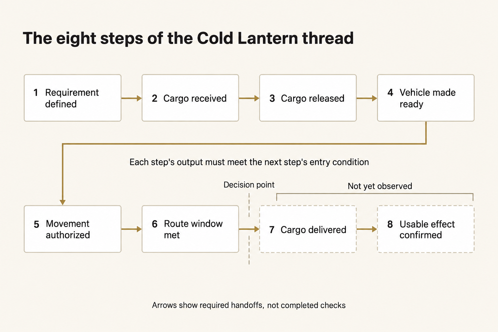
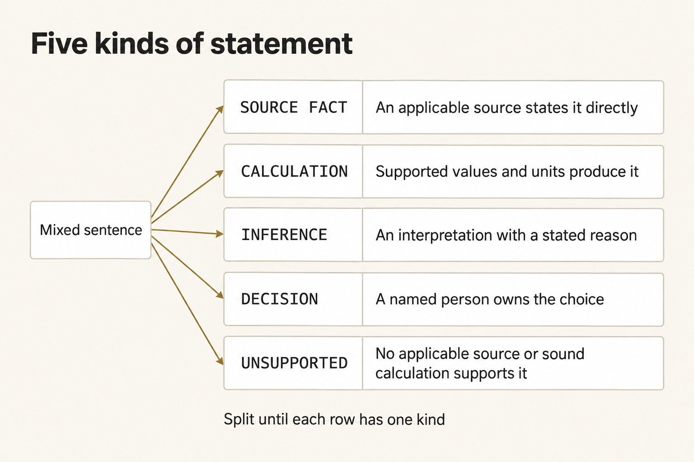
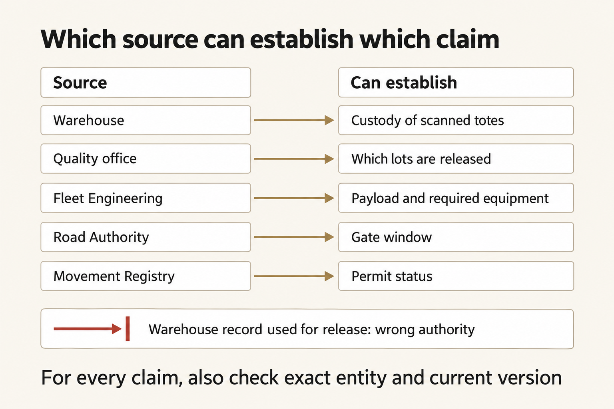
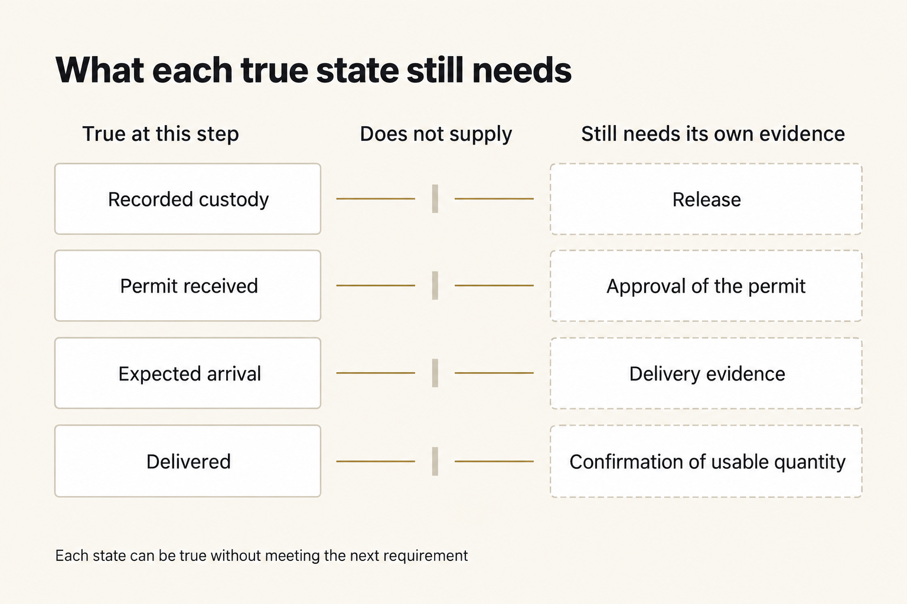

# Read a mission thread without getting lost in it

A brief can cite true facts and still recommend a movement those facts don't support. Before you accept Cold Lantern's `GO`, check what each of the eight steps shows and what the next requires. Allow about 15 minutes.

## What a mission thread is

A **mission thread** is the ordered path from a request to a result. It shows what must happen, in what order, and what each step must hand to the next.

*Evidence must support each required handoff to the decision point; expected arrival does not establish delivery or usable effect.*

Figure text

Follow the required path in order: 1. Requirement defined; 2. Cargo received; 3. Cargo released; 4. Vehicle made ready; 5. Movement authorized; 6. Route window met; 7. Cargo delivered; 8. Usable effect confirmed. Each step's output must meet the next step's entry condition. The arrows show required handoffs, not checks already completed. The decision point falls after step 6. Delivery and usable effect are not yet observed.

The eight steps are:

1. **Requirement defined** — the destination, usable quantity, route, and deadline are clear.
2. **Cargo received** — the warehouse records the exact totes and lots in its custody.
3. **Cargo released** — the quality office identifies which lots may be used.
4. **Vehicle made ready** — the released load and required rack fit the vehicle.
5. **Movement authorized** — the permit applies to the exact vehicle and route.
6. **Route window met** — the vehicle can reach the gate before it closes.
7. **Cargo delivered** — the route can reach the clinic by the deadline, and later evidence records actual delivery.
8. **Usable effect confirmed** — the clinic records receipt of the required released quantity.

At step 6, decide whether the evidence supports the `GO`. Expected arrival does not prove delivery or clinic use.

## Why a thread becomes difficult

Check what each recorded state means. A custody record alone doesn't show permission to use the cargo.

“Cargo received” opens into smaller questions:

- Were the exact totes scanned?
- Do their lot IDs match this mission?
- How many kits are in each tote?
- Does the warehouse record custody, or does it also have authority to release the kits?
- Was the record current at the decision time?
- What does the next step require?

The same pattern repeats in every step. When they matter, check these seven parts:

| Part | Plain question |
|---|---|
| Identity | Is this the exact mission, route, vehicle, permit, lot, clinic, and source revision? |
| Authority | Is this source allowed to establish this kind of fact? |
| Time | Was it current at 14:05 MDT, and is its time zone understood? |
| Quantity or condition | Are the count, units, required equipment, and state correct? |
| Dependency | What had to be true before this step could begin? |
| Handoff | Does this step's output meet the next step's entry condition? |
| Uncertainty | What is unknown, assumed, contradicted, or not yet observed? |

**Stop decomposing** (splitting a claim into smaller claims to check) when you reach one of these:

- a fact you can read directly in an applicable source;
- a calculation you can reproduce from supported facts and units;
- an assumption you have named as an assumption;
- an unresolved item that requires `HOLD`; or
- a decision owned by a named person.

## Five kinds of statement

A **material statement** could change the decision. Label each one in the AI brief with exactly one kind.

*Split a mixed sentence until each material statement has one kind and its own support.*

Figure text

Split a mixed sentence into separate rows until each row has one kind. A SOURCE FACT needs an applicable source that states it directly; a CALCULATION needs supported values and units that produce it; an INFERENCE needs an interpretation with a stated reason; and a DECISION needs a named person who owns the choice. Mark a statement UNSUPPORTED when no applicable source or sound calculation supports it. These are different kinds of statements, not steps that turn a fact into an approval.

- `SOURCE FACT` — an applicable source directly states it.
- `CALCULATION` — supported numbers and units produce it.
- `INFERENCE` — you interpret facts and state why that reading follows.
- `DECISION` — a named person chooses what happens next.
- `UNSUPPORTED` — no applicable source or sound calculation establishes it.

A sentence can contain more than one kind. Split it until each row has one kind.

## Source authority belongs to the claim

A source is not trustworthy for every claim.

*A genuine source may still be the wrong authority for this claim, entity, route, or decision time.*

Figure text

For custody of scanned totes, use the warehouse; for which lots are released, the quality office; for payload and required equipment, Fleet Engineering; for the gate window, the Road Authority; and for permit status, the Movement Registry. Even a genuine warehouse record is the wrong authority for release. For every claim, also check the exact entity and the current version.

- The warehouse records what it scanned.
- The quality office decides which lots are released.
- Fleet Engineering defines vehicle payload and required equipment.
- The Road Authority sets the gate window.
- The Movement Registry records permit status.

A genuine warehouse receipt can be the wrong source for usability. A current community update can be the wrong source for another route. A vendor note can contain real dimensions and a hostile instruction in the same file. Judge the source against the exact claim.

## The handoff rule

Even when one step is correct, the conclusion can be wrong if that step hasn't established what the next step requires.

*Check what the next step requires; the earlier true statement cannot supply missing authority or observation.*

Figure text

Recorded custody does not remove the need for release, and a received permit still needs approval. Expected arrival still needs delivery evidence, while delivery still needs confirmation of usable quantity. Each state can be true without meeting the next requirement.

- Twelve totes can be scanned while only ten are released.
- Released cargo can fit while the required rack pushes another load over capacity.
- A permit application can be received while the permit remains pending.
- The clinic can be reachable by 16:00 while the gate closes before the truck arrives.

The thread passes only when every required handoff to the decision point passes. An estimated clinic arrival is not delivery, and delivery is not yet clinic confirmation.
