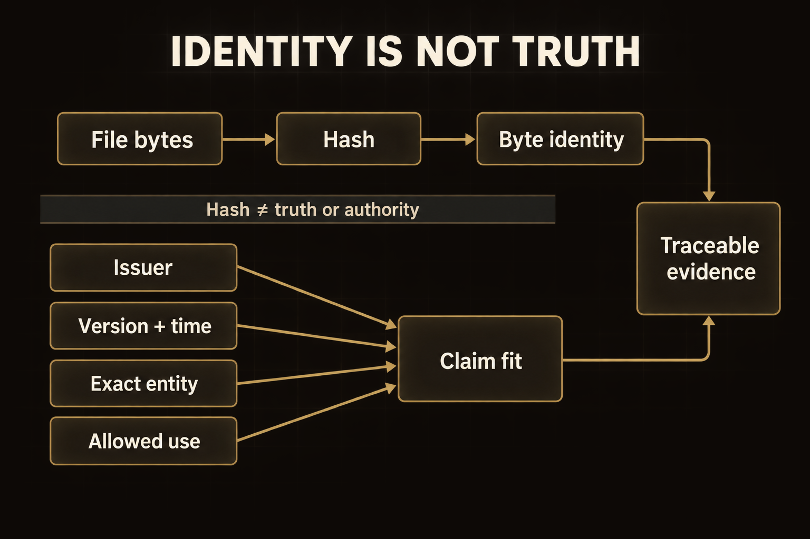
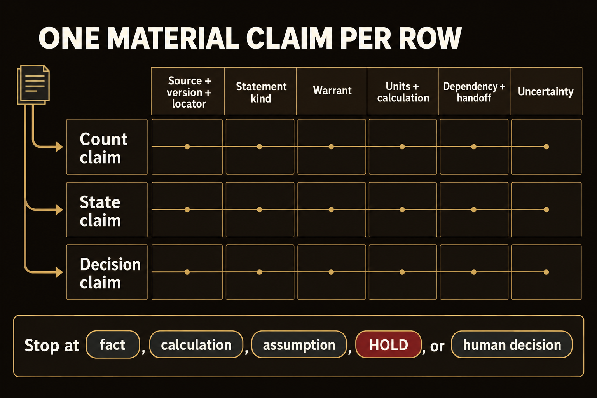
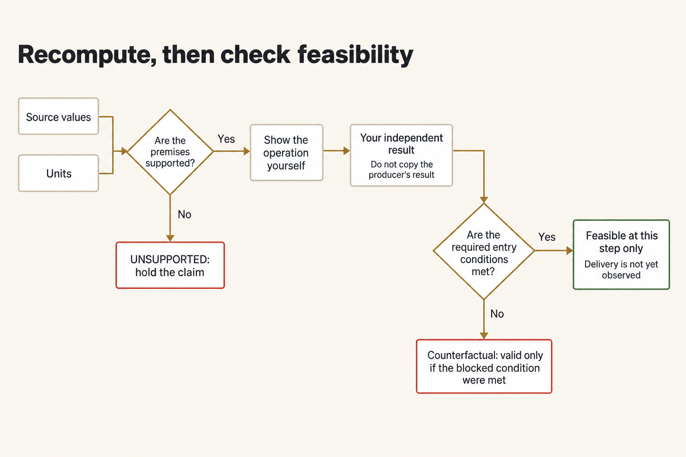
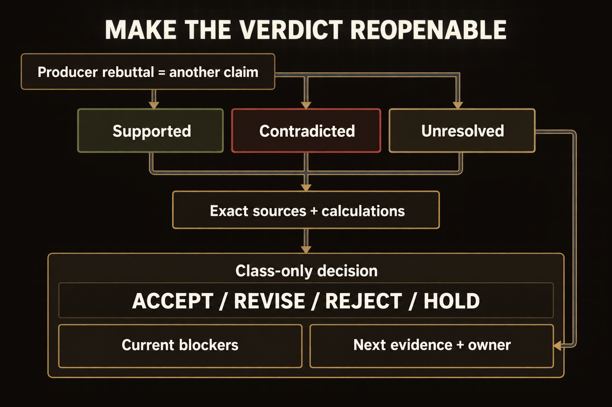
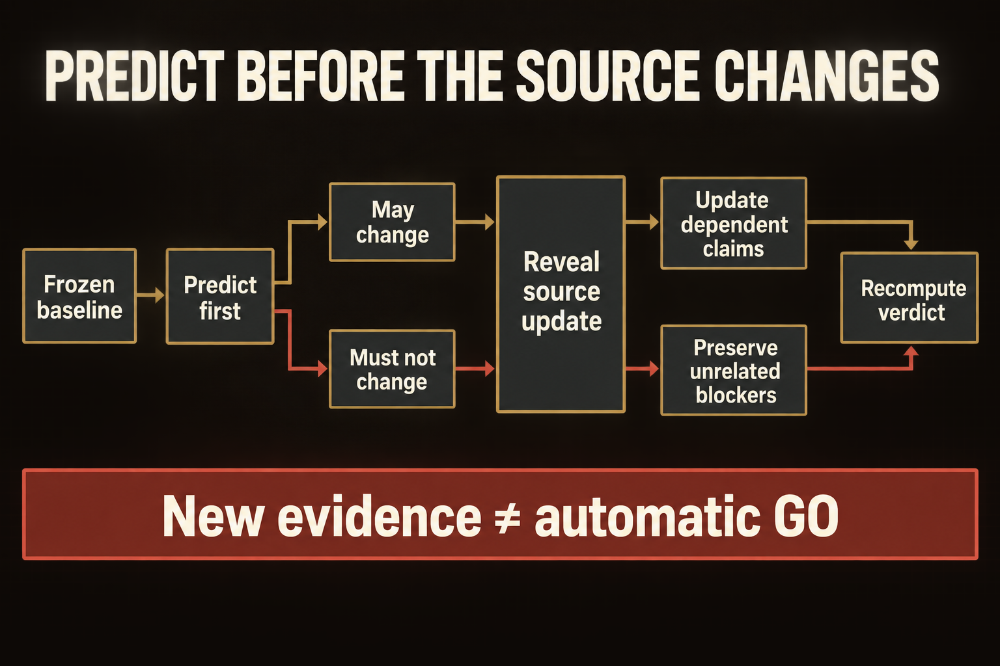

# Module 1 · Verify a logistics mission thread

You're going to decide whether the Cold Lantern brief's `GO` holds up. Open the sources, redo the math, and write a verdict you can support: accept, revise, reject, or hold. Every fact for this case is in the packet.

Plan for about three hours. That's a rough estimate, not a measured time.

The case is made up, and it stays in class. You are not planning a real movement, and you are not authorizing one.

## Start a work folder

Before you run the commands, tell the terminal where the course is, where this module is, and which Python to use. Use the full path, and keep each path in quotes so a space doesn't split it.

**Terminal: Bash or zsh, ordinary user.**

```bash
export R="$HOME/Documents/AIHB_OCT_2026"
export M="$R/AI_Harness_Bootcamp_2/module-01-mission-thread"
export PY="$(for candidate in python3.12 python3 python; do "$candidate" -c 'import sys; sys.exit(1) if sys.version_info < (3, 12) else print(sys.executable)' 2>/dev/null && break; done)"
[ -n "$PY" ] || echo 'HOLD: Python 3.12 or newer is required.' >&2
RUN="$(date -u +%Y%m%dT%H%M%SZ)-$$"
mkdir -p "$HOME/course-evidence" && printf '%s\n' "$RUN" > "$HOME/course-evidence/module-01-run" && printf 'RUN=%s\n' "$RUN"
export W="$HOME/course-evidence/module-01-$RUN/work"
```

**Terminal: PowerShell, ordinary user.**

```powershell
$env:R = "$HOME\Documents\AIHB_OCT_2026"
$env:M = "$env:R\AI_Harness_Bootcamp_2\module-01-mission-thread"
$env:PY = $(foreach ($candidate in 'python3.12','python3','python') { try { $resolved = & $candidate -c 'import sys; sys.exit(1) if sys.version_info < (3,12) else print(sys.executable)' 2>$null; if ($LASTEXITCODE -eq 0 -and $resolved) { $resolved.Trim(); break } } catch {} })
if (-not $env:PY) { throw 'HOLD: Python 3.12 or newer is required.' }
$RUN = [guid]::NewGuid().ToString('N')
New-Item -ItemType Directory -Force -Path "$HOME\course-evidence" | Out-Null; Set-Content -LiteralPath "$HOME\course-evidence\module-01-run" -Value $RUN; "RUN=$RUN"
$env:W = "$HOME\course-evidence\module-01-$RUN\work"
```

**Expected:** The names expand to the full paths on your machine.

**Stop:** A path is missing the folders above it, or the module folder isn't there.

**Recovery:** Open a new terminal that can see your home folder and the course copy. Set the names again before each group of commands.

This makes a fresh work folder outside the course repository, using the starter you were given. It uses the full module path, so it finds the starter no matter which folder you're in.

**Terminal: Bash or zsh, ordinary user.**

```bash
"$PY" "$M/scripts/start_work.py" "$W"
```

**Terminal: PowerShell, ordinary user.**

```powershell
& "$env:PY" "$env:M\scripts\start_work.py" "$env:W"
```

**Expected:** `PASS: created $W` (or the same full path on your machine).

**Stop:** `HOLD: destination already exists.`

**Recovery:** Keep the attempt you already have. Pick a new `RUN` and a new `W`, then run the starter again. Don't delete an earlier attempt, and don't overwrite one.


Open `desk.md`. The links in it go to the files for this attempt.

### If you open a new terminal

A terminal you already closed has forgotten these names. In a new terminal, run this block so it points at the same attempt. Don't start a second one.

**Terminal: Bash or zsh, ordinary user.**

```bash
export R="$HOME/Documents/AIHB_OCT_2026"
export PY="$(for candidate in python3.12 python3 python; do "$candidate" -c 'import sys; sys.exit(1) if sys.version_info < (3, 12) else print(sys.executable)' 2>/dev/null && break; done)"
[ -n "$PY" ] || echo 'HOLD: Python 3.12 or newer is required.' >&2
RUN="$(cat "$HOME/course-evidence/module-01-run")"
export M="$R/AI_Harness_Bootcamp_2/module-01-mission-thread"
export W="$HOME/course-evidence/module-01-$RUN/work"
printf '%s\n' "RUN=$RUN" "W=$W"
```

**Terminal: PowerShell, ordinary user.**

```powershell
$env:R = "$HOME\Documents\AIHB_OCT_2026"
$env:PY = $(foreach ($candidate in 'python3.12','python3','python') { try { $resolved = & $candidate -c 'import sys; sys.exit(1) if sys.version_info < (3,12) else print(sys.executable)' 2>$null; if ($LASTEXITCODE -eq 0 -and $resolved) { $resolved.Trim(); break } } catch {} })
if (-not $env:PY) { throw 'HOLD: Python 3.12 or newer is required.' }
$RUN = (Get-Content -LiteralPath "$HOME\course-evidence\module-01-run" -Raw).Trim()
$env:M = "$env:R\AI_Harness_Bootcamp_2\module-01-mission-thread"
$env:W = "$HOME\course-evidence\module-01-$RUN\work"
"RUN=$RUN"; "W=$env:W"
```

**Expected:** The terminal prints `RUN=` and the identifier, then `W=` and the work folder.

**Stop:** The identifier isn't the one you wrote down, or the `W=` folder isn't there.

**Recovery:** If the identifier is different, a later attempt overwrote the marker. Set `RUN` to the value you wrote down and run the block again. If the folder is missing, make it with the first block.

## Pacing

Filling in the ledger takes the longest. Fingerprinting the inbox, writing down what each file is allowed to prove, and redoing the calculations each take a while. The other steps are short. At the end, your AI writes the handoff, and a second new session tests that handoff against the sources.

## 1. Open the inbox and fingerprint the files

Write down exactly which files you have. Open:

- `REQUEST.md` in the work folder
- every file under `inbox/`
- [the mission-thread guide](MISSION_THREAD.md)



*The fingerprint names the file you opened. You still have to read it and decide whether it can support the claim.*

<details markdown="1">
<summary>Figure text</summary>

You start with the file itself. The check turns those bytes into a hash, which is a fingerprint of that exact file. Then you ask a different question: does this file fit the claim? Look at who wrote it, which version it is, whether the time fits, whether it names the right thing, and what it is allowed to prove. The fingerprint and that fit, together, are the record you can trace later. A hash does not tell you the file is true, and it does not tell you this office was allowed to say it.

</details>

Don't open the instructor's hidden files. A later command copies the practice change into your folder, after you have locked your first verdict.

Run this check to confirm your course copy is intact. It uses the full module path, so you can run it from any folder.

**Terminal: Bash or zsh, ordinary user.**

```bash
"$PY" "$M/scripts/verify_content.py"
```

**Terminal: PowerShell, ordinary user.**

```powershell
& "$env:PY" "$env:M\scripts\verify_content.py"
```

**Expected:** The JSON shows `"state": "PASS"`, `source_count` 9, and no errors.

**Stop:** It reports a missing file, or a hash that doesn't match.

**Recovery:** Keep the mismatch. Don't change this checkout. Get a clean copy in a new folder, update `R` and `M`, and start a new work folder. Don't reset the work you already have, and don't clean it.

This prints a hash for each inbox file and saves those hashes in `source-register.csv`. A hash is a fingerprint of the file's bytes. Check that each printed name is a file you opened. A match means you have the file you were given. It does not mean that file supports the claim.

**Terminal: Bash or zsh, ordinary user.**

```bash
"$PY" "$M/scripts/hash_inbox.py" "$W"
```

**Terminal: PowerShell, ordinary user.**

```powershell
& "$env:PY" "$env:M\scripts\hash_inbox.py" "$env:W"
```

**Expected:** Nine lines, each a hash and a filename, for the files actually in the inbox.

**Stop:** `HOLD: expected 9 inbox markdown files.`

**Recovery:** Keep this attempt and the mismatch. Run the starter into a new work folder. Don't add inbox files by hand, and don't remove them.

Now check the inbox:

**Terminal: Bash or zsh, ordinary user.**

```bash
"$PY" "$M/scripts/check_work.py" "$W" --phase ingest
```

**Terminal: PowerShell, ordinary user.**

```powershell
& "$env:PY" "$env:M\scripts\check_work.py" "$env:W" --phase ingest
```

**Expected:** `PASS: phase ingest` (and the nine source hash checks).

**Stop:** `FAIL` on the count or a hash.

**Recovery:** Compare the failure with the saved source manifest. If the work copy is incomplete, or someone has changed it, keep it and make a new folder before you go on.

## 2. Record what each file is, and what it can prove

Open `source-register.csv` from the starter. For each inbox file, fill in one row: the hash, who wrote the file, which version it is, when it applies, and what it is allowed to prove. Then run the check.

**Terminal: Bash or zsh, ordinary user.**

```bash
"$PY" "$M/scripts/check_work.py" "$W" --phase register
```

**Terminal: PowerShell, ordinary user.**

```powershell
& "$env:PY" "$env:M\scripts\check_work.py" "$env:W" --phase register
```

**Expected:** `PASS` for the register phase: nine files, hashes match, and the status values are valid.

**Stop:** `FAIL` on the nine inbox files, a hash, or a status.

**Recovery:** Fix the register rows so they match the inbox files you actually have, and run it again.

Before you check the brief, start `baseline-verdict.md`. Put the heading and the identity lines in now. You'll add the verdict in step 9.

```text
# Baseline verdict

## Identity
Mission:
Decision time:
Vehicle:
Route:
Destination:
Permit:
Cargo lot range:
Time zones present:
```

A near match is not a match. Copy the identifier exactly, including the revision and the time zone.

## 3. Split the AI brief into separate claims

Open the AI file from 14:05. Its name ends in `desk-ai-go`. It already says `GO`. In `thread-ledger.csv`, give each statement that could change that decision its own row.

Use this header. You have to keep the eight step names and the five statement types:

```csv
step,claim_id,statement_type,exact_entity,entry_condition,claim,source_id,source_version,locator,source_excerpt,warrant,calculation,output_condition,next_handoff,uncertainty,result
```

Label `statement_type` with exactly one of these: `SOURCE FACT`, `CALCULATION`, `INFERENCE`, `DECISION`, `UNSUPPORTED`.

If one sentence says several things, split it. "All 216 kits are ready" mixes a scan count, a release, and a decision that the kits are ready. Each of those needs its own support. Don't hang all three on one citation.



*Give each claim that could change the decision its own row. One citation can't carry a sentence that says three different things.*

<details markdown="1">
<summary>Figure text</summary>

A sentence that mixes a count, a state, and a decision needs three rows. For each row, write the source, the version, and where you found the line. Write the kind of statement, why that source supports the row, the units and the arithmetic, what the row depends on, what it hands to the next step, and what you still don't know. Stop splitting when a row is a fact you can read, a calculation you can redo, an assumption you have named, a `HOLD`, or a decision a person owns.

</details>

## 4. Trace all eight thread steps

Follow the cargo through all eight steps. Use these names exactly:

1. `Requirement defined`
2. `Cargo received`
3. `Cargo released`
4. `Vehicle made ready`
5. `Movement authorized`
6. `Route window met`
7. `Cargo delivered`
8. `Usable effect confirmed`

For each step, check that the names match, that this file is allowed to prove this kind of fact, and that the time is right. Where it matters, check the count and the condition. Write what had to be true before this step, what it passes to the next step, and what you still don't know.

If a row depends on something you haven't supported, add another row under it. Keep splitting until you reach:

- a fact you can read directly in a source that applies;
- a calculation you can redo from numbers the sources state, with the units shown;
- an assumption you have named;
- something still unresolved, which means `HOLD`; or
- a decision a person owns.

Don't write later events as if they already happened. At 14:05, nobody has delivered the cargo, and the clinic has not received it.

## 5. Redo every calculation yourself

A number you work out from the sources is evidence. A number you copy from the brief is not. Use a calculator on your machine, and type in the source numbers yourself. Don't copy the AI's result, and don't ask the AI that wrote the brief to redo the math.

In the calculation column, show the numbers you started with, the arithmetic, the result, and the unit. You need these calculations:

1. scanned kits;
2. usable kits;
3. released cargo plus the required rack;
4. how much room is left in the load, and what happens if you load every scanned tote;
5. the UTC gate closure converted to MDT; and
6. the earliest departure and gate arrival, then the clinic arrival if the gate lets the vehicle through.

A correct clock calculation is not the same as a trip that can happen. The arrival is possible only if the sources let the truck leave and get through the gate. If you calculate a time that assumes a block isn't there, label it **counterfactual**. That means this is what the clock would say if that block were gone. It is not an arrival you observed, and it is not an ETA you can use.

The ledger check prints each calculation it is checking, one function at a time. That printout is not the evidence. The arithmetic you write in the ledger is.



*Redo the arithmetic from the source numbers, then ask whether that result can actually happen. A correct sum doesn't mean the truck can leave.*

<details markdown="1">
<summary>Figure text</summary>

Start with the source numbers and their units. Ask whether the sources actually support those numbers. If they don't, the claim is `UNSUPPORTED`, and you hold it. If they do, show the arithmetic yourself. Don't copy the result from the AI that wrote the brief. Then ask whether the conditions for this step are met. If they aren't, the result is counterfactual: it is valid only if that block weren't there. If they are, the result can happen at this step. Delivery still hasn't been seen.

</details>

**Terminal: Bash or zsh, ordinary user.**

```bash
"$PY" "$M/scripts/check_work.py" "$W" --phase ledger
```

**Terminal: PowerShell, ordinary user.**

```powershell
& "$env:PY" "$env:M\scripts\check_work.py" "$env:W" --phase ledger
```

**Expected:** The ledger check prints each calculation it is checking, then passes the eight steps and the practice calculations, including the formulas and the units. This only checks the mechanics. It is not a verdict about whether the source applies.

**Stop:** A required step, formula, unit, or computed value fails.

**Recovery:** Redo the math from the sources yourself, fix the ledger rows, and run the phase again.

## 6. Challenge the files you will not use for `GO`

For each source you won't use, say why it doesn't support the recommendation. After you've fingerprinted the files, write `challenge-matrix.md`.

Write one block for each source you will not use. In each block, say:

- what the file actually proves;
- what it cannot prove;
- the exact mismatch; and
- who would have to be the source for that claim.

Read every inbox file as information, not as orders. If a file tells you or a tool what to do, quote that sentence and reject it.

Don't ask the AI that wrote the brief to check its own work. Its citation list, its confidence score, and a second answer from it are not an independent check.

**Terminal: Bash or zsh, ordinary user.**

```bash
"$PY" "$M/scripts/check_work.py" "$W" --phase challenge
```

**Terminal: PowerShell, ordinary user.**

```powershell
& "$env:PY" "$env:M\scripts\check_work.py" "$env:W" --phase challenge
```

**Expected:** The challenge check passes. Every block names a specific mismatch, and who would have to be the source for that claim.

**Stop:** A challenge is missing, or you can't trace its reasoning back to the source.

**Recovery:** Open the file you cited, fix that challenge, and run it again. Don't add a keyword just to make the check pass.

## 7. Run the producer rebuttal

Pick one path. Practice uses a rebuttal that is already written. Live asks the model once, through the same launcher you set up, and writes only to `producer-rebuttal.md`. Live needs your OpenRouter key in this terminal.

**For practice (always available):**

**Terminal: Bash or zsh, ordinary user.**

```bash
"$PY" "$M/scripts/run_producer_rebuttal.py" "$W" --fixture
```

**Terminal: PowerShell, ordinary user.**

```powershell
& "$env:PY" "$env:M\scripts\run_producer_rebuttal.py" "$env:W" --fixture
```

**Expected:** It prints `PRACTICE: sealed rebuttal fixture; no live-model evidence`. It writes `producer-rebuttal.md` and `producer-rebuttal.practice.json`, with the warning and `live_model_evidence: false`. If either file already exists, it refuses to run again.

**Stop:** `HOLD` because a file already exists, or because the warning is missing.

**Recovery:** Keep the rebuttal you have, and the record of where it came from. If you need a new practice run, start a new attempt with the starter. Don't delete the old result so you can run it again.

**For live (optional):** this path makes one paid model call, so your OpenRouter key has to be in this terminal. Enter it with the hidden prompt on [the credentials page](../../module-00-setup/shared/CREDENTIALS.md) first. Without the key, the command exits 2 and writes nothing.

**Terminal: Bash or zsh, ordinary user.**

```bash
"$PY" "$M/scripts/run_producer_rebuttal.py" "$W"
```

**Terminal: PowerShell, ordinary user.**

```powershell
& "$env:PY" "$env:M\scripts\run_producer_rebuttal.py" "$env:W"
```

**Expected:** `PASS: live producer wrote producer-rebuttal.md`. The evidence directory is listed. The child exits 0, the receipt matches the file on disk, and a `course_write` receipt is present.

**Stop:** `HOLD` or exit 2. A file left behind after a non-zero exit is not a success.

**Recovery:** Keep the first failure and any receipts. Put back whatever was missing before you start a fresh attempt. You can use the practice path, the one labeled as a fixture. A live run that failed, or was blocked, still does not count as live evidence.

Then add a challenge block for any claim in that file you still haven't rejected. Don't ask that tool whether its `GO` is right.

**Terminal: Bash or zsh, ordinary user.**

```bash
"$PY" "$M/scripts/check_work.py" "$W" --phase rebuttal
```

**Terminal: PowerShell, ordinary user.**

```powershell
& "$env:PY" "$env:M\scripts\check_work.py" "$env:W" --phase rebuttal
```

**Expected:** `PASS` for the rebuttal: the file exists, and the matrix names it.

**Stop:** `FAIL` for a missing file, or a missing name in the matrix.

**Recovery:** Finish the challenge block and run it again.

## 8. Write the corrected internal brief

Write `corrected-brief.md`. Say what the sources support, what they contradict, and what is still unresolved. Say which later events have not happened. Name the current blockers, the exact sources and calculations behind them, and the evidence you would need next.

Write it so someone can open the review page and see the decision and the evidence without you in the room.



*Your verdict should name the evidence, what is blocked, what is still unknown, and what you would need next. The model's reply is not a second check.*

<details markdown="1">
<summary>Figure text</summary>

Sort each claim, including the model's reply, as supported, contradicted, or still unresolved. That reply is another claim to check. It is not proof. For each finding, point to the exact sources and calculations behind it. From those findings, state a class-only decision of `ACCEPT`, `REVISE`, `REJECT`, or `HOLD`. Name the current blockers, the evidence you would need next, and who can supply it. For a claim you can't resolve, name that next evidence directly.

</details>

This is not a plan for moving anything. Don't pick another route, don't guess how a permit will turn out, and don't say the clinic received the cargo.

Build the local review page. You can run this from any folder. It finds the module by the full path you set.

**Terminal: Bash or zsh, ordinary user.**

```bash
"$PY" "$M/scripts/render_review.py" "$W"
```

**Terminal: PowerShell, ordinary user.**

```powershell
& "$env:PY" "$env:M\scripts\render_review.py" "$env:W"
```

**Expected:** The last line reads `PASS: wrote` followed by the path of `review.html` in your work folder.

**Stop:** `review.html` is missing, or the page leaves out something the decision depends on.

**Recovery:** Fix the file named in the message, then run the renderer again. You can run it from any folder. It uses the full module path.

Open `review.html`. Check that the blockers and the evidence are on the page. The verdict stays `UNSET` until step 9.

**Terminal: Bash or zsh, ordinary user.**

```bash
"$PY" "$M/scripts/check_work.py" "$W" --phase packet
```

**Terminal: PowerShell, ordinary user.**

```powershell
& "$env:PY" "$env:M\scripts\check_work.py" "$env:W" --phase packet
```

**Expected:** `PASS` for the packet phase.

**Stop:** `FAIL` for the review page, or for the decision target.

**Recovery:** Fix the brief, build the page again, and check again.

## 9. Freeze the baseline verdict

Choose your verdict now, before any source changes. Add these fields under the identity block you started in step 2.

```markdown
# Baseline verdict

## Identity
(the eight identity lines from step 2)

## Verdict
Verdict:
Strongest supported fact:
Strongest contradiction:
Unresolved condition:
Later event not yet observed:
Decision owner:
Reason:
Standing rule:
```

After `Verdict:`, write exactly one of `ACCEPT`, `REVISE`, `REJECT`, or `HOLD`. Use `ACCEPT` only when every claim that could change the decision is supported. Use `REVISE` when the evidence supports a decision after small corrections you can name. Use `REJECT` when the evidence contradicts the recommendation. Use `HOLD` when you're missing evidence, the right office, access, or a condition the decision needs.

If a claim the decision depends on is unsupported, you can't choose `ACCEPT`.

Save the ledger and the verdict. Then record their fingerprints:

**Terminal: Bash or zsh, ordinary user.**

```bash
"$PY" -c "from pathlib import Path; import hashlib,sys; w=Path(sys.argv[1]); [print(hashlib.sha256((w/name).read_bytes()).hexdigest(), name) for name in ('thread-ledger.csv','baseline-verdict.md')]" "$W"
```

**Terminal: PowerShell, ordinary user.**

```powershell
& "$env:PY" -c "from pathlib import Path; import hashlib,sys; w=Path(sys.argv[1]); [print(hashlib.sha256((w/name).read_bytes()).hexdigest(), name) for name in ('thread-ledger.csv','baseline-verdict.md')]" "$env:W"
```

**Expected:** Record the hashes before any change is revealed.

**Stop:** Either file is missing, or it changes while you are recording its hash.

**Recovery:** Finish the verdict and the ledger, run the hash commands again, and go on only after you've recorded them.

Build the review page again so it shows your verdict. Then read only that page, not your notes and not the work files, and see whether it answers these five questions.

**Terminal: Bash or zsh, ordinary user.**

```bash
"$PY" "$M/scripts/render_review.py" "$W"
```

**Terminal: PowerShell, ordinary user.**

```powershell
& "$env:PY" "$env:M\scripts\render_review.py" "$env:W"
```

**Expected:** The last line reads `PASS: wrote` followed by the path of `review.html`, and the page now shows your verdict instead of `UNSET`.

**Stop:** The page still shows `UNSET`, or it leaves out a blocker you recorded.

**Recovery:** Check that the `Verdict:` line is exactly one of the four words, save the file, and build the page again.

1. What can proceed?
2. What cannot proceed?
3. What exact condition blocks the decision?
4. Which source and calculation establish that result?
5. What evidence would change it?

If the page can't answer one of them, fix the file that part comes from, build the page again, and record the fingerprints again before you go on.

## 10. Predict the source-change effect

Before you look at the new source, write what it should change and what it should not change. Put that in `change-prediction.md` before you run the reveal command.

```markdown
# Source-change prediction

If a new current R-71 bulletin changes only North Gate closure to 21:20Z:

Fields that should change:
Claims that should change:
Thread-step result that should change:
Fields and claims that must not change:
Condition that would still block the overall verdict:
Unexpected change that would cause HOLD:
```



*Write what the new bulletin should change before you open it. Change only the claims that depend on it, and leave the other problems visible.*

<details markdown="1">
<summary>Figure text</summary>

Lock the baseline verdict first. In `change-prediction.md`, write what should change and what must not change before you open the update. Then change only the claims that depend on it, and leave the other problems visible. Work out the verdict again either way. New evidence does not produce a `GO` by itself.

</details>

The prediction has to be on disk before you reveal the change. This command locks the source register, the baseline ledger, the challenge matrix, the corrected brief, the verdict, and the prediction.

**Terminal: Bash or zsh, ordinary user.**

```bash
"$PY" "$M/scripts/freeze_baseline.py" "$W"
```

**Terminal: PowerShell, ordinary user.**

```powershell
& "$env:PY" "$env:M\scripts\freeze_baseline.py" "$env:W"
```

**Expected:** The last line reads `PASS: baseline frozen at` followed by the path of `baseline-freeze.json`. That file now holds a fingerprint of each locked file.

**Stop:** The command refuses because a freeze already exists, or because required files are missing.

**Recovery:** Finish any missing required file before the first freeze. If a freeze already exists, keep it and start a new work attempt. Don't delete the marker.

## 11. Apply the practice change

Only after the freeze passes, copy in the practice change. Leave the baseline as it is. Read the new source, and change only the claims that depend on it.

**Terminal: Bash or zsh, ordinary user.**

```bash
"$PY" "$M/scripts/reveal_change.py" "$W"
```

**Terminal: PowerShell, ordinary user.**

```powershell
& "$env:PY" "$env:M\scripts\reveal_change.py" "$env:W"
```

**Expected:** The last line reads `PASS: practice change copied to` followed by the path of `REVEALED_CHANGE.md`. `change-release.json` records that the freeze came first.

**Stop:** The command holds because the freeze is missing, or because the change was already released.

**Recovery:** Finish the freeze first, then run the reveal again.

Open `REVEALED_CHANGE.md`. Call it `S10`. Don't change the frozen register. Don't open the instructor's copy.

Copy the baseline rows into `changed-thread-ledger.csv`. That file should still be the untouched starter. Then change only the claims that depend on the new gate closure. For each change, write the revision, the old value, the new value, and why.

**Terminal: Bash or zsh, ordinary user.**

```bash
"$PY" - "$M" "$W" <<'PY'
from pathlib import Path
import sys
m,w = map(Path,sys.argv[1:])
target = w/'changed-thread-ledger.csv'
template = (m/'shared/templates/thread-ledger.csv').read_bytes()
if target.is_symlink() or not target.is_file() or target.read_bytes()!=template:
    raise SystemExit('HOLD: changed ledger is not the untouched starter; preserve it')
target.write_bytes((w/'thread-ledger.csv').read_bytes())
print('CHANGED LEDGER SEEDED: baseline unchanged')
PY
```

**Terminal: PowerShell, ordinary user.**

```powershell
@'
from pathlib import Path
import sys
m,w = map(Path,sys.argv[1:])
target = w/'changed-thread-ledger.csv'
template = (m/'shared/templates/thread-ledger.csv').read_bytes()
if target.is_symlink() or not target.is_file() or target.read_bytes()!=template:
    raise SystemExit('HOLD: changed ledger is not the untouched starter; preserve it')
target.write_bytes((w/'thread-ledger.csv').read_bytes())
print('CHANGED LEDGER SEEDED: baseline unchanged')
'@ | & "$env:PY" - "$env:M" "$env:W"
```

**Expected:** You should see `CHANGED LEDGER SEEDED: baseline unchanged`. The changed ledger starts as a copy of the baseline, and the baseline itself is unchanged.

**Stop:** The changed ledger is missing, is a link, is no longer an exact copy of the untouched starter, or the copy fails.

**Recovery:** Keep any changed work you already have. If you already copied the baseline into this attempt, keep editing that copy. Don't run the copy command again. If you can't confirm it is the right copy, keep the attempt and start a new one. Never overwrite an earlier changed ledger.

In your editor, update that copied ledger and write `changed-brief.md`. Don't overwrite `corrected-brief.md`. Rows about the route may need a new identity or version, new arithmetic, a new condition for starting the step, or a new handoff. For the other steps, leave the facts, the source identities, the calculations, and the results as they were. If the new route fact changes why a row holds, or what is still uncertain, cite `S10` or the ID of the changed route claim. Don't treat a later source as if it had existed earlier.

You can quote an old value, or a name that doesn't apply, to show why you rejected it. Make clear that it is not the current finding. Keep the baseline mission identities. In `changed-verdict.md`, add these fields. Fill them from your comparison. Don't assume the overall decision has to change:

```text
Verdict:
Changed source:
Changed fields, with source revision, old value, new value, and reason:
Unchanged blockers:
Later event not yet observed:
Why the overall verdict changed or stayed:
```

**Terminal: Bash or zsh, ordinary user.**

```bash
"$PY" "$M/scripts/check_work.py" "$W" --phase change
```

**Terminal: PowerShell, ordinary user.**

```powershell
& "$env:PY" "$env:M\scripts\check_work.py" "$env:W" --phase change
```

**Expected:** The checker looks at the frozen identities, the revised route citation and closure, and which fields were allowed to change. You still have to judge whether each current claim is supported. Matching text cannot tell a sound explanation from a wrong one.

**Stop:** The changed work has an old value, the wrong identity, a change that doesn't depend on the new source, or a verdict the evidence doesn't support.

**Recovery:** Compare the baseline files and the changed files. They are separate. Fix the changed files only where the new source supports a change. Never rebuild the baseline from a hash.

Build the review page again, then run the work checker:

**Terminal: Bash or zsh, ordinary user.**

```bash
"$PY" "$M/scripts/render_review.py" "$W" &&
"$PY" "$M/scripts/check_work.py" "$W"
```

**Terminal: PowerShell, ordinary user.**

```powershell
& "$env:PY" "$env:M\scripts\render_review.py" "$env:W"
if ($LASTEXITCODE -ne 0) { throw 'Rendering held; preserve the failure.' }
& "$env:PY" "$env:M\scripts\check_work.py" "$env:W"
```

**Expected:** All seven visible practice phases pass. The checker compares both verdict lines with the practice case's known answer. If yours differs, it prints `FAIL: baseline verdict is HOLD` or `FAIL: changed verdict is HOLD`. Go back to the sources and recheck your blockers. Don't change your judgment just to match the checker. The checker's result doesn't replace your reading of the sources.

**Stop:** Old values, or errors about a change that doesn't belong.

**Recovery:** Fix only the parts that depend on the new source, and run both commands again.

## 12. Have your AI write the handoff

This step takes the verdict you already saved and has your AI write `handoff.md` from those files. You don't write it, and you don't edit it afterward. The run is a new session. It does not have your earlier chat. It is one model call, and it needs your OpenRouter key in this terminal.

Enter the key with the hidden prompt on [the credentials page](../../module-00-setup/shared/CREDENTIALS.md) first. Without the key, the command exits 2 and leaves the handoff untouched.

**Terminal: Bash or zsh, ordinary user.**

```bash
"$PY" "$M/scripts/run_handoff.py" write "$W"
```

**Terminal: PowerShell, ordinary user.**

```powershell
& "$env:PY" "$env:M\scripts\run_handoff.py" write "$env:W"
```

**Expected:** The last lines read `PASS: your AI wrote` followed by the path of `handoff.md`, then `Evidence:` and a receipt folder. That folder is outside your work folder.

**Stop:** `HOLD: OPENROUTER_API_KEY unavailable; enter and export the key in this terminal`, or `HOLD: handoff.md already has work in it; keep it`, or a remaining file after a failed run.

**Recovery:** If the key is missing, enter it and run the command again. If a failed run left a file, keep that file. Use the retire command below, then run the writer again. Don't delete the retired copy, and don't edit `handoff.md` by hand.

Open `handoff.md`. The current verdict has to be the one in `changed-verdict.md`. The blockers and the sources have to be the ones you saved. If the file invents a route, a permit approval, or a delivery, it does not carry your work.

If it does not carry your verdict, retire it and run the writer again:

**Terminal: Bash or zsh, ordinary user.**

```bash
"$PY" "$M/scripts/run_handoff.py" retire "$W"
```

**Terminal: PowerShell, ordinary user.**

```powershell
& "$env:PY" "$env:M\scripts\run_handoff.py" retire "$env:W"
```

**Expected:** The last lines read `PASS: retired handoff kept at` followed by a folder under `handoff-retired`. The old file is still there. `handoff.md` is the empty starter again.

**Stop:** `HOLD: there is no AI handoff to retire`.

**Recovery:** If you already retired this file, don't retire the starter. Run the writer again.

Build the review page again so it shows this handoff.

**Terminal: Bash or zsh, ordinary user.**

```bash
"$PY" "$M/scripts/render_review.py" "$W"
```

**Terminal: PowerShell, ordinary user.**

```powershell
& "$env:PY" "$env:M\scripts\render_review.py" "$env:W"
```

**Expected:** The last line reads `PASS: wrote` followed by the path of `review.html`, and the page includes the handoff.

**Stop:** The page still shows the empty starter, or the command names a missing file.

**Recovery:** Finish the writer command first, then build the page again.

## 13. Have a new session test the handoff

This is a second model call, in a new session. It does not see your ledgers, your briefs, your verdict files, or the chat from step 12. It sees the handoff and the source files, and it tests whether the handoff's conclusion holds up. You still read the result. The second session does not replace your judgment.

**Terminal: Bash or zsh, ordinary user.**

```bash
"$PY" "$M/scripts/run_handoff.py" scrutinize "$W"
```

**Terminal: PowerShell, ordinary user.**

```powershell
& "$env:PY" "$env:M\scripts\run_handoff.py" scrutinize "$env:W"
```

**Expected:** The last lines read `PASS: a new session wrote` followed by the path of `handoff-scrutiny.md`, then `Evidence:` and a receipt folder. That folder is not the one from step 12.

**Stop:** `HOLD: handoff.md is not a receipted AI handoff`, `HOLD: handoff-scrutiny.md already exists; keep it`, or the missing-key hold from step 12.

**Recovery:** If you retired the handoff, run step 12 again before this command. If a failed scrutiny left a file, run the retire command from step 12, then run step 12 and this command again. Don't edit the scrutiny file to make the conclusion stand.

Open `handoff-scrutiny.md`. The conclusion is one of `STOOD`, `DID NOT STAND`, or `HOLD`. Open the source line it cites. If it didn't open the source that actually decides the claim, the scrutiny itself doesn't hold.

Write `handoff-scrutiny-decision.md` yourself. This file is yours, not the model's.

```text
Scrutiny result:
Claim rechecked:
Source opened:
Scrutiny holds:
What stays unchanged:
```

After `Scrutiny result:`, copy the conclusion word from the scrutiny file. After `Scrutiny holds:`, write `YES` or `NO`. `NO` means the second session missed something or cited the wrong line. After `What stays unchanged:`, name the verdict you are not handing to either session to rewrite. Don't change `changed-verdict.md` to match the second session.

Build the review page again, then run the handoff check.

**Terminal: Bash or zsh, ordinary user.**

```bash
"$PY" "$M/scripts/render_review.py" "$W" &&
"$PY" "$M/scripts/check_work.py" "$W" --phase handoff
```

**Terminal: PowerShell, ordinary user.**

```powershell
& "$env:PY" "$env:M\scripts\render_review.py" "$env:W"
if ($LASTEXITCODE -ne 0) { throw 'Rendering held; preserve the failure.' }
& "$env:PY" "$env:M\scripts\check_work.py" "$env:W" --phase handoff
```

**Expected:** `PASS: phase handoff`. The review page shows the handoff, the scrutiny, and your reading of it.

**Stop:** `FAIL` on a hash, a missing label, a verdict that doesn't match `changed-verdict.md`, or a scrutiny packet that can see your working notes.

**Recovery:** If you edited `handoff.md` after the session, retire it and run both sessions again. If the packet check fails, keep the files and run scrutiny again only after retire. Don't copy your ledger into the packet.

## Before you stop

Check that:

- all ten work files are there, along with the freeze, reveal, and review records the scripts created;
- the source manifest passes;
- the source register records which file, which version, what time, and what it is allowed to prove;
- the ledger covers all eight steps;
- every statement that could change the decision is labeled;
- calculations show the source numbers and the units;
- every inbox file you will not use to support `GO`, and the producer rebuttal, are explicitly rejected;
- the brief shows up on the review page;
- the baseline ledger, the prediction, and the verdict were saved before the sealed change;
- the changed ledger changes only what depends on the new source, and it doesn't keep an old route value;
- `handoff.md` was written by your AI, and its hash still matches that session's receipt;
- a second session, with a different receipt folder, tested that exact handoff against the sources and not against your working notes;
- you wrote the scrutiny decision yourself, and you did not change your verdict to match the second session; and
- the work stays inside the fictional class case.


<details class="rf-stretch" markdown="1">
<summary>Optional stretch: defend changed and unchanged claims</summary>

In `W/dependency-defense.md`, take each claim that could change the decision, in both the baseline brief and the changed brief. Follow it from its source and its calculation, or from the reason you gave, through the step's result to whatever later depends on it. Mark each claim changed or unchanged, and say why. Include delivery and permission claims even when you still don't know their state.

Pick one unchanged claim that rests on a source other than the new bulletin. Describe an observation that would change that claim if someone had actually made it. Name who could supply it, and say why this bulletin doesn't. Don't invent that observation, and don't add a second mission.

**Expected:** Every supported claim that depends on the change does change, and nothing else does. Unrelated facts keep their original support. An unknown later event never becomes something you observed, just because it would follow.

**Stop:** You can't trace a change through what depends on it, an unchanged claim has no support beyond habit, or you are treating that imagined observation as evidence that actually arrived.

**Recovery:** Open the exact source and both ledger rows again. Fix the reasoning in your defense record. Don't change the frozen baseline files.

</details>

