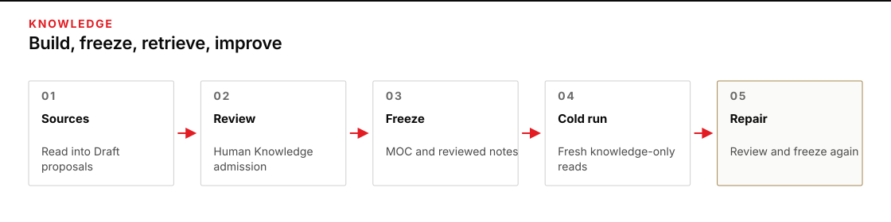
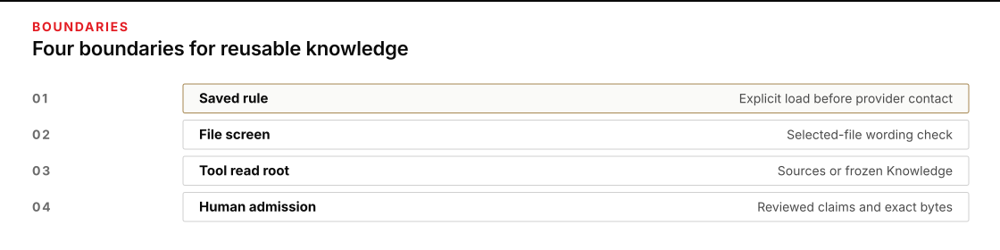

# Module 2 · Build and control a reusable second brain

Build linked knowledge in Obsidian, then use a fresh model session to answer questions from your reviewed notes. You’ll keep the original evidence separate from proposals, make the admission decisions yourself, and improve one substantive weakness after the first cold run.

This is an ungraded exercise with fictional Ledger Pike paperwork. Your result supports internal class review only. It does not authorize a release, vehicle assignment, permit approval, or real movement.

## The route

Plan for about three hours. That is a rough estimate, not a measured time. Reviewing, linking, and admitting notes and auditing and improving the knowledge take the most time.

The route is source → proposal → human review → frozen knowledge → fresh retrieval → substantive revision.



## 1. Prepare and open your vault

A **vault** is the folder of Markdown notes that Obsidian opens. Keep this editable folder separate from the frozen copies used by the model. Use the Python, OMP, and Obsidian environment you verified in [Module 00](../../module-00-setup/README.md). On WSL, open the Linux-home vault with Linux Obsidian under WSLg.

Set `R` to your actual course checkout. The examples use the standard Documents location; change only that assignment if yours differs. `PY` resolves a Python 3.12+ executable. `W` holds one fresh work attempt; `E` holds its run evidence. They are sibling directories outside the checkout. Use the same terminal throughout so these variables remain available.

**Terminal: Bash or zsh, ordinary user.**

```bash
R="$HOME/Documents/AIHB_OCT_2026"
PY="$(for candidate in python3.12 python3 python; do "$candidate" -c 'import sys; sys.exit(1) if sys.version_info < (3, 12) else print(sys.executable)' 2>/dev/null && break; done)"
RUN="$("$PY" -c 'import datetime, uuid; print(datetime.datetime.now(datetime.timezone.utc).strftime("%Y%m%dT%H%M%SZ") + "-" + uuid.uuid4().hex)')"
W="$HOME/course-evidence/module02-$RUN/work"
E="$HOME/course-evidence/module02-$RUN/evidence"
printf '%s\n' "R=$R" "PY=$PY" "W=$W" "E=$E"
"$PY" "$R/shared/prepare_work.py" 02 "$W"
```

**Terminal: native PowerShell, ordinary user.**

```powershell
$R = "$HOME\Documents\AIHB_OCT_2026"
$PY = $null
foreach ($candidate in @("python3.12", "python3", "python")) {
    try {
        $executable = (Get-Command $candidate -CommandType Application -ErrorAction Stop).Source
        & $executable -c "import sys; exit(0 if sys.version_info >= (3,12) else 1)" *> $null
        if ($LASTEXITCODE -eq 0) { $PY = $executable; break }
    } catch {}
}
if (-not $PY) { throw 'No Python 3.12+ found; return to setup.' }
$RUN = (Get-Date).ToUniversalTime().ToString("yyyyMMddTHHmmssZ") + "-" + [guid]::NewGuid().ToString("N")
$W = "$HOME\course-evidence\module02-$RUN\work"
$E = "$HOME\course-evidence\module02-$RUN\evidence"
Write-Output "R=$R" "PY=$PY" "W=$W" "E=$E"
& $PY "$R/shared/prepare_work.py" 02 $W
if ($LASTEXITCODE -ne 0) { throw 'Preparation held; preserve the attempt and read the named condition.' }
```

**Expected:** Preparation reports a fresh work copy. Stop if Python resolution fails, a path is wrong, or preparation returns a nonzero exit. Use Module 00 to fix a missing prerequisite. If a destination already exists, preserve it and rerun the variable block for a new attempt. Do not merge attempts or copy missing files from an old vault.

Initialize once. The preparation helper may print this next command; run it only once.

**Terminal: Bash or zsh, ordinary user, same window.**

```bash
"$PY" "$W/scripts/second_brain.py" initialize --work "$W"
```

**Terminal: native PowerShell, ordinary user, same window.**

```powershell
& $PY "$W/scripts/second_brain.py" initialize --work $W
if ($LASTEXITCODE -ne 0) { throw 'Initialization held; read the named file or condition.' }
```

**Expected:** `W/vault` has `Sources`, `Drafts`, `Knowledge`, `Reviews`, `Templates`, and `MOC.md`. `Sources` contains DN-001 through DN-040. Drafts, Knowledge, and Reviews start empty. The note, review, and audit templates have blank fields. An existing vault, missing source, or linked/unsafe path produces `HOLD`; preserve the attempt and fix the named prerequisite in a fresh work copy. Do not edit the source packet or machine identity files.

**Recovery:** Correct the named prerequisite, preserve the failed work copy, and prepare a fresh attempt before initializing again.

### Open the prepared folder

In Obsidian's vault chooser, click **Open** beside **Open folder as vault**. Select exactly the printed `W` path followed by `vault`. Do not choose **Create**, open the checkout, or open `cold`. If another vault is already open, use **Manage vaults** from the vault-name menu at the bottom left to reach the chooser.


### Find the index and original sources

Click **MOC** in the left file explorer. Obsidian normally hides the `.md` extension. Your MOC is the navigation index you will fill after your Knowledge notes exist; it starts with a title and no links.


Expand **Sources** and open a DN note. You can also press **Ctrl+O** on Windows/Linux or **Command+O** on macOS, type its ID, and press Enter. Check the folder name in the breadcrumb above the note before reading. Keep source text unchanged.


### Keep plugins restricted and Sync off

Click the **Settings** gear at the bottom left, then **Community plugins**. If the button says **Exit Restricted mode**, Restricted mode is already on; leave that button alone. If community plugins are enabled, use **Turn on Restricted mode**.


Select **Core plugins**, find **Sync**, and turn its toggle off if it is on. Do not sign in or connect a remote vault. Close Settings to return to your notes.


| Location | What belongs there | Who changes it |
|---|---|---|
| `vault/Sources` | Original DN evidence | Keep unchanged |
| `vault/Drafts` | Staged model proposals | Retain the proposals; repair in Knowledge |
| `vault/Knowledge` | Notes you prepare and admit | You, in Obsidian |
| `vault/Reviews` | Short decision reasons and audit | You, in Obsidian |
| `vault/Templates` | Blank starting structures | Copy into your new notes |
| `reviews`, `identities`, `source-manifest.json` | Machine receipts and identities outside the vault | Helper only |
| `cold/v1`, `cold/v2` | Frozen MOC and admitted Knowledge | Helper only; keep unchanged |

## 2. Inspect the controls and process sources

Three controls do different jobs. A **saved instruction** is a rule the launcher loads before contacting the model. The **file screen** checks a chosen file for fixed instruction-like phrases. The **read root** is the folder the model's read tool is allowed to access. Human admission adds a fourth boundary: you decide which supported claims enter reusable Knowledge.



### Create your context map in Reviews

Open `W/shared/controls/SAVED_INSTRUCTION.md` in a text viewer. Keep its bytes unchanged for this attempt. It stays outside both model read roots; do not copy it into the vault.

In Obsidian, press **Ctrl+P** on Windows/Linux or **Command+P** on macOS to open the command palette. Choose **Create new note**, then click the note's title above the body and name it `context-map`.


Open the command palette again, choose **Move current file to another folder**, type `Reviews`, and select that folder. Check that the breadcrumb reads **Reviews / context-map**. Use this same create, name, and move sequence for later notes, choosing **Knowledge** or **Reviews** as instructed.


In `Reviews/context-map.md`, record the question prompt, rule path, source-pass root (`vault/Sources`), cold root (`cold/v1`), read tool (`course_read`), and where the run evidence will appear. Record which control checks wording, which loads the rule, which limits reads, and who admits content. Leave room for predictions and later observations; do not replace a prediction after seeing the result.


Before running the file screen, write your expected clean, hostile, and missing-input observations in that note. Run the supplied screen once on each case; this is a local file check, not a model call.

**Terminal: Bash or zsh, ordinary user, same window.**

```bash
for note in DN-003 DN-014 DN-015 DN-016 DN-000; do
  "$PY" "$W/shared/case/guard.py" "$W/shared/case/$note.md"
  printf '%s exit=%s\n' "$note" "$?"
done
```

**Terminal: native PowerShell, ordinary user, same window.**

```powershell
foreach ($note in @("DN-003", "DN-014", "DN-015", "DN-016", "DN-000")) {
    & $PY "$W/shared/case/guard.py" "$W/shared/case/$note.md"
    $screenExit = $LASTEXITCODE
    Write-Output "$note exit=$screenExit"
}
```

**Expected:** DN-003 prints `PASS source-as-data` and exits 0. DN-014, DN-015, and DN-016 print `HOLD hostile-instruction` and exit 1. DN-000 is deliberately absent: it prints `HOLD: missing input` and exits 1. Record actual output and compare it with your prediction. An unexpected result means stop and check the file path and unchanged supplied screen with your instructor. Do not create DN-000 or change the screen to make it pass.

A screen acceptance does not establish truth or authority. A rejection flags wording; it does not erase useful evidence in the same source. The source pass still reads all forty notes under the saved rule. Manual paste bypasses this file screen. The read boundary is tool enforcement, not an operating-system sandbox.

Return to `Reviews/context-map.md` and append the output and exit code you actually observed for each file. Keep the earlier predictions. Obsidian stores your record; the terminal ran the screen.


Open `W/shared/controls/INGEST_PROMPT.md`. It asks the model to read all forty sources and propose a few related notes for these questions:

1. What current inner height applies to C-44, what competing measurement must not supersede it, and what does the measurement not authorize?
2. At 12:15 MDT, what evidence exists for quality release, vehicle assignment, permit approval, and the crate's stamp status? Keep those states separate.
3. Does paper arriving at 11:40 MDT establish that this movement can start at 12:15? Explain the relevant sequence and missing authority from the available knowledge.

Use the provider setup already established in Module 00. Ingest and retrieve make model calls; the other helper commands are local. Run one ingest for this work attempt.

**Terminal: Bash or zsh, ordinary user, same window.**

```bash
"$PY" "$W/scripts/second_brain.py" ingest --work "$W" --runner "$R/shared/run_omp.py" --evidence "$E/ingest"
```

**Terminal: native PowerShell, ordinary user, same window.**

```powershell
& $PY "$W/scripts/second_brain.py" ingest --work $W --runner "$R/shared/run_omp.py" --evidence "$E/ingest"
$ingestExit = $LASTEXITCODE
Write-Output "ingest exit=$ingestExit"
```

**Expected:** The helper checks the saved instruction, read-only policy, unchanged inputs, all forty distinct executed DN reads, and shared run audit before staging valid proposals. Open `Drafts` in Obsidian and observe the new files. `W/reviews/ingest-report.json` lists staged notes and any invalid proposal IDs and reasons. Invalid proposals have report entries only; they do not become Draft files. The model's JSON is captured evidence; you do not edit it, author JSON, or calculate hashes.

**Stop on HOLD:** Identify which condition below applies before continuing. Exit 2 with no evidence directory is a prerequisite failure. Fix the named setup condition; the helper preserves a preflight record and permits a manual retry in the same work attempt. It never retries automatically. Any created evidence, unexpected failure, or other completed attempt consumes this ingest. Keep it; another ingest requires fresh W and E.

- **Runtime-proof failure:** Stop and preserve the terminal HOLD and runtime evidence. Do not continue because the response looks plausible.
- **Per-proposal content HOLD after runtime proof passed:** Read `W/reviews/ingest-report.json`. Keep the valid Drafts. Invalid proposals already have a machine defect record in that report; do not run rejection against a Draft that does not exist. Repair or author replacement Markdown in Knowledge without another paid ingestion.
- **Top-level response format failure after runtime proof passed:** No Drafts are staged and no `ingest-report.json` is written. Use the terminal HOLD and preserved `E/ingest/response.md` and runtime evidence to identify this failure. Author replacement Knowledge from the blank Markdown template in Step 3 without another paid ingestion. If you cannot establish that runtime proof passed, stop and ask your instructor to inspect the evidence.

### Inspect the staged Drafts

If runtime proof passed and proposals staged, expand **Drafts** and open one. Check that its breadcrumb begins **Drafts**, not **Knowledge**. The paper-ticket notes below are manually written editing examples, not model responses or a completed answer set. Work with your own staged proposals; their IDs and wording can differ. Do not create a Draft merely to match an example.


## 3. Review, link, and admit

Admission means you have checked a note and recorded why these exact bytes may be reused. The helper can verify quotations and record your decision; it cannot make your judgment for you.

Open each promising Draft in Obsidian. Follow its source links and compare applicable identities, times, competing records, and limits. Use your [Module 01 source-verification practice](../../module-01-mission-thread/README.md) when checking these claims. Reject interpretations that turn evidence into instructions or claim authority the sources do not establish.

### Switch to Source mode before copying

If the note is in Reading view, click the pencil at the top right to edit. Open the command palette, search `source`, and choose **Toggle Live Preview/Source mode** if Markdown markers are hidden. Source mode exposes the `#`, `**`, `[[...]]`, and `>` characters you need to preserve. If those markers are already visible throughout the note, leave the mode unchanged.


For each note you want to keep, create `Knowledge/KB-NNN.md` using the proposed ID, then copy the promising text from its Draft in **Source mode**. To write a missing note yourself, choose an unused three-digit KB ID and copy `Templates/NOTE_TEMPLATE.md` into a new Knowledge note. Use the same review process for either origin. Keep the original Draft as the proposal record.

Open the blank note template in Source mode and copy its body into the new Knowledge note, not over the template. For a staged proposal, copy from its Draft instead. Check the destination breadcrumb before pasting so the original stays intact.


Replace the template's bare `#` on the first line with `# ` followed by your chosen title. Keep the space between the hash and title. Keep exactly one of each heading, in this order: `## Claim`, `## Limits and conflicts`, `## Evidence`, and `## Related`. Write a source-bounded claim and its limits in ordinary prose. All template slots are yours to fill.


For each Evidence item, add a `###` heading containing a source link, followed by its exact supporting quotation. The link syntax is `[[Sources/DN-NNN]]`, replacing `NNN` with the source's actual three digits; a unique `[[DN-NNN]]` is also accepted. This is syntax, not a source selection.

Open the source in **Source mode** before copying its text. Use the note's menu to select Source mode if it is in Reading view or Live Preview. Copy the meaningful Markdown characters as well as the words. Prefix each copied line with `> ` to mark your quotation. If the source line already begins with `>`, keep that original character after your added marker. Preserve underscores, emphasis markers, punctuation, and line breaks. Do not paraphrase a quote or remove characters to get a match. Use a passage that identifies a unique location in the source. The helper derives its line locator and hash for you.


To compare without repeatedly switching tabs, open the command palette and choose **Split right**. Open the source in the right-hand pane and keep your Knowledge note on the left. Compare the quotation character for character; edit only the Knowledge side.


### Link existing Knowledge notes

Populate all target Knowledge files before creating clickable relationships. Draft `Related` entries are plain-text suggestions so clicking one cannot accidentally create an empty note. Choose relationships that help someone interpret a claim, resolve a conflict, or follow a consequential sequence. Turn useful suggestions into `- [[Knowledge/KB-NNN|Your relationship label]]` entries under Related. Delete suggestions you do not turn into links; Related accepts only Knowledge links. Select the exact case-sensitive `Knowledge/` path, not the retained Draft twin. Explain the relationship in the label; do not link merely to inflate the graph.


Switch the Knowledge note to Reading view with the book button at the top right. Its relationship label becomes a clickable link.


Click that link. Confirm that the target has content and its breadcrumb begins **Knowledge**. If a blank note opens, stop and correct the target path rather than treating an empty file as a completed relationship.


### Build and follow the navigation index

In Source mode, make the first line of `MOC.md` exactly `# ` followed by your chosen title. After that, each nonblank line must contain one entry in the form `- [[Knowledge/KB-NNN|Your navigation label]]`. Replace `NNN` with the existing note's three digits and supply your own label. Keep the hyphen and space; do not use numbered bullets, subheadings, surrounding answer prose, or extra text after a link. Every admitted note must be reachable from the index. Source-backed claims belong in Knowledge. Open the links and confirm they reach existing, populated notes. If you accidentally created an empty Knowledge note, inspect it in Obsidian and either remove that empty note yourself or complete and review it. Freeze will name it and stop; it will not delete it for you.


Switch MOC to Reading view and follow every entry. Return to MOC with the back arrow above the note. These two paper-ticket notes do not cover all three questions; build the coverage your own sources require.


### Write the reason before admitting a note

Finish all note and link edits before admission. Copy `Templates/REVIEW_TEMPLATE.md` into a short reason note under `Reviews`, such as `Reviews/KB-001-v1.md`. Fill the decision, decisive reason (including a competing DN when relevant), and remaining limit. Do not repeat the entire claim and evidence in the reason. Save all edits.


Name the new reason for the note and revision, then move it to **Reviews**. Verify both paths: the reason belongs in `Reviews`, and its **Note** field identifies the exact `Knowledge/KB-NNN.md` you reviewed. Obsidian saves edits automatically; **Ctrl+S** or **Command+S** also saves the current note.


Run this command for each note you admit, changing the note and reason filenames to the files you actually prepared:

**Terminal: Bash or zsh, ordinary user, same window.**

```bash
"$PY" "$W/scripts/second_brain.py" review --work "$W" --note "$W/vault/Knowledge/KB-001.md" --decision admit --reason-file "$W/vault/Reviews/KB-001-v1.md"
```

**Terminal: native PowerShell, ordinary user, same window.**

```powershell
& $PY "$W/scripts/second_brain.py" review --work $W --note "$W/vault/Knowledge/KB-001.md" --decision admit --reason-file "$W/vault/Reviews/KB-001-v1.md"
if ($LASTEXITCODE -ne 0) { throw 'Admission held; correct the named note or reason before continuing.' }
```

To record a rejection of an existing staged Draft, write a separate short reason in Reviews and point to that file. For example, use these commands only if `Drafts/KB-002.md` exists and is the proposal you reject:


**Terminal: Bash or zsh, ordinary user, same window.**

```bash
"$PY" "$W/scripts/second_brain.py" review --work "$W" --note "$W/vault/Drafts/KB-002.md" --decision reject --reason-file "$W/vault/Reviews/KB-002-reject.md"
```

**Terminal: native PowerShell, ordinary user, same window.**

```powershell
& $PY "$W/scripts/second_brain.py" review --work $W --note "$W/vault/Drafts/KB-002.md" --decision reject --reason-file "$W/vault/Reviews/KB-002-reject.md"
if ($LASTEXITCODE -ne 0) { throw 'Rejection record held; inspect the named path or reason.' }
```

These filenames illustrate commands, not required decisions. An existing staged Draft can still be rejected if its citations are invalid or its text has been edited. An invalid proposal that never staged already has its defect record in `ingest-report.json`; do not create a Draft just to reject it. Rejection does not copy anything into Knowledge.

**Expected:** Review records an immutable receipt outside the vault, binding the note's bytes to your decision, reason, and source evidence. Admission does not copy or rewrite Knowledge. If a quotation, link, or reason fails validation, correct the named problem in Obsidian and review again. Any later Knowledge edit, including a relationship edit, requires a new admission receipt. The receipt is your operator record, not machine proof of human judgment.

**Stop:** A review returns `HOLD`. Keep the note and reason, correct the named condition in Obsidian, and review again before freezing.

Before v1, check collective coverage of all three questions. If you find missing evidence, author the missing Knowledge note now, link it, and review every changed note. Do not seed answers into the MOC or prompt.

## 4. Freeze and retrieve v1

A **cold snapshot** is a fixed copy containing only `MOC.md` and admitted `Knowledge/*.md`. Its identity record stays outside the model's read root. Obsidian remains open on the editable vault; you do not open or edit the cold folder as a vault.

**Terminal: Bash or zsh, ordinary user, same window.**

```bash
"$PY" "$W/scripts/second_brain.py" freeze --work "$W" --revision v1
```

**Terminal: native PowerShell, ordinary user, same window.**

```powershell
& $PY "$W/scripts/second_brain.py" freeze --work $W --revision v1
if ($LASTEXITCODE -ne 0) { throw 'Freeze held; resolve the named admission, link, or content condition.' }
```

**Expected:** The helper creates `cold/v1` and `identities/v1.json`. If any note lacks admission for its current bytes, freeze holds and names each affected note with full Bash/zsh and PowerShell review commands. Reopen those notes and inspect the changes. Before running a recovery command, create and fill the reason file named by `--reason-file`, or replace that argument with the path to the actual reason you wrote under `vault/Reviews`. Use the command for your shell, review every named note, then retry freeze. Do not edit a receipt to bypass this check. An existing revision stays intact; never overwrite it.

Run a fresh session against that frozen root. The helper starts a new model process; it does not continue the ingest chat. Keep the same saved instruction and three questions.

**Terminal: Bash or zsh, ordinary user, same window.**

```bash
"$PY" "$W/scripts/second_brain.py" retrieve --work "$W" --revision v1 --runner "$R/shared/run_omp.py" --evidence "$E/cold-v1"
```

**Terminal: native PowerShell, ordinary user, same window.**

```powershell
& $PY "$W/scripts/second_brain.py" retrieve --work $W --revision v1 --runner "$R/shared/run_omp.py" --evidence "$E/cold-v1"
if ($LASTEXITCODE -ne 0) { throw 'Cold run held; preserve its evidence and read the named condition.' }
```

**Expected:** The helper prints readable answers and citations while preserving the captured response. Inspect its rule-load and read evidence: the non-null instruction identity must match the initialized rule and must load before provider contact; the read root must be `cold/v1`; MOC and every cited Knowledge note must actually have been read. Input identity must match the snapshot and no output file changes may appear. A plausible answer alone proves none of these.

Open the files under `E/cold-v1` in a text viewer: `policy.json` names the root, prompt, tools, and instruction; `guard.jsonl` records `instruction_loaded` before `provider_request` and the tool observations; `result.json` and `snapshots.json` record input/output identities. The helper audits these records and compares the hashes for you. Read them to locate the proof; do not edit them or copy their JSON into a note. Record a short explanation of what you observed in `Reviews/context-map.md`. Use the corresponding `E/ingest` records to locate the forty-source read proof and the first rule load.

**Record run proof, then check the cited source**

Return to **Reviews / context-map** and add a section for the cold run. Fill each observation from the actual files you inspected. Keep unknown or unobserved items explicit; a note saying “passed” cannot substitute for a runtime record. Keep your earlier map and screen observations.


The snapshot keeps embedded source quotations for the model. Its source links identify originals available to you in the editable vault, not additional cold files. As a human, open the cited Knowledge and original Sources in Obsidian to judge each material answer. Keep model retrieval and your source check separate.

Open the cited **Knowledge** note, switch it to Reading view, and click its **Sources/DN-NNN** link. Check that the breadcrumb changes to **Sources** and the intended DN. This is your inspection in the editable vault, not a new source file available to the cold model.


Read call observations literally. `EXECUTED` means a tool call ran. `ALLOWED_ABSENT` means an allowed in-root path was missing, with no executed read. `DENIED` means the guard refused the call, or the runtime rejected an unavailable tool before the guard ran; no file was read or written by that call. `NOT_ATTEMPTED` means there was no relevant call. Raw-source observations flag path references in call arguments; they do not prove a read. An absent Sources path is not a successful raw-source read or a denial. Do not relabel an unattempted call as blocked. Never suppress a runtime audit failure.

A truthful `unsupported` answer identifies a coverage gap. It is not a failed runtime merely because support is missing. A malformed response, unread or invented citation, changed identity, or failed run audit is a HOLD. Preserve all evidence and distinguish those conditions from the content weakness you will improve next.

## 5. Audit and improve the knowledge

Choose one substantive weakness: an unsupported claim, missing qualification, mishandled stale source, or consequential missing relationship. Copy `Templates/AUDIT_TEMPLATE.md` into `Reviews/audit-v2.md`. Record the revision, focal KB ID, weakness, before state, expected change, and expected retrieval effect.

### Record the weakness and expected effect

Open **Templates / AUDIT_TEMPLATE** in Source mode, copy its body into a new note named `audit-v2`, and move the new note to **Reviews**. Keep the template unchanged.


Fill the revision, focal note, weakness, before state, and expected effect before editing Knowledge. Leave **Observed retrieval effect** unfilled until you have a fresh run to inspect.


If v1 was already correct, do not invent a failure. Add a meaningful qualification or counter-source that makes the knowledge more useful. Changing punctuation, a title, or cosmetic wording alone does not satisfy this step.

Edit the focal Knowledge note in Obsidian, or author a missing note with an unused KB ID. Make any related-note changes needed for a coherent collection. Update MOC when needed. Do not delete a previously frozen Knowledge note to hide a problem; correct its claim and limits. Record the after state and every other note changed in your audit.


Create fresh short reason notes, then repeat `review --decision admit` for **every** changed or new Knowledge note. For the focal note, use the command below with its actual ID and reason filename. Review reciprocal-link changes too.

Keep the old reason. Create a new one such as `Reviews/KB-001-v2.md`, state why the changed bytes are supported, and save it before returning to the terminal.


**Terminal: Bash or zsh, ordinary user, same window.**

```bash
FOCUS="KB-001"
"$PY" "$W/scripts/second_brain.py" review --work "$W" --note "$W/vault/Knowledge/$FOCUS.md" --decision admit --reason-file "$W/vault/Reviews/$FOCUS-v2.md"
```

**Terminal: native PowerShell, ordinary user, same window.**

```powershell
$FOCUS = "KB-001"
& $PY "$W/scripts/second_brain.py" review --work $W --note "$W/vault/Knowledge/$FOCUS.md" --decision admit --reason-file "$W/vault/Reviews/$FOCUS-v2.md"
if ($LASTEXITCODE -ne 0) { throw 'Revised admission held; inspect the named condition.' }
```

Set FOCUS to the same note recorded in your audit. Once all revised notes have matching admission receipts, freeze v2:

**Terminal: Bash or zsh, ordinary user, same window.**

```bash
"$PY" "$W/scripts/second_brain.py" freeze --work "$W" --revision v2 --previous "$W/identities/v1.json" --focus-note "$FOCUS"
```

**Terminal: native PowerShell, ordinary user, same window.**

```powershell
& $PY "$W/scripts/second_brain.py" freeze --work $W --revision v2 --previous "$W/identities/v1.json" --focus-note $FOCUS
if ($LASTEXITCODE -ne 0) { throw 'Revision freeze held; inspect changed notes and their admission receipts.' }
```

**Expected:** v2 has at least one changed or new Knowledge note, no deleted Knowledge note, and fresh receipts for every changed byte sequence. The focal note is changed or new. The helper checks the earlier snapshot independently of the editable vault. MOC-only or cosmetic changes do not demonstrate substantive improvement; you must judge the content change yourself. If it holds, follow the named review or link correction and preserve v1.

**Stop:** Revised admission or freeze returns `HOLD`. Preserve v1, correct the named note, reason, or link, and obtain matching admissions before retrying the new freeze.

Before the positive v2 retrieval, perform the missing-rule check below. Then compare all three new answers with the sources and your expected effect. Record the observed effect in `Reviews/audit-v2.md`, including unchanged correct wording when that is what happened. The helper requires the focal note to be read and cited; it cannot establish that your edit improved the meaning.

## 6. Test the missing rule and close

Temporarily rename only the work-copy rule. The negative retrieve must exit 2 before provider contact and before creating its evidence directory. The commands restore the original file, preserving its bytes. Do not edit the rule, initialize again, or substitute another rule.

**Terminal: Bash or zsh, ordinary user, same window.**

```bash
(
  rule="$W/shared/controls/SAVED_INSTRUCTION.md"
  held="$W/shared/controls/SAVED_INSTRUCTION.md.held"
  negative="$E/cold-v2-missing-rule"
  if [ ! -f "$rule" ] || [ -e "$held" ] || [ -L "$held" ] || [ -e "$negative" ] || [ -L "$negative" ]; then
    printf '%s\n' 'HOLD: missing rule or existing negative/held path; preserve it and inspect.'
    exit 1
  fi
  mv "$rule" "$held" || exit 1
  trap 'mv "$held" "$rule"' EXIT
  "$PY" "$W/scripts/second_brain.py" retrieve --work "$W" --revision v2 --runner "$R/shared/run_omp.py" --evidence "$negative"
  negative_exit=$?
  if [ "$negative_exit" -ne 2 ] || [ -e "$negative" ] || [ -L "$negative" ]; then
    printf '%s\n' 'HOLD: expected exit 2 and no evidence directory; stop and preserve observations.'
    exit 1
  fi
  printf '%s\n' 'Missing-rule prerequisite stopped with exit 2; no evidence directory created.'
)
```

**Terminal: native PowerShell, ordinary user, same window.**

```powershell
$rule = "$W/shared/controls/SAVED_INSTRUCTION.md"
$held = "$W/shared/controls/SAVED_INSTRUCTION.md.held"
$negative = "$E/cold-v2-missing-rule"
if (-not (Test-Path -LiteralPath $rule -PathType Leaf) -or (Test-Path -LiteralPath $held) -or (Test-Path -LiteralPath $negative)) {
    throw 'Missing rule or existing negative/held path; preserve it and inspect.'
}
Move-Item -LiteralPath $rule -Destination $held -ErrorAction Stop
try {
    & $PY "$W/scripts/second_brain.py" retrieve --work $W --revision v2 --runner "$R/shared/run_omp.py" --evidence $negative
    $negativeExit = $LASTEXITCODE
    if ($negativeExit -ne 2 -or (Test-Path -LiteralPath $negative)) {
        throw 'Expected exit 2 and no evidence directory; stop and preserve observations.'
    }
    Write-Output 'Missing-rule prerequisite stopped with exit 2; no evidence directory created.'
} finally {
    Move-Item -LiteralPath $held -Destination $rule -ErrorAction Stop
}
```

**If it differs:** Stop before the positive run. Preserve the actual exit and any evidence. If interrupted before restoration, inspect both paths and restore the held file to its original name without overwriting another file. Ask your instructor to resolve an ambiguous state. A provider call or evidence directory in this negative case is not success.

**Append the missing-rule observation**

In **Reviews / context-map**, add the exit code, whether a new evidence directory appeared, and whether the identical rule was restored. Record your actual outcome, including a HOLD if the check differed. Keep the earlier sections.


With the identical rule restored, retrieve v2 into a fresh destination:

**Terminal: Bash or zsh, ordinary user, same window.**

```bash
"$PY" "$W/scripts/second_brain.py" retrieve --work "$W" --revision v2 --runner "$R/shared/run_omp.py" --evidence "$E/cold-v2"
```

**Terminal: native PowerShell, ordinary user, same window.**

```powershell
& $PY "$W/scripts/second_brain.py" retrieve --work $W --revision v2 --runner "$R/shared/run_omp.py" --evidence "$E/cold-v2"
if ($LASTEXITCODE -ne 0) { throw 'Restored cold run held; keep its evidence and inspect the failure.' }
```

**Expected:** The saved-rule identity matches, the focal note is read and cited, and the helper validates the fresh read-only run. Complete your audit's observed-effect and remaining-gap fields. Judge each material claim against its Knowledge evidence and the original sources. All three final questions need source-backed answers. If a substantive gap remains, make another reviewed correction; do not repeat an unchanged request hoping for different wording.

**Compare the fresh result with your prediction**

Open **Reviews / audit-v2**. Fill **Observed retrieval effect**, **Remaining gap**, and **Bounded internal-use decision** from the new answers and their checked evidence. Compare them with the expected effect you wrote earlier; do not rewrite that prediction to match the result.


For another revision, use the same interfaces with new names. After editing and reviewing every changed note, set FOCUS to the new audit's focal note, then run each command only after the previous one succeeds:

**Terminal: Bash or zsh, ordinary user, same window.**

```bash
"$PY" "$W/scripts/second_brain.py" freeze --work "$W" --revision v3 --previous "$W/identities/v2.json" --focus-note "$FOCUS" &&
  "$PY" "$W/scripts/second_brain.py" retrieve --work "$W" --revision v3 --runner "$R/shared/run_omp.py" --evidence "$E/cold-v3"
```

**Terminal: native PowerShell, ordinary user, same window.**

```powershell
& $PY "$W/scripts/second_brain.py" freeze --work $W --revision v3 --previous "$W/identities/v2.json" --focus-note $FOCUS
if ($LASTEXITCODE -ne 0) { throw 'Further revision held.' }
& $PY "$W/scripts/second_brain.py" retrieve --work $W --revision v3 --runner "$R/shared/run_omp.py" --evidence "$E/cold-v3"
if ($LASTEXITCODE -ne 0) { throw 'Further cold run held; preserve its evidence.' }
```

Check that earlier snapshots still match after your legitimate live-vault edits. These checks contact no provider:

**Terminal: Bash or zsh, ordinary user, same window.**

```bash
"$PY" "$W/scripts/second_brain.py" check --work "$W" --revision v1
"$PY" "$W/scripts/second_brain.py" check --work "$W" --revision v2
```

**Terminal: native PowerShell, ordinary user, same window.**

```powershell
& $PY "$W/scripts/second_brain.py" check --work $W --revision v1
if ($LASTEXITCODE -ne 0) { throw 'v1 identity held; preserve and inspect the named path.' }
& $PY "$W/scripts/second_brain.py" check --work $W --revision v2
if ($LASTEXITCODE -ne 0) { throw 'v2 identity held; preserve and inspect the named path.' }
```

**Expected:** Both frozen identities still match. Later editable reasons, Knowledge changes, and Obsidian settings do not invalidate v1. A changed, added, or missing frozen file produces a named HOLD. Keep that snapshot and report the condition; do not rewrite its manifest or receipts. A digest detects byte changes; it does not prove truth, authority, human authorship, or tamper-proof custody.

**Recovery:** Confirm the work and revision paths. If the mismatch remains, ask your instructor to inspect the named frozen file and retain the HOLD; do not rewrite the identity to match changed content.

Record the missing-rule exit code, absent evidence directory, and restored rule in `Reviews/context-map.md`.

Keep your context map, screen observations, Knowledge/MOC, short admission reasons, immutable receipts, both frozen revisions, run evidence, audit, and missing-rule observation. In the audit, state what the final knowledge supports for internal class use and what remains unsupported. Discuss which relationship helped retrieval, what changed after review, and what each control actually proved. Record unresolved HOLD conditions plainly; do not turn them into a claim of successful completion.

Add the actual results of both local identity checks to your context map without removing earlier observations. Keep the v1 and v2 reason notes and audit visible under **Reviews**. The frozen folders and machine receipts remain outside this Obsidian vault.


