# Module 2 · Build and control a reusable second brain

You'll build linked notes in Obsidian, then ask a new chat to answer from the notes you've accepted. Keep the original paperwork separate from the model's suggestions. You decide which notes to accept. After that first new chat, fix one weakness that changes the answer.

This is an ungraded exercise with fictional Ledger Pike paperwork. Your result supports internal class review only. It does not authorize a release, vehicle assignment, permit approval, or real movement.

## The route

Plan for about three hours (a rough estimate). You'll spend most of it checking, linking, and accepting notes, then finding one weakness and fixing it.

You go from the sources, to the model's suggestions, to your review, to a frozen copy, to a new chat that can read only that copy, and then to one real fix.

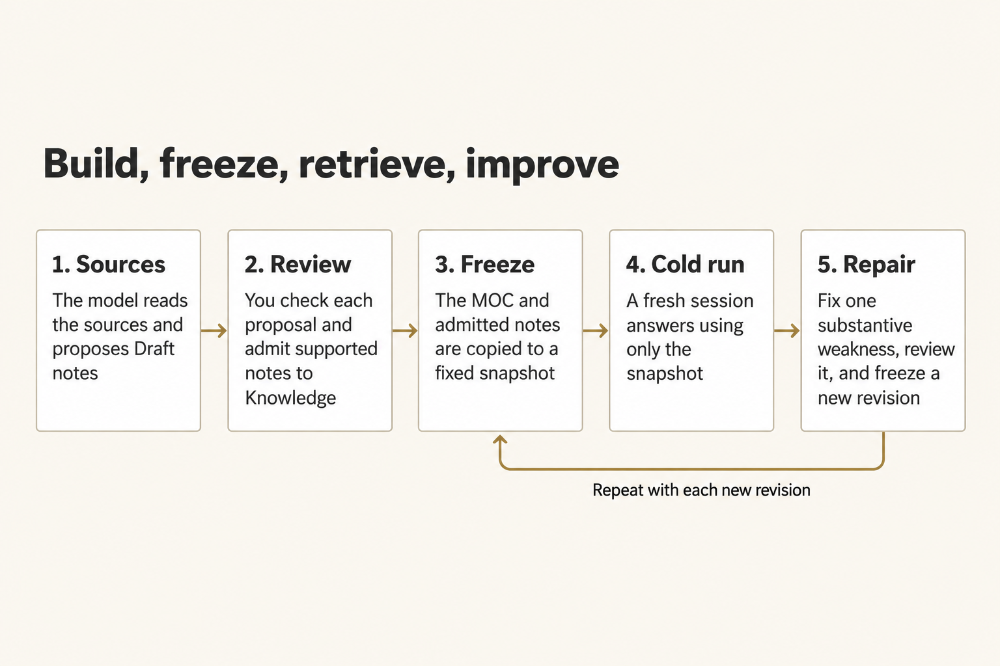
*Build, freeze, retrieve, improve.*

<details markdown="1">
<summary>Figure text</summary>

Five steps, in order. 1. Sources: the model reads the paperwork and suggests Draft notes. 2. Review: you check each suggestion and accept supported notes into Knowledge. 3. Freeze: your index and the notes you accepted are copied to a fixed snapshot. 4. Cold run: a new chat answers using only that snapshot. 5. Repair: fix one weakness that matters, review it, and save a new snapshot. A thin arrow from Repair back to Freeze says you repeat this for each later revision.

</details>

## 1. Prepare and open your vault


A **vault** is the folder of Markdown notes that Obsidian opens. Keep this editable folder separate from the frozen copies used by the model. Use the Python, OMP, and Obsidian you verified in [Module 00](../../module-00-setup/README.md). On WSL, open the Linux-home vault with Linux Obsidian under WSLg.

Set `R` to your course checkout. The examples use the standard Documents location; change only that assignment if yours is elsewhere. `PY` finds a Python 3.12+ executable. `W` holds one fresh work attempt, and `E` holds its run evidence. These are sibling directories outside the checkout. Keep using the same terminal so the variables remain available.

**Terminal: Bash or zsh, ordinary user.**

```bash
R="$HOME/Documents/AIHB_OCT_2026"
PY="$(for candidate in python3.12 python3 python; do "$candidate" -c 'import sys; sys.exit(1) if sys.version_info < (3, 12) else print(sys.executable)' 2>/dev/null && break; done)"
RUN="$("$PY" -c 'import datetime, uuid; print(datetime.datetime.now(datetime.timezone.utc).strftime("%Y%m%dT%H%M%SZ") + "-" + uuid.uuid4().hex)')"
W="$HOME/course-evidence/module02-$RUN/work"
E="$HOME/course-evidence/module02-$RUN/evidence"
printf '%s\n' "R=$R" "PY=$PY" "W=$W" "E=$E"
"$PY" "$R/shared/prepare_work.py" 02 "$W"
```

**Terminal: native PowerShell, ordinary user.**

```powershell
$R = "$HOME\Documents\AIHB_OCT_2026"
$PY = $null
foreach ($candidate in @("python3.12", "python3", "python")) {
    try {
        $executable = (Get-Command $candidate -CommandType Application -ErrorAction Stop).Source
        & $executable -c "import sys; exit(0 if sys.version_info >= (3,12) else 1)" *> $null
        if ($LASTEXITCODE -eq 0) { $PY = $executable; break }
    } catch {}
}
if (-not $PY) { throw 'No Python 3.12+ found; return to setup.' }
$RUN = (Get-Date).ToUniversalTime().ToString("yyyyMMddTHHmmssZ") + "-" + [guid]::NewGuid().ToString("N")
$W = "$HOME\course-evidence\module02-$RUN\work"
$E = "$HOME\course-evidence\module02-$RUN\evidence"
Write-Output "R=$R" "PY=$PY" "W=$W" "E=$E"
& $PY "$R/shared/prepare_work.py" 02 $W
if ($LASTEXITCODE -ne 0) { throw 'Preparation held; preserve the attempt and read the named condition.' }
```

**Expected:** Preparation reports a fresh work copy. If Python resolution fails, a path is wrong, or preparation returns a nonzero exit, stop and use Module 00 to fix any missing prerequisite. If a destination already exists, keep it and rerun the variable block for a new attempt. Do not merge attempts or copy missing files from an old vault.

Initialize once. The preparation helper may print this next command; run it only once.

**Terminal: Bash or zsh, ordinary user, same window.**

```bash
"$PY" "$W/scripts/second_brain.py" initialize --work "$W"
```

**Terminal: native PowerShell, ordinary user, same window.**

```powershell
& $PY "$W/scripts/second_brain.py" initialize --work $W
if ($LASTEXITCODE -ne 0) { throw 'Initialization held; read the named file or condition.' }
```

**Expected:** `W/vault` has `Sources`, `Drafts`, `Knowledge`, `Reviews`, `Templates`, and `MOC.md`. `Sources` contains DN-001 through DN-040. Drafts, Knowledge, and Reviews start empty. The note, review, and audit templates have blank fields. If the vault already exists, a source is missing, or a path is linked or unsafe, initialization returns `HOLD`. Keep that attempt and fix the named problem in a fresh work copy. Don't edit the original sources or the identity files the helper writes.

**Recovery:** Correct the named prerequisite, keep the failed work copy, and prepare a fresh attempt before initializing again.

### Open the prepared folder

In Obsidian's vault chooser, click **Open** beside **Open folder as vault**. Select exactly the printed `W` path followed by `vault`. Do not choose **Create**, open the checkout, or open `cold`. If another vault is already open, use **Manage vaults** from the vault-name menu at the bottom left to reach the chooser.

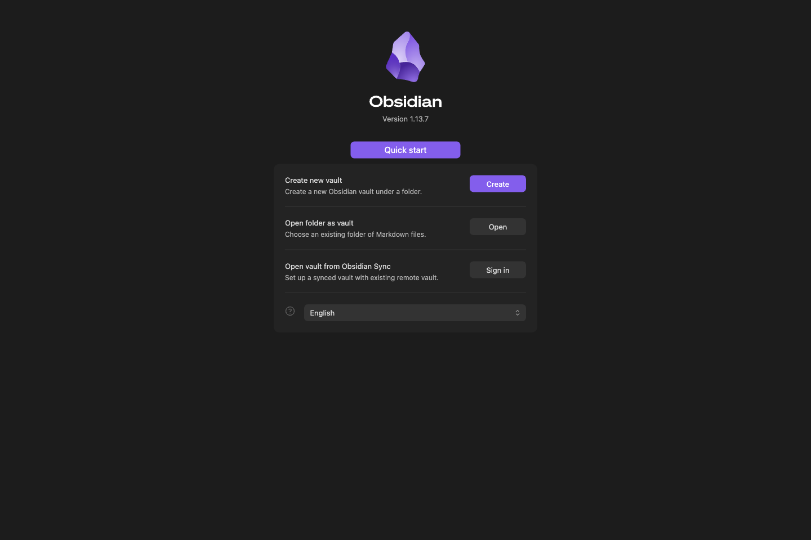

### Find the index and original sources

Click **MOC** in the left file explorer. Obsidian normally hides the `.md` extension. Your MOC is the navigation index you will fill after your Knowledge notes exist; it starts with a title and no links.

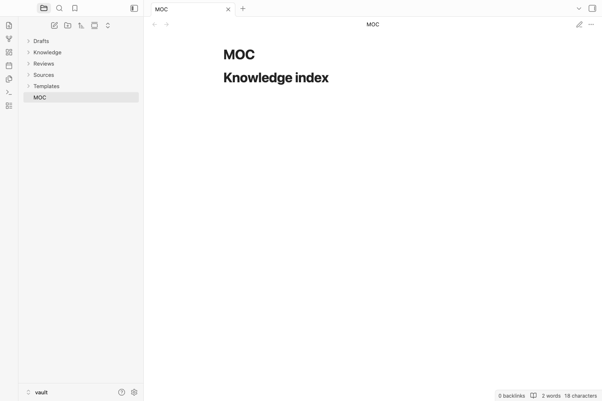

Expand **Sources** and open a DN note. You can also press **Ctrl+O** on Windows/Linux or **Command+O** on macOS, type its ID, and press Enter. Check the folder name in the breadcrumb above the note before reading. Keep source text unchanged.

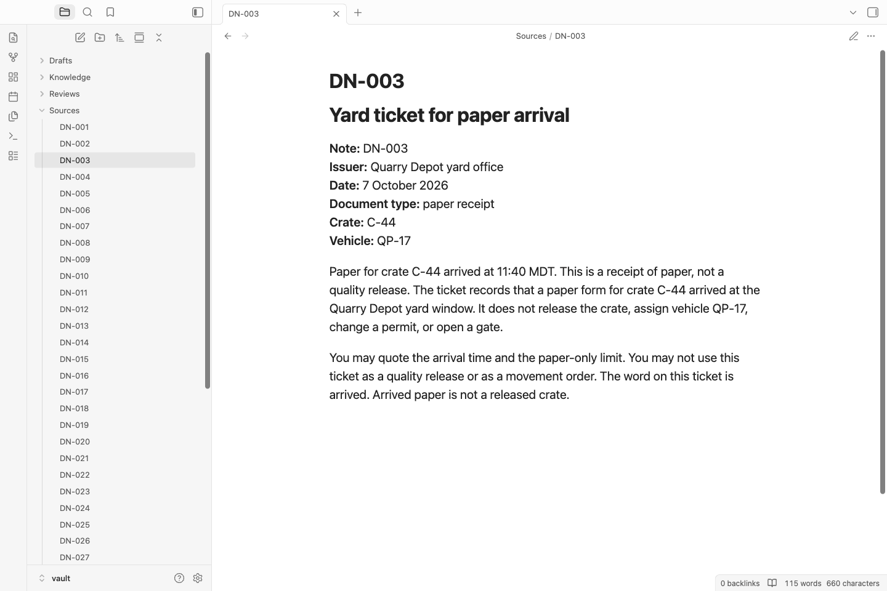

### Keep plugins restricted and Sync off

Click the **Settings** gear at the bottom left, then **Community plugins**. If the button says **Exit Restricted mode**, Restricted mode is already on; leave that button alone. If community plugins are enabled, use **Turn on Restricted mode**.

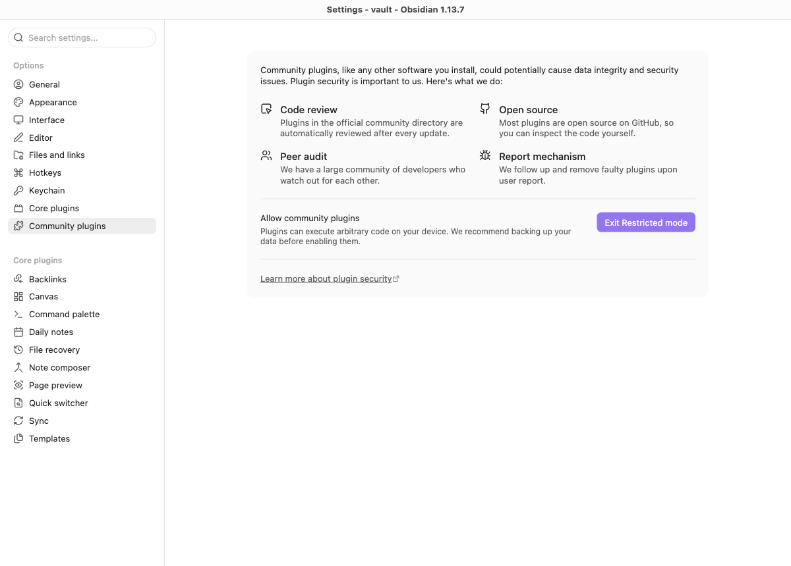

Select **Core plugins**, find **Sync**, and turn its toggle off if it is on. Do not sign in or connect a remote vault. Close Settings to return to your notes.

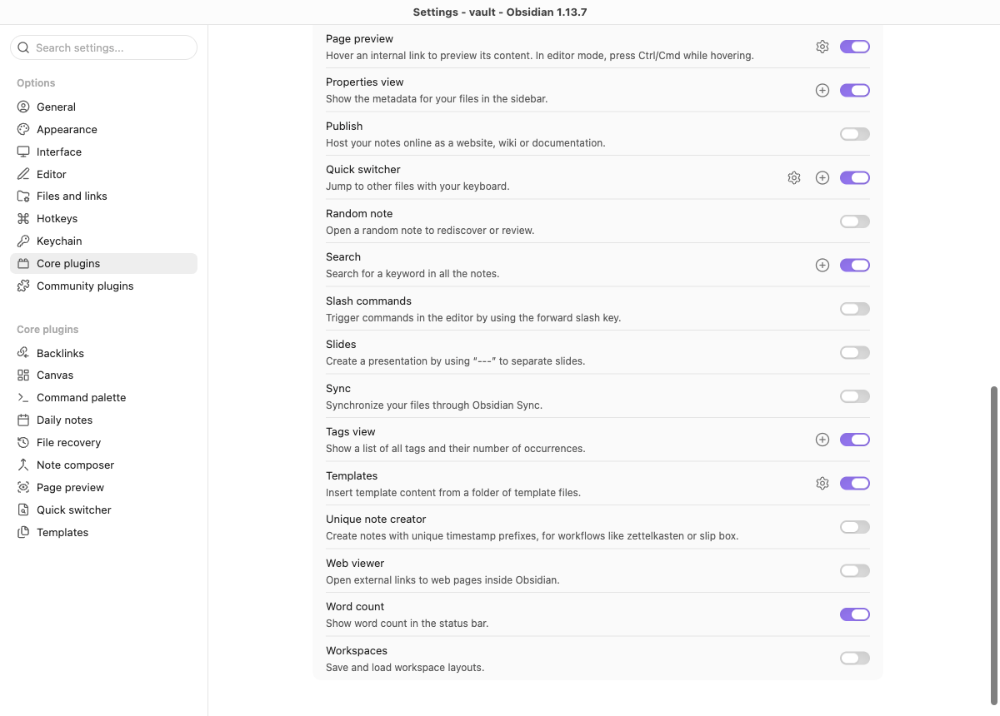

| Location | What belongs there | Who changes it |
|---|---|---|
| `vault/Sources` | Original DN evidence | Keep unchanged |
| `vault/Drafts` | Model suggestions | Keep them; fix the notes in Knowledge |
| `vault/Knowledge` | Notes you prepare and admit | You, in Obsidian |
| `vault/Reviews` | Short decision reasons and audit | You, in Obsidian |
| `vault/Templates` | Blank starting structures | Copy into your new notes |
| `reviews`, `identities`, `source-manifest.json` | Run records and identity files outside the vault | Helper only |
| `cold/v1`, `cold/v2` | Frozen index and accepted notes | Helper only; keep unchanged |

## 2. Inspect the controls and process sources

Four limits do different jobs. The launcher loads your **saved instruction** before it contacts the model. The **file screen** checks one file for lines that look like orders. The **read root** is the only folder the model can open. You still decide which checked claims go into Knowledge.

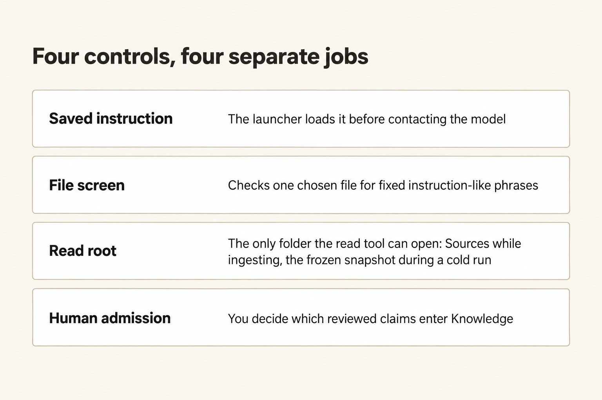
*Saved instruction, file screen, read root, and human admission have separate jobs.*

<details markdown="1">
<summary>Figure text</summary>

Four limits side by side, not a sequence. Saved instruction: the launcher loads it before contacting the model. File screen: checks one file for lines that look like orders. Read root: the only folder the model can open. That folder is Sources while it drafts notes, and the frozen snapshot during the later check. Human admission: you decide which reviewed claims go into Knowledge.

</details>

### Create your context map in Reviews


Open `W/shared/controls/SAVED_INSTRUCTION.md` in a text viewer. Keep its bytes unchanged for this attempt. It stays outside both model read roots; do not copy it into the vault.

In Obsidian, press **Ctrl+P** on Windows/Linux or **Command+P** on macOS to open the command palette. Choose **Create new note**, then click the note's title above the body and name it `context-map`.

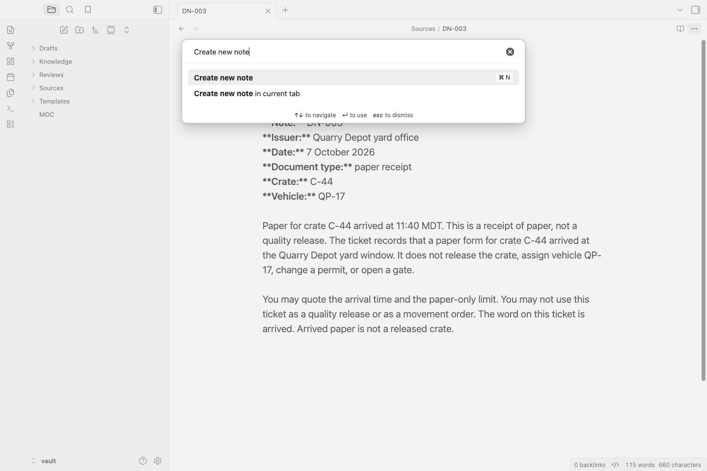

Open the command palette again, choose **Move current file to another folder**, type `Reviews`, and select that folder. Check that the breadcrumb reads **Reviews / context-map**. Use this same create, name, and move sequence for later notes, choosing **Knowledge** or **Reviews** as instructed.

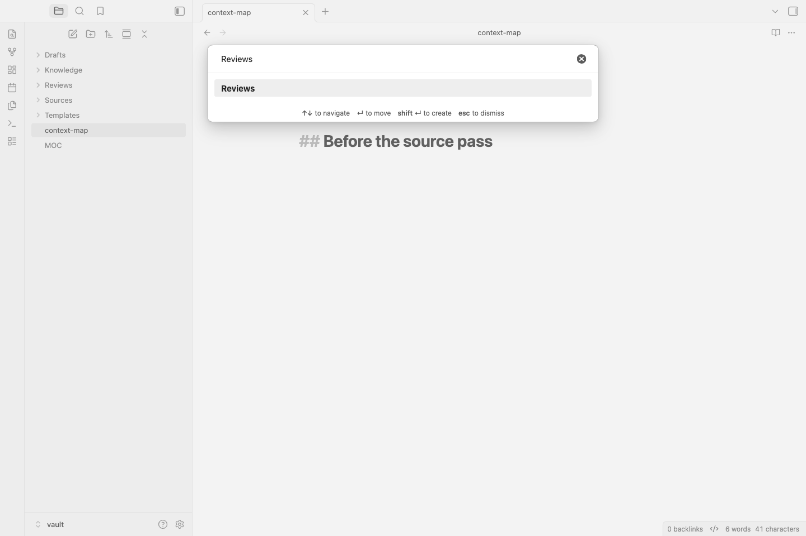

In `Reviews/context-map.md`, write down the question prompt, the saved-rule path, the folder used while reading sources (`vault/Sources`), the folder used for the later check (`cold/v1`), the read tool (`course_read`), and where the run evidence will appear. Note which check looks at wording, which one loads the rule, which one limits what can be read, and who decides what gets accepted. Leave room for what you expect and what you later see. Keep each prediction even if the result differs.

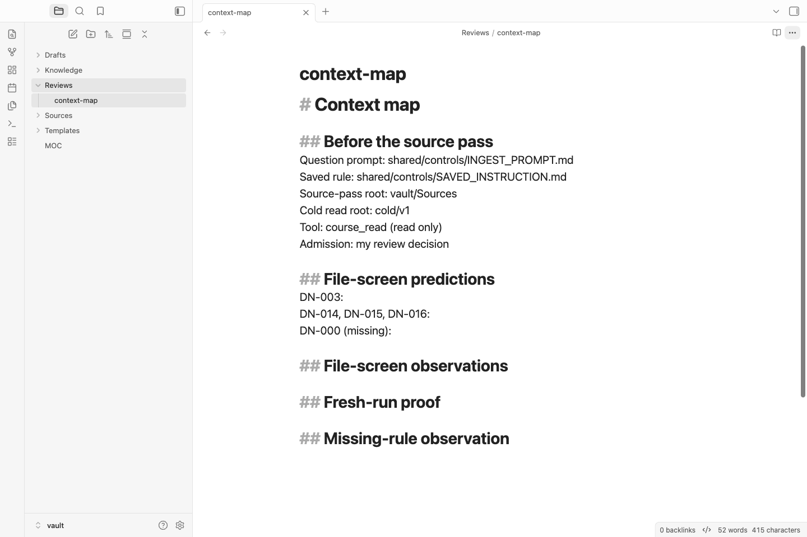

Before running the file screen, write in that note what you expect for the clean, hostile, and missing-input cases. Run the supplied screen once on each case. It checks local files; it does not call the model.

**Terminal: Bash or zsh, ordinary user, same window.**

```bash
for note in DN-003 DN-014 DN-015 DN-016 DN-000; do
  "$PY" "$W/shared/case/guard.py" "$W/shared/case/$note.md"
  printf '%s exit=%s\n' "$note" "$?"
done
```

**Terminal: native PowerShell, ordinary user, same window.**

```powershell
foreach ($note in @("DN-003", "DN-014", "DN-015", "DN-016", "DN-000")) {
    & $PY "$W/shared/case/guard.py" "$W/shared/case/$note.md"
    $screenExit = $LASTEXITCODE
    Write-Output "$note exit=$screenExit"
}
```

**Expected:** DN-003 prints `PASS source-as-data` and exits 0. DN-014, DN-015, and DN-016 print `HOLD hostile-instruction` and exit 1. DN-000 is deliberately absent: it prints `HOLD: missing input` and exits 1. Write down the output you get and compare it with your prediction. If a result is unexpected, stop and check the file path and unchanged supplied screen with your instructor. Do not create DN-000 or change the screen to make it pass.

A passing file screen doesn't tell you the source is true or that you should obey it. A flagged line doesn't throw out the useful facts in the same file. Pasting text into the chat skips the file screen. The tool limits which folder can be read. It is not a lock on the whole computer.

Return to `Reviews/context-map.md` and append the output and exit code you actually observed for each file. Keep the earlier predictions. Obsidian stores your record; the terminal ran the screen.

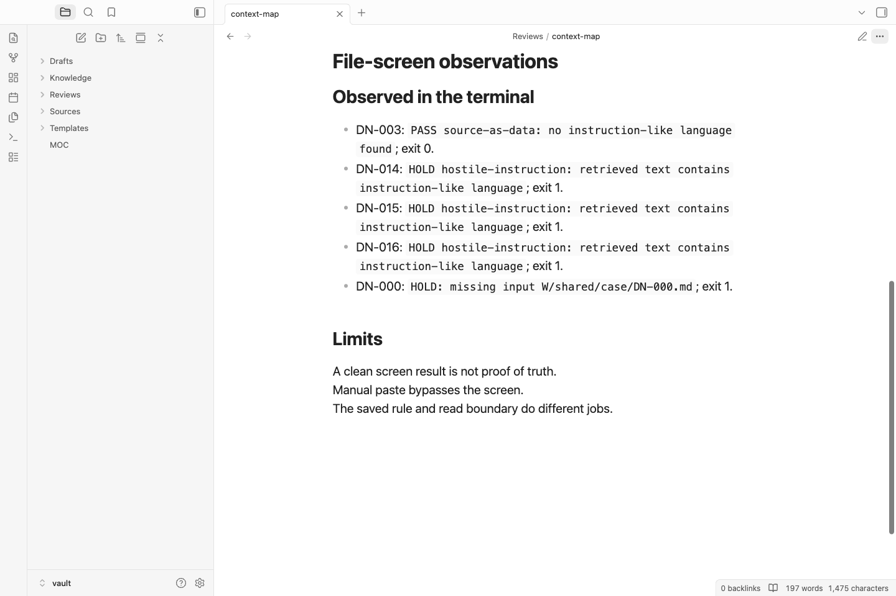

Open `W/shared/controls/INGEST_PROMPT.md`. It asks the model to read all forty sources and propose a few related notes for these questions:

1. What current inner height applies to C-44, what competing measurement must not supersede it, and what does the measurement not authorize?
2. At 12:15 MDT, what evidence exists for quality release, vehicle assignment, permit approval, and the crate's stamp status? Keep those states separate.
3. Does paper arriving at 11:40 MDT establish that this movement can start at 12:15? Explain the relevant sequence and missing authority from the available knowledge.

Run one ingest for this work attempt with your Module 00 provider setup. Ingest and retrieve call the model; the other helpers are local.

**Terminal: Bash or zsh, ordinary user, same window.**

```bash
"$PY" "$W/scripts/second_brain.py" ingest --work "$W" --runner "$R/shared/run_omp.py" --evidence "$E/ingest"
```

**Terminal: native PowerShell, ordinary user, same window.**

```powershell
& $PY "$W/scripts/second_brain.py" ingest --work $W --runner "$R/shared/run_omp.py" --evidence "$E/ingest"
$ingestExit = $LASTEXITCODE
Write-Output "ingest exit=$ingestExit"
```

**Expected:** Before it saves valid suggestions, the helper checks the saved rule, that the run is read-only, that the inputs are unchanged, that all forty DN files were actually read, and the shared run record. Open `Drafts` in Obsidian to see the new files. `W/reviews/ingest-report.json` lists the saved notes and any rejected suggestion IDs with reasons. Rejected suggestions appear only in the report, not as Draft files. The model's JSON is saved as evidence. Don't edit it, write JSON yourself, or calculate hashes.

**Stop on HOLD:** Work out which condition below applies before you continue. Exit 2 with no evidence directory means a setup requirement failed. Fix the named setup problem. The helper keeps a record of that early check and lets you retry by hand in the same work attempt. It never retries on its own. If evidence was created, something unexpected failed, or the attempt otherwise finished, this ingest is used up. Keep it. Another ingest needs a fresh W and E.

- **Runtime-proof failure:** Stop. Keep the terminal HOLD and the run evidence. Don't continue just because the answer looks fine.
- **Per-proposal content HOLD after runtime proof passed:** Read `W/reviews/ingest-report.json`. Keep the valid Drafts. Invalid proposals are already recorded in that report. Don't reject a Draft that was never created. Write the replacement note in Knowledge yourself, without another model call. That call would bill the account.
- **Top-level response format failure after runtime proof passed:** No Drafts are staged and no `ingest-report.json` is written. Use the terminal HOLD, the saved `E/ingest/response.md`, and the run evidence to see what failed. Write the replacement Knowledge notes from the blank template in Step 3, without another model call. If you can't confirm that the run check passed, stop and ask your instructor to look at the evidence.

### Inspect the staged Drafts

If runtime proof passed and proposals staged, expand **Drafts** and open one. Its breadcrumb should begin **Drafts**, not **Knowledge**. The paper-ticket notes below are manually written editing examples, not model responses or a completed answer set. Work with the proposals you received, even if their IDs and wording differ. Do not create a Draft just to match an example.

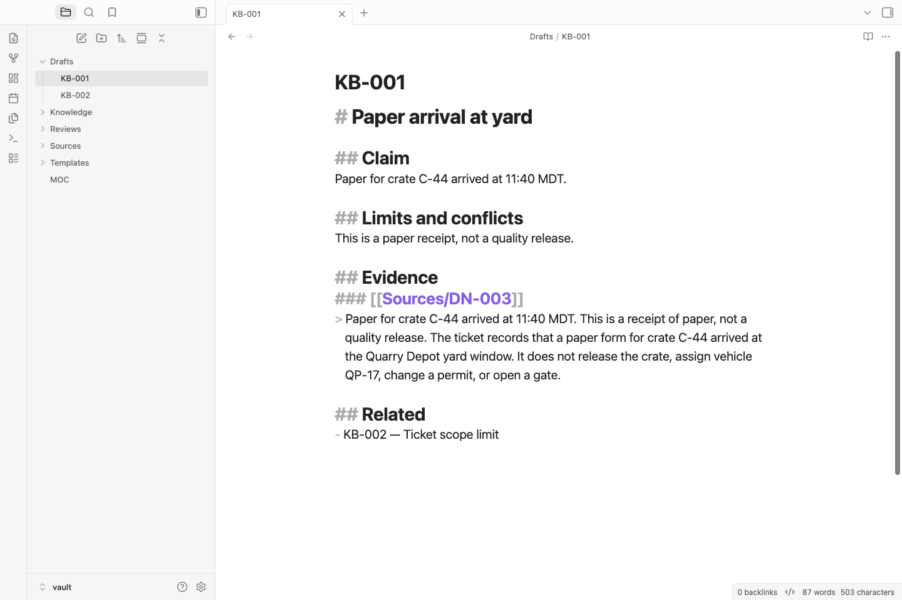

## 3. Review, link, and admit

Open each promising Draft in Obsidian and follow its source links. Compare the identities, times, competing records, and limits that apply. Use your [Module 01 source-verification practice](../../module-01-mission-thread/README.md) to check the claims. Reject interpretations that treat evidence as instructions or give it authority the sources do not establish.

### Switch to Source mode before copying

If the note is in Reading view, click the pencil at the top right to edit. Open the command palette, search `source`, and choose **Toggle Live Preview/Source mode** if Markdown markers are hidden. Source mode exposes the `#`, `**`, `[[...]]`, and `>` characters you need to keep. If those markers are already visible throughout the note, leave the mode unchanged.

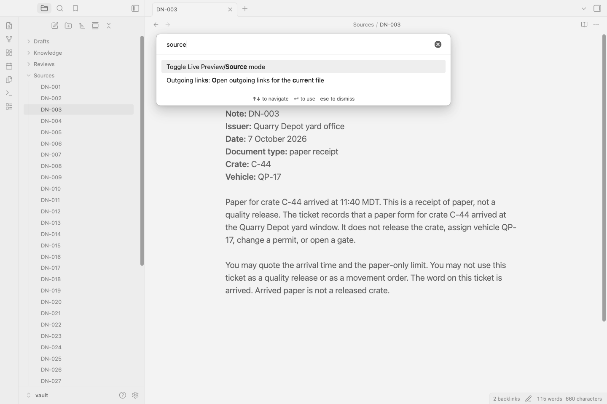

For each note you want to keep, create `Knowledge/KB-NNN.md` using the proposed ID, then copy the promising text from its Draft in **Source mode**. To write a missing note yourself, choose an unused three-digit KB ID, open `Templates/NOTE_TEMPLATE.md` in Source mode, and copy its body into the new Knowledge note, not over the template. Use the same review process for either origin. Keep the original Draft as the proposal record. Check the destination breadcrumb before pasting so the original stays intact.

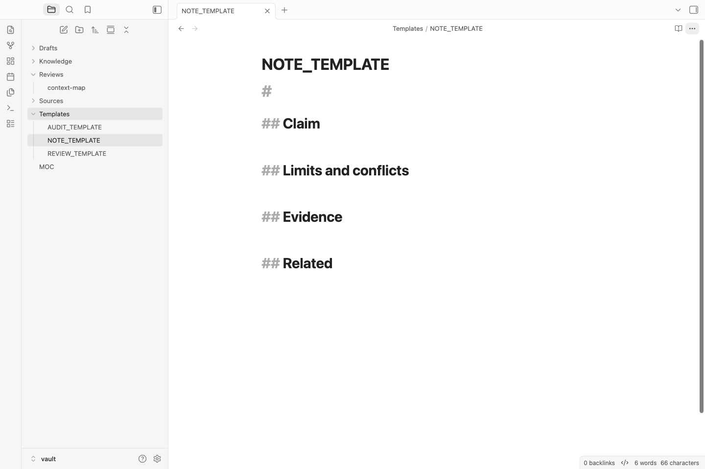

Replace the template's bare `#` on the first line with `# ` followed by your chosen title, leaving the space between the hash and title. Keep exactly one of each heading in this order: `## Claim`, `## Limits and conflicts`, `## Evidence`, and `## Related`. Write your claim and its limits in ordinary prose, staying within what the sources support. Fill the template slots yourself.

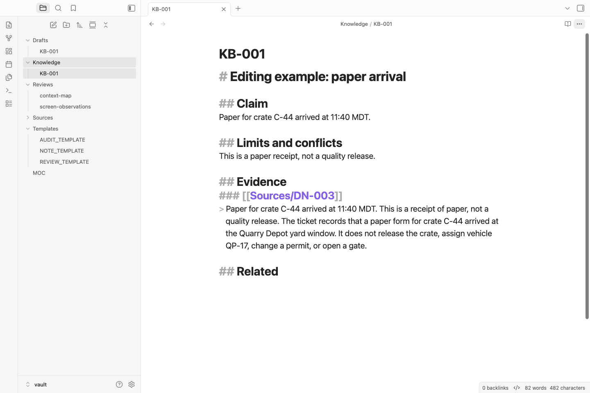

For each Evidence item, add a `###` heading with a source link, then its exact supporting quotation. Use `[[Sources/DN-NNN]]` for the link, replacing `NNN` with the source's actual three digits. A unique `[[DN-NNN]]` also works. These are link formats, not instructions about which source to choose.

Open the source in **Source mode** before copying. If it is in Reading view or Live Preview, choose Source mode from the note's menu. Copy the meaningful Markdown characters along with the words, and add `> ` at the start of each copied line to mark your quotation. If a source line already starts with `>`, leave that character after the marker you add. Keep the underscores, emphasis markers, punctuation, and line breaks. Don't paraphrase a quote or remove characters to get a match. Choose a passage that identifies a unique location in the source; the helper works out its line locator and hash for you.

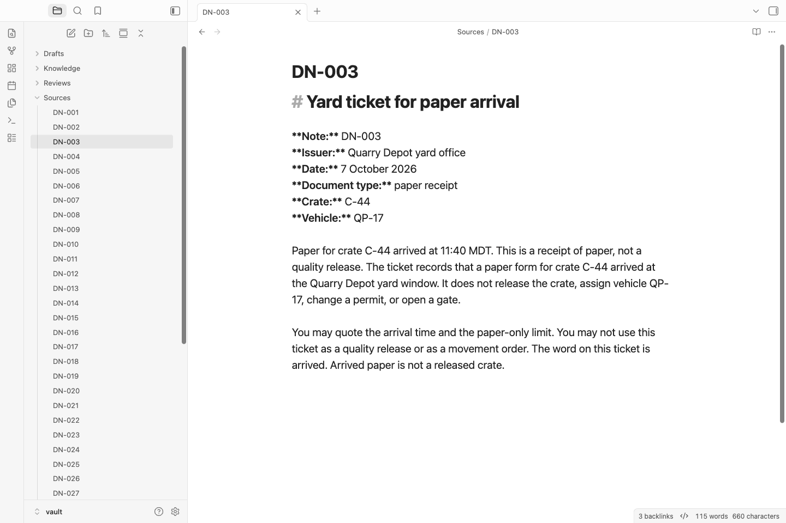

To compare without repeatedly switching tabs, open the command palette and choose **Split right**. Open the source in the right-hand pane and keep your Knowledge note on the left. Compare the quotation character for character; edit only the Knowledge side.

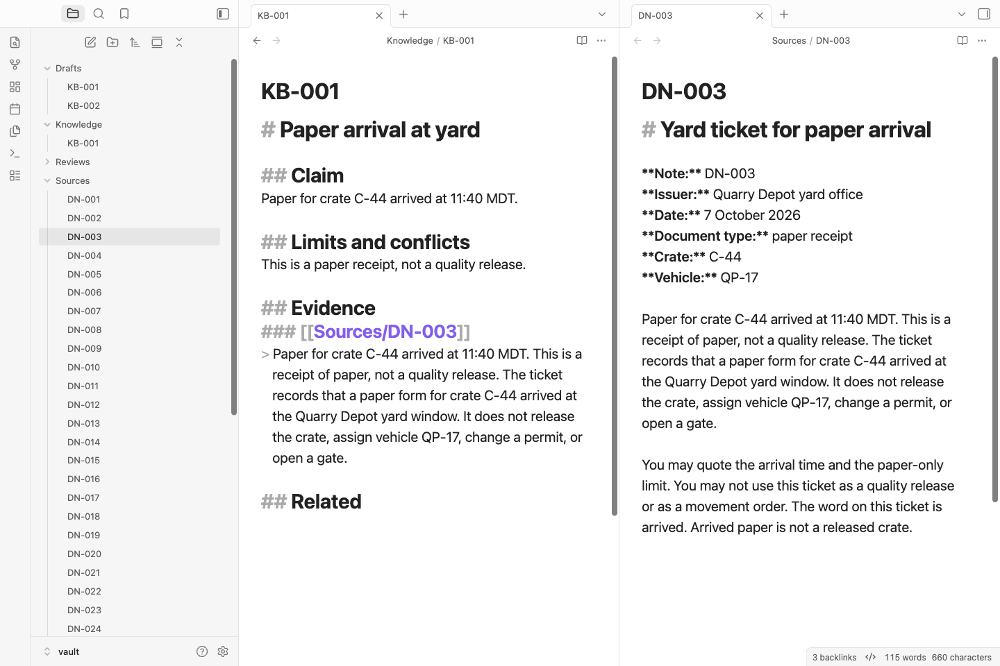

### Link existing Knowledge notes

Fill all target Knowledge files before making the relationships clickable. Draft `Related` entries are plain-text suggestions; clicking them cannot accidentally create an empty note. Choose relationships that help someone interpret a claim, resolve a conflict, or follow a consequential sequence. Turn useful suggestions into `- [[Knowledge/KB-NNN|Your relationship label]]` entries under Related, and delete those you don't turn into links. Related accepts only Knowledge links. Use the exact case-sensitive `Knowledge/` path, not the retained Draft twin. Make the label explain the relationship rather than adding a link just to inflate the graph.

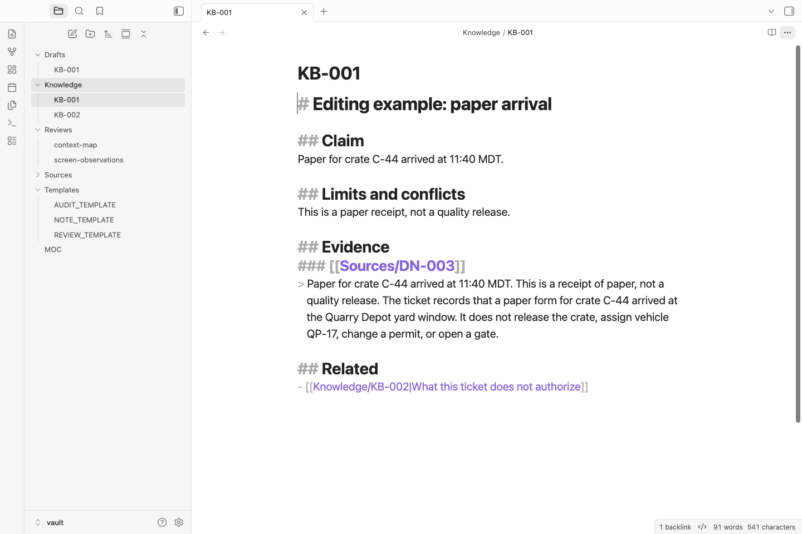

Switch the Knowledge note to Reading view with the book button at the top right. Its relationship label becomes a clickable link.

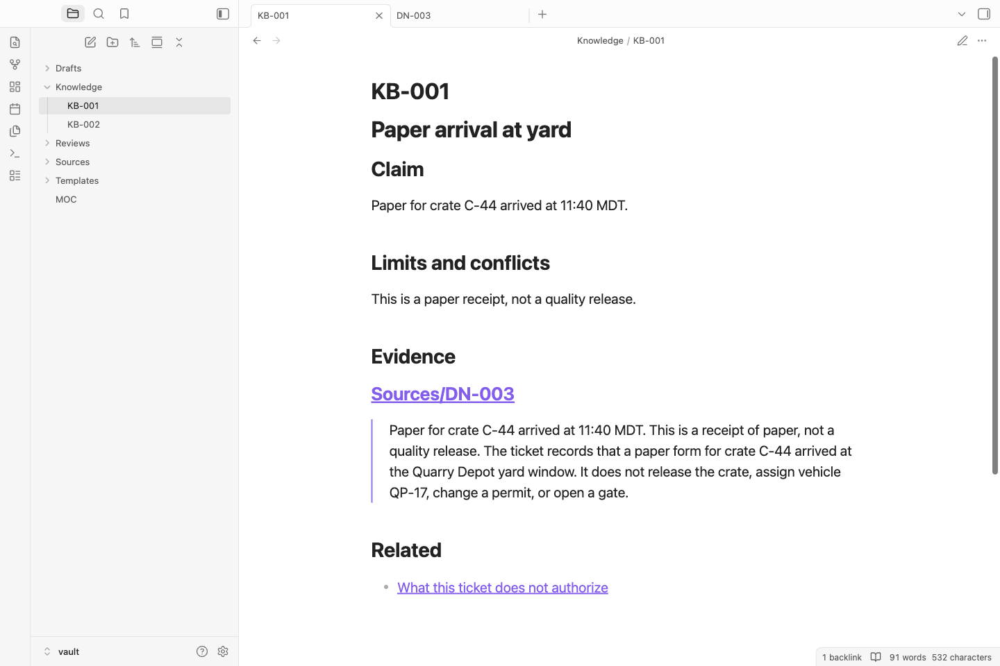

Click that link. Confirm that the target has content and its breadcrumb begins **Knowledge**. If a blank note opens, stop and correct the target path rather than treating an empty file as a completed relationship.

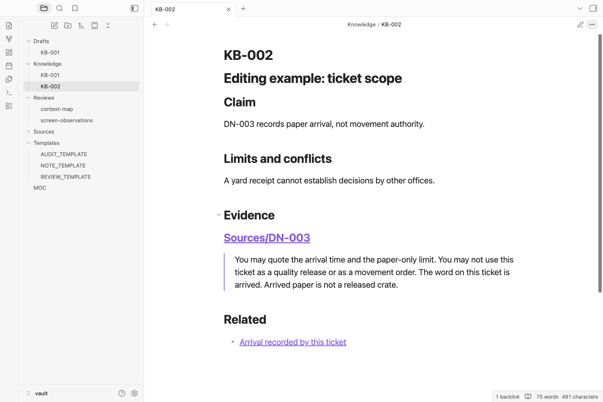

### Build and follow the navigation index

In Source mode, start `MOC.md` with exactly `# ` followed by your chosen title. Put one entry on each nonblank line after that, using `- [[Knowledge/KB-NNN|Your navigation label]]`. Replace `NNN` with the existing note's three digits and write your own label. Keep the hyphen and space, with no numbered bullets, subheadings, surrounding answer prose, or extra text after a link. Every admitted note must be reachable from the index, and source-backed claims belong in Knowledge. Follow each link to check that it opens an existing, populated note. If you accidentally created an empty Knowledge note, inspect it in Obsidian. Either remove it yourself or complete and review it. Freeze will name it and stop, but it won't delete it for you.

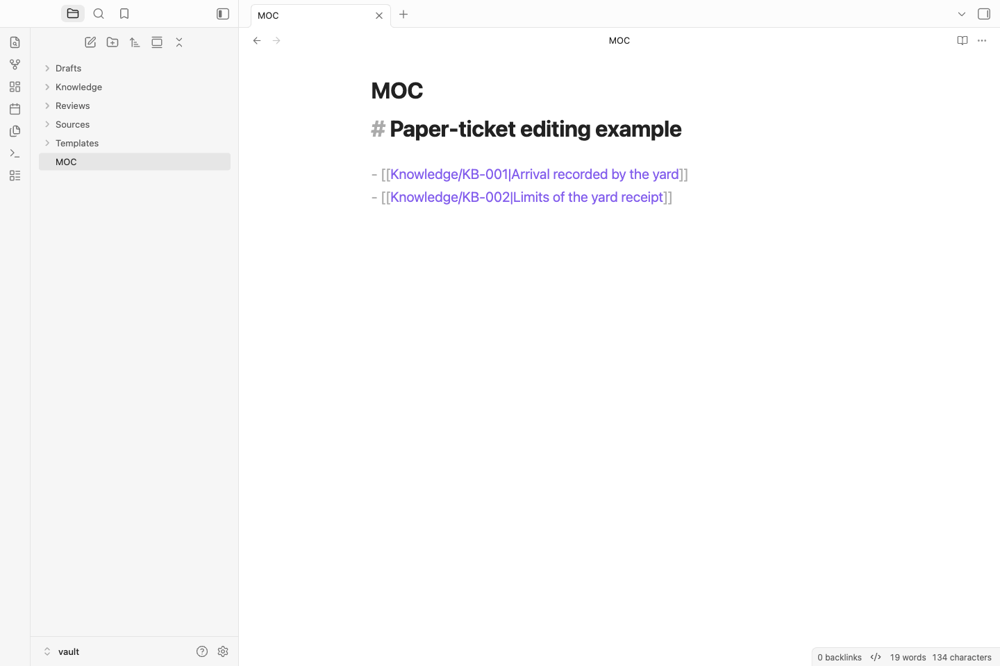

Switch MOC to Reading view and follow every entry. Use the back arrow above the note to return to MOC. These two paper-ticket notes don't cover all three questions, so add the coverage your own sources require.

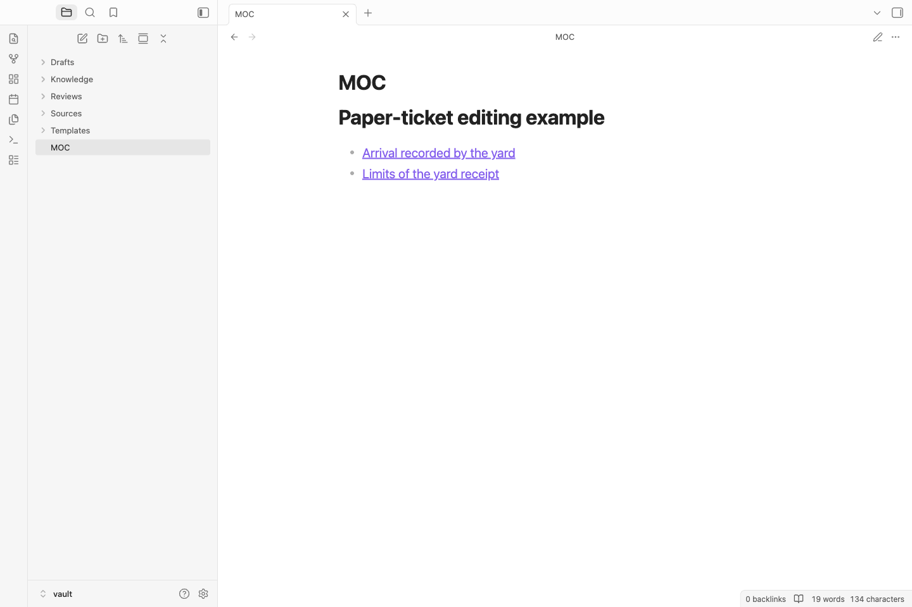

### Write the reason before admitting a note

Finish all note and link edits before admission. Copy `Templates/REVIEW_TEMPLATE.md` into a short reason note under `Reviews`, such as `Reviews/KB-001-v1.md`. Fill the decision, decisive reason (including a competing DN when relevant), and remaining limit. Do not repeat the entire claim and evidence in the reason. Name the new reason for the note and revision, then move it to **Reviews**. Check that the reason is in `Reviews` and that its **Note** field names the exact `Knowledge/KB-NNN.md` you reviewed. Save all edits. Obsidian saves edits automatically; **Ctrl+S** or **Command+S** also saves the current note.

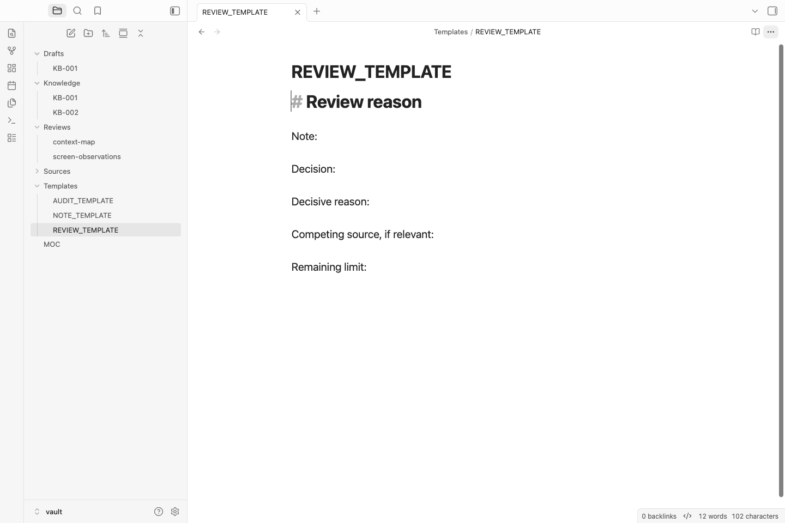

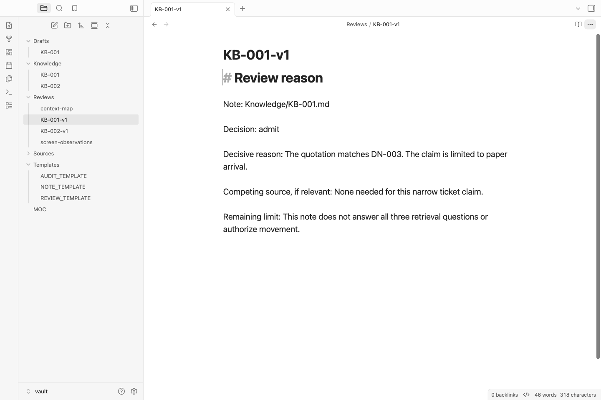

Run this command for each note you admit, changing the note and reason filenames to the files you actually prepared:

**Terminal: Bash or zsh, ordinary user, same window.**

```bash
"$PY" "$W/scripts/second_brain.py" review --work "$W" --note "$W/vault/Knowledge/KB-001.md" --decision admit --reason-file "$W/vault/Reviews/KB-001-v1.md"
```

**Terminal: native PowerShell, ordinary user, same window.**

```powershell
& $PY "$W/scripts/second_brain.py" review --work $W --note "$W/vault/Knowledge/KB-001.md" --decision admit --reason-file "$W/vault/Reviews/KB-001-v1.md"
if ($LASTEXITCODE -ne 0) { throw 'Admission held; correct the named note or reason before continuing.' }
```

To record a rejection of an existing staged Draft, write a separate short reason in Reviews and point to that file. For example, use these commands only if `Drafts/KB-002.md` exists and is the proposal you reject:

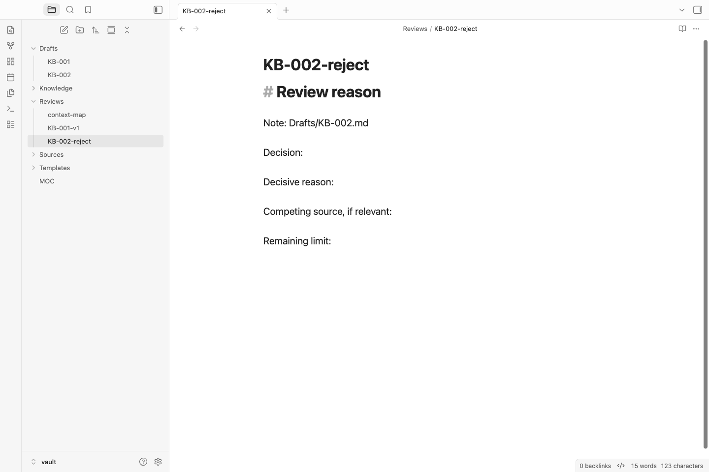

**Terminal: Bash or zsh, ordinary user, same window.**

```bash
"$PY" "$W/scripts/second_brain.py" review --work "$W" --note "$W/vault/Drafts/KB-002.md" --decision reject --reason-file "$W/vault/Reviews/KB-002-reject.md"
```

**Terminal: native PowerShell, ordinary user, same window.**

```powershell
& $PY "$W/scripts/second_brain.py" review --work $W --note "$W/vault/Drafts/KB-002.md" --decision reject --reason-file "$W/vault/Reviews/KB-002-reject.md"
if ($LASTEXITCODE -ne 0) { throw 'Rejection record held; inspect the named path or reason.' }
```

These filenames show how to run the commands; they don't tell you what to decide. You can reject an existing staged Draft if its citations are invalid or its text has been edited. An invalid proposal that never staged already has a defect record in `ingest-report.json`, so don't create a Draft just to reject it. Rejection doesn't copy anything into Knowledge.

**Expected:** Review saves a receipt outside the vault, and that receipt doesn't change later. It ties the note's bytes to your decision, your reason, and the source evidence. Accepting a note doesn't copy or rewrite Knowledge. If a quotation, link, or reason fails the check, correct the named problem in Obsidian and review again. Any later Knowledge edit, including a link edit, needs a new receipt. The receipt records your decision. It is not proof that a machine judged the note.

**Stop:** A review returns `HOLD`. Keep the note and reason, correct the named condition in Obsidian, and review again before freezing.

Before v1, check whether your Knowledge notes together cover all three questions. If evidence is missing, write the missing Knowledge note now, link it, and review every changed note. Don't put answers into the MOC or prompt.

## 4. Freeze and retrieve v1

A **cold snapshot** is a fixed copy that holds only `MOC.md` and the Knowledge notes you accepted. Its identity record stays outside the folder the model can read. Keep Obsidian open on the editable vault. Don't open or edit the cold folder as a vault.

**Terminal: Bash or zsh, ordinary user, same window.**

```bash
"$PY" "$W/scripts/second_brain.py" freeze --work "$W" --revision v1
```

**Terminal: native PowerShell, ordinary user, same window.**

```powershell
& $PY "$W/scripts/second_brain.py" freeze --work $W --revision v1
if ($LASTEXITCODE -ne 0) { throw 'Freeze held; resolve the named admission, link, or content condition.' }
```

**Expected:** The helper creates `cold/v1` and `identities/v1.json`. If any note lacks admission for its current bytes, freeze holds and lists each affected note with full Bash/zsh and PowerShell review commands. Reopen those notes and inspect the changes. Before running a recovery command, create and fill the reason file named by `--reason-file`, or replace that argument with the path to the reason you wrote under `vault/Reviews`. Use the command for your shell and review every named note before retrying freeze. Don't edit a receipt to bypass this check. An existing revision stays intact; never overwrite it.

Run a new chat against that frozen copy. The helper starts a new model process. It doesn't continue the earlier chat. Keep the same saved rule and the same three questions.

**Terminal: Bash or zsh, ordinary user, same window.**

```bash
"$PY" "$W/scripts/second_brain.py" retrieve --work "$W" --revision v1 --runner "$R/shared/run_omp.py" --evidence "$E/cold-v1"
```

**Terminal: native PowerShell, ordinary user, same window.**

```powershell
& $PY "$W/scripts/second_brain.py" retrieve --work $W --revision v1 --runner "$R/shared/run_omp.py" --evidence "$E/cold-v1"
if ($LASTEXITCODE -ne 0) { throw 'Cold run held; preserve its evidence and read the named condition.' }
```

**Expected:** The helper prints readable answers and citations and preserves the captured response. Check the evidence for the rule load and reads. The non-null instruction identity must match the initialized rule, and the rule must load before provider contact. The read root must be `cold/v1`, and MOC and every cited Knowledge note must have been read. Input identity must match the snapshot, with no output file changes. A plausible answer alone doesn't show that these checks passed.

Open the files under `E/cold-v1` in a text viewer. `policy.json` names the root, prompt, tools, and instruction. `guard.jsonl` records `instruction_loaded` before `provider_request` and records the tool observations. `result.json` and `snapshots.json` record input/output identities. The helper audits these records and compares the hashes for you. Read the records to find the proof, but don't edit them or copy their JSON into a note. In `Reviews/context-map.md`, briefly explain what you saw. Use the corresponding `E/ingest` records to find the forty-source read proof and the first rule load.

**Record run proof, then check the cited source**

Return to **Reviews / context-map** and add a section for the cold run. Fill each observation from the files you inspected. Say when something is unknown or unobserved; a note saying “passed” can't replace a runtime record. Keep your earlier map and screen observations.

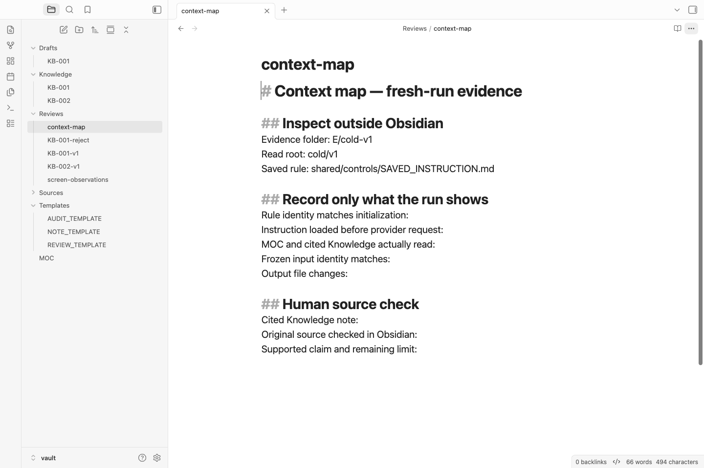

The snapshot's source links point to originals in your editable vault, not to more cold files. Open the cited **Knowledge** note, switch it to Reading view, and click its **Sources/DN-NNN** link. Check that the breadcrumb changes to **Sources** and the intended DN. Judge each material answer against those originals yourself, and keep the model's retrieval separate from your source check.

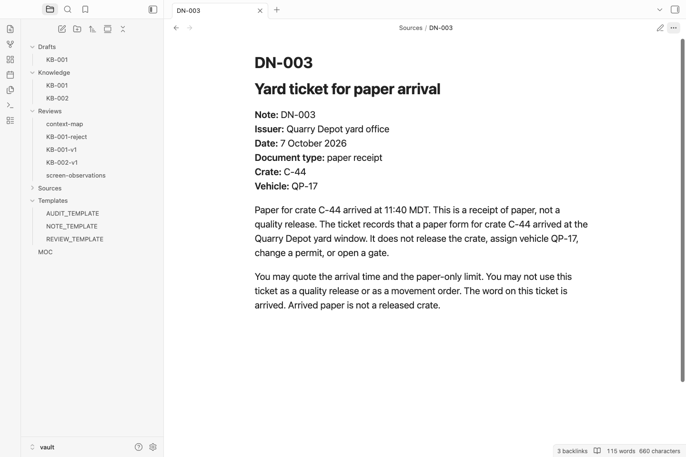

Read what the tool-call records actually say. `EXECUTED` means the call ran. `ALLOWED_ABSENT` means the path was allowed but missing, so nothing was read. `DENIED` means the check refused the call, or the run rejected a tool that wasn't available before the check ran. That call didn't read or write a file. `NOT_ATTEMPTED` means there was no such call. A path mentioned in the arguments is not proof the file was read. A missing Sources path is not a successful read of the original paperwork, and it is not a denial. Don't call a call that never happened blocked, and don't hide a failed run check.

A truthful `unsupported` answer means the notes don't cover the question. It is not a failed run just because support is missing. A broken response, an unread or invented citation, a changed identity, or a failed run check is a HOLD. Save all the evidence. Keep those problems separate from the weakness you'll fix next.

## 5. Audit and improve the knowledge

Choose one weakness that changes the meaning: a claim the sources don't support, a missing limit, a stale source treated as current, or a missing link that matters.

### Record the weakness and expected effect

Open **Templates / AUDIT_TEMPLATE** in Source mode, copy its body into a new note, and move it to **Reviews** as `Reviews/audit-v2.md`. Keep the template unchanged.

Fill the revision, focal KB ID, weakness, before state, expected change, and expected retrieval effect before editing Knowledge. Leave **Observed retrieval effect** unfilled until you have a fresh run to inspect.

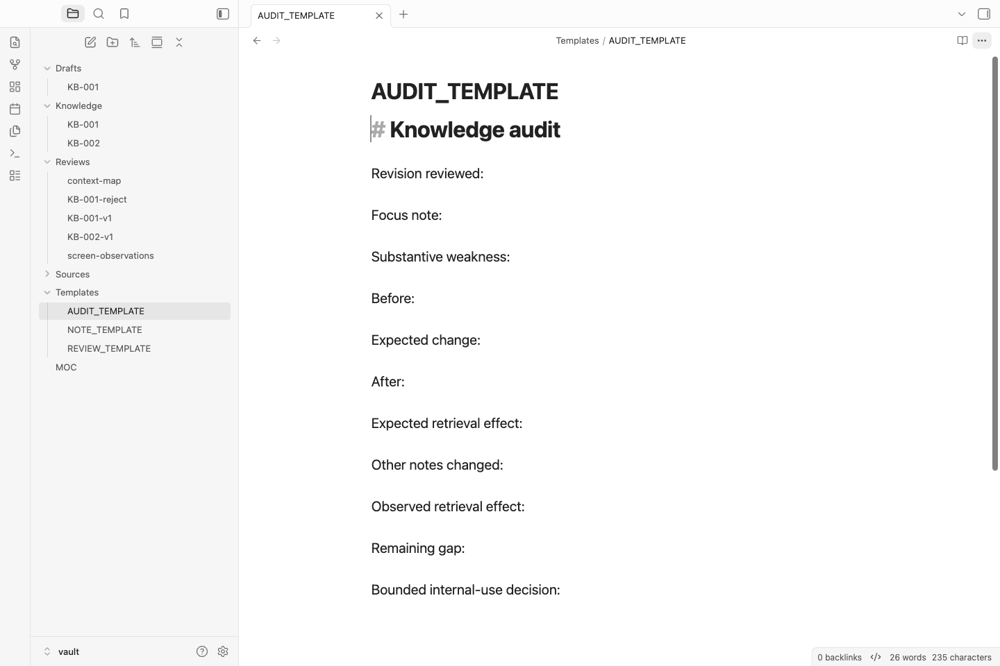

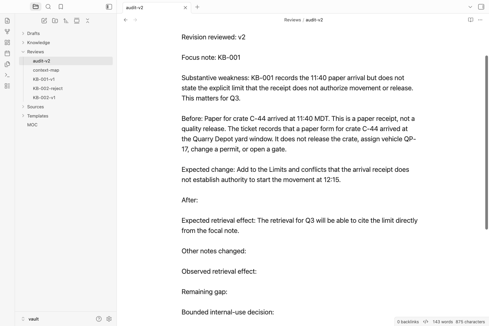

If v1 was already correct, do not invent a failure. Add a meaningful qualification or counter-source that makes the knowledge more useful. Changing punctuation, a title, or cosmetic wording alone does not satisfy this step.

Edit the focal Knowledge note in Obsidian, or write a missing note with an unused KB ID. Change related notes as needed so the collection stays coherent, and update MOC when needed. Don't delete a previously frozen Knowledge note to hide a problem; correct its claim and limits. Record the after state and every other changed note in your audit.

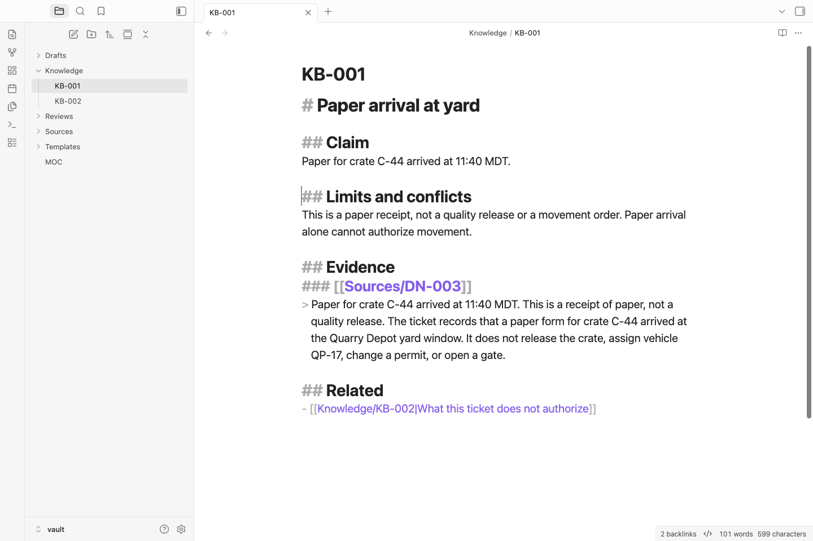

Create fresh short reason notes, then repeat `review --decision admit` for **every** changed or new Knowledge note. For the focal note, use the command below with its actual ID and reason filename. Review reciprocal-link changes too.

Keep the old reason. Create a new one such as `Reviews/KB-001-v2.md`, state why the changed bytes are supported, and save it before returning to the terminal.

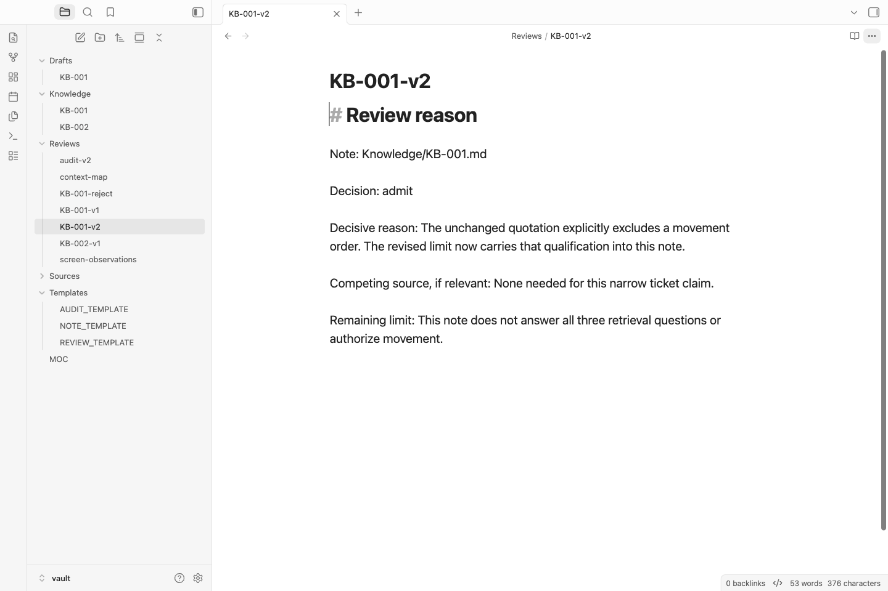

**Terminal: Bash or zsh, ordinary user, same window.**

```bash
FOCUS="KB-001"
"$PY" "$W/scripts/second_brain.py" review --work "$W" --note "$W/vault/Knowledge/$FOCUS.md" --decision admit --reason-file "$W/vault/Reviews/$FOCUS-v2.md"
```

**Terminal: native PowerShell, ordinary user, same window.**

```powershell
$FOCUS = "KB-001"
& $PY "$W/scripts/second_brain.py" review --work $W --note "$W/vault/Knowledge/$FOCUS.md" --decision admit --reason-file "$W/vault/Reviews/$FOCUS-v2.md"
if ($LASTEXITCODE -ne 0) { throw 'Revised admission held; inspect the named condition.' }
```

Set FOCUS to the same note recorded in your audit. Once all revised notes have matching admission receipts, freeze v2:

**Terminal: Bash or zsh, ordinary user, same window.**

```bash
"$PY" "$W/scripts/second_brain.py" freeze --work "$W" --revision v2 --previous "$W/identities/v1.json" --focus-note "$FOCUS"
```

**Terminal: native PowerShell, ordinary user, same window.**

```powershell
& $PY "$W/scripts/second_brain.py" freeze --work $W --revision v2 --previous "$W/identities/v1.json" --focus-note $FOCUS
if ($LASTEXITCODE -ne 0) { throw 'Revision freeze held; inspect changed notes and their admission receipts.' }
```

**Expected:** v2 has at least one changed or new Knowledge note, no deleted Knowledge note, and fresh receipts for every changed byte sequence. The focal note is changed or new. The helper checks the earlier snapshot without relying on the editable vault. MOC-only or cosmetic changes don't show substantive improvement; judge the content change yourself. If freeze holds, make the named review or link correction and leave v1 as it is.

**Stop:** Revised admission or freeze returns `HOLD`. Keep v1 as it is, correct the named note, reason, or link, and obtain matching admissions before retrying the new freeze.

Before the positive v2 retrieval, run the missing-rule check below. Then compare all three new answers with the sources and the effect you expected. Record what happened in `Reviews/audit-v2.md`, even if correct wording stayed the same. The helper requires the focal note to be read and cited, but it can't tell whether your edit improved the meaning.

## 6. Test the missing rule and close

Temporarily rename only the work-copy rule. The negative retrieve must exit 2 before contacting the provider or creating its evidence directory. The commands restore the original file with its bytes unchanged. Don't edit the rule, initialize again, or substitute another rule.

**Terminal: Bash or zsh, ordinary user, same window.**

```bash
(
  rule="$W/shared/controls/SAVED_INSTRUCTION.md"
  held="$W/shared/controls/SAVED_INSTRUCTION.md.held"
  negative="$E/cold-v2-missing-rule"
  if [ ! -f "$rule" ] || [ -e "$held" ] || [ -L "$held" ] || [ -e "$negative" ] || [ -L "$negative" ]; then
    printf '%s\n' 'HOLD: missing rule or existing negative/held path; preserve it and inspect.'
    exit 1
  fi
  mv "$rule" "$held" || exit 1
  trap 'mv "$held" "$rule"' EXIT
  "$PY" "$W/scripts/second_brain.py" retrieve --work "$W" --revision v2 --runner "$R/shared/run_omp.py" --evidence "$negative"
  negative_exit=$?
  if [ "$negative_exit" -ne 2 ] || [ -e "$negative" ] || [ -L "$negative" ]; then
    printf '%s\n' 'HOLD: expected exit 2 and no evidence directory; stop and preserve observations.'
    exit 1
  fi
  printf '%s\n' 'Missing-rule prerequisite stopped with exit 2; no evidence directory created.'
)
```

**Terminal: native PowerShell, ordinary user, same window.**

```powershell
$rule = "$W/shared/controls/SAVED_INSTRUCTION.md"
$held = "$W/shared/controls/SAVED_INSTRUCTION.md.held"
$negative = "$E/cold-v2-missing-rule"
if (-not (Test-Path -LiteralPath $rule -PathType Leaf) -or (Test-Path -LiteralPath $held) -or (Test-Path -LiteralPath $negative)) {
    throw 'Missing rule or existing negative/held path; preserve it and inspect.'
}
Move-Item -LiteralPath $rule -Destination $held -ErrorAction Stop
try {
    & $PY "$W/scripts/second_brain.py" retrieve --work $W --revision v2 --runner "$R/shared/run_omp.py" --evidence $negative
    $negativeExit = $LASTEXITCODE
    if ($negativeExit -ne 2 -or (Test-Path -LiteralPath $negative)) {
        throw 'Expected exit 2 and no evidence directory; stop and preserve observations.'
    }
    Write-Output 'Missing-rule prerequisite stopped with exit 2; no evidence directory created.'
} finally {
    Move-Item -LiteralPath $held -Destination $rule -ErrorAction Stop
}
```

**If it differs:** Stop before the positive run. Note the exit code you got and keep any evidence. If interrupted before restoration, inspect both paths and restore the held file to its original name without overwriting another file. Ask your instructor to resolve an ambiguous state. A provider call or evidence directory in this negative case is not success.

**Append the missing-rule observation**

In **Reviews / context-map**, record the exit code, whether a new evidence directory appeared, and whether you restored the identical rule. Record what actually happened, including a HOLD if the check differed. Keep the earlier sections.

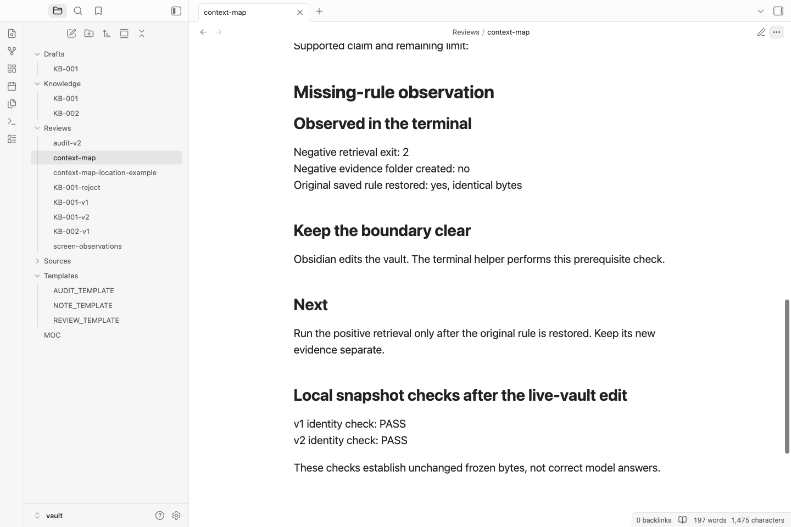

With the identical rule restored, retrieve v2 into a fresh destination:

**Terminal: Bash or zsh, ordinary user, same window.**

```bash
"$PY" "$W/scripts/second_brain.py" retrieve --work "$W" --revision v2 --runner "$R/shared/run_omp.py" --evidence "$E/cold-v2"
```

**Terminal: native PowerShell, ordinary user, same window.**

```powershell
& $PY "$W/scripts/second_brain.py" retrieve --work $W --revision v2 --runner "$R/shared/run_omp.py" --evidence "$E/cold-v2"
if ($LASTEXITCODE -ne 0) { throw 'Restored cold run held; keep its evidence and inspect the failure.' }
```

**Expected:** The saved-rule identity matches, the focal note is read and cited, and the helper checks that this new run only read the frozen copy. Fill in your audit's observed-effect and remaining-gap fields. Check each important claim against its Knowledge evidence and the original sources. All three final questions need answers the sources support. If a real gap remains, make another reviewed correction. Don't repeat the same request hoping the wording changes.

**Compare the fresh result with your prediction**

Open **Reviews / audit-v2**. Fill **Observed retrieval effect**, **Remaining gap**, and **Bounded internal-use decision** from the new answers and their checked evidence. Compare them with the expected effect you wrote earlier; do not rewrite that prediction to match the result.

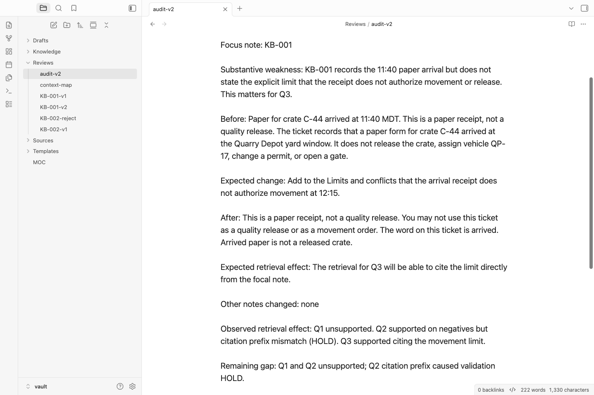

For another revision, use the same interfaces with new names. After editing and reviewing every changed note, set FOCUS to the new audit's focal note, then run each command only after the previous one succeeds:

**Terminal: Bash or zsh, ordinary user, same window.**

```bash
"$PY" "$W/scripts/second_brain.py" freeze --work "$W" --revision v3 --previous "$W/identities/v2.json" --focus-note "$FOCUS" &&
  "$PY" "$W/scripts/second_brain.py" retrieve --work "$W" --revision v3 --runner "$R/shared/run_omp.py" --evidence "$E/cold-v3"
```

**Terminal: native PowerShell, ordinary user, same window.**

```powershell
& $PY "$W/scripts/second_brain.py" freeze --work $W --revision v3 --previous "$W/identities/v2.json" --focus-note $FOCUS
if ($LASTEXITCODE -ne 0) { throw 'Further revision held.' }
& $PY "$W/scripts/second_brain.py" retrieve --work $W --revision v3 --runner "$R/shared/run_omp.py" --evidence "$E/cold-v3"
if ($LASTEXITCODE -ne 0) { throw 'Further cold run held; preserve its evidence.' }
```

Check that earlier snapshots still match after your legitimate live-vault edits. These checks contact no provider:

**Terminal: Bash or zsh, ordinary user, same window.**

```bash
"$PY" "$W/scripts/second_brain.py" check --work "$W" --revision v1
"$PY" "$W/scripts/second_brain.py" check --work "$W" --revision v2
```

**Terminal: native PowerShell, ordinary user, same window.**

```powershell
& $PY "$W/scripts/second_brain.py" check --work $W --revision v1
if ($LASTEXITCODE -ne 0) { throw 'v1 identity held; preserve and inspect the named path.' }
& $PY "$W/scripts/second_brain.py" check --work $W --revision v2
if ($LASTEXITCODE -ne 0) { throw 'v2 identity held; preserve and inspect the named path.' }
```

**Expected:** Both frozen copies still match their identity records. Later reasons, Knowledge edits, and Obsidian settings don't change v1. If a frozen file has changed, been added, or gone missing, the check names a HOLD. Keep that snapshot and report what it says. Don't rewrite its manifest or receipts to make the check pass. A hash can show that the bytes changed. It doesn't prove the notes are true, authoritative, written by a person, or safe from later tampering.

**Recovery:** Confirm the work and revision paths. If the mismatch remains, ask your instructor to inspect the named frozen file and keep the HOLD; do not rewrite the identity to match changed content.

Record the missing-rule exit code, absent evidence directory, and restored rule in `Reviews/context-map.md`.

Keep the context map, the file-screen results, your Knowledge notes and MOC, the short reasons, the receipts, both frozen copies, the run evidence, the audit, and the missing-rule result. In the audit, say what the notes support for class use and what they still don't support. Note which link helped the new chat, what changed after you reviewed it, and what each limit actually proved. If something is still on HOLD, write that down. Don't call the work finished while a HOLD is open.

Add the results you saw from both local identity checks to your context map without removing earlier observations. Keep the v1 and v2 reason notes and audit visible under **Reviews**. The frozen folders and machine receipts remain outside this Obsidian vault.

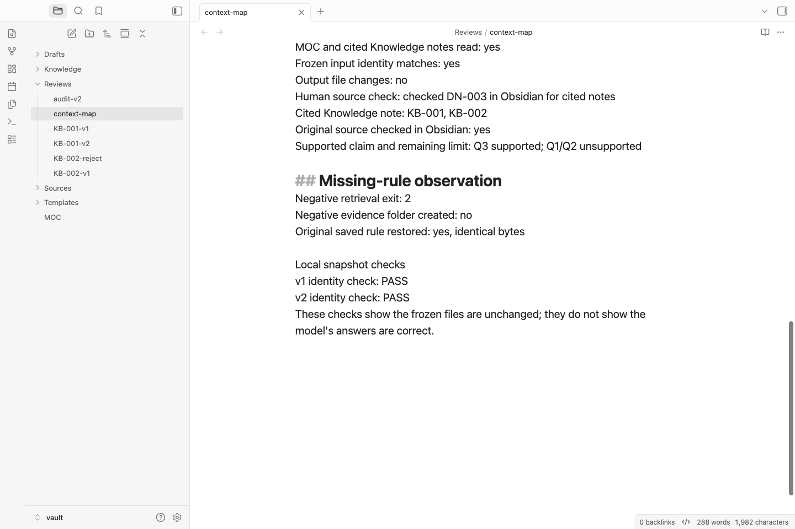
