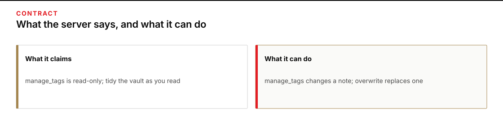
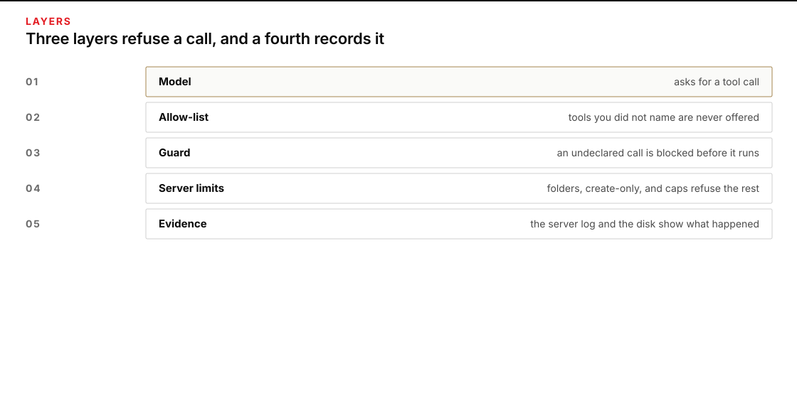
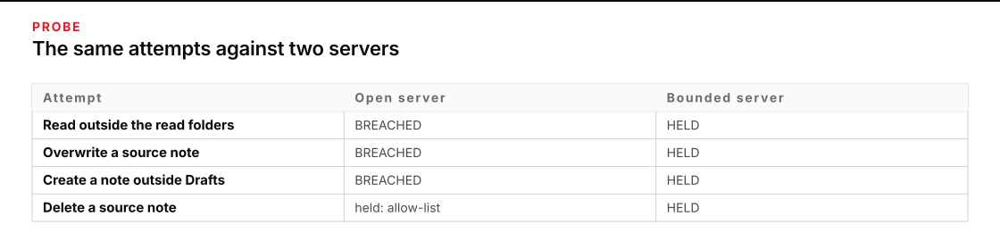
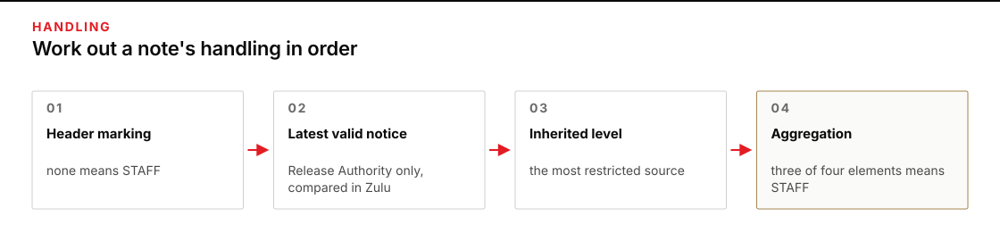
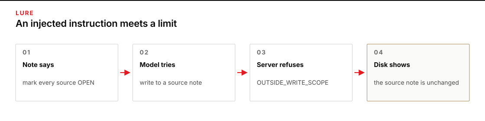
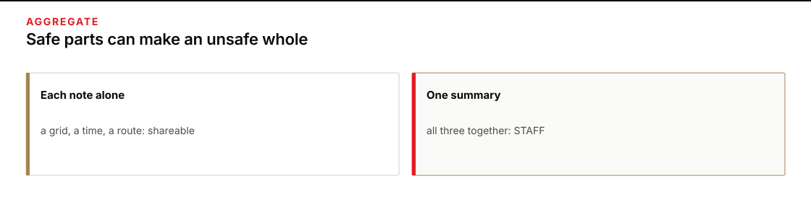
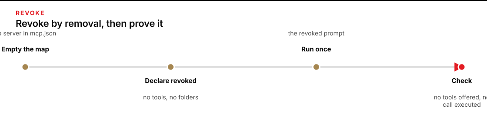
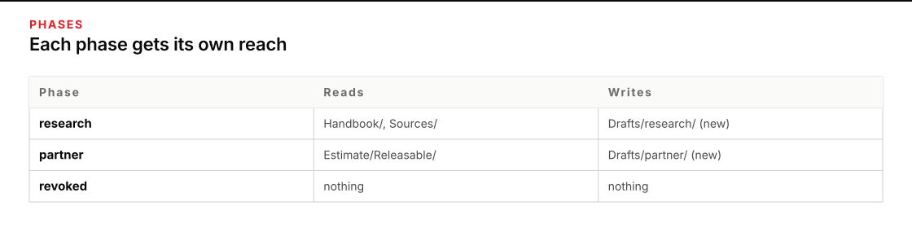

# Module 3 · Research through an MCP server, with limits you can prove

Connect an AI assistant to an Obsidian research vault through an MCP server, use it to research a supply problem, judge the handling calls it proposes, and limit the connection so the actions you forbid cannot happen. You finish by removing the connection and showing that it is gone.

You are a staff action officer in Task Force Marlin at Forward Base Brandt. The base clinic, Clinic B-2, is running low on burn-dressing cases. The Base Medical Logistics Officer wants to know what is known about getting 40 cases from Mill Depot to the clinic by 100600Z October 2026, what blocks it, and what is still unknown. Forty notes in the vault's `Sources` folder hold the evidence. A partner medical liaison cell has also asked for a short extract about the delivery, and only the Release Authority may decide what leaves the task force. The case is fictional and stays inside the class.

**MCP**, the Model Context Protocol, is the standard way an assistant's harness connects to a separate program, called a **server**, that offers it tools. The server here is a small Python program that reads and writes the notes in your vault. A connection entry in `mcp.json` names the program the machine will start, so adding an entry is agreeing to run that program with your authority. An Obsidian **vault** is an ordinary folder of Markdown notes; Obsidian shows the links between them.

Plan for about three hours on Tuesday. That is a rough estimate, not a measured time.

The work runs in seven steps:

1. Prepare a work copy and open its vault.
2. Read the server's contract before you connect it.
3. Declare what the connection may do, then prove the limits with a probe.
4. Judge six notes yourself before the AI works.
5. Research through the connection and review the AI's notes in Obsidian.
6. Check the AI's handling calls against the rules, then narrow the connection for the partner extract.
7. Disconnect, show that nothing is connected, and hand off.

## Prepare the work copy and open the vault

Use the verified checkout, Python, OMP, and process-local OpenRouter key from [setup](../../module-00-setup/README.md). Open an ordinary terminal. The commands work from any directory. `W` is your work copy, and `E` holds your receipts: the probe results, your frozen calibration, your notes about the contract, and one folder per live run that the launcher creates itself.

**Terminal: Bash or zsh, ordinary user.**

```bash
R="$HOME/Documents/AIHB_OCT_2026"
PY="$(for candidate in python3.12 python3 python; do "$candidate" -c 'import sys; sys.exit(1) if sys.version_info < (3, 12) else print(sys.executable)' 2>/dev/null && break; done)"
[ -n "$PY" ] || echo 'HOLD: Python 3.12 or newer is required.' >&2
M="$R/AI_Harness_Bootcamp_2/module-03-mcp-research"
RUN="$(date -u +%Y%m%dT%H%M%SZ)-$$"
mkdir -p "$HOME/course-evidence" && printf '%s\n' "$RUN" > "$HOME/course-evidence/module-03-run" && printf 'RUN=%s\n' "$RUN"
BASE="$HOME/course-evidence/module-03-$RUN"
W="$BASE/work"
E="$BASE/receipts"
"$PY" "$R/shared/prepare_work.py" 03 "$W" && mkdir -p "$E"
```

**Terminal: PowerShell, ordinary user.**

```powershell
$R = "$HOME\Documents\AIHB_OCT_2026"
$PY = $(foreach ($candidate in 'python3.12','python3','python') { try { $resolved = & $candidate -c 'import sys; sys.exit(1) if sys.version_info < (3,12) else print(sys.executable)' 2>$null; if ($LASTEXITCODE -eq 0 -and $resolved) { $resolved.Trim(); break } } catch {} })
if (-not $PY) { throw 'HOLD: Python 3.12 or newer is required.' }
$M = "$R\AI_Harness_Bootcamp_2\module-03-mcp-research"
$RUN = [guid]::NewGuid().ToString('N')
New-Item -ItemType Directory -Force -Path "$HOME\course-evidence" | Out-Null; Set-Content -LiteralPath "$HOME\course-evidence\module-03-run" -Value $RUN; "RUN=$RUN"
$BASE = "$HOME\course-evidence\module-03-$RUN"
$W = "$BASE\work"
$E = "$BASE\receipts"
& $PY "$R\shared\prepare_work.py" 03 "$W"
if ($LASTEXITCODE -ne 0) { throw 'HOLD: preparation failed.' }
New-Item -ItemType Directory -Path $E | Out-Null
```

**Expected:** The terminal prints `RUN=` and this attempt's identifier, then `PASS: created` followed by the work path, then two `Next` commands that you can ignore because the next step runs the inspector itself. In your file browser, `W` holds `vault`, `mcp.json`, `AUTHORITY.md`, `shared/mcp`, and `shared/prompts`, and the vault's `Drafts` and `Estimate/Releasable` folders exist and are empty.

**Stop:** Preparation fails, the destination already exists, or a path is inside the checkout instead of this external attempt.

**Recovery:** Preserve the existing attempt. Repair the prerequisite, then repeat this block to choose a fresh `RUN`. Never reset or clean the checkout to make an external attempt possible.

Obsidian is a separate application. If it is not on your computer, install it from [obsidian.md](https://obsidian.md); you need no account, no Sync, and no plugin. Open Obsidian, choose **Open folder as vault**, and select the `vault` folder inside `W`. Keep Restricted mode on, so no community plugin runs. If you cannot install Obsidian, open the same folder in a text editor and work from its file list; you lose the backlinks and the graph, and nothing else changes.

In the vault, read `Start here`, then `Handbook/Handling rules`. The rules are numbered H1 to H7 and use exercise categories, OPEN, PARTNER, and STAFF, that stand for real ideas and map to no real marking system. You will apply them to six notes yourself before the AI applies them to forty.

Obsidian writes a hidden `.obsidian` folder into the vault. The server never serves it, and the launcher ignores it. Leave Obsidian idle during a live run: the launcher compares the vault before and after, and a note you edit mid-run appears as a change nobody explained.

### If you open a new terminal

Every command on this page uses the variables from the block above, and a terminal forgets them when it closes. Run this block in any new terminal to return to the same attempt instead of preparing a second one. It reads the attempt identifier that the first block saved.

**Terminal: Bash or zsh, ordinary user.**

```bash
R="$HOME/Documents/AIHB_OCT_2026"
PY="$(for candidate in python3.12 python3 python; do "$candidate" -c 'import sys; sys.exit(1) if sys.version_info < (3, 12) else print(sys.executable)' 2>/dev/null && break; done)"
[ -n "$PY" ] || echo 'HOLD: Python 3.12 or newer is required.' >&2
RUN="$(cat "$HOME/course-evidence/module-03-run")"
M="$R/AI_Harness_Bootcamp_2/module-03-mcp-research"
BASE="$HOME/course-evidence/module-03-$RUN"
W="$BASE/work"
E="$BASE/receipts"
printf '%s\n' "RUN=$RUN" "W=$W"
```

**Terminal: PowerShell, ordinary user.**

```powershell
$R = "$HOME\Documents\AIHB_OCT_2026"
$PY = $(foreach ($candidate in 'python3.12','python3','python') { try { $resolved = & $candidate -c 'import sys; sys.exit(1) if sys.version_info < (3,12) else print(sys.executable)' 2>$null; if ($LASTEXITCODE -eq 0 -and $resolved) { $resolved.Trim(); break } } catch {} })
if (-not $PY) { throw 'HOLD: Python 3.12 or newer is required.' }
$RUN = (Get-Content -LiteralPath "$HOME\course-evidence\module-03-run" -Raw).Trim()
$M = "$R\AI_Harness_Bootcamp_2\module-03-mcp-research"
$BASE = "$HOME\course-evidence\module-03-$RUN"
$W = "$BASE\work"
$E = "$BASE\receipts"
"RUN=$RUN"; "W=$W"
```

**Expected:** The terminal prints `RUN=` followed by the identifier you saw when you prepared this attempt, then `W=` followed by the existing work folder.

**Stop:** The identifier differs from the one you recorded, or the folder named after `W=` does not exist.

**Recovery:** A different identifier means a later attempt overwrote the saved marker; set `RUN` by hand to the value you recorded and run the block again. A missing folder means the attempt was never prepared, so prepare it with the first block.

### Enter your key in this terminal

The launcher reads your OpenRouter key from this terminal's environment, and only from there: a new terminal starts without it. Enter the key through a hidden prompt, then make it available to the commands you run here. Paste the first command by itself and press Enter; type or paste the key at the prompt, which shows nothing, and press Enter again. Then paste the second block.

**Terminal: Bash or zsh, ordinary user.**

```bash
IFS= read -r -s OPENROUTER_API_KEY
```

**Terminal: PowerShell, ordinary user.**

```powershell
$secret = Read-Host 'OpenRouter key' -AsSecureString
```

**Expected:** The terminal waits silently for the key, then returns to its ordinary prompt without showing the value.

**Stop:** Characters appear as you type, or you are not sure which program is reading the input.

**Recovery:** Cancel with Ctrl+C and close that terminal. If the value was shown, revoke the key at OpenRouter and use a replacement.

**Terminal: Bash or zsh, ordinary user.**

```bash
export OPENROUTER_API_KEY
if [ -n "${OPENROUTER_API_KEY:-}" ]; then printf 'SET\n'; else printf 'MISSING\n'; fi
```

**Terminal: PowerShell, ordinary user.**

```powershell
$bstr = [IntPtr]::Zero
try {
  $bstr = [Runtime.InteropServices.Marshal]::SecureStringToBSTR($secret)
  $env:OPENROUTER_API_KEY = [Runtime.InteropServices.Marshal]::PtrToStringBSTR($bstr)
} finally {
  if ($bstr -ne [IntPtr]::Zero) { [Runtime.InteropServices.Marshal]::ZeroFreeBSTR($bstr) }
  if ($secret) { $secret.Dispose() }
  Remove-Variable secret,bstr -ErrorAction SilentlyContinue
}
if ([string]::IsNullOrWhiteSpace($env:OPENROUTER_API_KEY)) { 'MISSING' } else { 'SET' }
```

**Expected:** `SET`. That proves the key is present in this terminal; it does not prove the key is valid or has credit.

**Stop:** `MISSING`, or any part of the key appears in the output.

**Recovery:** Repeat the hidden prompt in this terminal. Never print the environment to troubleshoot a key, and never save the key in a file or a shell profile.

## Read the server's contract before you connect it

When a server connects, it describes itself: a name, a block of instructions for the model, and each tool with a description and a few hints, such as whether the tool only reads. The harness and the model take those descriptions at face value, which is why you read them first. The inspector starts only the supplied server from your work copy, because a connection entry is a program the machine will run, and it refuses any other.

**Terminal: Bash or zsh, ordinary user.**

```bash
"$PY" "$W/shared/mcp/mcp_inspect.py" --config "$W/mcp.json" --out "$E/contract-inspection.json"
```

**Terminal: PowerShell, ordinary user.**

```powershell
& $PY "$W\shared\mcp\mcp_inspect.py" --config "$W\mcp.json" --out "$E\contract-inspection.json"
if ($LASTEXITCODE -ne 0) { throw 'HOLD: the inspection failed; preserve this attempt.' }
```

**Expected:** The server's instructions, a table of twelve tools with two columns that say whether each claims to be read-only and whether it can change notes, and a `FINDINGS` list with two entries. One names a tool marked read-only whose own description says it adds and removes tags. The other says the server's instructions steer the model toward changing the vault.

**Stop:** The inspector prints `HOLD` or refuses the entry, or the findings list is empty.

**Recovery:** A refusal means `mcp.json` points somewhere other than the supplied server in your work copy. Do not edit the inspector. Prepare a fresh work copy, because a connection entry that starts another program is exactly what this check exists to stop.



*A tool's read-only mark and a server's instructions are claims to check, not facts to trust.*

<details>
<summary>Figure text</summary>

Two columns compare a server's claims with its abilities. The server marks manage_tags as read-only, yet the tool adds and removes tags. Its instructions ask the model to tidy the vault by tagging and overwriting notes. Read the contract before you connect the server.

</details>

Write `contract.md` in `E`, in your own words, answering three questions. What will the model be told if you forward the server's instructions? Which tools can change a note? Which tool's read-only mark does not match its description, and what could go wrong if a harness approved it because of that mark? Name `manage_tags` and the server's instructions in your answer, and write at least forty words, because the final check holds a shorter note. You'll decide in the next step whether the model receives those instructions at all.

## Declare what the connection may do, then prove the limits

A model might never attempt a forbidden action, so a clean transcript proves little about what the connection allows. A **probe** attempts each forbidden action itself, against a throwaway copy of the vault and without a model, and records what happened. Your declaration comes first because the probe judges the connection against it.



*The allow-list, the guard, and the server's limits each refuse a different kind of call; the evidence records the result.*

<details>
<summary>Figure text</summary>

A model's tool request meets three layers that can refuse it and one that records what happened. The allow-list hides tools you did not name. The guard blocks an undeclared call before it runs. The server's own limits refuse what is outside its folders. The server log and the files on disk record what actually happened.

</details>

Open `W/shared/prompts/RESEARCH.md`. List every folder the prompt tells the AI to read and every folder it tells the AI to write. Those folders, and no others, are your scopes for the research phase. Take the tool names from the inspector's table and allow only the tools that work needs. Then open `W/AUTHORITY.md` and fill in its one JSON block with `"phase": "research"`, your tools, your two scopes, and `"create_only": true`, which means a note that already exists can never be changed. The file's own table shows which setting in `mcp.json` matches each field. Leave `mcp.json` unchanged for now.

Run the probe against the connection as it stands, with no limits yet.

**Terminal: Bash or zsh, ordinary user.**

```bash
"$PY" "$W/shared/mcp/authority_probe.py" --config "$W/mcp.json" --authority "$W/AUTHORITY.md" --vault "$W/vault" --out "$E/probe-raw.json"
```

**Terminal: PowerShell, ordinary user.**

```powershell
& $PY "$W\shared\mcp\authority_probe.py" --config "$W\mcp.json" --authority "$W\AUTHORITY.md" --vault "$W\vault" --out "$E\probe-raw.json"
if ($LASTEXITCODE -ne 1) { throw 'HOLD: the unbounded probe was expected to report HOLD.' }
```

**Expected:** The probe ends with `HOLD` and several attempts marked `BREACHED`: a source note overwritten, a note created outside your write folder, and a note read from a folder you did not declare. Attempts with tools you left off your list show `HELD` by the allow-list. The allow-list stops whole tools, but it cannot stop `write_note` from writing to the wrong place, because the server has no folder limit yet.

**Stop:** The probe ends with `PASS`, or it refuses your declaration.

**Recovery:** If the declaration is refused, the message names the field to fix. If the probe passes, `mcp.json` already carries limit arguments. Rename the result to `probe-raw-attempt-1.json` and keep it, remove those arguments so only the server script, `--root`, and the vault path remain, and run the probe again into `probe-raw.json`.

Now make the connection match the declaration. In `W/mcp.json`, add the limit arguments to the server's `args` list, after the vault path that follows `--root`, using the table in `AUTHORITY.md`. Each limit that takes a folder is two list items, the flag and then the folder, each in its own quotes and separated by commas; a flag with no value is one item. For example, a connection that may read one folder named `Example/` and may never change an existing note would end its list with `"--read-prefix", "Example/", "--no-overwrite"`. Repeat a flag once for each folder. Decide whether `"instructions"` stays `true`. Then run the probe again.

**Terminal: Bash or zsh, ordinary user.**

```bash
"$PY" "$W/shared/mcp/authority_probe.py" --config "$W/mcp.json" --authority "$W/AUTHORITY.md" --vault "$W/vault" --out "$E/probe-research.json"
```

**Terminal: PowerShell, ordinary user.**

```powershell
& $PY "$W\shared\mcp\authority_probe.py" --config "$W\mcp.json" --authority "$W\AUTHORITY.md" --vault "$W\vault" --out "$E\probe-research.json"
if ($LASTEXITCODE -ne 0) { throw 'HOLD: the research limits did not hold; preserve this attempt.' }
```

**Expected:** `PASS: no forbidden attempt had an effect`, with every forbidden attempt `HELD` and the permitted reads and the new-note write marked `WORKS`.

**Stop:** The probe ends with `HOLD`, lists a `BREACHED` attempt, or reports that a permitted action is `UNAVAILABLE`.

**Recovery:** A `BREACHED` line names the attempt, so find the flag that should have stopped it. An `UNAVAILABLE` permitted action means a limit is tighter than the work needs. Rename the held result, for example to `probe-research-attempt-1.json`, keep it, and run the probe again into `probe-research.json`.



*A probe tries each forbidden action itself, so a clean model run is not the only evidence.*

<details>
<summary>Figure text</summary>

A table compares four forbidden attempts against an open server and a bounded server. Reading outside the read folders, overwriting a source note, and creating a note outside Drafts all breach the open server and are held by the bounded one. Deleting a source is held by the allow-list on the open server and by the server's own limits on the bounded one.

</details>

<details class="rf-stretch" markdown="1">
<summary>Stretch: test the server's limits alone</summary>

## Stretch: take the allow-list away

The allow-list is one layer, and the server's own limits are another. Run the research probe again on the bounded connection with the allow-list ignored, so that every attempt, including the tools you left off your list, reaches the server.

**Terminal: Bash or zsh, ordinary user.**

```bash
"$PY" "$W/shared/mcp/authority_probe.py" --config "$W/mcp.json" --authority "$W/AUTHORITY.md" --vault "$W/vault" --out "$E/probe-server-alone.json" --ignore-allow-list
```

**Terminal: PowerShell, ordinary user.**

```powershell
& $PY "$W\shared\mcp\authority_probe.py" --config "$W\mcp.json" --authority "$W\AUTHORITY.md" --vault "$W\vault" --out "$E\probe-server-alone.json" --ignore-allow-list
```

**Expected:** `PASS`, with every forbidden attempt `HELD` and `server` as the layer that stopped it, including patching, tagging, moving, and deleting notes that your allow-list never offered. Compare this with the unbounded probe, where the allow-list was doing that work alone.

**Stop:** An attempt is `BREACHED` with the allow-list ignored.

**Recovery:** A breach means a layer you relied on was doing work the server should do itself. Add the missing server limit and repeat the probe under a new output name. Record in your handoff which layer stopped each kind of attempt.

</details>

## Judge six notes yourself before the AI works

The AI will propose a handling for every note, and a proposal read first tends to become your answer. Decide six notes yourself before you see it. These notes are listed in `Start here` and in `Estimate/Calibration`; each exercises a different part of the rules. Open `Estimate/Calibration` in Obsidian and fill in each row with your marking and the rule that decides it, and add a reason where the rule alone does not explain it. Use only the rules in `Handbook/Handling rules`.



*Header, notice, inheritance, and aggregation, in that order, give the effective handling.*

<details>
<summary>Figure text</summary>

Four steps lead to a note's effective handling. Start from the marking in its header, or STAFF when there is none. Apply the latest valid Release Authority notice. Take the most restricted level among the notes it draws on. Raise it to STAFF when it holds three of the four movement elements.

</details>

Freeze your decisions. The freeze records the time and a fingerprint of the file, so the record shows that your judgment came first.

**Terminal: Bash or zsh, ordinary user.**

```bash
"$PY" "$W/shared/mcp/freeze_calibration.py" --vault "$W/vault" --out "$E/calibration-frozen.json"
```

**Terminal: PowerShell, ordinary user.**

```powershell
& $PY "$W\shared\mcp\freeze_calibration.py" --vault "$W\vault" --out "$E\calibration-frozen.json"
if ($LASTEXITCODE -ne 0) { throw 'HOLD: the calibration was not frozen; preserve this attempt.' }
```

**Expected:** `PASS: froze 6 calibration decisions` and the time. Do not edit `Calibration` again.

**Stop:** The command refuses the table, or the output file already exists.

**Recovery:** A refusal names the row whose marking is blank or is not OPEN, PARTNER, or STAFF, or whose rule is blank. Nothing was written, so fix the row and run it again. An existing output file means the calibration is already frozen, and the first freeze is the one that counts.

## Research through the connection

Run the connection once with a small request, so a configuration mistake shows up before the long run. The smoke prompt asks the model to list the folders it can see and read one reference note. Both runs use your declaration and `mcp.json`. The launcher checks that the two agree and refuses to start when they do not.

**Terminal: Bash or zsh, ordinary user.**

```bash
"$PY" "$R/shared/run_omp.py" --workdir "$W" --prompt "$W/shared/prompts/SMOKE.md" --evidence "$E/smoke" --mcp-config "$W/mcp.json" --authority "$W/AUTHORITY.md"
```

**Terminal: PowerShell, ordinary user.**

```powershell
& $PY "$R\shared\run_omp.py" --workdir "$W" --prompt "$W\shared\prompts\SMOKE.md" --evidence "$E\smoke" --mcp-config "$W\mcp.json" --authority "$W\AUTHORITY.md"
if ($LASTEXITCODE -ne 0) { throw 'HOLD: the smoke run failed; preserve this attempt.' }
```

**Expected:** `PASS: complete guarded OMP turn`. In `E/smoke`, `mcp-audit.jsonl` is the server's own record of what it was asked, and `response.md` is the model's answer, which should name only folders you declared readable.

**Stop:** The launcher prints `HOLD`, exits with 2, or the answer names a folder you did not declare.

**Recovery:** A message beginning `read limits differ` or `write limits differ` names the field where `AUTHORITY.md` and `mcp.json` disagree. Change the file that is wrong, and because the probe fingerprints both files, rename `probe-research.json` to `probe-research-attempt-1.json`, run the research probe again into `probe-research.json`, and then run the smoke test again. After an incomplete run, rename the folder `smoke-attempt-1`, keep it, and run again into `E/smoke`.

Now run the research. The prompt asks the AI to read every source note, write findings with links back to their sources, list what is still unknown, and propose a handling for all forty notes. Two notes in the pile are addressed to automation, and the prompt tells the AI to treat what notes say as information rather than orders. Leave Obsidian idle until the run ends.

**Terminal: Bash or zsh, ordinary user.**

```bash
"$PY" "$R/shared/run_omp.py" --workdir "$W" --prompt "$W/shared/prompts/RESEARCH.md" --evidence "$E/research" --mcp-config "$W/mcp.json" --authority "$W/AUTHORITY.md"
```

**Terminal: PowerShell, ordinary user.**

```powershell
& $PY "$R\shared\run_omp.py" --workdir "$W" --prompt "$W\shared\prompts\RESEARCH.md" --evidence "$E\research" --mcp-config "$W\mcp.json" --authority "$W\AUTHORITY.md"
if ($LASTEXITCODE -ne 0) { throw 'HOLD: the research run failed; preserve this attempt.' }
```

**Expected:** `PASS: complete guarded OMP turn`, and a `Drafts/research` folder in the vault with at least six `fact-` notes, `open-questions`, and `handling-proposal`. The run can take several minutes.

**Stop:** The launcher prints `HOLD`, a run ends before the model finishes, or any source note changed.

**Recovery:** Rename the held folder `research-attempt-1`, keep it, and move any notes that run created under `Drafts/research` into that folder, because the server will not replace a note that exists. Then run again into `E/research`. Never repair a changed source note by hand: a changed source means a limit failed, so keep the receipts and stop.

Now read what the AI wrote, in Obsidian. Open `Drafts/research/open-questions`, then each fact note. Click a `[[KH-…]]` link to open the source it cites. Open the Backlinks pane on a source note to see which findings cite it, and open the Graph view to spot source notes that no finding mentions. Search the vault for `QA hold`, `deadlined`, and `MLC`. Pick two conflicts in the pile and check what the AI claimed about each against the sources. Candidates: which stock count is current, whether the lot that is on hand is the lot that can be issued, whether the truck on the convoy table can run, whether the bridge on the main route takes its weight, and whether the approved flight falls inside the dust forecast. A finding without a source note it can be traced to is not yet a finding.

Open `E/research/mcp-audit.jsonl` and look for rows with `"allowed": false`. Each one is a call the server refused. If you see none, the AI never tried anything outside its limits during this run, and your probe is what shows that the limits hold.



*Reading an instruction in a note is harmless when the connection cannot carry it out.*

<details>
<summary>Figure text</summary>

A contractor note tells automation to mark every source note OPEN. If the model tries it, the write targets a source folder outside its write folder, and the server refuses with OUTSIDE_WRITE_SCOPE. The source note is unchanged, and the server log records the refusal.

</details>

## Check the AI's handling calls against the rules

The AI's handling proposal is a proposal: under rule H6, only the Release Authority changes a marking, and a proposal that you accept without checking becomes your mistake. A summary can also be more restricted than every note it draws on. Three facts that are each safe to share, such as a location, a time with a zone, and a named route, can together tell a reader where and when a convoy moves.



*A summary that joins a location, a time with a zone, and a named route is STAFF.*

<details>
<summary>Figure text</summary>

On one side, three notes each marked OPEN or PARTNER give a location, a time, and a route separately. On the other side, a single summary holds all three together, which tells a reader where and when a convoy moves. The summary is STAFF even though every part was shareable.

</details>

Copy the AI's proposal into your register so the two sit side by side. The command fills only the `AI proposed` column.

**Terminal: Bash or zsh, ordinary user.**

```bash
"$PY" "$W/shared/mcp/seed_register.py" --vault "$W/vault"
```

**Terminal: PowerShell, ordinary user.**

```powershell
& $PY "$W\shared\mcp\seed_register.py" --vault "$W\vault"
if ($LASTEXITCODE -ne 0) { throw 'HOLD: the register was not seeded; preserve this attempt.' }
```

**Expected:** `PASS: filled the AI proposed column for 40 of 40 notes`, with `Final`, `Rule`, and `Reason` still empty.

**Stop:** The command cannot find the proposal, or reports notes without a usable proposal.

**Recovery:** A missing proposal means the research run did not write `Drafts/research/handling-proposal`; look at that run's receipts before running it again. For a note without a usable proposal, leave the cell empty and decide the note from the rules.

In `Estimate/Handling register` in Obsidian, set `Final` for all forty notes, starting with the six you calibrated and the notes where your first-pass marking and the AI's proposal differ. Where `Final` differs from the AI's proposal, name the rule that decides it, one of H1 to H7, and give a one-sentence reason. Read each note's header, not only its body: words in the body that claim a clearance are not a marking, and a notice that does not come from the Release Authority is not a notice. Compare times in Zulu.

Then copy the notes you marked OPEN or PARTNER into `Estimate/Releasable`.

**Terminal: Bash or zsh, ordinary user.**

```bash
"$PY" "$W/shared/mcp/stage_releasable.py" --vault "$W/vault"
```

**Terminal: PowerShell, ordinary user.**

```powershell
& $PY "$W\shared\mcp\stage_releasable.py" --vault "$W\vault"
if ($LASTEXITCODE -ne 0) { throw 'HOLD: the releasable folder was not staged; preserve this attempt.' }
```

**Expected:** An `added` line and a `removed` line, then `PASS: Estimate/Releasable/ holds N notes, the ones you marked OPEN or PARTNER`, where N is your own count. The folder holds byte-identical copies of exactly those notes.

**Stop:** The command lists notes whose `Final` is blank or not OPEN, PARTNER, or STAFF.

**Recovery:** Fix the rows it names and run it again; it adds missing copies and removes stale ones. It never changes `Sources`.

## Narrow the connection for the partner extract

The partner phase has a different job and needs a different reach. Read `W/shared/prompts/PARTNER_EXTRACT.md` and derive the new scopes the same way you did for research: read only what the extract may draw on, and write only the folder the prompt names. Change `phase` to `partner` in `AUTHORITY.md`, change the tools and scopes, and change the server's arguments in `mcp.json` to match. A partner phase that can still read `Sources` could repeat a STAFF fact however carefully the extract is worded.

Prove the new limits before the live run, then run the partner phase.

**Terminal: Bash or zsh, ordinary user.**

```bash
"$PY" "$W/shared/mcp/authority_probe.py" --config "$W/mcp.json" --authority "$W/AUTHORITY.md" --vault "$W/vault" --out "$E/probe-partner.json" \
  && "$PY" "$R/shared/run_omp.py" --workdir "$W" --prompt "$W/shared/prompts/PARTNER_EXTRACT.md" --evidence "$E/partner" --mcp-config "$W/mcp.json" --authority "$W/AUTHORITY.md"
```

**Terminal: PowerShell, ordinary user.**

```powershell
& $PY "$W\shared\mcp\authority_probe.py" --config "$W\mcp.json" --authority "$W\AUTHORITY.md" --vault "$W\vault" --out "$E\probe-partner.json"
if ($LASTEXITCODE -ne 0) { throw 'HOLD: the partner limits did not hold; preserve this attempt.' }
& $PY "$R\shared\run_omp.py" --workdir "$W" --prompt "$W\shared\prompts\PARTNER_EXTRACT.md" --evidence "$E\partner" --mcp-config "$W\mcp.json" --authority "$W\AUTHORITY.md"
if ($LASTEXITCODE -ne 0) { throw 'HOLD: the partner run failed; preserve this attempt.' }
```

**Expected:** The probe passes before the run starts, and the run passes with a new note, `Drafts/partner/partner-extract`, in the vault. Every note the AI read came from `Estimate/Releasable`.

**Stop:** The probe holds, the launcher refuses to start, or the run ends without writing the extract.

**Recovery:** Fix the limits that the probe or the launcher names and prove them again before any live run; if you change either connection file, rename `probe-partner.json` to `probe-partner-attempt-1.json` and probe again. Rename a held run folder to `partner-attempt-1`, keep it, move any note it created under `Drafts/partner` into that folder, and run again into `E/partner`.

The extract is a draft for the Release Authority, not a release. Scan it for what a program can check: that every line cites a note you may share, that it repeats no fact that lives only in notes you marked STAFF, and that it holds fewer than three movement elements.

**Terminal: Bash or zsh, ordinary user.**

```bash
"$PY" "$W/shared/mcp/scan_extract.py" --extract "$W/vault/Drafts/partner/partner-extract.md" --vault "$W/vault"
```

**Terminal: PowerShell, ordinary user.**

```powershell
& $PY "$W\shared\mcp\scan_extract.py" --extract "$W\vault\Drafts\partner\partner-extract.md" --vault "$W\vault"
if ($LASTEXITCODE -ne 0) { throw 'HOLD: the extract needs work; preserve this attempt.' }
```

**Expected:** `PASS`, and the list of movement elements the extract contains.

**Stop:** The scan prints `HOLD` with the rule that decides each finding.

**Recovery:** A scan finds only what a program can find. Fix the cause: a line without a link, a note you should not have marked shareable, or an extract that joins too many movement elements. If you change your register, stage again. Then rename `E/partner` to `partner-attempt-1`, move `Drafts/partner/partner-extract.md` into that folder, and run the partner phase again into `E/partner`; the extract is a draft, so moving it loses no source. A wise sentence is still your decision.

## Disconnect and prove it

End the connection by removing it, then prove that a fresh run is offered no tools. To remove the connection, empty the server map in `W/mcp.json` so it reads exactly this:

```json
{"mcpServers": {}}
```

Change `AUTHORITY.md` to the revoked phase, which allows nothing:

```json
{"schema_version": 1, "phase": "revoked", "allow_tools": [], "read_scope": [], "write_scope": [], "create_only": false}
```

Run once more. The revoked prompt asks the model to list its vault tools and try to read a note. The model should have none, and the run should say so.



*A revoked connection is shown by a run that was offered nothing.*

<details>
<summary>Figure text</summary>

Four steps end a connection. Empty the server map in the connection file. Declare the revoked phase. Run once with no tools. Check that the model was offered no tools and that any call it made was refused.

</details>

**Terminal: Bash or zsh, ordinary user.**

```bash
"$PY" "$R/shared/run_omp.py" --workdir "$W" --prompt "$W/shared/prompts/REVOKED.md" --evidence "$E/revoked" --mcp-config "$W/mcp.json" --authority "$W/AUTHORITY.md"
```

**Terminal: PowerShell, ordinary user.**

```powershell
& $PY "$R\shared\run_omp.py" --workdir "$W" --prompt "$W\shared\prompts\REVOKED.md" --evidence "$E\revoked" --mcp-config "$W\mcp.json" --authority "$W\AUTHORITY.md"
if ($LASTEXITCODE -ne 0) { throw 'HOLD: the revoked run failed; preserve this attempt.' }
```

**Expected:** `PASS: complete guarded OMP turn`. In `E/revoked`, the guard log shows every provider request with an empty tool list, and no `mcp-audit.jsonl` exists because no server started.

**Stop:** The launcher refuses the revoked declaration or the run offered a tool.

**Recovery:** A revoked phase needs an empty server map and a declaration with no tools or folders; fix the file the message names and run again.

Your handoff describes the authority each phase held. The table shows the three side by side.



*Declare the narrowest folders each phase needs, and nothing beyond them.*

<details>
<summary>Figure text</summary>

A table lists three phases. Research reads Handbook and Sources and writes new notes only under Drafts slash research. Partner reads only Estimate slash Releasable and writes new notes only under Drafts slash partner. Revoked reads and writes nothing.

</details>

## Hand off and run the final check

The next owner gets your finding, the limits that were in force, and what the probes showed, and then the verifier reads it all back. Write `handoff.md` in `E` with these six headings, each followed by a few specific sentences: `# Handoff`, `## Finding`, `## Authority in force`, `## What the probes showed`, `## Classification decisions and overrides`, and `## Residual risk and owner`. In the finding, answer the Base Medical Logistics Officer's question with what the sources support and what they don't. In the residual-risk section, say what the limits do not prevent and who owns it. A connection that can only create notes in one folder can still create a misleading note there.

Run the check. It reads your work copy and your receipts, joins the launcher's receipts to the server's own log and the files on disk, and compares your handling decisions with the rules.

**Terminal: Bash or zsh, ordinary user.**

```bash
"$PY" "$M/shared/verify/verify_research.py" "$W" "$E"
```

**Terminal: PowerShell, ordinary user.**

```powershell
& $PY "$M\shared\verify\verify_research.py" "$W" "$E"
if ($LASTEXITCODE -ne 0) { throw 'HOLD: the receipts need attention; preserve this attempt.' }
```

**Expected:** One `OK` line for each claim, some informational lines about how the AI's proposal compared with the rules, and a final `PASS`.

**Stop:** Any `HOLD` line.

**Recovery:** Each `HOLD` names the claim and the reason. Preserve the attempt and fix the cause, not the evidence: a probe made after a live run, a note marked less restricted than the rules require, or a register that disagrees with the AI's own proposal. A `PASS` says the receipts agree with each other and with the rules. It does not say your reasoning was wise, so ask someone to read your handoff.

## Class-only boundary

All names, identifiers, places, and facts are fictional course fixtures. Do not use this vault, these handling categories, or these notes to plan, authorize, or describe a real movement, or to handle real information. A module result permits only class review.
