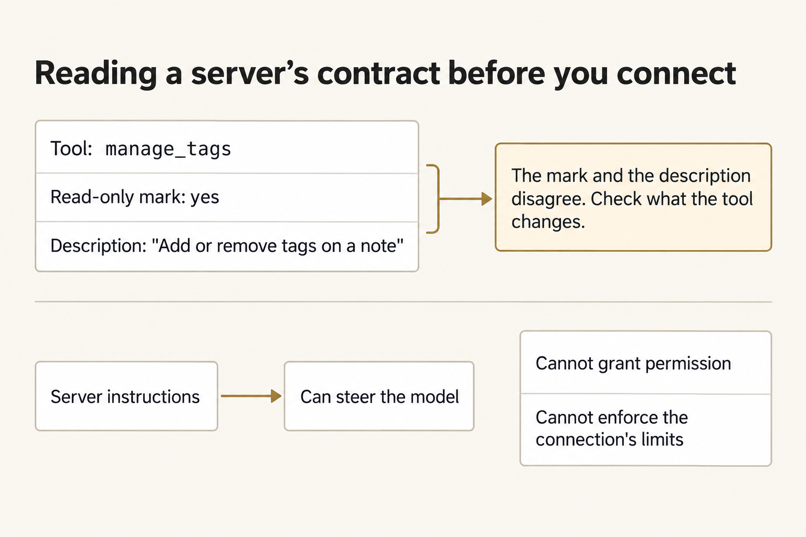
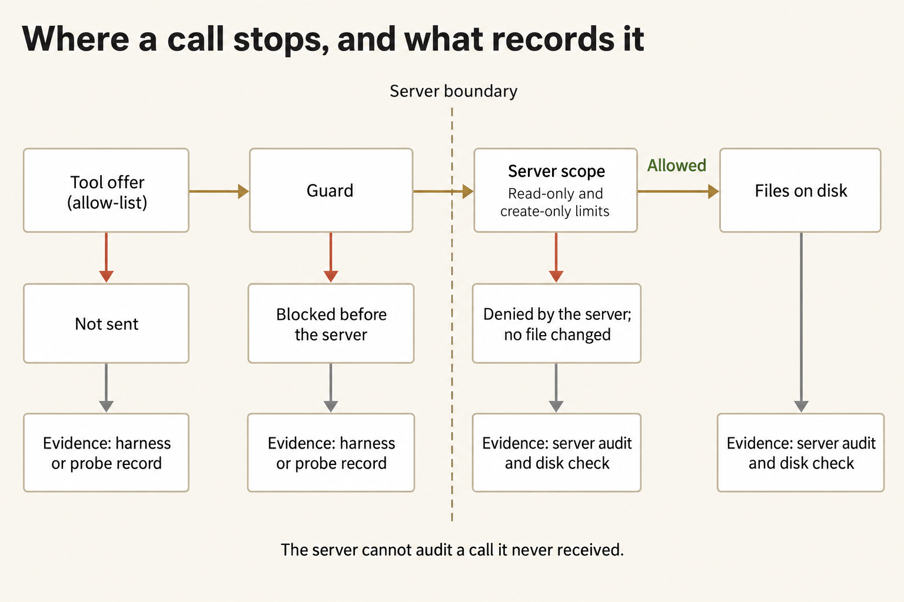
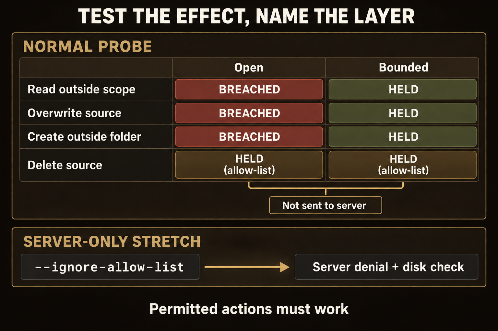
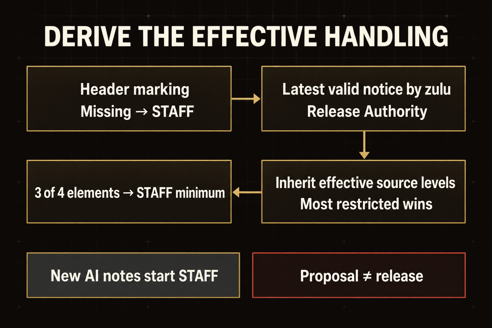
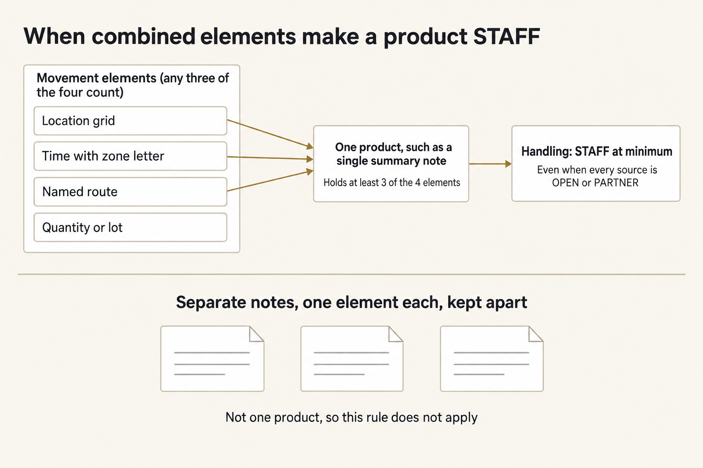
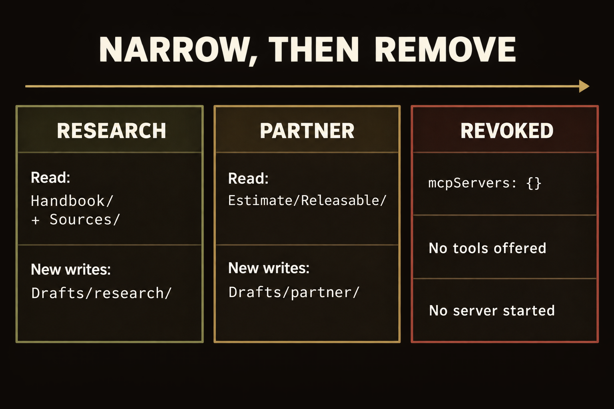

# Module 3 · Research through an MCP server, with limits you can prove

Connect an AI assistant to an Obsidian research vault through an MCP server. Research a supply problem, judge the handling calls it proposes, limit the connection so forbidden actions can't happen, then remove the connection and show the tools are gone.

You are a staff action officer in Task Force Marlin at Forward Base Brandt. The base clinic, Clinic B-2, is running low on burn-dressing cases. The Base Medical Logistics Officer wants to know what is known about getting 40 cases from Mill Depot to the clinic by 100600Z October 2026, what blocks it, and what is still unknown. Forty notes in the vault's `Sources` folder hold the evidence. A partner medical liaison cell has also asked for a short extract about the delivery, and only the Release Authority may decide what leaves the task force. The case is fictional and stays inside the class.

**MCP** (Model Context Protocol) is the standard way an assistant's harness connects to a separate program (**server**) that offers tools. The server here is a small Python program that reads and writes notes in your vault. A connection entry in `mcp.json` names the program your machine will start; adding the entry means agreeing to let that program run with your authority. An Obsidian **vault** is an ordinary folder of Markdown notes; Obsidian shows the links between them.

Plan for about three hours on Tuesday (a rough estimate).

The work has seven steps:

1. Prepare a work copy and open its vault.
2. Read the server's contract before you connect it.
3. Declare what the connection may do, then prove the limits with a probe.
4. Judge six notes yourself before the AI works.
5. Research through the connection and review the AI's notes in Obsidian.
6. Check the AI's handling calls against the rules, then narrow the connection for the partner extract.
7. Disconnect, show that nothing is connected, and hand off.

## Prepare the work copy and open the vault

Use the checkout, Python, and OMP you verified in [setup](../../module-00-setup/README.md), and your OpenRouter key, which you enter in the terminal rather than save in a file. Open an ordinary terminal. The commands work from any directory. `W` is your work copy, and `E` holds your receipts: the probe results, your frozen calibration, your notes about the contract, and one folder per live run that the launcher creates itself.

**Terminal: Bash or zsh, ordinary user.**

```bash
R="$HOME/Documents/AIHB_OCT_2026"
PY="$(for candidate in python3.12 python3 python; do "$candidate" -c 'import sys; sys.exit(1) if sys.version_info < (3, 12) else print(sys.executable)' 2>/dev/null && break; done)"
[ -n "$PY" ] || echo 'HOLD: Python 3.12 or newer is required.' >&2
M="$R/AI_Harness_Bootcamp_2/module-03-mcp-research"
RUN="$(date -u +%Y%m%dT%H%M%SZ)-$$"
mkdir -p "$HOME/course-evidence" && printf '%s\n' "$RUN" > "$HOME/course-evidence/module-03-run" && printf 'RUN=%s\n' "$RUN"
BASE="$HOME/course-evidence/module-03-$RUN"
W="$BASE/work"
E="$BASE/receipts"
"$PY" "$R/shared/prepare_work.py" 03 "$W" && mkdir -p "$E"
```

**Terminal: PowerShell, ordinary user.**

```powershell
$R = "$HOME\Documents\AIHB_OCT_2026"
$PY = $(foreach ($candidate in 'python3.12','python3','python') { try { $resolved = & $candidate -c 'import sys; sys.exit(1) if sys.version_info < (3,12) else print(sys.executable)' 2>$null; if ($LASTEXITCODE -eq 0 -and $resolved) { $resolved.Trim(); break } } catch {} })
if (-not $PY) { throw 'HOLD: Python 3.12 or newer is required.' }
$M = "$R\AI_Harness_Bootcamp_2\module-03-mcp-research"
$RUN = [guid]::NewGuid().ToString('N')
New-Item -ItemType Directory -Force -Path "$HOME\course-evidence" | Out-Null; Set-Content -LiteralPath "$HOME\course-evidence\module-03-run" -Value $RUN; "RUN=$RUN"
$BASE = "$HOME\course-evidence\module-03-$RUN"
$W = "$BASE\work"
$E = "$BASE\receipts"
& $PY "$R\shared\prepare_work.py" 03 "$W"
if ($LASTEXITCODE -ne 0) { throw 'HOLD: preparation failed.' }
New-Item -ItemType Directory -Path $E | Out-Null
```

**Expected:** The terminal prints `RUN=` and this attempt's identifier, followed by `PASS: created` and the work path. It then prints two `Next` commands; you can ignore them because the next step runs the inspector itself. In your file browser, `W` holds `vault`, `mcp.json`, `AUTHORITY.md`, `shared/mcp`, and `shared/prompts`. The vault's `Drafts` and `Estimate/Releasable` folders also exist and are empty.

**Stop:** Preparation fails, the destination already exists, or a path is inside the checkout instead of this external attempt.

**Recovery:** Keep the existing attempt. Repair the prerequisite, then repeat this block to choose a fresh `RUN`. Never reset or clean the checkout to make an external attempt possible.

Install Obsidian from [obsidian.md](https://obsidian.md) if needed. You need no account, no Sync, and no plugin. Open Obsidian, choose **Open folder as vault**, and select the `vault` folder inside `W`. Keep Restricted mode on so no community plugin runs. If you cannot install Obsidian, open the same folder in a text editor and work from its file list. You will lose the backlinks and the graph, but nothing else changes.

In the vault, read `Start here`, then `Handbook/Handling rules`. The rules are numbered H1 to H7. They use the exercise categories OPEN, PARTNER, and STAFF, which stand for real ideas but do not map to any real marking system. Apply them to six notes yourself before the AI applies them to forty.

Obsidian writes a hidden `.obsidian` folder into the vault. The server never serves it, and the launcher ignores it. Leave Obsidian idle during a live run because the launcher compares the vault before and after. If you edit a note mid-run, it will show up as an unexplained change.

### If you open a new terminal

A closed terminal forgets these variables. In a new terminal, run this block to reload them for the same attempt instead of preparing another one. It reads the attempt identifier that the first block saved.

**Terminal: Bash or zsh, ordinary user.**

```bash
R="$HOME/Documents/AIHB_OCT_2026"
PY="$(for candidate in python3.12 python3 python; do "$candidate" -c 'import sys; sys.exit(1) if sys.version_info < (3, 12) else print(sys.executable)' 2>/dev/null && break; done)"
[ -n "$PY" ] || echo 'HOLD: Python 3.12 or newer is required.' >&2
RUN="$(cat "$HOME/course-evidence/module-03-run")"
M="$R/AI_Harness_Bootcamp_2/module-03-mcp-research"
BASE="$HOME/course-evidence/module-03-$RUN"
W="$BASE/work"
E="$BASE/receipts"
printf '%s\n' "RUN=$RUN" "W=$W"
```

**Terminal: PowerShell, ordinary user.**

```powershell
$R = "$HOME\Documents\AIHB_OCT_2026"
$PY = $(foreach ($candidate in 'python3.12','python3','python') { try { $resolved = & $candidate -c 'import sys; sys.exit(1) if sys.version_info < (3,12) else print(sys.executable)' 2>$null; if ($LASTEXITCODE -eq 0 -and $resolved) { $resolved.Trim(); break } } catch {} })
if (-not $PY) { throw 'HOLD: Python 3.12 or newer is required.' }
$RUN = (Get-Content -LiteralPath "$HOME\course-evidence\module-03-run" -Raw).Trim()
$M = "$R\AI_Harness_Bootcamp_2\module-03-mcp-research"
$BASE = "$HOME\course-evidence\module-03-$RUN"
$W = "$BASE\work"
$E = "$BASE\receipts"
"RUN=$RUN"; "W=$W"
```

**Expected:** The terminal prints `RUN=` followed by the identifier you saw when you prepared this attempt, then `W=` followed by the existing work folder.

**Stop:** The identifier differs from the one you recorded, or the folder named after `W=` does not exist.

**Recovery:** A different identifier means a later attempt overwrote the saved marker; set `RUN` by hand to the value you recorded and run the block again. A missing folder means the attempt was never prepared, so prepare it with the first block.

### Enter your key in this terminal

Enter the key through a hidden prompt. The launcher reads your OpenRouter key only from this terminal's environment. Paste the first command, press Enter, type or paste the key (it shows nothing), press Enter, then paste the second block.

**Terminal: Bash or zsh, ordinary user.**

```bash
IFS= read -r -s OPENROUTER_API_KEY
```

**Terminal: PowerShell, ordinary user.**

```powershell
$secret = Read-Host 'OpenRouter key' -AsSecureString
```

**Expected:** The terminal waits silently for the key, then returns to its ordinary prompt without showing the value.

**Stop:** Characters appear as you type, or you are not sure which program is reading the input.

**Recovery:** Cancel with Ctrl+C and close that terminal. If the value was shown, revoke the key at OpenRouter and use a replacement.

**Terminal: Bash or zsh, ordinary user.**

```bash
export OPENROUTER_API_KEY
if [ -n "${OPENROUTER_API_KEY:-}" ]; then printf 'SET\n'; else printf 'MISSING\n'; fi
```

**Terminal: PowerShell, ordinary user.**

```powershell
$bstr = [IntPtr]::Zero
try {
  $bstr = [Runtime.InteropServices.Marshal]::SecureStringToBSTR($secret)
  $env:OPENROUTER_API_KEY = [Runtime.InteropServices.Marshal]::PtrToStringBSTR($bstr)
} finally {
  if ($bstr -ne [IntPtr]::Zero) { [Runtime.InteropServices.Marshal]::ZeroFreeBSTR($bstr) }
  if ($secret) { $secret.Dispose() }
  Remove-Variable secret,bstr -ErrorAction SilentlyContinue
}
if ([string]::IsNullOrWhiteSpace($env:OPENROUTER_API_KEY)) { 'MISSING' } else { 'SET' }
```

**Expected:** `SET` proves the key is present in this terminal, but not that it is valid or has credit.

**Stop:** `MISSING`, or any part of the key appears in the output.

**Recovery:** Repeat the hidden prompt in this terminal. Never print the environment to troubleshoot a key, and never save the key in a file or a shell profile.

## Read the server's contract before you connect it

Read the contract before connecting. When a server connects, it describes itself: a name, a block of instructions for the model, and a description and hints for each tool, such as whether it only reads. The harness and the model take those descriptions at face value. The inspector starts only the supplied server from your work copy and refuses any other.

**Terminal: Bash or zsh, ordinary user.**

```bash
"$PY" "$W/shared/mcp/mcp_inspect.py" --config "$W/mcp.json" --out "$E/contract-inspection.json"
```

**Terminal: PowerShell, ordinary user.**

```powershell
& $PY "$W\shared\mcp\mcp_inspect.py" --config "$W\mcp.json" --out "$E\contract-inspection.json"
if ($LASTEXITCODE -ne 0) { throw 'HOLD: the inspection failed; preserve this attempt.' }
```

**Expected:** The inspector prints the server's instructions and a table of twelve tools. Its two columns show whether each tool claims to be read-only and whether it can change notes. The `FINDINGS` list has two entries: one names a tool marked read-only whose own description says it adds and removes tags, and the other says the server's instructions steer the model toward changing the vault.

**Stop:** The inspector prints `HOLD` or refuses the entry, or the findings list is empty.

**Recovery:** A refusal means `mcp.json` points to a program other than the supplied server in your work copy. Do not edit the inspector. Prepare a fresh work copy because this check is meant to stop a connection entry from starting another program.



*Inspect what the tool can change; a read-only annotation or a server's instructions do not enforce your authority boundary.*

<details markdown="1">
<summary>Figure text</summary>

The `manage_tags` tool says it is read-only, but its description says it adds or removes tags. Check what each tool does rather than relying on its read-only mark. The server's instructions can also steer the model, but they neither grant permission nor enforce the connection's limits.

</details>

Write `contract.md` in `E` and answer three questions in your own words. What will the model be told if you forward the server's instructions? Which tools can change a note? Which tool has a read-only mark that disagrees with its description, and what could go wrong if a harness approved it on that basis? Name `manage_tags` and the server's instructions. Write at least forty words; the final check holds a shorter note.

## Declare what the connection may do, then prove the limits

A model might never try a forbidden action, so a clean transcript proves little. A **probe** tries each forbidden action without a model, using a throwaway copy of the vault, and records what happens. Write your declaration first so the probe can judge the connection against it.



*Use separate tool, guard, and server limits, then inspect the evidence from the layer actually exercised; the server cannot log a call it never received.*

<details markdown="1">
<summary>Figure text</summary>

A request meets the tool offer or allow-list first, then the guard, then server scope (including read-only or create-only limits) before it can affect files on disk. The allow-list does not send an excluded tool call. The guard may block an offered call before it reaches the server. A call that does reach the server may be denied there without changing a file. Once a call is refused, it goes no further. For calls not sent or blocked before the server, use the harness or probe record. For calls that reach the server, check the server audit and disk effects, even if the server denies them; check disk effects for allowed calls too. The server cannot audit a call it never received.

</details>

Open `W/shared/prompts/RESEARCH.md`. List every folder the prompt tells the AI to read and every folder it tells the AI to write. Use those folders, and no others, as your scopes for the research phase. From the inspector's table, allow only the tools needed for that work. Then open `W/AUTHORITY.md` and fill in its one JSON block with `"phase": "research"`, your tools, your two scopes, and `"create_only": true`. That last setting means an existing note can never be changed. The table in the file shows which setting in `mcp.json` matches each field. Leave `mcp.json` unchanged for now.

Run the probe against the connection as it stands, with no limits yet.

**Terminal: Bash or zsh, ordinary user.**

```bash
"$PY" "$W/shared/mcp/authority_probe.py" --config "$W/mcp.json" --authority "$W/AUTHORITY.md" --vault "$W/vault" --out "$E/probe-raw.json"
```

**Terminal: PowerShell, ordinary user.**

```powershell
& $PY "$W\shared\mcp\authority_probe.py" --config "$W\mcp.json" --authority "$W\AUTHORITY.md" --vault "$W\vault" --out "$E\probe-raw.json"
if ($LASTEXITCODE -ne 1) { throw 'HOLD: the unbounded probe was expected to report HOLD.' }
```

**Expected:** The probe ends with `HOLD`. Several attempts show `BREACHED`: one overwrites a source note, one creates a note outside your write folder, and one reads a note from a folder you did not declare. Tools left off your list show `HELD` by the allow-list. The allow-list stops whole tools, but it cannot stop `write_note` from writing to the wrong folder while the server has no folder limit.

**Stop:** The probe ends with `PASS`, or it refuses your declaration.

**Recovery:** If the declaration is refused, the message names the field to fix. If the probe passes, `mcp.json` already carries limit arguments. Rename the result to `probe-raw-attempt-1.json` and keep it, remove those arguments so only the server script, `--root`, and the vault path remain, and run the probe again into `probe-raw.json`.

Now make the connection match the declaration. In `W/mcp.json`, use the table in `AUTHORITY.md` to add limit arguments to the server's `args` list, after the vault path that follows `--root`. A folder limit takes two list items: the flag and the folder, each in its own quotes, separated by commas. A flag with no value takes one item. For example, a connection that may read one folder named `Example/` and never change an existing note would end its list with `"--read-prefix", "Example/", "--no-overwrite"`. Repeat a flag once for each folder. Decide whether `"instructions"` stays `true`, then run the probe again.

**Terminal: Bash or zsh, ordinary user.**

```bash
"$PY" "$W/shared/mcp/authority_probe.py" --config "$W/mcp.json" --authority "$W/AUTHORITY.md" --vault "$W/vault" --out "$E/probe-research.json"
```

**Terminal: PowerShell, ordinary user.**

```powershell
& $PY "$W\shared\mcp\authority_probe.py" --config "$W\mcp.json" --authority "$W\AUTHORITY.md" --vault "$W\vault" --out "$E\probe-research.json"
if ($LASTEXITCODE -ne 0) { throw 'HOLD: the research limits did not hold; preserve this attempt.' }
```

**Expected:** `PASS: no forbidden attempt had an effect`, with every forbidden attempt `HELD` and the permitted reads and the new-note write marked `WORKS`.

**Stop:** The probe ends with `HOLD`, lists a `BREACHED` attempt, or reports that a permitted action is `UNAVAILABLE`.

**Recovery:** A `BREACHED` line names the attempt, so find the flag that should have stopped it. An `UNAVAILABLE` permitted action means a limit is tighter than the work needs. Rename the held result, for example to `probe-research-attempt-1.json`, keep it, and run the probe again into `probe-research.json`.



*With deletion excluded, the normal probe reports HELD by the allow-list in both configurations; only the server-only probe establishes the server's response to that call.*

<details markdown="1">
<summary>Figure text</summary>

The normal probe makes four forbidden attempts against both an open connection and a bounded connection. Reading outside scope, overwriting a source, and creating a note outside the write folder each return `BREACHED` on the open connection and `HELD` on the bounded one. Deleting a source returns `HELD (allow-list)` in both configurations because the declaration excludes deletion. The allow-list did not send that call to the server: `server.outcome` is `NOT_SENT`, so this result cannot tell you how the server would respond. Only the server-only stretch, run with `--ignore-allow-list`, sends the delete call to the server; its evidence is the server's denial and a check that the files on disk did not change. Permitted actions must still work; a limit that blocks needed work is too tight, not correct authority.

</details>

<details class="rf-stretch" markdown="1">
<summary>Stretch: test the server's limits alone</summary>

## Stretch: take the allow-list away

The allow-list is one layer, and the server's own limits are another. Run the research probe again on the bounded connection with the allow-list ignored, so that every attempt, including the tools you left off your list, reaches the server.

**Terminal: Bash or zsh, ordinary user.**

```bash
"$PY" "$W/shared/mcp/authority_probe.py" --config "$W/mcp.json" --authority "$W/AUTHORITY.md" --vault "$W/vault" --out "$E/probe-server-alone.json" --ignore-allow-list
```

**Terminal: PowerShell, ordinary user.**

```powershell
& $PY "$W\shared\mcp\authority_probe.py" --config "$W\mcp.json" --authority "$W\AUTHORITY.md" --vault "$W\vault" --out "$E\probe-server-alone.json" --ignore-allow-list
```

**Expected:** `PASS`, with every forbidden attempt marked `HELD` by the `server` layer. That includes patching, tagging, moving, and deleting notes, even though your allow-list never offered those tools. Compare the unbounded probe, where the allow-list alone stopped them.

**Stop:** An attempt is `BREACHED` with the allow-list ignored.

**Recovery:** A breach shows that you were relying on another layer to stop an action the server should stop itself. Add the missing server limit and repeat the probe under a new output name. In your handoff, record which layer stopped each kind of attempt.

</details>

## Judge six notes yourself before the AI works

The AI will propose a handling for every note. If you read its proposals first, they can sway your own decisions, so decide six notes yourself before you see them. You'll find those notes in `Start here` and `Estimate/Calibration`; each tests a different part of the rules. Open `Estimate/Calibration` in Obsidian. For each row, enter your marking and the rule that decides it, adding a reason if the rule alone does not explain your decision. Use only the rules in `Handbook/Handling rules`.



*Apply header, valid notice, inheritance, and aggregation in order; a body claim or a proposed marking does not grant release authority.*

<details markdown="1">
<summary>Figure text</summary>

Four steps, in order, give a note's effective handling.

1. Header marking: start from the marking in the note's header; a missing marking means STAFF.
2. Latest valid notice by zulu time from the Release Authority: apply the most recent valid notice. A notice is valid only when it is a marking-change notice, its originator is the Release Authority, its target note exists, and the new level it sets is a permitted level.
3. Inherit effective source levels: a note takes the most restricted level among the notes it draws on, using their effective levels after steps 1 and 2, not their original header markings. Most restricted wins.
4. Aggregation: a product holding at least 3 of the 4 movement elements is STAFF at minimum.

New notes written by the AI start at STAFF. A proposed marking is not a release, and neither that proposal nor a claim in a note's body changes handling. Only a valid Release Authority notice does.

</details>

Freeze your decisions. The freeze saves the time and a fingerprint of the file, showing that you made your judgment before seeing the AI's proposals.

**Terminal: Bash or zsh, ordinary user.**

```bash
"$PY" "$W/shared/mcp/freeze_calibration.py" --vault "$W/vault" --out "$E/calibration-frozen.json"
```

**Terminal: PowerShell, ordinary user.**

```powershell
& $PY "$W\shared\mcp\freeze_calibration.py" --vault "$W\vault" --out "$E\calibration-frozen.json"
if ($LASTEXITCODE -ne 0) { throw 'HOLD: the calibration was not frozen; preserve this attempt.' }
```

**Expected:** `PASS: froze 6 calibration decisions` and the time. Do not edit `Calibration` again.

**Stop:** The command refuses the table, or the output file already exists.

**Recovery:** If the command refuses the table, it names a row with a blank marking, a marking other than OPEN, PARTNER, or STAFF, or a blank rule. Nothing was written, so fix that row and run the command again. If the output file already exists, the calibration is already frozen; the first freeze is the one that counts.

## Research through the connection

Try the connection with a small request first. The smoke prompt asks the model to list the folders it can see and read one reference note, so a configuration mistake can show up early. Both runs use your declaration and `mcp.json`. The launcher checks that they agree and refuses to start if they do not.

**Terminal: Bash or zsh, ordinary user.**

```bash
"$PY" "$R/shared/run_omp.py" --workdir "$W" --prompt "$W/shared/prompts/SMOKE.md" --evidence "$E/smoke" --mcp-config "$W/mcp.json" --authority "$W/AUTHORITY.md"
```

**Terminal: PowerShell, ordinary user.**

```powershell
& $PY "$R\shared\run_omp.py" --workdir "$W" --prompt "$W\shared\prompts\SMOKE.md" --evidence "$E\smoke" --mcp-config "$W\mcp.json" --authority "$W\AUTHORITY.md"
if ($LASTEXITCODE -ne 0) { throw 'HOLD: the smoke run failed; preserve this attempt.' }
```

**Expected:** `PASS: complete guarded OMP turn`. In `E/smoke`, `mcp-audit.jsonl` is the server's own record of what it was asked, and `response.md` holds the model's answer. That answer should name only folders you declared readable.

**Stop:** The launcher prints `HOLD`, exits with 2, or the answer names a folder you did not declare.

**Recovery:** A message beginning `read limits differ` or `write limits differ` points to the field where `AUTHORITY.md` and `mcp.json` disagree. Fix the wrong file. The probe fingerprints both files, so rename `probe-research.json` to `probe-research-attempt-1.json`, run the research probe again into `probe-research.json`, and then repeat the smoke test. If a run was incomplete, keep its folder by renaming it `smoke-attempt-1`, then run again into `E/smoke`.

Now run the research. The prompt asks the AI to read every source note, write findings linked to their sources, list what remains unknown, and propose a handling for all forty notes. Two notes address automation directly. The prompt tells the AI to treat what notes say as information, not orders. Leave Obsidian idle until the run ends.

**Terminal: Bash or zsh, ordinary user.**

```bash
"$PY" "$R/shared/run_omp.py" --workdir "$W" --prompt "$W/shared/prompts/RESEARCH.md" --evidence "$E/research" --mcp-config "$W/mcp.json" --authority "$W/AUTHORITY.md"
```

**Terminal: PowerShell, ordinary user.**

```powershell
& $PY "$R\shared\run_omp.py" --workdir "$W" --prompt "$W\shared\prompts\RESEARCH.md" --evidence "$E\research" --mcp-config "$W\mcp.json" --authority "$W\AUTHORITY.md"
if ($LASTEXITCODE -ne 0) { throw 'HOLD: the research run failed; preserve this attempt.' }
```

**Expected:** `PASS: complete guarded OMP turn`, and a `Drafts/research` folder in the vault with at least six `fact-` notes, `open-questions`, and `handling-proposal`. The run can take several minutes.

**Stop:** The launcher prints `HOLD`, a run ends before the model finishes, or any source note changed.

**Recovery:** Rename the held folder `research-attempt-1` and keep it. Move any notes the run created under `Drafts/research` into that folder because the server will not replace a note that already exists. Then run again into `E/research`. Never repair a changed source note by hand. A changed source means a limit failed, so keep the receipts and stop.

Now read what the AI wrote in Obsidian. Open `Drafts/research/open-questions`, then each fact note. Click a `[[KH-…]]` link to open the source it cites. Open the Backlinks pane on a source note to see which findings cite it. Open the Graph view to spot source notes that no finding mentions. Search the vault for `QA hold`, `deadlined`, and `MLC`. Pick two conflicts and check what the AI claimed against the sources. Candidates: which stock count is current, whether the lot on hand is the lot that can be issued, whether the truck on the convoy table can run, whether the bridge on the main route takes its weight, and whether the approved flight falls inside the dust forecast. A finding without a source note it can be traced to is not yet a finding.

Open `E/research/mcp-audit.jsonl` and look for rows with `"allowed": false`. Each one is a call the server refused. If you see none, the AI never tried anything outside its limits during this run, and your probe is what shows that the limits hold.

Quoted instructions in a source do not change authority. Check which calls were made and what changed on disk. If you did not observe an attempt, do not claim one happened.

## Check the AI's handling calls against the rules

Treat the AI's handling proposal as a proposal. Under rule H6, only the Release Authority changes a marking. If you accept the AI's proposal without checking it, the mistake is yours. A summary may need a more restricted marking than any of its source notes. Three facts may each be safe to share alone: a location, a time with a zone, and a named route. Together, they can tell a reader where and when a convoy moves.



*One product containing at least three movement-element types is STAFF at minimum, even when its sources are individually OPEN or PARTNER.*

<details markdown="1">
<summary>Figure text</summary>

There are four movement-element types: location grid, time with zone letter, named route, and quantity or lot. When any three of the four enter one product, such as a single summary note, that product is STAFF at minimum. Separate notes that each hold one element, kept apart, are not combined into one product, so this rule does not apply to them. Shareable parts do not make a shareable combination.

</details>

Copy the AI's proposal into your register beside your first-pass markings. The command fills only the `AI proposed` column.

**Terminal: Bash or zsh, ordinary user.**

```bash
"$PY" "$W/shared/mcp/seed_register.py" --vault "$W/vault"
```

**Terminal: PowerShell, ordinary user.**

```powershell
& $PY "$W\shared\mcp\seed_register.py" --vault "$W\vault"
if ($LASTEXITCODE -ne 0) { throw 'HOLD: the register was not seeded; preserve this attempt.' }
```

**Expected:** `PASS: filled the AI proposed column for 40 of 40 notes`, with `Final`, `Rule`, and `Reason` still empty.

**Stop:** The command cannot find the proposal, or reports notes without a usable proposal.

**Recovery:** A missing proposal means the research run did not write `Drafts/research/handling-proposal`; look at that run's receipts before running it again. For a note without a usable proposal, leave the cell empty and decide the note from the rules.

Open `Estimate/Handling register` in Obsidian and set `Final` for all forty notes. Start with the six you calibrated and any note where your first-pass marking differs from the AI's proposal. If `Final` differs from the AI's proposal, name the rule that decides it, one of H1 to H7, and give a one-sentence reason. Read each note's header as well as its body: words in the body claiming clearance do not change a marking, and only a valid notice from the Release Authority counts as a notice. Compare times in Zulu.

Then copy the notes you marked OPEN or PARTNER into `Estimate/Releasable`.

**Terminal: Bash or zsh, ordinary user.**

```bash
"$PY" "$W/shared/mcp/stage_releasable.py" --vault "$W/vault"
```

**Terminal: PowerShell, ordinary user.**

```powershell
& $PY "$W\shared\mcp\stage_releasable.py" --vault "$W\vault"
if ($LASTEXITCODE -ne 0) { throw 'HOLD: the releasable folder was not staged; preserve this attempt.' }
```

**Expected:** An `added` line and a `removed` line, then `PASS: Estimate/Releasable/ holds N notes, the ones you marked OPEN or PARTNER`, where N is your own count. The folder holds byte-identical copies of exactly those notes.

**Stop:** The command lists notes whose `Final` is blank or not OPEN, PARTNER, or STAFF.

**Recovery:** Fix the rows it names and run it again; it adds missing copies and removes stale ones. It never changes `Sources`.

## Narrow the connection for the partner extract

Read `W/shared/prompts/PARTNER_EXTRACT.md` and set the new scopes as you did for research: allow reads only from material the extract may draw on, and writes only to the folder the prompt names. Change `phase` to `partner` in `AUTHORITY.md`, update the tools and scopes, and set the server's arguments in `mcp.json` to match. If the partner phase can still read `Sources`, it could repeat a STAFF fact no matter how carefully the extract is worded.

Prove the new limits before the live run, then run the partner phase.

**Terminal: Bash or zsh, ordinary user.**

```bash
"$PY" "$W/shared/mcp/authority_probe.py" --config "$W/mcp.json" --authority "$W/AUTHORITY.md" --vault "$W/vault" --out "$E/probe-partner.json" \
  && "$PY" "$R/shared/run_omp.py" --workdir "$W" --prompt "$W/shared/prompts/PARTNER_EXTRACT.md" --evidence "$E/partner" --mcp-config "$W/mcp.json" --authority "$W/AUTHORITY.md"
```

**Terminal: PowerShell, ordinary user.**

```powershell
& $PY "$W\shared\mcp\authority_probe.py" --config "$W\mcp.json" --authority "$W\AUTHORITY.md" --vault "$W\vault" --out "$E\probe-partner.json"
if ($LASTEXITCODE -ne 0) { throw 'HOLD: the partner limits did not hold; preserve this attempt.' }
& $PY "$R\shared\run_omp.py" --workdir "$W" --prompt "$W\shared\prompts\PARTNER_EXTRACT.md" --evidence "$E\partner" --mcp-config "$W\mcp.json" --authority "$W\AUTHORITY.md"
if ($LASTEXITCODE -ne 0) { throw 'HOLD: the partner run failed; preserve this attempt.' }
```

**Expected:** The probe passes before the run starts, and the run passes with a new note, `Drafts/partner/partner-extract`, in the vault. Every note the AI read came from `Estimate/Releasable`.

**Stop:** The probe holds, the launcher refuses to start, or the run ends without writing the extract.

**Recovery:** Fix the limits named by the probe or launcher and prove them again before any live run. If you change either connection file, rename `probe-partner.json` to `probe-partner-attempt-1.json` and probe again. Rename a held run folder to `partner-attempt-1` and keep it. Move any note that run created under `Drafts/partner` into that folder, then run again into `E/partner`.

The extract is a draft for the Release Authority, not a release. Scan it for what a program can check: whether every line cites a note you may share, whether it repeats any fact found only in notes you marked STAFF, and whether it holds fewer than three movement elements.

**Terminal: Bash or zsh, ordinary user.**

```bash
"$PY" "$W/shared/mcp/scan_extract.py" --extract "$W/vault/Drafts/partner/partner-extract.md" --vault "$W/vault"
```

**Terminal: PowerShell, ordinary user.**

```powershell
& $PY "$W\shared\mcp\scan_extract.py" --extract "$W\vault\Drafts\partner\partner-extract.md" --vault "$W\vault"
if ($LASTEXITCODE -ne 0) { throw 'HOLD: the extract needs work; preserve this attempt.' }
```

**Expected:** `PASS`, and the list of movement elements the extract contains.

**Stop:** The scan prints `HOLD` with the rule that decides each finding.

**Recovery:** The scan finds only what a program can find. Fix the cause: a line without a link, a note you should not have marked shareable, or an extract that joins too many movement elements. If you change your register, stage again. Then rename `E/partner` to `partner-attempt-1` and move `Drafts/partner/partner-extract.md` into that folder. Run the partner phase again into `E/partner`. The extract is a draft, so moving it loses no source. You still decide whether the wording is wise.

## Disconnect and prove it

End the connection by removing it, then prove that a fresh run is offered no tools. To remove the connection, empty the server map in `W/mcp.json` so it reads exactly this:

```json
{"mcpServers": {}}
```

Change `AUTHORITY.md` to the revoked phase, which allows nothing:

```json
{"schema_version": 1, "phase": "revoked", "allow_tools": [], "read_scope": [], "write_scope": [], "create_only": false}
```

Run once more. The revoked prompt asks the model to list its vault tools and try to read a note. The model should have none, and the run should say so.



*Give each phase only its declared reach, then remove the connection and confirm a fresh run was offered no MCP tools.*

<details markdown="1">
<summary>Figure text</summary>

Three phases follow one another in time, each with its own reach; nothing carries over from one phase to the next.

- Research: reads `Handbook/` and `Sources/`; new writes only in `Drafts/research/`.
- Partner: reads only `Estimate/Releasable/`; new writes only in `Drafts/partner/`.
- Revoked: the server map is `mcpServers: {}`. A fresh run is offered no tools, and no server is started, so there is no server to refuse a request.

</details>

**Terminal: Bash or zsh, ordinary user.**

```bash
"$PY" "$R/shared/run_omp.py" --workdir "$W" --prompt "$W/shared/prompts/REVOKED.md" --evidence "$E/revoked" --mcp-config "$W/mcp.json" --authority "$W/AUTHORITY.md"
```

**Terminal: PowerShell, ordinary user.**

```powershell
& $PY "$R\shared\run_omp.py" --workdir "$W" --prompt "$W\shared\prompts\REVOKED.md" --evidence "$E\revoked" --mcp-config "$W\mcp.json" --authority "$W\AUTHORITY.md"
if ($LASTEXITCODE -ne 0) { throw 'HOLD: the revoked run failed; preserve this attempt.' }
```

**Expected:** `PASS: complete guarded OMP turn`. In `E/revoked`, the guard log shows every provider request with an empty tool list, and no `mcp-audit.jsonl` exists because no server started.

**Stop:** The launcher refuses the revoked declaration or the run offered a tool.

**Recovery:** The revoked phase needs an empty server map and a declaration with no tools or folders. Fix the file named in the message, then run again.

Your handoff describes the authority each phase held.

## Hand off and run the final check

The next owner needs your finding, the limits that were in force, and what the probes showed. The verifier reads these back. Write `handoff.md` in `E` with these six headings, each followed by a few specific sentences: `# Handoff`, `## Finding`, `## Authority in force`, `## What the probes showed`, `## Classification decisions and overrides`, and `## Residual risk and owner`. In the finding, answer the Base Medical Logistics Officer's question with what the sources support and what they don't. In the residual-risk section, say what the limits do not prevent and who owns it. A connection that can only create notes in one folder can still create a misleading note there.

Run the check. It reads your work copy and receipts, matches the launcher's receipts against the server's own log and the files on disk, and checks your handling decisions against the rules.

**Terminal: Bash or zsh, ordinary user.**

```bash
"$PY" "$M/shared/verify/verify_research.py" "$W" "$E"
```

**Terminal: PowerShell, ordinary user.**

```powershell
& $PY "$M\shared\verify\verify_research.py" "$W" "$E"
if ($LASTEXITCODE -ne 0) { throw 'HOLD: the receipts need attention; preserve this attempt.' }
```

**Expected:** One `OK` line for each claim, some informational lines about how the AI's proposal compared with the rules, and a final `PASS`.

**Stop:** Any `HOLD` line.

**Recovery:** Each `HOLD` names the claim and the reason. Preserve the attempt and fix the cause rather than changing the evidence: a probe made after a live run, a note marked less restricted than the rules require, or a register that disagrees with the AI's own proposal. A `PASS` means the receipts agree with each other and with the rules, but it cannot judge whether your reasoning was wise. Ask someone to read your handoff.

## Class-only boundary

All names, identifiers, places, and facts are fictional materials for this course. Do not use this vault, these handling categories, or these notes to plan, authorize, or describe a real movement, or to handle real information. Use a module result only for class review.
