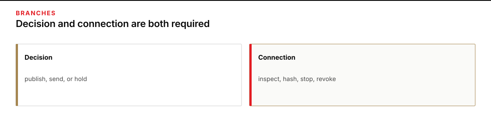

# Module 3 · Decide responsible release and operate bounded tools

Decide whether the Kiln Hold packet may be shared beyond the class, using evidence for all six responsibility concerns and their combined effect. Also operate a tool with only the authority the task needs, check its limits under untrusted instructions, and remove its declared access path.

Plan for one three-hour facilitated session, including two hours of practice. This is a planning allowance, not a measured completion guarantee.

The packet is NB-NOTE-17: forty files describing burn-dressing cases from Mill Depot to Clinic B-2 on vehicle MH-6. The files are for named class participants. The packet is not a public movement order.

## Start here

Use your existing source checks and instruction boundaries. Make two separate judgments: what sharing the evidence permits, and what operations you authorize the tool to perform.

## Two branches

The **decision** branch asks whether the packet may be published, sent to a real operations list, or used as a real dispatch. Support the decision with citations for privacy/security, copyright/intellectual property, fairness/bias, transparency/disclosure, affected-person impact and recourse, and human accountability. Consider how those concerns interact. Establish from the packet who, if anyone, could authorize sharing beyond the class; do not assume that a true operational fact grants that authority.

*Record the release decision and complete the tool branch.*

Figure text

The decision branch records whether the packet may be published or dispatched. The connection branch inspects, runs, and revokes the hash tool. Both branches are required.

The **connection** branch uses a hash tool to calculate a file fingerprint. Inspect its permissions, run it on the designated file, check whether untrusted instructions can make it exceed its authority, then disconnect and revoke its declared script path. A fingerprint identifies file bytes; it does not authorize sharing.

A careful decision does not replace the tool work.

## Class-only boundary

All names, movements, and addresses are fictional course fixtures. Do not use this packet to plan, authorize, dispatch, or describe a real movement. A module result permits only class review.
