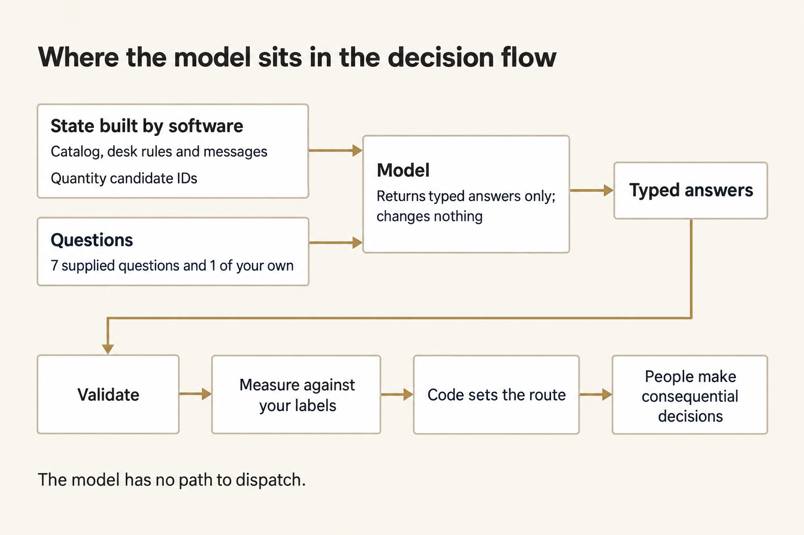
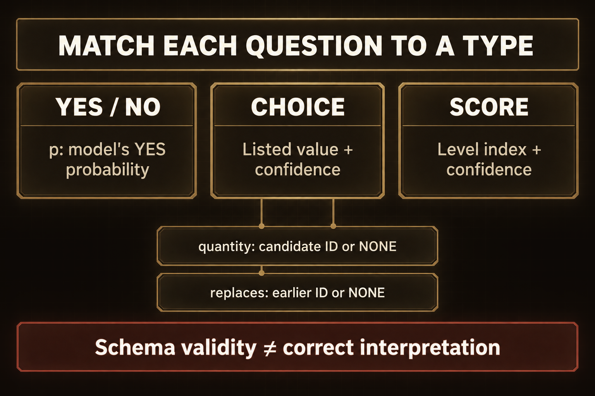
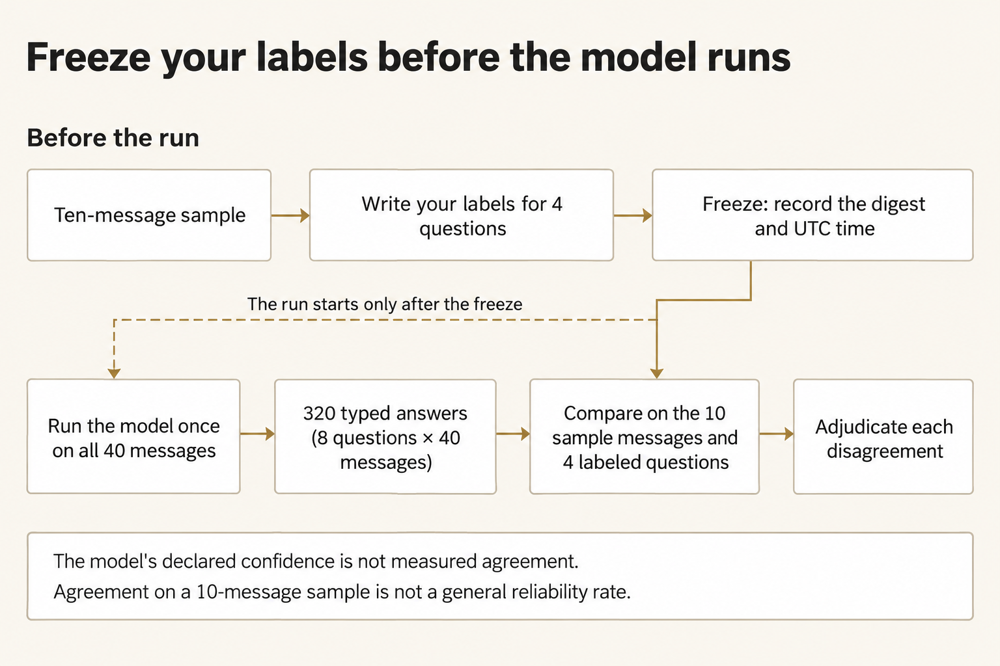
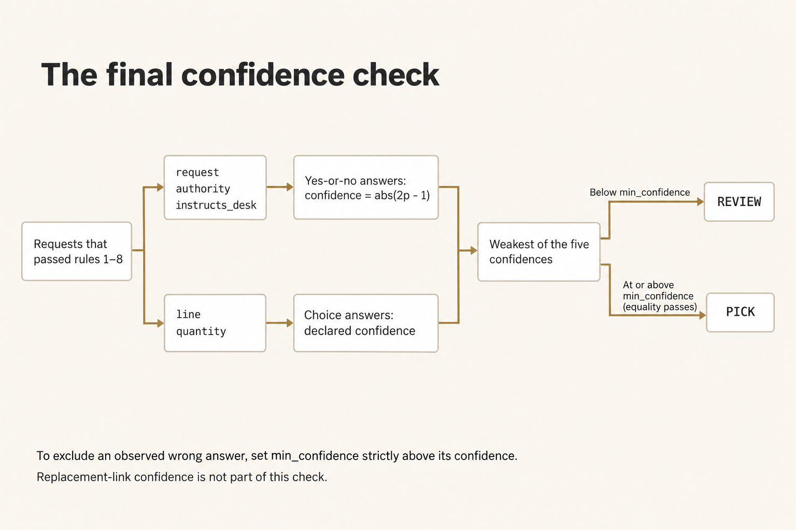
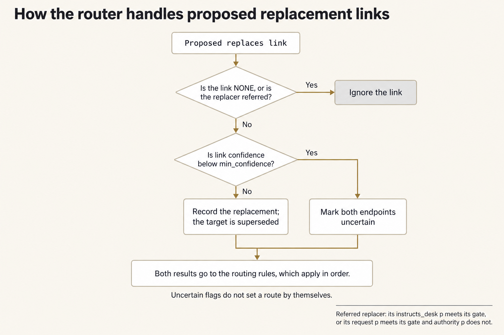
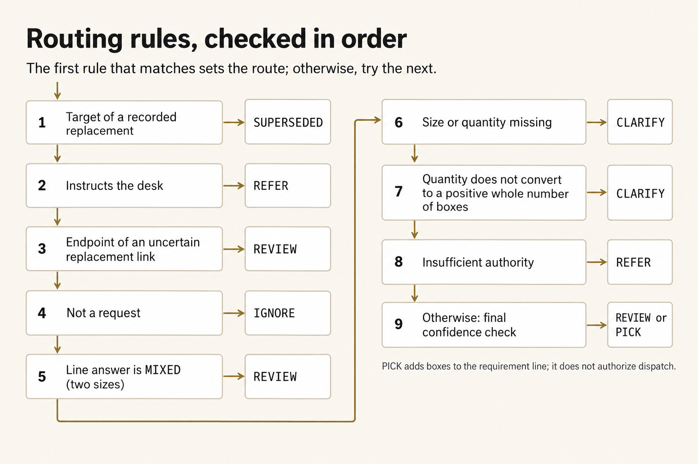

# Module 4 · Decide with typed questions

You're going to turn one shift's messages into answers a script can sort. Check those answers against your own reading before you trust them. The model answers fixed questions, and each answer has to come from a fixed list. Your script and the desk lead make the decisions.

You are the intake clerk at Ferry Depot. Chalk Line is a made-up resupply of sterile surgical gloves from Ferry Depot to Clinic K-3, on vehicle `CL-9`, leaving at 15:00. Forty messages came in during the shift: requisitions, corrections, cancellations, resends, and one note that tells the desk to treat itself as approved. The warehouse picks from the requirement line you hand it. That line says how many boxes of each size the clinic asked for, with authority. The case stays inside the class.

The packet the model sees is the glove catalog, a short copy of the desk rules, and the forty messages. Call that the state. A typed question only allows answers from a fixed list: yes or no with a probability, one choice from a list, or one step on a scale. This run is a decision function, which means the model reads that packet and sends back only those answers. It doesn't write a paragraph, and it doesn't change any file.

Plan for about two and a half hours on Tuesday. That's a rough estimate.

## Prepare the work copy

Open an ordinary terminal and run this block. It uses the checkout, Python, and OMP you already checked in [setup](../../module-00-setup/README.md), plus your OpenRouter key. You type the key into this terminal. Don't save it in a file. `W` is your work copy. `E` is where your frozen labels and the handoff go, and where the launcher makes a folder for each live run.

**Terminal: Bash or zsh, ordinary user.**

```bash
R="$HOME/Documents/AIHB_OCT_2026"
PY="$(for candidate in python3.12 python3 python; do "$candidate" -c 'import sys; sys.exit(1) if sys.version_info < (3, 12) else print(sys.executable)' 2>/dev/null && break; done)"
[ -n "$PY" ] || echo 'HOLD: Python 3.12 or newer is required.' >&2
M="$R/AI_Harness_Bootcamp_2/module-04-typed-decisions"
RUN="$(date -u +%Y%m%dT%H%M%SZ)-$$"
mkdir -p "$HOME/course-evidence" && printf '%s\n' "$RUN" > "$HOME/course-evidence/module-04-run" && printf 'RUN=%s\n' "$RUN"
BASE="$HOME/course-evidence/module-04-$RUN"
W="$BASE/work"
E="$BASE/evidence"
"$PY" "$R/shared/prepare_work.py" 04 "$W" && mkdir -p "$E"
```

**Terminal: PowerShell, ordinary user.**

```powershell
$R = "$HOME\Documents\AIHB_OCT_2026"
$PY = $(foreach ($candidate in 'python3.12','python3','python') { try { $resolved = & $candidate -c 'import sys; sys.exit(1) if sys.version_info < (3,12) else print(sys.executable)' 2>$null; if ($LASTEXITCODE -eq 0 -and $resolved) { $resolved.Trim(); break } } catch {} })
if (-not $PY) { throw 'HOLD: Python 3.12 or newer is required.' }
$M = "$R\AI_Harness_Bootcamp_2\module-04-typed-decisions"
$RUN = [guid]::NewGuid().ToString('N')
New-Item -ItemType Directory -Force -Path "$HOME\course-evidence" | Out-Null; Set-Content -LiteralPath "$HOME\course-evidence\module-04-run" -Value $RUN; "RUN=$RUN"
$BASE = "$HOME\course-evidence\module-04-$RUN"
$W = "$BASE\work"
$E = "$BASE\evidence"
& $PY "$R\shared\prepare_work.py" 04 "$W"
if ($LASTEXITCODE -ne 0) { throw 'HOLD: preparation failed.' }
New-Item -ItemType Directory -Path $E | Out-Null
```

**Expected:** The terminal prints `RUN=` with this attempt's id, and `PASS: created` with the work path. It also prints two `Next` commands. Ignore those. In your file browser, `W` contains `shared/case`, `shared/controls`, `shared/prompts`, and `scripts`.

**Stop:** Stop if preparation fails, if that folder already exists, or if the path is inside the checkout instead of this separate attempt.

**Recovery:** Keep the attempt you already have. Fix whatever was missing, then run this block again so it picks a fresh `RUN`. Don't reset or clean the checkout to force an attempt through.

Open `W/shared/case/DESK_RULES.md` in your editor and read it once. It names the catalog, who may approve a requisition, what a case is, and what each route means. Every rule the questions rely on is on that page.

### If you open a new terminal

A closed terminal forgets `W`, `E`, and the other names this block set. In a new terminal, run this block to load them again for the same attempt. Don't prepare a second one.

**Terminal: Bash or zsh, ordinary user.**

```bash
R="$HOME/Documents/AIHB_OCT_2026"
PY="$(for candidate in python3.12 python3 python; do "$candidate" -c 'import sys; sys.exit(1) if sys.version_info < (3, 12) else print(sys.executable)' 2>/dev/null && break; done)"
[ -n "$PY" ] || echo 'HOLD: Python 3.12 or newer is required.' >&2
RUN="$(cat "$HOME/course-evidence/module-04-run")"
M="$R/AI_Harness_Bootcamp_2/module-04-typed-decisions"
BASE="$HOME/course-evidence/module-04-$RUN"
W="$BASE/work"
E="$BASE/evidence"
printf '%s\n' "RUN=$RUN" "W=$W"
```

**Terminal: PowerShell, ordinary user.**

```powershell
$R = "$HOME\Documents\AIHB_OCT_2026"
$PY = $(foreach ($candidate in 'python3.12','python3','python') { try { $resolved = & $candidate -c 'import sys; sys.exit(1) if sys.version_info < (3,12) else print(sys.executable)' 2>$null; if ($LASTEXITCODE -eq 0 -and $resolved) { $resolved.Trim(); break } } catch {} })
if (-not $PY) { throw 'HOLD: Python 3.12 or newer is required.' }
$RUN = (Get-Content -LiteralPath "$HOME\course-evidence\module-04-run" -Raw).Trim()
$M = "$R\AI_Harness_Bootcamp_2\module-04-typed-decisions"
$BASE = "$HOME\course-evidence\module-04-$RUN"
$W = "$BASE\work"
$E = "$BASE\evidence"
"RUN=$RUN"; "W=$W"
```

**Expected:** The terminal prints `RUN=` and then the id you saw when you prepared this attempt, then `W=` and the work folder you already have.

**Stop:** Stop if the id is different from the one you wrote down, or if the folder after `W=` does not exist.

**Recovery:** Open `$HOME/course-evidence/module-04-run` in your editor, set `RUN` by hand to the value you wrote down, and run the block again. If the folder is missing, this attempt was never prepared, so go back and run the first block.

### Enter your key in this terminal

The launcher reads your OpenRouter key only from this terminal. A new terminal starts without it. You'll enter the key at a hidden prompt, so the commands you run here can see it. Paste the first command by itself and press Enter. At the prompt, type or paste the key. Nothing will appear. Press Enter again, then paste the second block.

**Terminal: Bash or zsh, ordinary user.**

```bash
IFS= read -r -s OPENROUTER_API_KEY
```

**Terminal: PowerShell, ordinary user.**

```powershell
$secret = Read-Host 'OpenRouter key' -AsSecureString
```

**Expected:** The terminal waits quietly for the key, then comes back to its ordinary prompt without showing the value.

**Stop:** Stop if characters appear as you type, or if you aren't sure which program is reading what you type.

**Recovery:** Cancel with Ctrl+C and close that terminal. If the key was shown, revoke it at OpenRouter and use a replacement.

**Terminal: Bash or zsh, ordinary user.**

```bash
export OPENROUTER_API_KEY
if [ -n "${OPENROUTER_API_KEY:-}" ]; then printf 'SET\n'; else printf 'MISSING\n'; fi
```

**Terminal: PowerShell, ordinary user.**

```powershell
$bstr = [IntPtr]::Zero
try {
  $bstr = [Runtime.InteropServices.Marshal]::SecureStringToBSTR($secret)
  $env:OPENROUTER_API_KEY = [Runtime.InteropServices.Marshal]::PtrToStringBSTR($bstr)
} finally {
  if ($bstr -ne [IntPtr]::Zero) { [Runtime.InteropServices.Marshal]::ZeroFreeBSTR($bstr) }
  if ($secret) { $secret.Dispose() }
  Remove-Variable secret,bstr -ErrorAction SilentlyContinue
}
if ([string]::IsNullOrWhiteSpace($env:OPENROUTER_API_KEY)) { 'MISSING' } else { 'SET' }
```

**Expected:** `SET` means the key is present in this terminal. It can't tell you whether the key is valid or has credit.

**Stop:** Stop on `MISSING`, or if any part of the key appears in the output.

**Recovery:** Repeat the hidden prompt in this terminal. Don't print the environment to troubleshoot a key, and don't save the key in a file or a shell profile.

## Build the state and read the questions

Run the builder. It makes the packet the model will see. It copies the catalog and the desk rules, and it lists the forty messages in the order they arrived. In each message, it finds any number followed by more words in the same sentence, and it saves that number with those words. Call that saved pair a quantity candidate. The words one through ten count as numbers. Later, the model picks one of those candidates. It doesn't type a number of its own.



*The script gives the model the packet and the answer choices. The model sends back answers from those choices. The script checks and routes them, and people still make the decisions that matter.*

<details markdown="1">
<summary>Figure text</summary>

The script gives the model a packet made from the catalog, the rules, and the messages, including the candidate ids. It also gives seven supplied questions plus the one you write. The model sends back only answers from the fixed lists, and it doesn't write any file. After that you check the answers and compare them with your labels. The script routes the messages. People make the decisions that matter. Nothing the model says goes straight to dispatch.

</details>

**Terminal: Bash or zsh, ordinary user.**

```bash
"$PY" "$W/scripts/build_state.py" "$W"
```

**Terminal: PowerShell, ordinary user.**

```powershell
& $PY "$W\scripts\build_state.py" "$W"
```

**Expected:** `PASS: state.json holds 40 messages and 68 quantity candidates`, then the path of `out/state.json`.

**Stop:** Stop on a line starting `HOLD:`, or if the message count or the candidate count is different.

**Recovery:** The case files in `W/shared/case` changed, or they aren't complete. Prepare a fresh attempt from the checkout. Don't edit the case.

Open `W/out/state.json` and `W/shared/controls/questions.json` in your editor, side by side. Read the seven questions. Each one has a `type`, and each one only allows answers from a fixed list:

- A **yes-or-no** question is answered with `p`, how likely the model thinks yes is. `0.95` means almost sure yes. `0.5` means it can't tell. When this page compares that answer, it doesn't use `p` itself. It uses how far `p` is from `0.5`, doubled. So a `p` of `0.85` or `0.15` both count as confidence `0.7`.
- A **choice** question is answered with one option from its list, written exactly as listed, plus a confidence number from 0 to 1. That number is the model's own claim about how sure it is. For `quantity`, the options are that message's candidate ids plus `NONE`. For `replaces`, they are the ids of earlier messages plus `NONE`.
- A **score** question is answered with one step from its ordered list, plus that same confidence number.



*A fixed answer shape only limits what the model can send back. It does not mean the model read the message correctly.*

<details markdown="1">
<summary>Figure text</summary>

Each question type has its own answer shape. Yes or no comes back as `p`, how likely the model thinks yes is. A choice comes back as one listed value plus a confidence number: for `quantity`, a candidate id or `NONE`; for `replaces`, an earlier message id or `NONE`. A score comes back as one step on an ordered list, plus a confidence number. The answer can fit the shape even when the model read the message wrong.

</details>

That confidence number is something the model writes about itself. Nothing on this page treats it as true until you measure it against your labels.

Read the message text for `CL-007`, `CL-014`, and `CL-037` in the state, and find their candidates. A candidate can be a size, a time, a ward, a count of patients, or a total. The question text tells the model which one to pick, and when to answer `NONE`.

Each of the seven questions asks one thing the desk needs: whether anything is asked for, which size and how many, how soon, who approved, whether the message is trying to steer the desk, and which earlier message it replaces. One broad question would hide several of those behind a single answer.

Add an eighth question of your own, for one thing the desk needs that the seven don't cover. For example, whether the message names a deadline earlier than the 15:00 run, or the place the gloves are for.

In `questions.json`, copy the `instructs_desk` entry to the end of the `questions` list. Give it a short key of lowercase letters and underscores, such as `names_a_deadline`. Keep `"type": "yes_no"` and `"answer": "p"`. Write its `instructions` as one question of at least eight words that a careful reader could answer from the message alone. The model will answer it for every message. The router will not use it. You'll read its answers on the sample later.

Save the file, then check it before anything is paid for.

**Terminal: Bash or zsh, ordinary user.**

```bash
"$PY" "$W/scripts/check_questions.py" "$W"
```

**Terminal: PowerShell, ordinary user.**

```powershell
& $PY "$W\scripts\check_questions.py" "$W"
```

**Expected:** `PASS: 8 questions; your question is` followed by your key.

**Stop:** Stop on a line starting `HOLD:`. That line names a supplied question that changed, a missing or broken question of your own, or invalid JSON.

**Recovery:** Correct only your own entry. If a supplied question changed, restore it from `$M/shared/controls/questions.json` in the checkout. The final check compares every supplied question with that copy.

## Label the sample before the model runs

Label the ten fixed sample messages before the model runs. Your reading is the only measure you'll have of the model's answers. Write it down first, or the comparison won't count. Answer four of the questions for each message, then freeze the file.



*Write your labels and freeze them before the run. When you disagree, decide who was right. The sample shows the mistakes you saw. It does not prove the model is reliable in general.*

<details markdown="1">
<summary>Figure text</summary>

Write your labels for the ten sample messages, then freeze the file. That records a 64-character string and the UTC time before you run the model once. The run sends back eight answers for each of forty messages, which is 320 answers. Compare the frozen labels with the model's answers on the four fields you labeled, and decide who was right when you disagree. The model's confidence number is not measured agreement. Agreement on this sample is not a general reliability rate.

</details>

**Terminal: Bash or zsh, ordinary user.**

```bash
"$PY" "$W/scripts/label_template.py" "$W"
```

**Terminal: PowerShell, ordinary user.**

```powershell
& $PY "$W\scripts\label_template.py" "$W"
```

**Expected:** `wrote 10 sample entries`, then the path of `out/labels.json`.

**Stop:** Stop on a line starting `HOLD:`, or if the file already exists.

**Recovery:** If the file is already there from an earlier try in this folder, keep it and continue. The freeze below records whichever labels you finish.

Open `W/out/labels.json` in your editor. Each entry shows a message, its sender, and its candidates, then four fields holding `?`. Replace every `?`. Use `W/shared/case/DESK_RULES.md` and the question text as your rules:

- `request`: `yes` or `no`. Does the message ask Ferry Depot to send gloves to Clinic K-3?
- `line`: `GL-65`, `GL-70`, `GL-75`, `GL-80`, `UNSTATED`, `MIXED`, or `NONE`.
- `quantity`: the candidate id that states the requested quantity, such as `q2`, or `NONE`.
- `authority`: `yes` or `no`. Is the message from the administrative officer, and does it either say approved or carry a `K3-REQ` number? Both have to be true.

Judge each message by its own words. Don't look ahead to what the model might say. It hasn't answered yet. Save the file, then freeze it.

**Terminal: Bash or zsh, ordinary user.**

```bash
"$PY" "$W/scripts/freeze_labels.py" "$W" "$E"
```

**Terminal: PowerShell, ordinary user.**

```powershell
& $PY "$W\scripts\freeze_labels.py" "$W" "$E"
```

**Expected:** `LABELS FROZEN` followed by a 64-character string. `E/labels.sha256` now records that string and the UTC time.

**Stop:** Stop on `HOLD:` naming a field that is still `?`, or a value outside its answer list, or `HOLD: labels were already frozen in this evidence folder; keep that freeze`.

**Recovery:** Fill in or correct the named field and freeze again. If a freeze already exists in `E`, it stands. A label you change after freezing will fail the final check, so start a fresh attempt instead.

## Run the decision function once

Run it once. In one paid call, about two to four minutes, the model answers all eight questions for all forty messages. That's 320 answers. The launcher sends the contract as the saved instruction, and it records that the model received the contract before the first request to the provider. The run only reads. The model reads the state and the questions, and it writes nothing.

**Terminal: Bash or zsh, ordinary user.**

```bash
"$PY" "$R/shared/run_omp.py" --workdir "$W" --prompt "$W/shared/prompts/DECIDE.md" --evidence "$E/decide-1" --instruction "$W/shared/controls/CONTRACT.md"; printf 'EXIT=%s\n' "$?"
```

**Terminal: PowerShell, ordinary user.**

```powershell
& $PY "$R\shared\run_omp.py" --workdir "$W" --prompt "$W\shared\prompts\DECIDE.md" --evidence "$E\decide-1" --instruction "$W\shared\controls\CONTRACT.md"; Write-Output "EXIT=$LASTEXITCODE"
```

**Expected:** The last two lines are `PASS: complete guarded OMP turn; module content still requires its own check` and `EXIT=0`. `E/decide-1` now holds `policy.json`, `events.jsonl`, `guard.jsonl`, `snapshots.json`, `response.md`, and `result.json`. The reply itself is in `response.md`.

**Stop:** Stop on `EXIT=2` with a `HOLD:` line about the key, the pinned OMP version, or an existing evidence folder. Stop on `EXIT=1` with a `HOLD:` line about the receipts. Stop if there is no output for more than six minutes.

**Recovery:** With `EXIT=2`, nothing ran. Restore the named prerequisite, then run again with the same evidence name if no folder was created, or with `decide-2` if one was. With `EXIT=1`, a run happened, but its receipts are held. Keep `E/decide-1` unchanged, read the `HOLD:` reason, run again into `E/decide-2`, and check `E/decide-2` instead of `E/decide-1` in the next step. Don't retry a run quietly, and don't delete it.

Open `E/decide-1/response.md` in your editor. If the contract held, you'll see one JSON document and nothing else: no greeting, and no explanation. Don't edit the file, whatever it contains. The next step reads it as it is. Then open `E/decide-1/policy.json` and confirm `"profile": "read"` and a `tools` list holding only `course_read`. In `E/decide-1/guard.jsonl`, find the two `executed` lines for `out/state.json` and `shared/controls/questions.json`. That receipt shows the run read what you built and wrote nothing.

## Validate every typed answer

A reply that looks like JSON is not yet a set of answers you can use. The checker confirms that the launcher recorded `PASS`. Then it checks every message and every question against the question set.

It checks that the forty ids are in order, with no extra keys, every probability between 0 and 1, every choice inside its list, every candidate inside that message, and every replaced message earlier than the one that replaces it.

One broken answer holds the whole reply. A routing table built on a half-checked reply would hide where it went wrong.

**Terminal: Bash or zsh, ordinary user.**

```bash
"$PY" "$W/scripts/validate_answers.py" "$W" "$E/decide-1" "$W/out/answers-1.json"
```

**Terminal: PowerShell, ordinary user.**

```powershell
& $PY "$W\scripts\validate_answers.py" "$W" "$E\decide-1" "$W\out\answers-1.json"
```

**Expected:** `PASS: 40 messages, 320 typed answers, 0 violations`, then the path of `out/answers-1.json`. A line starting `note:` means the model wrapped the document in a code fence. The document inside it was accepted.

**Stop:** Stop on `HOLD:` naming a held launcher run, or listing problems such as a choice outside its list, a missing message, or prose around the document.

**Recovery:** Keep `E/decide-1` and the HOLD line. They record what happened. Run the decision function again into `E/decide-2`, check that receipt into `out/answers-2.json`, and use `answers-2.json` wherever the rest of this page says `answers-1.json`. Write in the handoff that the first reply was held, and why. Don't edit a reply to make it pass.

## Measure the answers against your labels

Agreement between your frozen labels and the model's answers is the only evidence you have about those answers. The comparison counts agreements for each question. It prints every disagreement with the message text and the confidence number the model wrote on that answer. It also lists the model's answers to your own question on the ten sample messages, so you can judge them against the text.

**Terminal: Bash or zsh, ordinary user.**

```bash
"$PY" "$W/scripts/compare_labels.py" "$W" "$W/out/answers-1.json" "$W/out/agreement-1.json"
```

**Terminal: PowerShell, ordinary user.**

```powershell
& $PY "$W\scripts\compare_labels.py" "$W" "$W\out\answers-1.json" "$W\out\agreement-1.json"
```

**Expected:** A four-row table of agreements and disagreements, one block per disagreement, your question's answer for each of the ten sample messages, then `AGREEMENT 4 questions, N disagreements, highest declared confidence among disagreements X`, where N and X are what was measured, then the path of `out/agreement-1.json`.

**Stop:** Stop on a line starting `HOLD:`, or a table with fewer than four rows.

**Recovery:** The labels file or the answers file was changed after it was written. Compare the files named in the HOLD line with their frozen records. Start a fresh attempt if either was edited.

For each disagreement, open the message in the state and decide who read it correctly: you, the model, or neither. Write one line per disagreement in `E/adjudication.md`: the message id, the question, who was right, and the rule in `DESK_RULES.md` that decides it. If the model was right, that corrects your label. It is not a reason to change the label file. The frozen file stays as it was.

Then read the last line again. If any disagreement where the model was wrong carried a confidence number at or above `0.7`, that number did not protect you. A gate at `0.7` would have let that answer through. Note the highest such value. The next step uses it.



*Only a request that is still usable and authorized reaches this last gate. A gate equal to a wrong answer's confidence lets that answer through.*

<details markdown="1">
<summary>Figure text</summary>

After the earlier checks, only a request that is still usable and authorized reaches this last one. For `request`, `authority`, and `instructs_desk`, the confidence number is how far `p` is from `0.5`, doubled, which is `abs(2p - 1)`. For `line` and `quantity`, use the confidence number on the typed answer. The weakest of those five decides the route: below `min_confidence` is `REVIEW`, and at or above it is `PICK`. An equal number gets through. The confidence on a replacement link is handled earlier, and it does not enter this five-answer minimum. To keep out a wrong answer that reaches this check, the gate has to be strictly higher than that answer's confidence. If you saw no wrong answers, you have no observed maximum. That is not proof the model is reliable. A gate can't go above 1, so a wrong answer with confidence 1 can't be kept out by this gate alone.

</details>

## Set the gates and route the pile

The supplied script sets each route. A gate is a cutoff you set in `gates.json`. The script compares an answer with that gate, and the first matching rule sets the route. Before those rules, the script builds the replacement links. It leaves out any link that says `NONE`, and it leaves out a later message that itself has to go to a person. That later message has to go to a person in either of two cases: its `instructs_desk` probability meets its gate, or its `request` probability meets its gate while its `authority` probability does not.



*A message that has to go to a person cannot replace another message. An uncertain link marks both messages for the later checks, and the earlier rules still win.*

<details markdown="1">
<summary>Figure text</summary>

Before routing, the script looks at each proposed `replaces` link. It ignores the link if it is `NONE`, or if the later message has to go to a person. That later message has to go to a person when its `instructs_desk` probability meets its gate, or when its `request` probability meets its gate while its `authority` probability does not. For the links that remain, a link confidence below `min_confidence` marks both messages as uncertain. Otherwise the script records the replacement, and the earlier message is replaced. An uncertain mark does not set a route by itself. In the routing order, a valid replacement puts the earlier message in `SUPERSEDED` before an uncertain-link `REVIEW`. A message whose `instructs_desk` probability meets its gate goes to `REFER` before an uncertain-link `REVIEW`.

</details>

1. A message replaced by a later message that does not itself have to go to a person, when that link's confidence meets `min_confidence`, is `SUPERSEDED`.
2. Otherwise, a message whose `instructs_desk` probability meets its gate is `REFER`.
3. Otherwise, either message in a replacement link below `min_confidence` is `REVIEW`.
4. Otherwise, a message whose `request` probability is below its gate is `IGNORE`.
5. Otherwise, a request with `MIXED` sizes is `REVIEW`.
6. Otherwise, a request with line `UNSTATED` or `NONE`, or quantity `NONE`, is `CLARIFY`.
7. Otherwise, a chosen quantity that can't be turned from boxes or cases into a positive whole number of boxes is `CLARIFY`.
8. Otherwise, a request whose `authority` probability is below its gate is `REFER`.
9. Otherwise, the weakest confidence across `request`, `line`, `quantity`, `authority`, and `instructs_desk` decides the last route. Below `min_confidence` is `REVIEW`. At or above it is `PICK`, and the boxes join the requirement line.



*The script checks the rules in this order. An earlier match wins. Only a request that is still usable and authorized reaches the last confidence check.*

<details markdown="1">
<summary>Figure text</summary>

Nine rules are checked in order for each message. The first rule that matches sets the route. A message that doesn't match moves on to the next rule.

1. A replaced message is `SUPERSEDED`.
2. A message telling the desk what to do, where the `instructs_desk` probability is at or above its gate, is `REFER`.
3. Either message in an uncertain replacement link is `REVIEW`.
4. A message that is not a request, where the `request` probability is below its gate, is `IGNORE`.
5. A request with `MIXED` size is `REVIEW`.
6. A request with a missing size or quantity, where the line is `UNSTATED` or `NONE` or the quantity is `NONE`, is `CLARIFY`.
7. A request whose converted box count is not usable is `CLARIFY`. The chosen candidate has to start with a number followed by a box or case unit. Cases convert at ten boxes each, and the box count has to be positive and whole. The case number itself doesn't have to be whole if the box count is.
8. A request without enough authority, where the `authority` probability is below its gate, is `REFER`.
9. Otherwise the request goes to the last confidence check, which routes it to `REVIEW` or `PICK`.

`PICK` puts the boxes on the requirement line. It does not release stock, and it does not authorize dispatch.

</details>

Open `W/shared/controls/gates.json` in your editor. Set `min_confidence` from what you measured. The script sends a message to `REVIEW` when its weakest confidence falls below that gate. To keep out a wrong answer that reaches this last check, set `min_confidence` strictly higher than that answer's confidence. If the two numbers are equal, the answer gets through. A wrong answer at confidence 1 can't be kept out by this gate alone. Write that limit down. Don't treat `1.0` as a switch that means you trust nothing. If you saw no wrong answers, you don't have a highest-wrong number. The sample still can't show that the model is reliable in general. Leave `request`, `authority`, and `instructs_desk` at `0.5` unless a disagreement gave you a reason to move one. Save the file, then route.

**Terminal: Bash or zsh, ordinary user.**

```bash
"$PY" "$W/scripts/route.py" "$W" "$W/out/answers-1.json" 1
```

**Terminal: PowerShell, ordinary user.**

```powershell
& $PY "$W\scripts\route.py" "$W" "$W\out\answers-1.json" 1
```

**Expected:** The gates you set, a table of boxes per catalog line with the messages that supplied them, the `REFER`, `REVIEW`, and `CLARIFY` queues, then `ROUTED 40 messages:` with a count for each route and `requirement N boxes`, then the paths of `out/routing-1.csv` and `out/requirement-1.json`.

**Stop:** Stop on a line starting `HOLD:`, or a `PICK` count of zero.

**Recovery:** A `HOLD:` means a gate is outside 0 to 1, or `gates.json` contains an unexpected key. Correct the file and route again as attempt `2`. If the `PICK` count is zero with gates at `1.0`, that follows from the gates you set. Lower `min_confidence` only if your measurement supports it.

Open `W/out/routing-1.csv`. Every message has a route and a reason. If you change a gate after reading it, route again with the next attempt number. The final check reads the highest-numbered attempt and recomputes it from the gates on disk.

## Decide the queue and write the handoff

The script doesn't make the decisions that belong to people. The `REFER` queue holds messages that lack authority, or that try to tell the desk what to do. The `REVIEW` queue holds answers the model could not type cleanly, or that it gave with low confidence. The `CLARIFY` queue holds requests the clinic has to finish. Read each queued message in the state and decide what the desk does with it. One queued message changes who may approve. The desk lead makes that decision. Record it in the handoff as the lead's, not yours.

Then write `E/handoff.md` with these six headings. After each heading, write complete sentences or a table:

```markdown
# Chalk Line handoff

## Requirement line
(boxes per catalog line for the 15:00 run, the messages each count rests on, and the gates in force)

## Review queue decisions
(one line per REFER, REVIEW, and CLARIFY message: the id, what it says, what the desk does, and who decides)

## Agreement and gates
(how often you and the model agreed on the sample, each disagreement and who was right, the one thing each labeled question asks, what your own question showed on the sample, and why the gates are set where they are)

## Limits
(the confidence number is the model's claim about itself; what the ten-message sample can and cannot show; what a second run would add)

## Decision
(write exactly one of READY FOR SIGNATURE or HOLD, then the condition that would change it, without repeating either phrase: for example, this changes if the desk lead rejects the delegation)

## Next owner
(who signs the requirement line, and what they read first)
```

**Expected:** The handoff names every message in the three queues, states one decision, and keeps the model's answers separate from the desk's decisions.

**Stop:** Stop if a queued message is missing from the handoff, or if the decision reads as if the model approved the requisitions.

**Recovery:** Open `routing-1.csv`, list the `REFER`, `REVIEW`, and `CLARIFY` ids, and add the missing ones before the final check.

## Run the final check

The final check compares the state with the case. It checks the labels and the time you froze them, and it checks each run's receipts and that the run was read-only. It also compares the typed answers with the replies, the agreement file with the frozen labels, the routing with the gates on disk, and the handoff with the queues. It confirms that the files agree with each other. It does not decide whether the model's answers are right. That judgment comes from your labels and your reading.

**Terminal: Bash or zsh, ordinary user.**

```bash
"$PY" "$M/shared/verify/verify_decisions.py" "$W" "$E"
```

**Terminal: PowerShell, ordinary user.**

```powershell
& $PY "$M\shared\verify\verify_decisions.py" "$W" "$E"
```

**Expected:** Six lines starting `PASS state`, `PASS labels`, `PASS answers`, `PASS agreement`, `PASS routing`, and `PASS handoff`, then `PASS: receipts, typed answers, frozen labels, gates, routing, and handoff agree; the answers' meaning is yours to judge`.

**Stop:** Stop on any line starting `HOLD`, followed by `HOLD: N checks held`.

**Recovery:** Each `HOLD` line names the file and the cause. If a label changed, a reply was edited, or the gates changed after the last routing, route again or start a fresh attempt. Don't repair these by editing the evidence.

## Stretch: measure stability across a second run

<details class="rf-stretch" markdown="1">
<summary>Optional stretch: run it again and measure stability</summary>

An answer that changes between two runs of the same packet is not a fact about the message. Run the decision function a second time into the next unused folder, `E/decide-2` if your first run passed. Check the reply into the matching `out/answers-N.json`, then compare your two checked answer files, question by question. If your first run was held and `decide-2` already exists, use `decide-3` and `answers-3.json` below.

**Terminal: Bash or zsh, ordinary user.**

```bash
"$PY" "$R/shared/run_omp.py" --workdir "$W" --prompt "$W/shared/prompts/DECIDE.md" --evidence "$E/decide-2" --instruction "$W/shared/controls/CONTRACT.md"; printf 'EXIT=%s\n' "$?"
```

**Terminal: PowerShell, ordinary user.**

```powershell
& $PY "$R\shared\run_omp.py" --workdir "$W" --prompt "$W\shared\prompts\DECIDE.md" --evidence "$E\decide-2" --instruction "$W\shared\controls\CONTRACT.md"; Write-Output "EXIT=$LASTEXITCODE"
```

**Expected:** `PASS: complete guarded OMP turn; module content still requires its own check` and `EXIT=0`, with a new `E/decide-2` folder.

**Stop:** Stop on `EXIT=2` or `EXIT=1` with a `HOLD:` line.

**Recovery:** Same as the first run: nothing is retried quietly, and a held run keeps its folder.

**Terminal: Bash or zsh, ordinary user.**

```bash
"$PY" "$W/scripts/validate_answers.py" "$W" "$E/decide-2" "$W/out/answers-2.json" && "$PY" "$W/scripts/compare_runs.py" "$W/out/answers-1.json" "$W/out/answers-2.json"
```

**Terminal: PowerShell, ordinary user.**

```powershell
& $PY "$W\scripts\validate_answers.py" "$W" "$E\decide-2" "$W\out\answers-2.json"
if ($LASTEXITCODE -ne 0) { throw 'HOLD: the second reply did not validate; keep it and record the cause.' }
& $PY "$W\scripts\compare_runs.py" "$W\out\answers-1.json" "$W\out\answers-2.json"
```

**Expected:** `PASS: 40 messages, 320 typed answers, 0 violations`, then an eight-row table of flipped answers per question, then `STABILITY 40 messages, 8 questions, N flipped answers out of 320`.

**Stop:** Stop if the second reply is held, or if the two runs do not cover the same messages.

**Recovery:** Keep both receipts. A held second reply also tells you something about stability. Record it in the handoff's Limits section.

Add the flip count to the Limits section of the handoff. An answer that flipped, and that carried a high confidence number in both runs, is the strongest evidence here that the confidence number is not a measurement.

</details>

## Before you stop

Check that `E` holds `labels.sha256`, `decide-1`, `adjudication.md`, and `handoff.md`. Check that `W/out` holds `state.json`, `labels.json`, a validated `answers-N.json`, its `agreement-N.json`, and the final `routing-N.csv` and `requirement-N.json` pair. The case files, the contract, the prompt, and the seven supplied questions still have to match the checkout. The final check compares them. Keep work and evidence outside the checkout. Looking at the model's answers later does not change the frozen labels. Changing a gate later means making a new routing attempt.

## Class-only boundary

All names, identifiers, places, and facts are made up for class. The requirement line is for class use only. It does not dispatch `CL-9`, release stock, or change who may approve a requisition. A `PASS` from the final check means the files agree with each other. It does not mean the clinic's need was read correctly.
