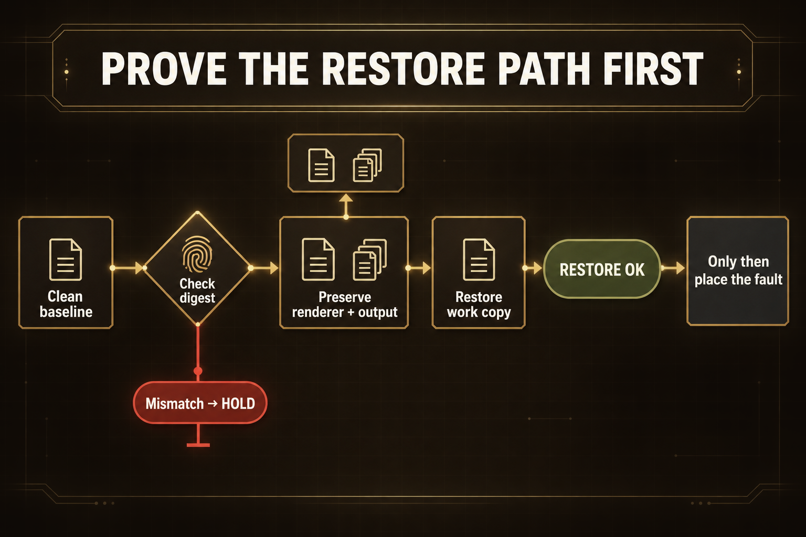
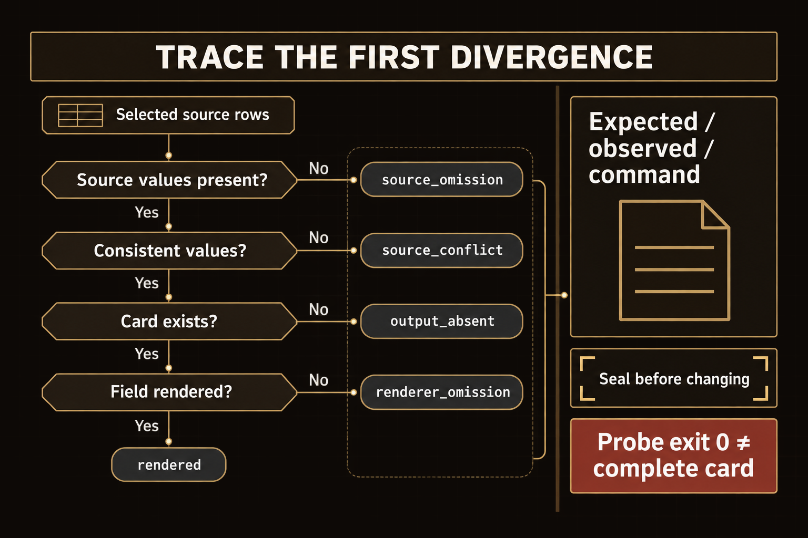
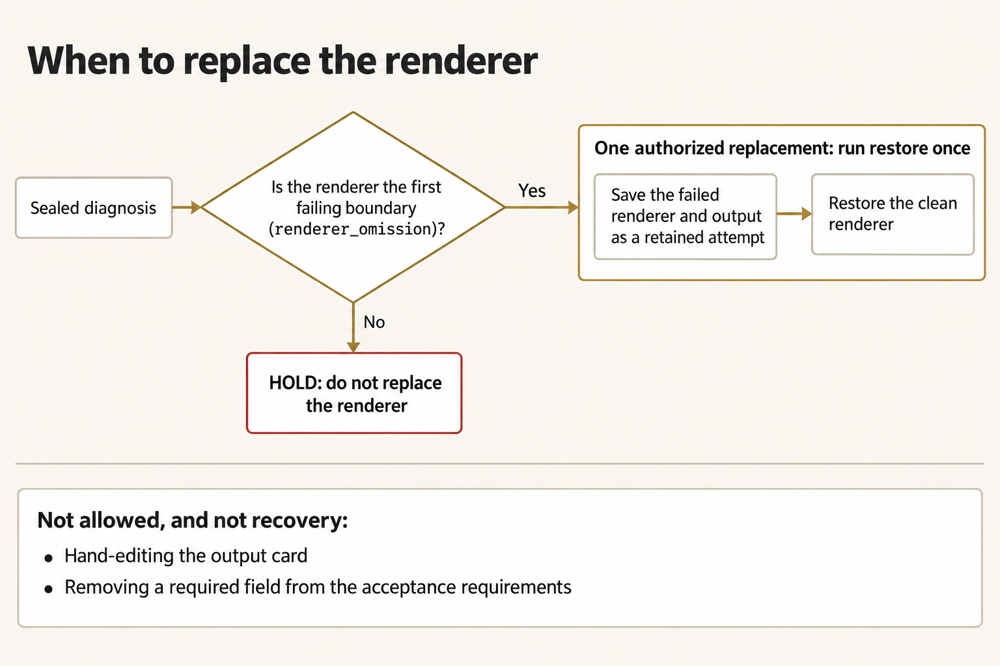
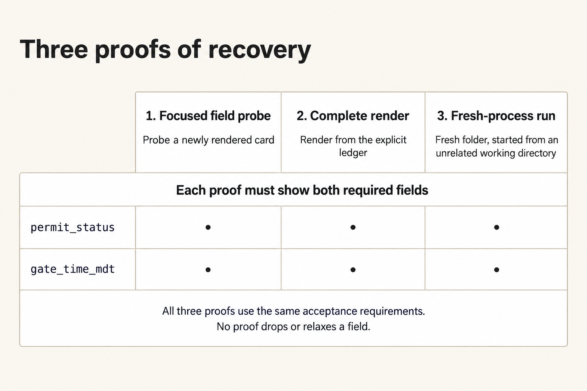

# Module 5 · Diagnose and recover

Find where a required field disappears from a Copper Span duty card before you change anything. Keep the failed result. Use the probe to tell whether the source lacks the field or the renderer dropped it. Make one authorized correction you can undo, then prove the card recovered under the original acceptance requirements.

Plan for about three hours (a rough estimate).

The case is fictional and class-only; nothing here plans or authorizes a real movement.

## Prepare a separate attempt

Open an ordinary terminal and run this block. It uses the Python and checkout from setup, creates a new work folder `W` and a records folder `E`, and leaves earlier attempts alone. The preparer prints a suggested next command; don't run it.

**Terminal: Bash or zsh, ordinary user.**

```bash
R="$HOME/Documents/AIHB_OCT_2026"
PY="$(for candidate in python3.12 python3 python; do "$candidate" -c 'import sys; sys.exit(1) if sys.version_info < (3, 12) else print(sys.executable)' 2>/dev/null && break; done)"
[ -n "$PY" ] || echo 'HOLD: Python 3.12 or newer is required.' >&2
M="$R/AI_Harness_Bootcamp_2/module-05-diagnose-review"
RUN="$(date -u +%Y%m%dT%H%M%SZ)-$$"
mkdir -p "$HOME/course-evidence" && printf '%s\n' "$RUN" > "$HOME/course-evidence/module-05-run" && printf 'RUN=%s\n' "$RUN"
W="$HOME/course-evidence/module-05-$RUN/work"
E="$HOME/course-evidence/module-05-$RUN/evidence"
"$PY" "$R/shared/prepare_work.py" 05 "$W" &&
"$PY" -c "from pathlib import Path; import sys; Path(sys.argv[1]).mkdir(parents=True, exist_ok=False)" "$E"
```

**Terminal: PowerShell, ordinary user.**

```powershell
$R = "$HOME\Documents\AIHB_OCT_2026"
$PY = $(foreach ($candidate in 'python3.12','python3','python') { try { $resolved = & $candidate -c 'import sys; sys.exit(1) if sys.version_info < (3,12) else print(sys.executable)' 2>$null; if ($LASTEXITCODE -eq 0 -and $resolved) { $resolved.Trim(); break } } catch {} })
if (-not $PY) { throw 'No Python >= 3.12 found' }
$M = "$R\AI_Harness_Bootcamp_2\module-05-diagnose-review"
$RUN = [guid]::NewGuid().ToString('N')
New-Item -ItemType Directory -Force -Path "$HOME\course-evidence" | Out-Null; Set-Content -LiteralPath "$HOME\course-evidence\module-05-run" -Value $RUN; "RUN=$RUN"
$W = "$HOME\course-evidence\module-05-$RUN\work"
$E = "$HOME\course-evidence\module-05-$RUN\evidence"
& $PY "$R\shared\prepare_work.py" 05 "$W"
if ($LASTEXITCODE -ne 0) { throw 'Preparation stopped; preserve this attempt.' }
& $PY -c "from pathlib import Path; import sys; Path(sys.argv[1]).mkdir(parents=True, exist_ok=False)" "$E"
```

**Expected:** The preparer prints `PASS: created` followed by the absolute work path. `W` contains `scripts/render_review.py`, `scripts/restore.py`, `baseline/`, `shared/case/ledger.json` (and the stretch ledgers), and an empty `out/` directory. `E` is a sibling evidence directory.

**Stop:** A command fails, a destination already exists, Python isn't the verified 3.12-or-newer interpreter, or you already ran the preparer's suggested command and created a review.

**Recovery:** Keep the existing attempt. Fix the prerequisite through setup, then repeat this block with a new `RUN`. Do not reset the checkout or delete an old work folder.

### If you open a new terminal

A closed terminal forgets these variables. In a new terminal, run this block to reload them for the same attempt instead of preparing another one.

**Terminal: Bash or zsh, ordinary user.**

```bash
R="$HOME/Documents/AIHB_OCT_2026"
PY="$(for candidate in python3.12 python3 python; do "$candidate" -c 'import sys; sys.exit(1) if sys.version_info < (3, 12) else print(sys.executable)' 2>/dev/null && break; done)"
[ -n "$PY" ] || echo 'HOLD: Python 3.12 or newer is required.' >&2
RUN="$(cat "$HOME/course-evidence/module-05-run")"
M="$R/AI_Harness_Bootcamp_2/module-05-diagnose-review"
W="$HOME/course-evidence/module-05-$RUN/work"
E="$HOME/course-evidence/module-05-$RUN/evidence"
printf '%s\n' "RUN=$RUN" "W=$W"
```

**Terminal: PowerShell, ordinary user.**

```powershell
$R = "$HOME\Documents\AIHB_OCT_2026"
$PY = $(foreach ($candidate in 'python3.12','python3','python') { try { $resolved = & $candidate -c 'import sys; sys.exit(1) if sys.version_info < (3,12) else print(sys.executable)' 2>$null; if ($LASTEXITCODE -eq 0 -and $resolved) { $resolved.Trim(); break } } catch {} })
if (-not $PY) { throw 'HOLD: Python 3.12 or newer is required.' }
$RUN = (Get-Content -LiteralPath "$HOME\course-evidence\module-05-run" -Raw).Trim()
$M = "$R\AI_Harness_Bootcamp_2\module-05-diagnose-review"
$W = "$HOME\course-evidence\module-05-$RUN\work"
$E = "$HOME\course-evidence\module-05-$RUN\evidence"
"RUN=$RUN"; "W=$W"
```

**Expected:** The terminal prints `RUN=` followed by the identifier you saw when you prepared this attempt, then `W=` followed by the existing work folder.

**Stop:** The identifier differs from the one you recorded, or the folder named after `W=` does not exist.

**Recovery:** If the identifier differs, a later attempt overwrote the saved marker: set `RUN` to the value you recorded and run the block again. If the folder is missing, the attempt was never prepared: run the first block.

## 1. Confirm the clean render

Render the card with the clean **renderer**, the supplied program that turns ledger rows into a duty card. Keep this output; it's your baseline for comparison.

**Terminal: Bash or zsh, ordinary user.**

```bash
"$PY" "$W/scripts/render_review.py" "$W/shared/case/ledger.json" "$W/out/baseline.md"
```

**Terminal: PowerShell, ordinary user.**

```powershell
& $PY "$W\scripts\render_review.py" "$W\shared\case\ledger.json" "$W\out\baseline.md"
```

**Expected:** The terminal prints the full path of `baseline.md`.

**Stop:** The command prints a line starting `HOLD:`.

**Recovery:** Check the variables and that `ledger.json` is under `W`. Keep any output already written and rerun with a new output filename.

Open the card and check that both required fields are there.

**Terminal: Bash or zsh, ordinary user.**

```bash
cat "$W/out/baseline.md"
```

**Terminal: PowerShell, ordinary user.**

```powershell
Get-Content "$W\out\baseline.md"
```

**Expected:** The card shows `current_rows:`, `near_miss_rows:`, `near_miss_ids:`, and `scanned_quantity:` lines, then a `permit_status:` line and a `gate_time_mdt:` line, each with a value, then `class_only: true`.

**Stop:** Either `permit_status:` or `gate_time_mdt:` is missing from the card.

**Recovery:** Check the variables and that `ledger.json` is under `W`, then render again to a new output filename. Keep the earlier output.

Then read the rules for this card in [shared/case/DUTY_CARD.md](case/DUTY_CARD.md).

## 2. Verify restore before any swap

Test restore before you place the fault. The restore command checks the clean baseline's **digest** (a fingerprint of its file bytes). The command saves your current renderer and `out/` files under `attempts/`, then copies the baseline over the work renderer.



*Confirm the restore reproduces the clean renderer before placing a fault, while preserving the existing attempt and output.*

<details markdown="1">
<summary>Figure text</summary>

Start with the clean baseline renderer and check its digest. If the digest does not match, stop at `HOLD` before replacing anything. If it matches, save the current renderer and output as a retained attempt, then copy the baseline over the work renderer. Confirm `RESTORE OK` before placing the practice fault.

</details>

**Terminal: Bash or zsh, ordinary user.**

```bash
"$PY" "$W/scripts/restore.py" "$W"
```

**Terminal: PowerShell, ordinary user.**

```powershell
& $PY "$W\scripts\restore.py" "$W"
```

**Expected:** `RESTORE OK` is printed, and the `scripts/render_review.py` bytes now match the baseline.

**Stop:** `RESTORE OK` is not printed, or the files differ.

**Recovery:** Do not continue. Record the error and start with a new prepare_work destination.

## 3. Seal the first miss

When your instructor says so, place the practice fault. It breaks only your work copy's renderer; the clean baseline is untouched. Don't fix anything until you've recorded where the field first disappears.

**Terminal: Bash or zsh, ordinary user.**

```bash
"$PY" "$M/scripts/place_practice_fault.py" "$W" --variant A
```

**Terminal: PowerShell, ordinary user.**

```powershell
& $PY "$M\scripts\place_practice_fault.py" "$W" --variant A
```

**Expected:** `FAULT PLACED A`.

**Stop:** A line starting `HOLD:`, for example `HOLD: work copy is not the clean baseline` or `HOLD: output already exists`.

**Recovery:** Run the restore from step 2 again, confirm `RESTORE OK`, then place the fault again. If the hold names an existing output, you have already placed the fault in this attempt; continue.

Render the card again with the faulty renderer:

**Terminal: Bash or zsh, ordinary user.**

```bash
"$PY" "$W/scripts/render_review.py" "$W/shared/case/ledger.json" "$W/out/miss.md"
```

**Terminal: PowerShell, ordinary user.**

```powershell
& $PY "$W\scripts\render_review.py" "$W\shared\case\ledger.json" "$W\out\miss.md"
```

**Expected:** The terminal prints the full path of `miss.md`. The render succeeds; the fault drops a field instead of crashing the renderer.

**Stop:** A line starting `HOLD:`.

**Recovery:** Keep the output. Check that the ledger path is the one under `W`, then repeat with a new output filename.

Before you run the probe, write down how you would tell whether a field is missing from the source or lost while rendering. The read-only **probe** compares the required fields in the selected source rows with the rendered card. The command runs it from the checkout, not your work copy, so the fault can't disable it:



*Compare the selected source and rendered card, preserve the first mismatch, and read the probe's classifications before replacing anything.*

<details markdown="1">
<summary>Figure text</summary>

Check the selected source rows for each required field in order. If a source value is missing, the ordinary probe reports `source_omission`. If it is present, check whether the selected rows agree. Conflicting values produce `source_conflict`. When the values agree, check for a rendered card. If there is no card, the result is `output_absent`. If the card exists, the probe reports `rendered` when it contains the field and `renderer_omission` when it does not. Stop at the first failing check. Record what you expected, what you saw, and the exact command, then seal that evidence before changing anything. Probe exit status 0 means the diagnosis ran, not that the card is complete. The ordinary probe does not detect a wrong input version. That requires the optional `--intended` comparison, which reports `wrong_input_version` outside these core outcomes.

</details>

**Terminal: Bash or zsh, ordinary user.**

```bash
"$PY" "$M/scripts/probe_fields.py" "$W/shared/case/ledger.json" --review "$W/out/miss.md"
```

**Terminal: PowerShell, ordinary user.**

```powershell
& $PY "$M\scripts\probe_fields.py" "$W\shared\case\ledger.json" --review "$W\out\miss.md"
```

**Expected:** The probe prints four lines: `selected_source_ids` followed by the current row IDs, `review_present yes`, one field line ending `renderer_omission`, and the other ending `rendered`. The field marked `renderer_omission` is the first one missing from the card.

**Stop:** You can't name the earliest missing field from the probe output, or more than one field is missing.

**Recovery:** Record `HOLD`. Wait to replace the renderer until the probe shows the field in the selected source but not on the card. If the source is missing it, replacing the renderer cannot bring that information back.

Now write `$E/sealed-first-miss.md` from the probe output. Do this before you replace anything, and don't change the file afterwards. Record the last passing boundary, where the field is still present, and the first failing boundary, where it's missing:

```markdown
# Sealed first miss

Command:
Observed output (first 20 lines):
Probe output:
  selected_source_ids ...
  review_present yes
  permit_status ...
  gate_time_mdt ...
First missing field:
Still present:
```

## 4. One authorized replace

Replace the renderer only if the probe isolated it as the first failing boundary (`renderer_omission`). Make one authorized replacement by running restore. The command first saves the failed renderer and `out/` under `attempts/`, then copies the clean baseline back. Don't hand-edit the card, and don't drop a required field from the acceptance requirements.



*Replace the renderer only when the evidence isolates it; preserve the failed attempt instead of patching the card or relaxing acceptance.*

<details markdown="1">
<summary>Figure text</summary>

Start from the sealed diagnosis. If it shows that the renderer is the first failing boundary (`renderer_omission`), make one authorized replacement: run restore once. Before the clean renderer is restored, the failed attempt (the failed renderer and its output) is saved as a retained attempt. Then restore the clean renderer. If the diagnosis points to any other cause, stop at `HOLD` and do not replace the renderer. Two actions are not allowed and are not recovery: hand-editing the output card, and removing a required field from the acceptance requirements.

</details>

**Terminal: Bash or zsh, ordinary user.**

```bash
"$PY" "$W/scripts/restore.py" "$W"
```

**Terminal: PowerShell, ordinary user.**

```powershell
& $PY "$W\scripts\restore.py" "$W"
```

**Expected:** `RESTORE OK`, and the work copy now matches the baseline bytes.

**Stop:** You made more than one change, or you replaced the renderer before sealing the miss.

**Recovery:** Record the error. Start over with a fresh prepare_work destination.

Then write `$E/replace-record.md` with the command, the `RESTORE OK` line, and why replacing the renderer fixes the cause you found.

## 5. Prove recovery three ways

Finding the cause isn't enough. Prove the repair with three checks, in this order; each must show both required fields.



*Prove the focused repair, the complete result, and fresh-process recovery without dropping either required field.*

<details markdown="1">
<summary>Figure text</summary>

Recovery needs three separate proofs. First, a focused field probe of a newly rendered card. Second, a complete render from the explicit ledger. Third, a fresh-process run in a fresh folder, started from an unrelated working directory. Each proof must show both required fields, `permit_status` and `gate_time_mdt`. All three proofs meet the same acceptance requirements; no proof drops or relaxes a field.

</details>

First, the focused check: render a new card and use the probe to check its required fields.

**Terminal: Bash or zsh, ordinary user.**

```bash
"$PY" "$W/scripts/render_review.py" "$W/shared/case/ledger.json" "$W/out/focused.md" &&
"$PY" "$M/scripts/probe_fields.py" "$W/shared/case/ledger.json" --review "$W/out/focused.md"
```

**Terminal: PowerShell, ordinary user.**

```powershell
& $PY "$W\scripts\render_review.py" "$W\shared\case\ledger.json" "$W\out\focused.md"
if ($LASTEXITCODE -ne 0) { throw 'Focused render held.' }
& $PY "$M\scripts\probe_fields.py" "$W\shared\case\ledger.json" --review "$W\out\focused.md"
```

Second, the end-to-end check: render the complete card from the work-copy ledger. Then open `complete.md` and check both fields.

**Terminal: Bash or zsh, ordinary user.**

```bash
"$PY" "$W/scripts/render_review.py" "$W/shared/case/ledger.json" "$W/out/complete.md"
```

**Terminal: PowerShell, ordinary user.**

```powershell
& $PY "$W\scripts\render_review.py" "$W\shared\case\ledger.json" "$W\out\complete.md"
```

Third, the clean-condition check: copy the renderer and ledger to a fresh folder. Then run them in a new process from your home folder, a working directory unrelated to the work copy.

**Terminal: Bash or zsh, ordinary user.**

```bash
FRESH="$HOME/course-evidence/module-05-$RUN/fresh"
"$PY" -c "
from pathlib import Path
import sys
p = Path(sys.argv[1])
if p.exists() or p.is_symlink(): sys.exit(1)
p.mkdir(parents=True)
" "$FRESH" &&
cp "$W/scripts/render_review.py" "$FRESH/" &&
cp "$W/shared/case/ledger.json" "$FRESH/" &&
cd "$HOME" &&
"$PY" "$FRESH/render_review.py" "$FRESH/ledger.json" "$FRESH/review.md"
```

**Terminal: PowerShell, ordinary user.**

```powershell
$FRESH = "$HOME\course-evidence\module-05-$RUN\fresh"
& $PY -c "
from pathlib import Path
import sys
p = Path(sys.argv[1])
if p.exists() or p.is_symlink(): sys.exit(1)
p.mkdir(parents=True)
" "$FRESH"
if ($LASTEXITCODE -ne 0) { throw 'Fresh dir exists.' }
Copy-Item "$W\scripts\render_review.py" "$FRESH\"
Copy-Item "$W\shared\case\ledger.json" "$FRESH\"
Set-Location "$HOME"
& $PY "$FRESH\render_review.py" "$FRESH\ledger.json" "$FRESH\review.md"
```

**Expected:** The focused probe reports both fields as `rendered`, and the complete and fresh review files both contain `permit_status` and `gate_time_mdt`. The fresh run used a new folder and started from your home folder. A probe exit code of 0 only means the probe ran; read its field lines.

**Stop:** Any of the three outputs lacks `permit_status:` or `gate_time_mdt:`, or the focused probe reports anything other than `rendered`.

**Recovery:** Keep the failed output. Fix the path problem you diagnosed, then use unused output names for another proof. If another renderer replacement is needed, start a fresh attempt instead of erasing the first intervention.

Keep the three outputs, the focused probe result, and the sealed miss for your handoff.

Finally, check that the commands still work when the work path contains a space. This block prepares a separate attempt and renders a baseline (restore needs an output to save), then restores the renderer and probes a new render. Your main attempt stays untouched.

**Terminal: Bash or zsh, ordinary user.**

```bash
SPACE_WORK="$HOME/course-evidence/module-05-$RUN/work with space"
"$PY" "$R/shared/prepare_work.py" 05 "$SPACE_WORK" &&
"$PY" "$SPACE_WORK/scripts/render_review.py" "$SPACE_WORK/shared/case/ledger.json" "$SPACE_WORK/out/baseline.md" &&
"$PY" "$SPACE_WORK/scripts/restore.py" "$SPACE_WORK" &&
"$PY" "$SPACE_WORK/scripts/render_review.py" "$SPACE_WORK/shared/case/ledger.json" "$SPACE_WORK/out/focused.md" &&
"$PY" "$M/scripts/probe_fields.py" "$SPACE_WORK/shared/case/ledger.json" --review "$SPACE_WORK/out/focused.md"
```

**Terminal: PowerShell, ordinary user.**

```powershell
$SPACE_WORK = "$HOME\course-evidence\module-05-$RUN\work with space"
& $PY "$R\shared\prepare_work.py" 05 "$SPACE_WORK"
if ($LASTEXITCODE -ne 0) { throw 'Spaced work preparation held.' }
& $PY "$SPACE_WORK\scripts\render_review.py" "$SPACE_WORK\shared\case\ledger.json" "$SPACE_WORK\out\baseline.md"
if ($LASTEXITCODE -ne 0) { throw 'Baseline render held.' }
& $PY "$SPACE_WORK\scripts\restore.py" "$SPACE_WORK"
if ($LASTEXITCODE -ne 0) { throw 'Restore held.' }
& $PY "$SPACE_WORK\scripts\render_review.py" "$SPACE_WORK\shared\case\ledger.json" "$SPACE_WORK\out\focused.md"
if ($LASTEXITCODE -ne 0) { throw 'Focused render held.' }
& $PY "$M\scripts\probe_fields.py" "$SPACE_WORK\shared\case\ledger.json" --review "$SPACE_WORK\out\focused.md"
```

**Expected:** Preparation and both renders succeed, restore prints `RESTORE OK`, and the probe reports both fields as `rendered`.

**Stop:** Any command holds or either field is absent.

**Recovery:** Keep this directory. Fix the named problem, then choose a new spaced destination instead of reusing an existing output.

## 6. Finish the handoff

Write `$E/handoff.md` so the next person can repeat and check your result without asking you:

```markdown
# Module 5 handoff

First missing field:
Probe output that showed it:
  (include selected_source_ids, review_present, and the cause line)
Replace command:
Previous renderer and outputs preserved in: (the attempts folder under W)
Focused probe result:
Complete render file:
Fresh-process rerun file:
What the next person should inspect first:
```

## Stretch: competing causes on a second case

<details class="rf-stretch" markdown="1">
<summary>Optional stretch: distinguish source omission, wrong input version, and renderer omission</summary>

Three different causes can make a field go missing: missing source data, the wrong input version, or a renderer that drops a field the source supplies. Before you start, write in `E/stretch-prediction.md` which cause you expect in each case and what evidence would tell them apart. Leave the core evidence unchanged.

### Inspect missing source evidence

Render the second ledger with the clean renderer. The renderer should refuse it, and the command then runs the probe on the source rows. Don't fill a source gap by changing code.

**Terminal: Bash or zsh, ordinary user.**

```bash
"$PY" "$W/scripts/render_review.py" "$W/shared/case/ledger-stretch.json" "$W/out/source-omission.md"
SOURCE_EXIT=$?
if [ "$SOURCE_EXIT" -eq 1 ]; then
  "$PY" "$M/scripts/probe_fields.py" "$W/shared/case/ledger-stretch.json"
else
  printf '%s\n' 'HOLD: expected a malformed-source refusal; inspect the actual result.'
  false
fi
```

**Terminal: PowerShell, ordinary user.**

```powershell
& $PY "$W\scripts\render_review.py" "$W\shared\case\ledger-stretch.json" "$W\out\source-omission.md"
if ($LASTEXITCODE -ne 1) { throw 'Expected a malformed-source refusal; inspect the actual result.' }
& $PY "$M\scripts\probe_fields.py" "$W\shared\case\ledger-stretch.json"
```

**Expected:** The renderer prints `HOLD: malformed input (permit_status)`. The probe then prints `permit_status source_omission BK-202` and `gate_time_mdt source_omission BK-203`.

**Stop:** The renderer accepts the incomplete source, or you cannot locate the missing values in the named rows.

**Recovery:** Keep the refusal and probe output. Obtain complete source evidence from its owner. Restoring a renderer cannot create that information.

### Compare the intended input

Probe the stale ledger against the supplied intended ledger. Look at both the source IDs and their revisions: matching IDs don't mean matching versions.

**Terminal: Bash or zsh, ordinary user.**

```bash
"$PY" "$M/scripts/probe_fields.py" "$W/shared/case/ledger-stale.json" --intended "$W/shared/case/ledger-intended.json"
```

**Terminal: PowerShell, ordinary user.**

```powershell
& $PY "$M\scripts\probe_fields.py" "$W\shared\case\ledger-stale.json" --intended "$W\shared\case\ledger-intended.json"
```

**Expected:** The probe reports `wrong_input_version` and prints both selections and their revisions.

**Stop:** You cannot explain which intended source replaces the stale selection.

**Recovery:** Record the input-selection error and identify the correct snapshot. Don't replace a working renderer to hide a wrong input.

### Localize the other renderer omission

The main ledger has both fields. Place variant B, render to a new name, and use the result to find the first omission before you authorize a replacement.

**Terminal: Bash or zsh, ordinary user.**

```bash
"$PY" "$M/scripts/place_practice_fault.py" "$W" --variant B &&
"$PY" "$W/scripts/render_review.py" "$W/shared/case/ledger.json" "$W/out/stretch-miss.md" &&
"$PY" "$M/scripts/probe_fields.py" "$W/shared/case/ledger.json" --review "$W/out/stretch-miss.md"
```

**Terminal: PowerShell, ordinary user.**

```powershell
& $PY "$M\scripts\place_practice_fault.py" "$W" --variant B
if ($LASTEXITCODE -ne 0) { throw 'Fault placement held.' }
& $PY "$W\scripts\render_review.py" "$W\shared\case\ledger.json" "$W\out\stretch-miss.md"
if ($LASTEXITCODE -ne 0) { throw 'Stretch render held.' }
& $PY "$M\scripts\probe_fields.py" "$W\shared\case\ledger.json" --review "$W\out\stretch-miss.md"
```

**Expected:** One field is `renderer_omission`; the other is `rendered`. Seal this miss and the source support in `E/sealed-stretch-miss.md` before continuing.

**Stop:** More than one field is missing, or the selected source does not supply the omitted value.

**Recovery:** Keep your observations and diagnose the earlier cause. Don't replace anything until the evidence isolates this renderer.

### Prove the second recovery without overwriting the first

Authorize one baseline replacement for the sealed variant-B miss. Use new output names and a new fresh-process directory for its three proofs.

**Terminal: Bash or zsh, ordinary user.**

```bash
"$PY" "$W/scripts/restore.py" "$W" &&
"$PY" "$W/scripts/render_review.py" "$W/shared/case/ledger.json" "$W/out/stretch-focused.md" &&
"$PY" "$M/scripts/probe_fields.py" "$W/shared/case/ledger.json" --review "$W/out/stretch-focused.md" &&
"$PY" "$W/scripts/render_review.py" "$W/shared/case/ledger.json" "$W/out/stretch-complete.md"
```

**Terminal: PowerShell, ordinary user.**

```powershell
& $PY "$W\scripts\restore.py" "$W"
if ($LASTEXITCODE -ne 0) { throw 'Stretch restore held.' }
& $PY "$W\scripts\render_review.py" "$W\shared\case\ledger.json" "$W\out\stretch-focused.md"
if ($LASTEXITCODE -ne 0) { throw 'Stretch focused render held.' }
& $PY "$M\scripts\probe_fields.py" "$W\shared\case\ledger.json" --review "$W\out\stretch-focused.md"
if ($LASTEXITCODE -ne 0) { throw 'Stretch probe held.' }
& $PY "$W\scripts\render_review.py" "$W\shared\case\ledger.json" "$W\out\stretch-complete.md"
```

**Expected:** Restore succeeds, the focused probe reports both fields as `rendered`, and the complete output contains both values.

**Stop:** Any command holds or either field is absent.

**Recovery:** Keep the failed proof and choose unused names for a justified new attempt. Never overwrite the core proof files.

**Terminal: Bash or zsh, ordinary user.**

```bash
FRESH="$HOME/course-evidence/module-05-$RUN/fresh-stretch"
"$PY" -c "from pathlib import Path; import sys; Path(sys.argv[1]).mkdir(parents=True, exist_ok=False)" "$FRESH" &&
cp "$W/scripts/render_review.py" "$FRESH/" &&
cp "$W/shared/case/ledger.json" "$FRESH/" &&
cd "$HOME" &&
"$PY" "$FRESH/render_review.py" "$FRESH/ledger.json" "$FRESH/review.md"
```

**Terminal: PowerShell, ordinary user.**

```powershell
$FRESH = "$HOME\course-evidence\module-05-$RUN\fresh-stretch"
& $PY -c 'from pathlib import Path; import sys; Path(sys.argv[1]).mkdir(parents=True, exist_ok=False)' "$FRESH"
if ($LASTEXITCODE -ne 0) { throw 'Fresh stretch destination already exists.' }
Copy-Item "$W\scripts\render_review.py" "$FRESH\" -ErrorAction Stop
Copy-Item "$W\shared\case\ledger.json" "$FRESH\" -ErrorAction Stop
Set-Location -LiteralPath $HOME -ErrorAction Stop
& $PY "$FRESH\render_review.py" "$FRESH\ledger.json" "$FRESH\review.md"
```

**Expected:** The new process produces a review with both fields while using only the copied renderer and ledger, from an unrelated working directory.

**Stop:** The destination exists or the copied run fails.

**Recovery:** Keep the failed directory. After you correct the diagnosed cause, use a new destination. Record which source or renderer change each of the three cases actually justified; even a successful renderer replacement in one case won't fix all three.

</details>

## Before you stop

Check that:

- restore printed `RESTORE OK` before the first swap;
- the sealed miss names exactly one earliest field, based on the probe output for the selected rows;
- you made only one authorized replacement;
- the focused probe confirmed both fields on the work-copy render, and the complete render and the fresh-process output also show both fields (the fresh run started from your home folder);
- the work stayed inside the fictional class case.

Keep the sealed misses, the source selections, each authorized replacement record, and all three recovery proofs. The next owner should be able to tell a source gap from a wrong version or a field the renderer dropped, without asking you.

