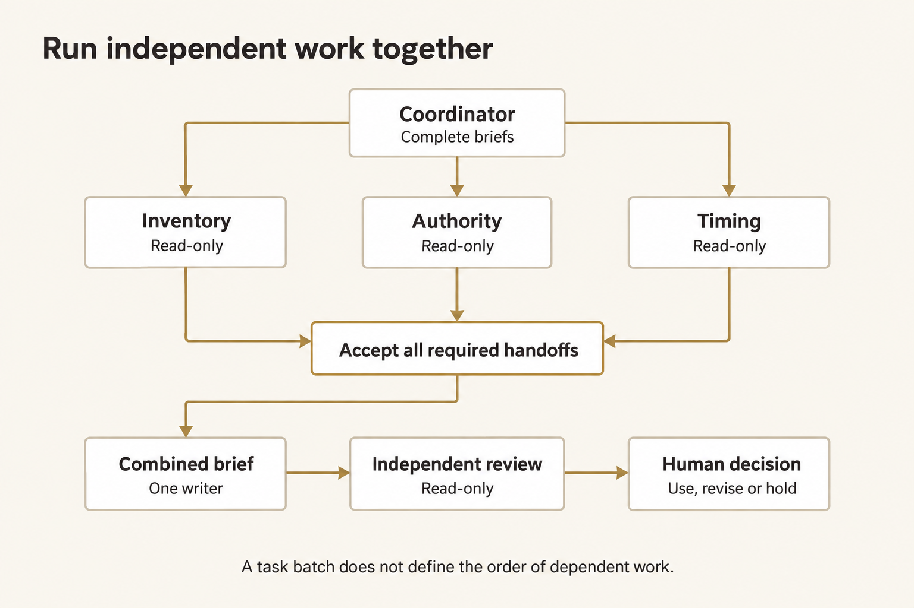
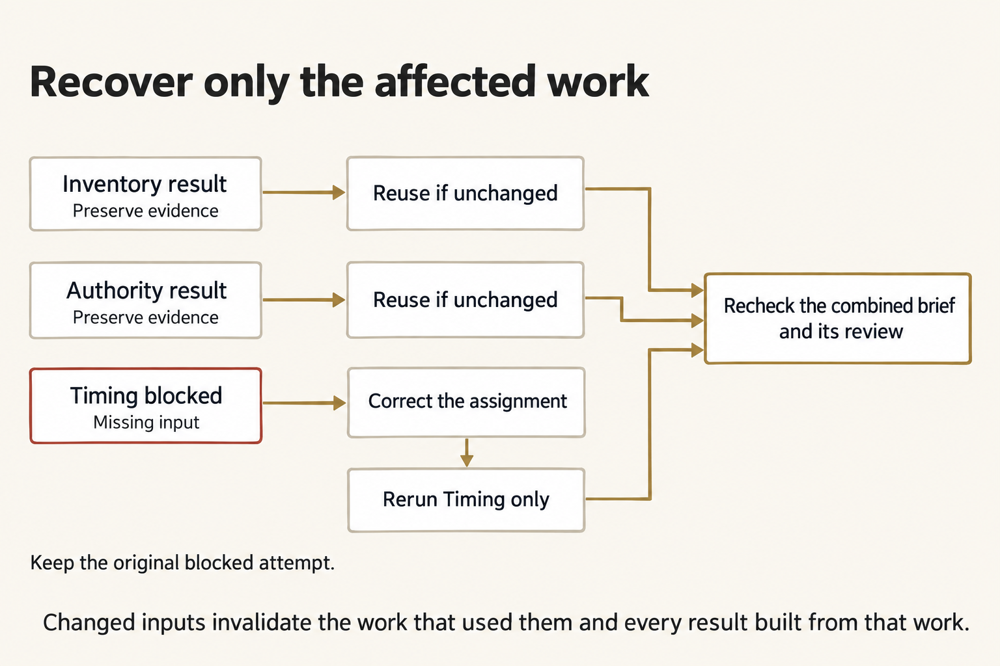

# Orchestrating an OMP agent team

A team helps when several assignments can make useful progress independently. It hurts when agents need the same unfinished input, compete to edit one file, or return results that nobody can check.

Split the work by evidence and ownership, not by how many agents you can launch. Every required handoff needs an acceptance condition. Every dependent action must wait for that condition—not merely for a child to stop talking.

## Start with the dependency graph

Copper Span needs three kinds of evidence for one fictional CS-2 brief: inventory at Basin Depot, release authority, and the timing constraint for Clinic F-9. Each specialist can inspect its own source without another specialist's answer. Combining those answers cannot start until all three are usable. Review cannot start until the actual combined brief exists.



<details markdown="1">
<summary>Figure text</summary>

“Run independent work together.” Coordinator, with Complete briefs, branches to Inventory, Authority and Timing; each is Read-only. All three feed Accept all required handoffs. That joins to Combined brief, One writer; then Independent review, Read-only; then Human decision, Use, revise or hold. “A task batch does not define the order of dependent work.”

</details>

For each proposed edge, ask: **What exact result must exist before the next owner can do valid work?**

- Inventory → integration: a current, source-backed quantity report, not an agent's completion message.
- Authority → integration: the controlling release record, not the most recently received copy.
- Timing → integration: the current time constraint, not a guess from an older claim.
- Integration → review: the candidate's actual bytes and identity, plus the accepted handoffs and sources.
- Review → human decision: findings about that candidate, with any remaining limits explicit.

Putting a reviewer fourth in a three-specialist batch does not create the last two dependencies. OMP does not interpret array order as a dependency graph.

## Give every child a complete assignment

A child has its own session. It does not receive the parent's conversation history. “Check the file we discussed” is not an assignment a child can execute reliably.

A complete brief supplies six things:

| Part | Copper Span example |
|---|---|
| Target | Establish the current inventory quantities for CS-2. |
| Inputs and authority | Exact logical input path; source identity, current revision and supersession determine authority. |
| Allowed work | Read that input only; no write, alternative source, delegation or real-world action. |
| Return contract | Structured facts, source path/hash, source identity and revision, plus the reason that revision controls. |
| Acceptance | Facts match the authoritative source actually read; no unsupported release claim. |
| Stop condition | A missing assigned file produces a blocked handoff with the exact failed path. |

Shared context carries what every child needs: movement, origin, destination, commodity, decision time and authority rules. The individual `task` carries that child's assignment. Do not bury a role-specific restriction in a conversation the child never sees.

A brief is an input revision. Changing it after a run does not change the old child's instructions. It makes the old result stale for the new assignment.

## Native task arguments

OMP's native `task` tool accepts a shared `context` string and a `tasks` array. A complete single-item argument object can look like this:

```json
{
  "context": "Fictional CS-2 carries IV fluid cases from Basin Depot to Clinic F-9. Source identity, current_revision and explicit supersession determine authority. No result authorizes movement.",
  "tasks": [
    {
      "name": "Inventory",
      "agent": "inventory",
      "task": "Use course_read on shared/case/inventory.json. For CS-2, return role inventory, status complete, the actual source path/hash/identity, current revision, its supersedes value, exact current facts and a source-selection reason. Do not write, substitute inputs or infer release authority. If the assigned read fails because it is missing, return status blocked, its exact path, null hash/identity/revision/supersedes, empty facts and the observed failure as reason. Yield once.",
      "solutionSpace": "One read-only source analysis; no implementation or alternative source selection.",
      "outputSchema": {
        "type": "object",
        "properties": {
          "role": {"type": "string", "enum": ["inventory", "authority", "timing"]},
          "status": {"type": "string", "enum": ["complete", "blocked"]},
          "source_path": {"type": "string"},
          "source_sha256": {"type": ["string", "null"]},
          "source_id": {"type": ["string", "null"]},
          "revision": {"type": ["integer", "null"]},
          "supersedes": {"type": ["integer", "null"]},
          "facts": {"type": "object"},
          "reason": {"type": "string"}
        },
        "required": ["role", "status", "source_path", "source_sha256", "source_id", "revision", "supersedes", "facts", "reason"],
        "additionalProperties": false
      },
      "schemaMode": "strict"
    }
  ]
}
```

`name` identifies a particular child invocation. `agent` selects a role definition. They are not interchangeable. `solutionSpace` describes the assignment's openness; it is not a place to omit essential task instructions. `outputSchema` checks the return shape. `schemaMode: "strict"` makes schema failure a failure, not proof that the facts are correct.

The schema represents both complete and blocked handoffs. The acceptance check adds what shape validation cannot: the correct role, actual read, controlling source facts, and the null fields required for a missing-input report. The launcher's submitted argument object is frozen in `policy.json` under `task_call`; the native parent transcript records what was actually requested. The guard refuses changes to the frozen batch. Compare those records instead of treating the parent's final paragraph as the dispatch log.

For three independent assignments, put three complete items in the same `tasks` array. For work that consumes their results, make a later call after collecting and accepting those results. There is no public `dependsOn` field and no automatic insertion of one child's output into the next child's context.

[Native task schema and flow, OMP v18.3.5](https://github.com/can1357/oh-my-pi/blob/v18.3.5/docs/tools/task.md)

## Roles, tools and model selection

A role is Markdown with YAML frontmatter. Copper Span supplies four roles under `shared/agents/`. The inventory role begins:

```yaml
---
name: inventory
description: Read-only inventory analysis for fictional Copper Span.
model: openrouter/anthropic/claude-sonnet-4.6
tools: course_read
---
```

The Markdown body defines the specialist's standing behavior. The task brief names the work for this invocation. Keep reusable role instructions separate from the exact input path and acceptance conditions of an individual assignment.

OMP discovers project roles in `.omp/agents/`; user roles normally live under the user's OMP profile. The launcher copies only the requested roles into an isolated runtime's `.omp/agents/`, with a fresh HOME and explicit settings. It does not modify your personal OMP profile or put runtime state into the work inputs.

`task` and `yield` are native OMP tools. `course_read` and `course_write` are supplied course-extension tools, not standard OMP names:

- `course_read` resolves only an exact declared logical input and returns its path, byte hash and UTF-8 contents.
- `course_write` exists only during integration and permits one coordinator-owned candidate write.
- Native `yield` returns a child's structured handoff. The guard allows one terminal yield after the assigned read attempts.

Outside this bounded run, an ordinary OMP read-only role can use the native `read` tool. Its permissions and any extensions must be checked in that environment; copying a role name does not copy Copper Span's guard.

The role selects the course's pinned OpenRouter model. Do not assume a child inherits every parent setting: the observed child thinking level can differ from the parent's. Check `resolvedModelIdentity`, `resolvedThinkingLevel` and `resolvedModelIsFallback` in the native result rather than inferring them from a parent command.

[Role discovery and frontmatter](https://github.com/can1357/oh-my-pi/blob/v18.3.5/docs/task-agent-discovery.md) · [Task executor](https://github.com/can1357/oh-my-pi/blob/v18.3.5/packages/coding-agent/src/task/executor.ts)

## Bound the team before dispatch

| Control | Copper Span setting | Consequence |
|---|---|---|
| Child concurrency | `task.maxConcurrency: 3` | At most three child assignments run concurrently. This does not order dependent work. |
| Recursion | `task.maxRecursionDepth: 1` | Specialists cannot grow another team. |
| Completion mode | `async.enabled: false` | A stage collects the batch's results before finishing. |
| Runtime retries/fallback | Both disabled | Provider failure does not silently switch models or repeat the stage. |
| Request bound | 12 provider requests per session | An unexpected loop holds instead of continuing indefinitely. |
| Run deadline | 300 seconds, with a short shutdown allowance | A stopped or incomplete attempt cannot pass the saved-evidence check. |
| Input ownership | Exact per-role file bindings | A blocked Timing child cannot borrow another file, even if that file exists nearby. |
| Write ownership | Coordinator, integration only | Specialists and reviewer cannot edit the shared candidate. |

Native headless children use noninteractive `yolo` approval mode. That does **not** mean they inherit an interactive approval dialog or gain permission to use arbitrary tools. Role restrictions, explicit policy and the re-bound guard still apply. Verify the child's actual active tools and observed calls.

Children have separate session histories, not separate operating-system sandboxes. Default native work can share a working directory. Independent read-only assignments avoid races; one named owner writes the combined artifact. A tool allowlist is not an OS security boundary.

[Settings](https://github.com/can1357/oh-my-pi/blob/v18.3.5/docs/settings.md) · [Extension lifecycle and subagent context](https://github.com/can1357/oh-my-pi/blob/v18.3.5/docs/extensions.md)

## Join requested, executed and returned work

A usable handoff has a chain, not just a plausible answer:

1. **Requested:** the parent's native `task` call names the child, role, complete brief and return schema.
2. **Executed:** the spawn record and child session identify the actual child; guard readiness identifies its model, role revision and active tools.
3. **Read:** a native tool call joins to an executed read and tool result with the assigned path and source hash—or to the actual missing-file error.
4. **Returned:** the child's terminal `yield`, native structured result and child artifacts agree.
5. **Accepted:** an independent check compares those records with the source's current authority and the assignment fingerprint.
6. **Used:** integration preserves the original producing attempt and child identity instead of presenting retained work as a new execution.

In `reports.json`, each specialist entry contains `attempt_id`, `child_id`, `report` and `fingerprint`. The report carries the source facts; the surrounding entry carries its producing identity. Reuse preserves both.

Native child artifacts sit under the parent session's directory in `sessions/`. Their `.jsonl` files contain native messages and tool results; their `.json` files contain returned structured data. A fabricated `result.json`, a parent summary, or a fixture file cannot substitute for that chain.

`seal.json` hashes the retained evidence. A changed file fails the ordinary integrity check. These are local audit records, not tamper-proof attestation against somebody who controls the files, program and hashes. Unit-test fixtures are not live provider evidence.

## Completion is not acceptance or authority

Keep three decisions separate:

- **Native completion:** the child finished and returned. A truthful blocked report can complete with native exit code 0.
- **Technical acceptance:** the recorded work meets the handoff contract and still matches its inputs. The CLI reports `PASS` or `HOLD` for that technical question.
- **Human use decision:** a person decides whether to use, revise or hold the checked brief, within their actual authority.

A technically accepted Copper Span brief can correctly say `decision: "HOLD"`. Likewise, an independent reviewer can accept that HOLD brief because its facts and limits are correct. Neither result authorizes a real movement.

## Resolve disagreement through sources

The authority packet contains a superseded release and a controlling HOLD. The old release copy has the later archive receipt timestamp. Choosing the latest timestamp would select the wrong authority.

Check source identity, `current_revision`, the named authority and the explicit `supersedes` chain. Trace each proposed claim to the controlling record. Do not average statuses or let two agreeable agents outvote one source-backed contradiction.

If the source has a missing predecessor, cycle or unresolved branch, stop. Do not invent an authority ordering. A human must resolve the source problem before the dependent brief is usable.

## Recover only invalidated work



<details markdown="1">
<summary>Figure text</summary>

“Recover only the affected work.” Inventory result and Authority result each say Preserve evidence and lead to Reuse if unchanged. Timing blocked, Missing input, leads to Correct the assignment, then Rerun Timing only. All valid paths feed Recheck the combined brief and its review. “Keep the original blocked attempt.” “Changed inputs invalidate the work that used them and every result built from that work.”

</details>

The first Timing assignment names an absent input. The child must attempt that read and report the exact failure; no receipt is prewritten. Inventory and Authority can still return valid results.

Correct the Timing brief, not the evidence. Give repair the prior evidence directory. Repair verifies the original records and compares each handoff's source, role, brief and control fingerprint with the current assignment. Only blocked or changed specialists are dispatched. Unchanged complete handoffs keep their original identities.

| What changed? | What must be reconsidered? |
|---|---|
| Only Timing's assigned path | Timing, then any combined brief and review that consume it. |
| Authority source or authority brief | Authority and downstream work; not unchanged Inventory or Timing analysis. |
| A common execution control | Every handoff that used that control. |
| Integration brief | Integration and its dependent review; unchanged specialist handoffs can remain valid. |
| Reviewer brief or role | Review acceptance; not independent specialist work. |
| Candidate bytes after integration | Candidate acceptance and review; an old review describes the old bytes. |
| A prior native record or evidence hash | The chain is no longer trustworthy for automatic reuse. Preserve it and investigate. |

Do not rerun all specialists merely to get matching timestamps. Do not rename old reports as new work. If native execution is incomplete, malformed or aborted, keep the partial records but do not assume they meet the automatic-reuse contract.

## Supervise an interactive native team

Inside the **same interactive OMP session that spawned the children**, `Alt+A` opens Agent Hub. Native `agent://<id>` and `history://<id>` reads inspect registered agent results and history. Native `write` to `agent://<id>` sends a steering message. Background-job `proc://` controls apply to jobs that exist in that process.

These are OMP tool URIs, not shell commands. A separate `omp` process cannot attach to a headless launcher's in-memory team. The bounded Copper Span stages do not expose these steering tools; they preserve evidence and stop between stages so you can decide what runs next.

For genuinely asynchronous native work, keep doing independent work while children run; wait when their results are the remaining dependency. Do not poll repeatedly. Read the returned result and its provenance before scheduling a dependent wave.

During a headless stage, Ctrl+C requests a stop. Preserve its return code, stdout/stderr and any native records already written. Cancellation does not guarantee a complete report from each child. An incomplete attempt is HOLD, not evidence that every child succeeded or safely rolled back.

## Prefer one assistant when decomposition does not help

Use one assistant when the work is small, inputs keep changing, useful assignments cannot be made independent, or nobody can check the returned handoffs. Parallel work repeats context and creates review overhead; more agents do not create more authority.

Use deterministic rules for a fixed routing problem. Use a human for a consequential authority decision. Use an agent team when independent judgment-bearing work can be bounded, attributed, checked and joined without losing its dependencies.
