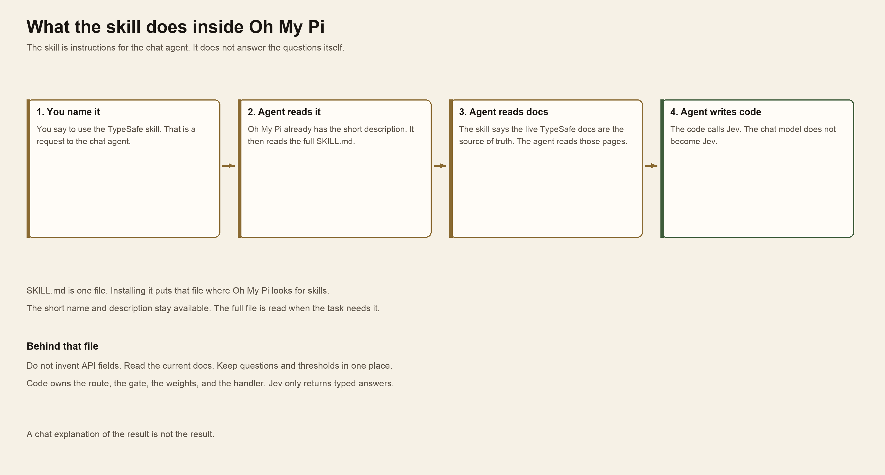
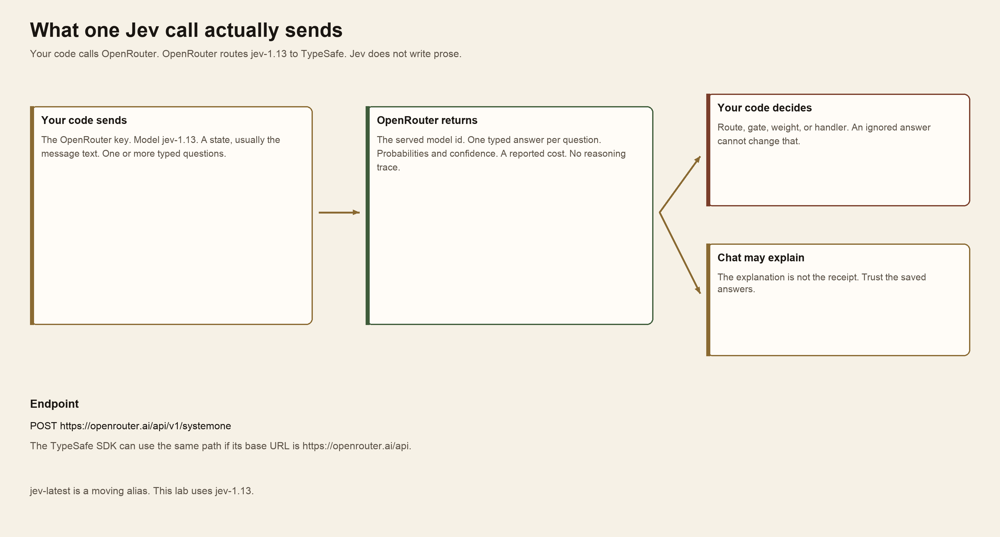
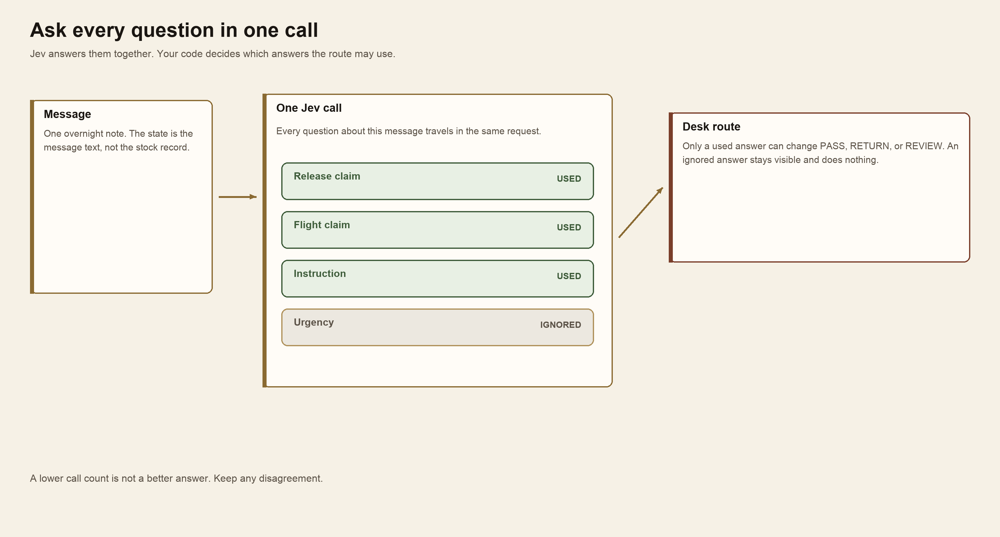
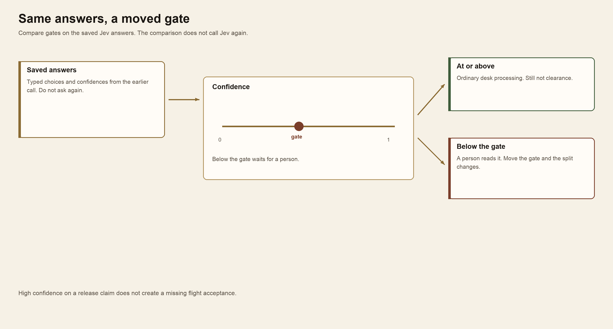
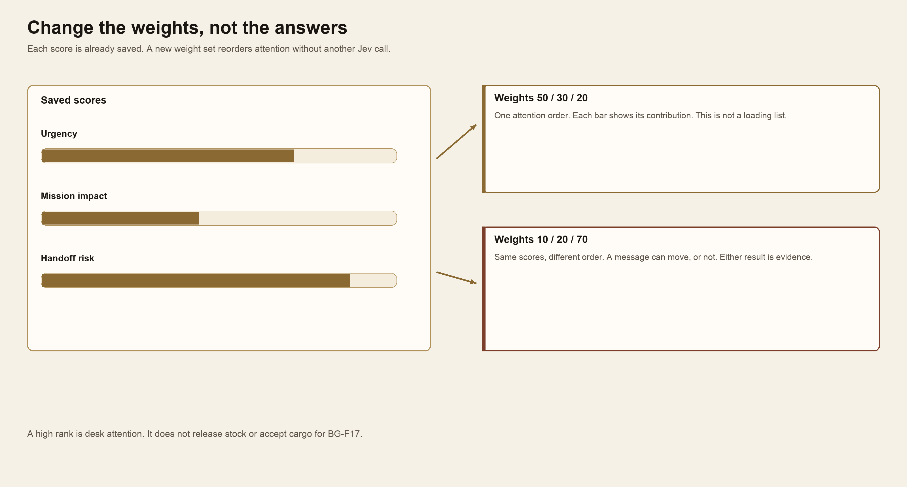
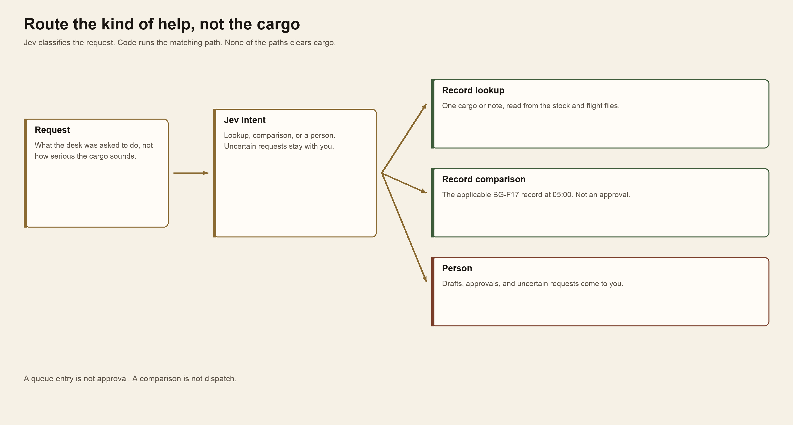
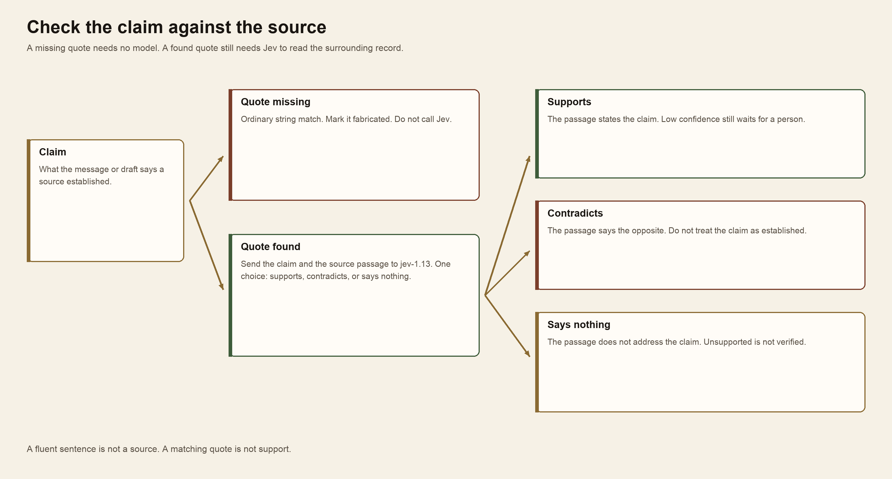
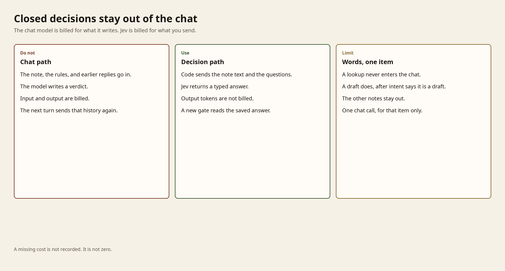

# Module 6 · Use Jev inside Oh My Pi

Open ordinary Oh My Pi and install the TypeSafe skill. Oh My Pi stays the chat agent. It writes code that calls Jev through OpenRouter, using the key you already have. Jev answers the fixed questions. Your code decides what to do with those answers. Each check is its own section. Plan for about three hours.

## How the Jev skill works

The TypeSafe skill is not Jev, and it is not a second chat model. It is one instruction file, `SKILL.md`. Installing it puts that file where Oh My Pi looks for skills. Oh My Pi keeps the skill's short name and description in reach. When you say to use the TypeSafe skill, the chat agent reads the whole file.

That file tells the agent how to build with Jev. It says to read the live TypeSafe docs before writing an integration, because the docs are the current contract. It says not to invent request fields. It says to keep the questions and the thresholds in one place, so you can read them. Then the agent writes ordinary code. The code calls Jev. The chat model stays the chat model.



*You name the skill. Oh My Pi reads SKILL.md, then the live docs, then writes code that calls Jev. The chat model does not become Jev.*

A Jev call is a separate request from the chat. Your code sends three things: the OpenRouter key already in the terminal, the model `jev-1.13`, and a state plus typed questions. OpenRouter routes that request to TypeSafe. Jev returns one typed answer per question, with probabilities and a confidence. It does not return a paragraph or a reasoning trace. The response also names the served model and a reported cost.

Your code then decides. A route, a gate, a weight, or a handler is a decision in code, not a sentence from the chat. The chat model may explain what came back. That explanation is not the receipt. If the two disagree, keep the saved answers.



*Your code sends the key, jev-1.13, a state, and questions. OpenRouter returns typed answers. Your code decides. A chat explanation is not the receipt.*

The call is `POST https://openrouter.ai/api/v1/systemone`. The TypeSafe SDK can use that same path if its base URL is `https://openrouter.ai/api` and its key is your OpenRouter key. Do not create a TypeSafe key. Do not use `jev-latest`. That name follows the newest release. This lab uses `jev-1.13`.


## Blue Gauge: the last resupply flight

It is 05:00 UTC+02 on 15 October 2026 at Aster Airhead. Flight BG-F17 is planned to Forward Support Base Kestrel. The cargo list closes at 05:30 and the aircraft departs at 06:00. The next flight is **not supplied**.

Read the [desk rules](case/DESK_RULES.md). Stock release and exact-flight acceptance are separate records. `PASS`, `RETURN`, and `REVIEW` are message routes. None of them releases stock, accepts cargo for BG-F17, or dispatches the aircraft.

The messages are in `shared/case/notes`. The requests are in `shared/case/requests`. Stock is in `shared/case/scans.json`. Flight acceptance is in `shared/case/flight_acceptances.json`.

## Start Oh My Pi

Use the same terminal where Oh My Pi already works, with `OPENROUTER_API_KEY` already set. Start in this module folder so the session can read the case. Do not set a judge role, and do not create a TypeSafe key. Jev is not the chat model.

**Terminal: Bash or zsh, ordinary user.**

```bash
cd "$HOME/Documents/AIHB_OCT_2026/AI_Harness_Bootcamp_2/module-06-decision-model"
omp
```

**Terminal: PowerShell, ordinary user.**

```powershell
Set-Location "$HOME\Documents\AIHB_OCT_2026\AI_Harness_Bootcamp_2\module-06-decision-model"
omp
```

**Expected:** Oh My Pi opens in this folder. The chat model is the one you already use.

**Stop:** Stop if `omp` is not found, or if the key appears on screen.

**Recovery:** Return to [setup](../../module-00-setup/README.md) if Oh My Pi or the OpenRouter key is missing.

## Install the TypeSafe skill

In that session, paste the install step from the [TypeSafe quick start](https://docs.typesafe.ai/introduction/quickstart#vibe-it-the-agent-skill), then the OpenRouter constraint.

```text
Install the TypeSafe skill. If you're in Claude Code, run `claude plugin marketplace add typesafe-ai/skills`, then `claude plugin install typesafe@typesafe-ai`. If you're in another agent, run `npx skills add typesafe-ai/skills --skill typesafe-ai` and select your agent. Use one installation method. You can read the skill directly at https://github.com/typesafe-ai/skills/blob/main/skills/typesafe-ai/SKILL.md (raw: https://raw.githubusercontent.com/typesafe-ai/skills/main/skills/typesafe-ai/SKILL.md). Then use the TypeSafe skill when working on this project.

Call Jev through OpenRouter, not the TypeSafe API. Use the OpenRouter key already in OPENROUTER_API_KEY. Point the TypeSafe SDK at https://openrouter.ai/api, or POST https://openrouter.ai/api/v1/systemone. Use model jev-1.13. Do not ask for a TypeSafe key. Do not use jev-latest.
```

The skill reads the TypeSafe docs and writes the questions, gates, and code. OpenRouter serves Jev. Code owns the route, the gate, the weights, and the handler. Put the questions and thresholds in one place, and read them before you accept them. A Jev answer is not cargo authority.

**Expected:** The skill is loaded. The agent agrees to call `jev-1.13` through OpenRouter with the key already in the environment.

**Stop:** Stop if it asks for a TypeSafe key, uses `jev-latest`, makes Jev the chat model, prints the key, or writes the key into a file.

**Recovery:** Paste the second paragraph again. If the installer does not list Oh My Pi, tell it to read the raw skill file in that prompt and use that.

## 1. Speculative fan-out

[Speculative fan-out](https://docs.typesafe.ai/patterns/fan-out) asks every question you might need in one Jev call, including questions the route may not use. Jev answers them together. Your code then decides which answers matter.

Use it when one item needs several independent judgments, and you do not yet know which of them the next step will use. A support note may be a bug, a billing problem, and a feature request at once. A cargo message may claim release, claim flight acceptance, and also carry an instruction to skip a check. Asking the first question and waiting hides the others and costs another round trip. Ask them together, then ignore the answers the route does not use.

Do not ask the first question, wait, and then ask the next one. A follow-up call is slower, and it hides answers you already could have had. An ignored answer stays on the page. It must not change `PASS`, `RETURN`, or `REVIEW`.



*One message goes to one Jev call. Used answers can change the route. An ignored answer stays visible and does nothing.*

**In OMP:**
```text
Using the TypeSafe skill, read the fan-out pattern and the OpenRouter Jev docs. Write code that sends each practice message in shared/case/notes/tuning to jev-1.13 through OpenRouter with several questions in one call, including one the route may ignore. Put the questions in one place. Show the actual request, which answers the route used, and which it ignored.
```

**Expected:** One OpenRouter call per message carries every question. An ignored answer is marked and does not change the route.

**Stop:** Stop if it asks the questions one at a time when you asked for one call, or if a message route is treated as clearance.

## 2. Confidence-gated routing

[Confidence-gated routing](https://docs.typesafe.ai/patterns/confidence-routing) uses two facts from the same answer. The choice says what Jev selected. The confidence says whether you should act on it. Your code holds the gate. A low gate lets more messages through. A high gate sends more of them to a person.

Use it when a wrong automatic action is more costly than a delay. Checking a balance can accept a lower confidence than approving a transfer. On this desk, an ordinary message can pass at a lower gate than a message that claims stock is released. The middle band belongs to a person. Do not use a gate when you only need the best option and a wrong pick is harmless.

Compare gates on the saved answers. Do not call Jev again to move the gate. The confidence on a choice is not the same number as the top option's probability. Read the confidence the API returns.



*Saved answers meet a confidence gate. At or above the gate, the desk continues. Below it, a person reads the message. Moving the gate does not call Jev again.*

**In OMP:**
```text
Using the TypeSafe skill, keep those saved Jev answers. In code, send a message to a person when confidence on the chosen answer is low. Compare two gates on the same answers. Do not call OpenRouter again for the comparison. Keep the gate next to the questions.
```

**Expected:** The second gate changes who waits for a person, and it makes no new Jev call.

**Stop:** Stop if the comparison calls Jev again, or if high confidence is treated as stock release or flight acceptance.

## 3. Composite scoring

[Composite scoring](https://docs.typesafe.ai/patterns/composite-scoring) asks Jev for separate scores, then combines them in code. Urgency, stated mission impact, and handoff risk are different questions. A weight says how much each score counts. Change the weights and the attention order can change. The scores do not.

Use it when several qualities matter at once and a person may want to change which one counts more. A queue can rank by customer frustration, revenue, and time waiting. This desk ranks by urgency, stated mission impact, and handoff risk. Ask for the scores once. Try a new policy by changing the weights, not by asking Jev again. Do not use one blended score when any single failure must stop the work. That needs a separate yes-or-no check.

Do not call Jev again to try a new weight set. A high rank is desk attention. It is not a loading list, a release, or acceptance for BG-F17.



*Saved scores for urgency, mission impact, and handoff risk. Two weight sets produce two attention orders. Neither calls Jev again.*

**In OMP:**

```text
Using the TypeSafe skill, read the composite-scoring pattern. Write code that asks jev-1.13 through OpenRouter for urgency, stated mission impact, and handoff risk, then combines those scores with weights. Change the weights and show the new order from the saved scores, without another call. This is desk attention, not cargo allocation.
```

**Expected:** You can see each score's contribution. The new weights change the order, or you can see why a message did not move. No new Jev call.

**Stop:** Stop if a high rank is treated as authority to load or dispatch.

## 4. Intent routing

[Intent routing](https://docs.typesafe.ai/patterns/intent-routing) asks Jev what kind of work the request is, then sends it to the matching path. Judge the work being requested, not how serious the cargo sounds.

Use it when different requests need different kinds of help, and a chat reply would be the wrong tool for some of them. A status question can be a lookup. A record question can be a comparison. A draft, an approval, or an uncertain request needs a person. A loud shortage does not make a waiver into a lookup. Route by the work, then show what actually ran.

A status lookup reads one record. A record question compares the supplied stock and flight records for this cargo and BG-F17 at 05:00. A draft, an approval, or an uncertain request comes to you. Show what actually ran. A lookup is not a clearance. A comparison is not dispatch. A queue entry is not approval.



*Jev classifies the request. A lookup reads a record, a comparison checks the BG-F17 record, and a draft or approval comes to a person. None of those paths clears cargo.*

**In OMP:**

```text
Using the TypeSafe skill, read the intent-routing pattern. Write code that asks jev-1.13 through OpenRouter to classify every request in shared/case/requests, then runs the matching path: a status lookup reads a record, a record question compares the supplied stock and flight records, and a draft, approval, or uncertain request comes to me. Show the request and what actually ran. Nothing you run releases cargo or accepts it for BG-F17.
```

**Expected:** Each request has a typed intent and a path you can inspect. An approval comes to you. A lookup or comparison cites `scans.json` or `flight_acceptances.json`.

**Stop:** Stop if an approval is handled without you, or if a result is called clearance.

## 5. Hallucination check

A [citation check](https://docs.typesafe.ai/cookbooks/citation_check) asks whether a claim is actually in its source. Jev does not decide that a sentence sounds careful. It reads the claim beside the passage and returns one choice: the passage supports the claim, contradicts it, or says nothing about it.

Use it when a draft, a message, or a model answer cites a record. A quote that is not in the source is fabricated. Ordinary code can find that. Do not spend a Jev call on a missing quote. A quote that is in the source can still be the wrong support: the words match, and the surrounding record says the opposite, or nothing about the claim. That is the call for Jev. Low confidence on that choice waits for a person.

On this desk, a message can say stock is released or that BG-F17 has accepted the cargo. Check that claim against `scans.json` or `flight_acceptances.json`. A fluent message is not a source. A matching phrase is not release.



*A missing quote is fabricated without Jev. A found quote goes to Jev, which says the source supports the claim, contradicts it, or says nothing about it.*

**In OMP:**

```text
Using the TypeSafe skill, read the citation-check cookbook. Write code that checks claims in the Blue Gauge messages against scans.json and flight_acceptances.json. If the quoted fact is not in the source, mark it fabricated and do not call Jev. If it is there, ask jev-1.13 through OpenRouter whether the passage supports the claim, contradicts it, or says nothing about it. Send a low-confidence answer to me. Show one of each result.
```

**Expected:** A missing quote makes no Jev call. A found quote has one choice and a confidence. Unsupported and contradicted claims stay visible. None of them becomes clearance.

**Stop:** Stop if a fluent sentence is treated as support, or if a missing quote is sent to Jev.

## 6. Keep the chat model off closed decisions

A token is the unit the provider counts. A chat model bills the tokens you send and the tokens it writes back, including any reasoning. The next turn sends that history again. Jev bills the tokens you send. It counts output tokens and does not bill them. On 7 October 2026 the [Jev model page](https://openrouter.ai/typesafe/jev-1.13) listed $0.042 per million input tokens and $0 per million output tokens. Read that page before you budget. The rate is not the cut that matters.

The cut is which model sees the note.

A closed decision ends in a value you already listed: a route, a score, a yes or no, a support check. That is a Jev question. Asking the chat model to write the same value pays for a paragraph you then parse, and the paragraph stays in the session. Send the note text and the questions to `jev-1.13`. Your code reads the typed answer. The chat model is not in that request.

Send only the state the question needs. A chat turn re-sends the session: the skill, the desk rules, earlier notes, and the model's own replies. A Jev call sends the note, or the note plus the passage the question compares. Desk rules stay in your code. Do not paste the packet into the chat to save a call. Extra text in `state` also makes the answer worse. Jev reads literally, and [irrelevant detail lowers accuracy](https://docs.typesafe.ai/model-jaggedness/jev-1.13).

Call the chat model only when the product is words, and only for that item. A lookup reads `scans.json` or `flight_acceptances.json`. A comparison is code. A draft is a chat completion, after the saved intent already says this request is a draft, and only for that request. If a person needs a written reason, ask for it on the review-queue items only, and give the chat model the saved answer plus the source passage. Do not ask it to draft, rank, or explain all eighty notes. Eighty notes in the chat is eighty notes of input, plus the verdicts, plus that transcript on the next turn. Eighty notes judged by Jev never enter the session.

Changing a gate or a weight reads saved answers. That adds no Jev tokens and no chat tokens. Asking the chat model what a different gate would do puts the notes back in.

Read `usage` on the response, not a summary of it. Jev reports input tokens, output tokens, and a cost. A chat completion reports prompt tokens and completion tokens, and bills both. A missing cost is "not recorded", not zero. The turn in which you ask Oh My Pi to write this comparison can still spend chat tokens. That turn is not the cost of the decision. Report them apart.

Other people's measurements are not this desk. On 19 September 2026, OpenRouter triaged 60 support tickets: Jev cost about $0.025 per 1,000, a small chat model about $0.09, and a frontier chat model about $2.88, with intent accuracy essentially tied ([Jev vs LLM](https://openrouter.ai/blog/tutorials/jev-vs-llm-when-to-use-each/)). On a 50-question set, drafting with a cheap chat model, checking support with Jev, and calling a frontier model only when that check failed cost $0.012, against $0.175 for calling the frontier model every time ([verified cascade](https://openrouter.ai/docs/cookbook/evaluate-and-optimize/jev-verified-cascade)). Those inputs are not these notes. Your `usage` fields are the receipt.



*Three paths. The chat path bills input and output and resends the history. The decision path bills input only, and a new gate reads saved answers. A draft is one chat call; a lookup never enters the chat.*

**In OMP:**

```text
Using the TypeSafe skill, read https://openrouter.ai/blog/tutorials/jev-vs-llm-when-to-use-each/ and the usage object on a Jev response. Do not paste the notes into this chat. Do not print the key.

Write code that prints usage from the API responses, not from this conversation.

1. For BG-001 through BG-005 in shared/case/notes/tuning, call the chat model you already use through OpenRouter chat completions at POST https://openrouter.ai/api/v1/chat/completions. If the session does not name that model, use openrouter/anthropic/claude-sonnet-4.6. Ask only for a route of PASS, RETURN, or REVIEW and a confidence, using the same route criteria you already wrote. Cap the completion at 128 tokens. Record prompt tokens, completion tokens, and cost. Do not send the other notes, the desk rules file, or earlier replies. Do not use jev-1.13 or jev-latest for this call.

2. For the same five notes, call jev-1.13 through the OpenRouter path you already use. State is the note text alone. Ask the route question and one score in that same call. Record input tokens, output tokens, and cost. Output tokens are not billed. If you already saved usage for these exact questions and notes, reuse it and do not call again.

3. Change one gate on the saved answers and print the new routes. That step must make zero new Jev requests and zero new chat completions.

Using the saved intent answers, name one request that is a lookup and one that needs words. The lookup must read scans.json or flight_acceptances.json and must not call the chat model. Do not draft the prose request. Do not explain the other notes.

Print each usage object as returned. Label a missing cost "not recorded". A route is not clearance, flight acceptance, or dispatch.
```

**Expected:** The printed usage shows chat prompt and completion tokens beside Jev input tokens, with Jev output tokens marked not billed. The gate change adds no model call. The lookup cites `scans.json` or `flight_acceptances.json` and does not call the chat model. The request that needs words was not sent to the chat model.

**Stop:** Stop if the notes are pasted into the chat, if Jev is used as the chat model, if `jev-latest` appears, if the key is printed, if a missing cost is written as zero, if the gate change makes a new call, or if a token count is treated as stock release, flight acceptance, or dispatch.

**Recovery:** If the saved Jev answers have no usage, call `jev-1.13` again for BG-001 through BG-005 only. If a chat completion comes back empty under the 128-token cap, raise that cap to 256 once and record both. Do not send BG-006 through BG-080 to either model for this comparison.
