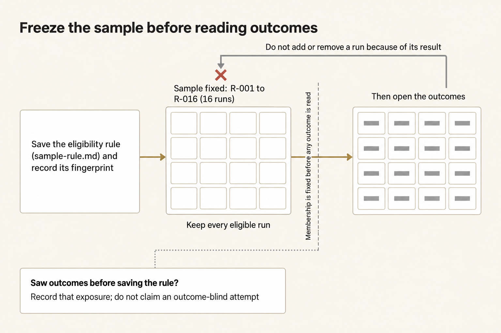
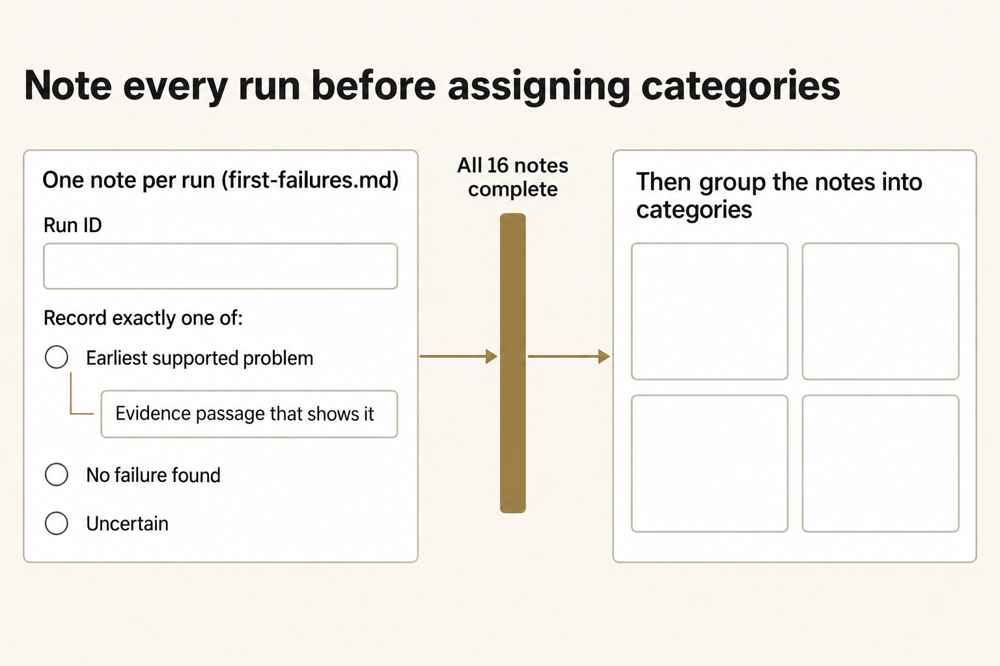
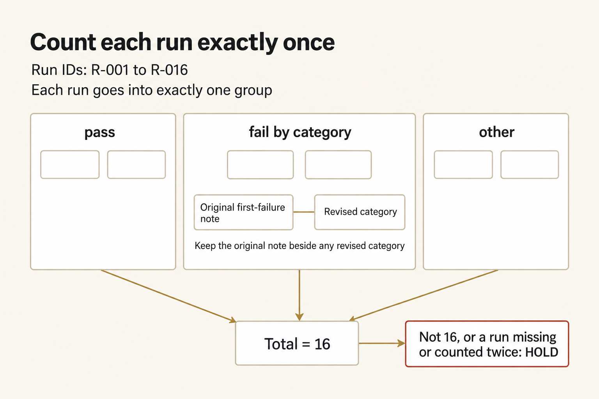
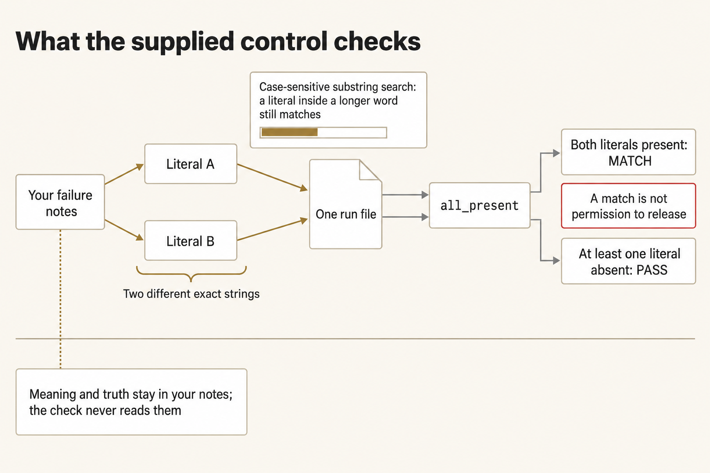

# Module 6 · Improve from observed failures

You're going to find a failure that shows up more than once in Blue Gauge's practice records, then turn it into a check that flags the same text in another run. Write the first problem in each run before you sort them into categories. From those notes, pick two exact pieces of text. The supplied check looks for both of them. Try it on a run you know is bad, a run you know is good, and a file that isn't there, and write down what it catches and what it misses.

The eighty records are made-up practice runs about oxygen cylinders moving from East Yard to Clinic O-2. They aren't real workplace notes, and they don't tell you how reliable a model is. Don't use this packet to plan, authorize, dispatch, or describe a real movement. What you produce here is for class use only.

Plan for about three hours. That's a rough estimate.

## Copy a work folder

Open an ordinary terminal and run this block. It uses the checkout and Python you already checked in setup. It names this attempt so the work stays outside the checkout. `W` is your work folder. `E` is where your notes and the handoff go. Use the command block for your terminal, and keep using that kind of terminal for the rest of the lab.
**Terminal: Bash or zsh, ordinary user.**

```bash
R="$HOME/Documents/AIHB_OCT_2026"
PY="$(for candidate in python3.12 python3 python; do "$candidate" -c 'import sys; sys.exit(1) if sys.version_info < (3, 12) else print(sys.executable)' 2>/dev/null && break; done)"
[ -n "$PY" ] || echo 'HOLD: Python 3.12 or newer is required.' >&2
M="$R/AI_Harness_Bootcamp_2/module-06-run-corpus"
RUN="$(date -u +%Y%m%dT%H%M%SZ)-$$"
mkdir -p "$HOME/course-evidence" && printf '%s\n' "$RUN" > "$HOME/course-evidence/module-06-run" && printf 'RUN=%s\n' "$RUN"
W="$HOME/course-evidence/module-06-$RUN/work"
E="$HOME/course-evidence/module-06-$RUN/evidence"
```

**Expected:** The terminal prints `RUN=` and then this attempt's id. Write that id down. `R` points at the checkout, `PY` at Python 3.12 or newer, and `W` and `E` at new folders.

**Stop:** Stop if `PY` is empty, or if it doesn't point at Python 3.12 or newer.

**Recovery:** Fix Python the way setup describes, then run the block again in a new terminal.
**Terminal: PowerShell, ordinary user.**

```powershell
$R = "$HOME\Documents\AIHB_OCT_2026"
$PY = $null
foreach ($candidate in @('python3.12', 'python3', 'python')) {
  $cmd = Get-Command $candidate -CommandType Application -ErrorAction SilentlyContinue | Select-Object -First 1
  if ($cmd) {
    $ver = & $cmd.Source -c "import sys; print(1 if sys.version_info >= (3, 12) else 0)" 2>$null
    if ($ver -eq '1') {
      $PY = & $cmd.Source -c "import sys; print(sys.executable)"
      break
    }
  }
}
if (-not $PY) { throw 'Python 3.12 or newer not found on PATH.' }

$M = "$R\AI_Harness_Bootcamp_2\module-06-run-corpus"
$RUN = [guid]::NewGuid().ToString('N')
New-Item -ItemType Directory -Force -Path "$HOME\course-evidence" | Out-Null; Set-Content -LiteralPath "$HOME\course-evidence\module-06-run" -Value $RUN; "RUN=$RUN"
$W = "$HOME\course-evidence\module-06-$RUN\work"
$E = "$HOME\course-evidence\module-06-$RUN\evidence"
```

**Terminal: Bash or zsh, ordinary user.**

```bash
mkdir -p "$E"
```

**Expected:** The evidence folder `E` exists.

**Stop:** Stop if `mkdir` fails with a permission error.

**Recovery:** Use a folder you can write under `$HOME/course-evidence`, and run `mkdir` again with the full path.
**Terminal: PowerShell, ordinary user.**

```powershell
New-Item -ItemType Directory -Force -Path "$E" | Out-Null
```

**Expected:** The evidence folder `E` exists.

**Stop:** Stop if the command fails with a permission error.

**Recovery:** Use a folder you can write under `$HOME/course-evidence`, and run `New-Item` again with the full path.

Run the prepare script by its full path under `R`. It creates the work folder outside the checkout. Prepare each attempt only once.
**Terminal: Bash or zsh, ordinary user.**

```bash
cd "$R" && "$PY" "$R/shared/prepare_work.py" 06 "$W"
```

**Terminal: PowerShell, ordinary user.**

```powershell
Set-Location -LiteralPath "$R"; & $PY "$R\shared\prepare_work.py" 06 "$W"
```

**Expected:** `PASS: created` followed by the full work path, then two suggested next commands. Don't run those yet. Freeze the sample rule first. The work folder contains `shared/controls/`, `shared/corpus/` with the eighty runs, and `shared/checks/`.

**Stop:** Stop if prepare refuses with `HOLD` because that folder already exists.

**Recovery:** Open a new terminal, paste the first block again so you get a new `RUN` and `W`, then run prepare again.

Make the output folder under `W`. You only need to do this once.
**Terminal: Bash or zsh, ordinary user.**

```bash
mkdir -p "$W/out"
```

**Terminal: PowerShell, ordinary user.**

```powershell
New-Item -ItemType Directory -Force -Path "$W\out" | Out-Null
```

**Expected:** No output. The folder `W/out` now exists.

**Stop:** Stop on a permission error.

**Recovery:** Use a folder you can write under `$HOME/course-evidence`, and run the command again with the full path.

Later commands use full paths under `W`, so you don't need to change folders. Don't copy any other checker into the work folder.

### If you open a new terminal

A closed terminal forgets `W`, `E`, and the other names this block set. In a new terminal, run this block to load them again for the same attempt. Don't prepare a second one.
**Terminal: Bash or zsh, ordinary user.**

```bash
R="$HOME/Documents/AIHB_OCT_2026"
PY="$(for candidate in python3.12 python3 python; do "$candidate" -c 'import sys; sys.exit(1) if sys.version_info < (3, 12) else print(sys.executable)' 2>/dev/null && break; done)"
[ -n "$PY" ] || echo 'HOLD: Python 3.12 or newer is required.' >&2
RUN="$(cat "$HOME/course-evidence/module-06-run")"
M="$R/AI_Harness_Bootcamp_2/module-06-run-corpus"
W="$HOME/course-evidence/module-06-$RUN/work"
E="$HOME/course-evidence/module-06-$RUN/evidence"
printf '%s\n' "RUN=$RUN" "W=$W"
```

**Terminal: PowerShell, ordinary user.**

```powershell
$R = "$HOME\Documents\AIHB_OCT_2026"
$PY = $(foreach ($candidate in 'python3.12','python3','python') { try { $resolved = & $candidate -c 'import sys; sys.exit(1) if sys.version_info < (3,12) else print(sys.executable)' 2>$null; if ($LASTEXITCODE -eq 0 -and $resolved) { $resolved.Trim(); break } } catch {} })
if (-not $PY) { throw 'HOLD: Python 3.12 or newer is required.' }
$RUN = (Get-Content -LiteralPath "$HOME\course-evidence\module-06-run" -Raw).Trim()
$M = "$R\AI_Harness_Bootcamp_2\module-06-run-corpus"
$W = "$HOME\course-evidence\module-06-$RUN\work"
$E = "$HOME\course-evidence\module-06-$RUN\evidence"
"RUN=$RUN"; "W=$W"
```

**Expected:** The terminal prints `RUN=` and then the id you saw when you prepared this attempt, then `W=` and the work folder you already have.

**Stop:** Stop if the id is different from the one you wrote down, or if the folder after `W=` does not exist.

**Recovery:** A different id means a later attempt overwrote the saved marker. Set `RUN` by hand to the value you wrote down, and run the block again. A missing folder means this attempt was never prepared, so run the prepare steps above.

## Pacing

Most of the time is the work itself. Reading the sixteen runs and writing the first-failure notes takes the longest. Freezing the config and running the three checks come next. Adding up the counts and choosing the two pieces of text take less time. Freezing the sample rule and writing the handoff are quick. Your pace may differ.

## 1. Freeze the sample rule first

Write `sample-rule.md` before you open any run that shows a result or a stamp.

That keeps the sample outcome-blind, which means you decide which runs you'll read before you know which ones passed or failed. Use the text below only if you haven't opened the run files. If you've already seen results, write that down. Don't claim you hadn't seen them.



*Write the sample rule before you read any results. If you already saw results, write that down. Don't claim you hadn't.*

<details markdown="1">
<summary>Figure text</summary>

Write who is in the sample before you read any results.

1. Save the rule first. The written rule comes before the results.
2. The rule fixes the sample as `R-001` through `R-016`, sixteen runs. Keep every one of them.
3. Then open the results. It's the same sixteen runs. Who is in the sample does not change.

Don't add or drop a run because of what you saw in a result. If you saw results before you saved the rule, write that down. Don't claim you hadn't seen them.

</details>
**Terminal: Bash or zsh, ordinary user.**

```bash
cat > "$W/sample-rule.md" << 'EOF'
# Sample rule

## Eligible set
The eligible set is R-001.md through R-016.md. I will read all sixteen. I will not add or drop a file.

## Reading rule
I have not opened a run file yet. I will not choose a run because it looks clean or broken.

## Outcome rule
I will not use a stamp result to decide which runs belong in the sample.
EOF
```

**Expected:** `sample-rule.md` exists and has the three headings.

**Stop:** Stop if `cat` fails, or if the file isn't created.

**Recovery:** Check that you can write there, and run the `cat` command again with the full path.
**Terminal: PowerShell, ordinary user.**

```powershell
@"
# Sample rule

## Eligible set
The eligible set is R-001.md through R-016.md. I will read all sixteen. I will not add or drop a file.

## Reading rule
I have not opened a run file yet. I will not choose a run because it looks clean or broken.

## Outcome rule
I will not use a stamp result to decide which runs belong in the sample.
"@ | Out-File -FilePath "$W\sample-rule.md" -Encoding utf8
```

**Expected:** `sample-rule.md` exists and has the three headings.

**Stop:** Stop if the command fails, or if the file isn't created.

**Recovery:** Check that you can write there, and run the `Out-File` command again with the full path.

Record a digest of the rule in `E`. That's a 64-character string for this exact file, so you can show the reading came after the rule.
**Terminal: Bash or zsh, ordinary user.**

```bash
"$PY" -c "import hashlib,sys; from pathlib import Path; src, dst = map(Path, sys.argv[1:]); digest = hashlib.sha256(src.read_bytes()).hexdigest(); handle = dst.open('x', encoding='utf-8'); handle.write(digest + '\n'); handle.close(); print(digest)" "$W/sample-rule.md" "$E/sample-rule.sha256"
```

**Expected:** The terminal prints a 64-character digest and writes it to a new file, `E/sample-rule.sha256`. The command exits 0.

**Stop:** Stop if the sample-rule file is missing, if the digest file already exists, or if you've already opened a run and seen a stamp.

**Recovery:** Leave this attempt and its files in place. If you saw no results, open a new terminal, repeat the prepare block, and write the rule before you open any run. If you've seen results, write that down and don't claim you hadn't.
**Terminal: PowerShell, ordinary user.**

```powershell
& $PY -c "import hashlib,sys; from pathlib import Path; src, dst = map(Path, sys.argv[1:]); digest = hashlib.sha256(src.read_bytes()).hexdigest(); handle = dst.open('x', encoding='utf-8'); handle.write(digest + '\n'); handle.close(); print(digest)" "$W\sample-rule.md" "$E\sample-rule.sha256"
Write-Output "exit $LASTEXITCODE"
```

**Expected:** The terminal prints a 64-character digest and writes it to a new file, `E\sample-rule.sha256`. The command exits 0.

**Stop:** Stop if the sample-rule file is missing, if the digest file already exists, or if you've already opened a run and seen a stamp.

**Recovery:** Leave this attempt and its files in place. If you saw no results, open a new terminal, repeat the prepare block, and write the rule before you open any run. If you've seen results, write that down and don't claim you hadn't.

### If you must start a new attempt

Open a new terminal and paste the first block so you get a new `RUN`. Then run:
**Terminal: Bash or zsh, ordinary user.**

```bash
"$PY" "$R/shared/prepare_work.py" 06 "$W" &&
"$PY" -c "from pathlib import Path; import sys; Path(sys.argv[1]).mkdir(parents=True); (Path(sys.argv[2])/'out').mkdir(exist_ok=True)" "$E" "$W"
```

**Terminal: PowerShell, ordinary user.**

```powershell
& $PY "$R\shared\prepare_work.py" 06 "$W"
if ($LASTEXITCODE -ne 0) { throw 'Preparation held; preserve this attempt.' }
& $PY -c "from pathlib import Path; import sys; Path(sys.argv[1]).mkdir(parents=True); (Path(sys.argv[2])/'out').mkdir(exist_ok=True)" "$E" "$W"
```

**Expected:** Prepare creates a new work folder at the new path, and `W/out` and the new evidence folder `E` both exist before you record the digest.

**Stop:** Stop if prepare holds because that folder already exists.

**Recovery:** Use a path that doesn't exist yet. Paste the first block into a new terminal to get a new `RUN`, then run prepare again.

If you haven't opened any results, write `sample-rule.md` again and repeat the digest step with the new `W` and `E`. If you have, write that in the attempt record and don't reuse the declaration that says you hadn't seen results. You can still check the control. You can't claim a first reading that happened before you saw results.

## 2. First-failure notes before categories

Open the sixteen sample files under `shared/corpus/`. For each run, write one first-failure note in `$E/first-failures.md` before you tally any categories.

Name the earliest concrete problem the run text supports, and point to the line that shows it. Don't start with a category name. If you find no failure, write that. Don't invent one. If you aren't sure, say so.



*Write each run's earliest supported problem, or that you found no failure, or that you aren't sure, before you assign categories.*

<details markdown="1">
<summary>Figure text</summary>

Write the note before you name a category.

One note per run. Each note starts with the run id, then records exactly one of these:

- The earliest problem the text supports, with the passage that shows it.
- No failure found.
- You aren't sure.

Finish every note before you group them. The grouping comes after the notes, not before.

</details>

**Expected:** `first-failures.md` has sixteen entries, one per sample run. Each starts with the run id and records the earliest problem the text supports, something you couldn't resolve, or that you found no failure.

**Stop:** Stop if you wrote a category count before every run had its note. Those counts aren't evidence.

**Recovery:** Keep the notes you have, add the missing ones, and only then write or revise the counts file.

## 3. Then tally categories

Once all sixteen notes exist, group the failures you saw by what went wrong and write `$E/counts.md`. List the run ids under each category so someone else can check the counts against the notes. Use the pass, fail, and other lines below so that every run is counted exactly once.


```markdown
# Counts

pass (run IDs):
fail by category:
  <category>: <run IDs>
other (run IDs):
total: 16
revisions to category names:
```

The total has to be 16. Each category's count has to match the runs listed under it. Pass, fail, and other have to add up to the total. If they don't, record `HOLD` and find the run that's missing or counted twice. Then state one conclusion that the failure categories in this sample support. Don't treat how often a failure showed up here as a rate for real work or for current models.

If you change a category name, keep the original first-failure note next to it.



*Add pass, fail, and other up to all sixteen runs, and keep each original first-failure note beside any category name you change.*

<details markdown="1">
<summary>Figure text</summary>

Count each run once.

1. Each run id goes in exactly one bucket.
2. The three buckets are pass, fail by category, and other.
3. Inside fail by category, the original note stays beside any category name you change. Changing the name does not replace the note.
4. The three buckets add up to 16.
5. If they don't add up to sixteen, or a run is missing or counted twice, record `HOLD`.

</details>

**Expected:** The totals in the counts file add up to 16, and the first-failure notes are still what you go back to.

**Stop:** Stop if the totals add up to anything other than 16.

**Recovery:** Compare the counts with `first-failures.md` and find the run that's missing or counted twice. Correct the counts and keep the earlier version.

## 4. Pick two exact strings and configure the supplied check

Choose two exact pieces of text that mark the failure you saw more than once, then freeze them. Start by reading `shared/controls/PREDICATE_SPEC.md`.

The check takes one run file and a config file:

`predicate.py <run-file> --config <predicate.json>`

The config is a JSON object with exactly one key, `all_present`. Its value is a list of exactly two different strings, and neither string may be empty. Those two strings are the literals. A literal is an exact piece of text, copied as written.

Pick two literals from your first-failure notes that together point at one repeated failure. This check is a predicate, which means a yes-or-no question. It says yes only when both strings appear in the same file. Either string can also appear alone in a run that passed. The search cares about capitals, and a string inside a longer word still counts. The check doesn't read meaning, calculate values, or use pattern rules.

`RELEASED` occurs inside `UNRELEASED`, so a config that uses `RELEASED` also matches a hold stamp written as `UNRELEASED` when the other string is present. Measure that limit. A match is not proof that anyone released a cylinder.



*Take two exact strings from your notes. The check only asks whether both appear. It does not decide what the run means or whether it is true.*

<details markdown="1">
<summary>Figure text</summary>

The check tests text, not meaning.

1. Your notes give you two different exact strings.
2. Each string is searched in one run file. Capitals matter. A string inside a longer word still counts, and that can flag a run that doesn't have the failure.
3. Both have to be present. The config key is `all_present`.
4. The check has two results: one string is missing, or both are present.
5. Both present is not permission to release anything.

What the run means, and whether its claims are true, stays in your notes. It does not go into the check.

</details>

Start from the template.
**Terminal: Bash or zsh, ordinary user.**

```bash
cp "$W/shared/controls/predicate.template.json" "$W/out/predicate.json"
```

**Terminal: PowerShell, ordinary user.**

```powershell
Copy-Item "$W\shared\controls\predicate.template.json" -Destination "$W\out\predicate.json"
```


**Expected:** `$W/out/predicate.json` exists and matches the template.

**Stop:** Stop if the copy fails, or if the file isn't there.

**Recovery:** Check the path and that you can write there. Make sure `W` points at your work folder and that `shared/controls/predicate.template.json` is in it, then run the copy again.

Edit `$W/out/predicate.json` so `all_present` holds your two strings. The finished file has to look like `{"all_present": ["first text", "second text"]}` with your own two strings.

Then freeze a copy. The checks use this frozen copy, not the file you keep editing.
**Terminal: Bash or zsh, ordinary user.**

```bash
CFG="$W/out/predicate-frozen.json"
"$PY" - "$W/out/predicate.json" "$CFG" <<'PY'
from pathlib import Path
import hashlib, sys
source, target = map(Path, sys.argv[1:])
try:
    raw = source.read_bytes()
    with target.open('xb') as handle:
        handle.write(raw)
except OSError as exc:
    raise SystemExit('HOLD: ' + str(exc))
print('FROZEN', target.name, hashlib.sha256(raw).hexdigest())
PY
```

**Terminal: PowerShell, ordinary user.**

```powershell
$CFG = "$W\out\predicate-frozen.json"
@'
from pathlib import Path
import hashlib, sys
source, target = map(Path, sys.argv[1:])
try:
    raw = source.read_bytes()
    with target.open('xb') as handle:
        handle.write(raw)
except OSError as exc:
    raise SystemExit('HOLD: ' + str(exc))
print('FROZEN', target.name, hashlib.sha256(raw).hexdigest())
'@ | & $PY - "$W\out\predicate.json" "$CFG"
if ($LASTEXITCODE -ne 0) { throw 'Freeze held; preserve the attempt.' }
```

**Expected:** One line: `FROZEN predicate-frozen.json` followed by a 64-character digest. Step 5 checks the content.

**Stop:** Stop on a line starting `HOLD:`. Either the frozen file already exists, or a file can't be read or written.

**Recovery:** Keep the earlier frozen file and its results. To change the strings, use the copy, edit, and freeze steps in step 5. Don't overwrite a frozen file. `CFG` names the frozen config that the checks and the stretch use.
**Terminal: Bash or zsh, ordinary user.**

```bash
"$PY" "$W/shared/controls/predicate.py" "$W/shared/checks/known-bad.txt" --config "$W/shared/controls/predicate.template.json"
echo "exit $?"
```


**Expected:** The control prints `HOLD: malformed config` to standard error, and the exit line is `exit 1`.

**Stop:** Stop if the exit isn't 1, or if the output contains `MATCH` or `PASS`.

**Recovery:** Check that the command points at the unedited template and that the paths are quoted. If you edited a copy, give it a new name.
**Terminal: PowerShell, ordinary user.**

```powershell
& $PY "$W\shared\controls\predicate.py" "$W\shared\checks\known-bad.txt" --config "$W\shared\controls\predicate.template.json"
Write-Output "exit $LASTEXITCODE"
```


**Expected:** The control prints `HOLD: malformed config` to standard error, and the exit line is `exit 1`.

**Stop:** Stop if the exit isn't 1, or if the output contains `MATCH` or `PASS`.

**Recovery:** Check that the command points at the unedited template and that the paths are quoted. If you edited a copy, give it a new name.
**Terminal: Bash or zsh, ordinary user.**

```bash
"$PY" "$W/shared/controls/predicate.py" "$W/shared/checks/known-bad.txt" --config "$CFG"; echo "exit $?"
"$PY" "$W/shared/controls/predicate.py" "$W/shared/checks/known-good.txt" --config "$CFG"; echo "exit $?"
"$PY" "$W/shared/controls/predicate.py" "$W/out/not-created.txt" --config "$CFG"; echo "exit $?"
```

**Terminal: PowerShell, ordinary user.**

```powershell
& $PY "$W\shared\controls\predicate.py" "$W\shared\checks\known-bad.txt" --config "$CFG"; Write-Output "exit $LASTEXITCODE"
& $PY "$W\shared\controls\predicate.py" "$W\shared\checks\known-good.txt" --config "$CFG"; Write-Output "exit $LASTEXITCODE"
& $PY "$W\shared\controls\predicate.py" "$W\out\not-created.txt" --config "$CFG"; Write-Output "exit $LASTEXITCODE"
```

**Expected:**

- The known-bad check prints `MATCH: both literals present`, then `exit 1`.
- The known-good check prints `PASS: at least one literal absent`, then `exit 0`.
- The missing path prints `HOLD: missing input`, then `exit 1`.

The exit lines read `exit 1`, `exit 0`, `exit 1` in that order.


*`MATCH` and `HOLD` both exit 1. Read the output line. The exit code alone can't tell a match from a run the check couldn't decide.*

<details markdown="1">
<summary>Figure text</summary>

Read the line the check prints, not just the exit code. Four cases:

- A known-bad run: `MATCH: both literals present`, `exit 1`.
- A known-good run: `PASS: at least one literal absent`, `exit 0`.
- A missing run: `HOLD: missing input`, `exit 1`.
- A config that isn't the expected shape: `HOLD: malformed config`, `exit 1`.

Three of those exit 1. `HOLD` also exits 1. The exit code alone can't tell a match from a refusal. Read the output line.

</details>

Copy the three command lines and their output into `$E/predicate-results.md`.

**Stop:** Stop if known-bad exits 0, or if known-good exits 1. Your two strings don't separate the cases you chose.

**Recovery:** Keep the frozen config and the results. Make a new working copy with the command below. That command doesn't run the check.
**Terminal: Bash or zsh, ordinary user.**

```bash
PF="$W/out/predicate-revised-$(date -u +%Y%m%dT%H%M%SZ)-$$"
P="$PF.json"
"$PY" - "$W/out/predicate-frozen.json" "$P" <<'PY'
from pathlib import Path
import sys
source, target = map(Path, sys.argv[1:])
try:
    with target.open('xb') as handle:
        handle.write(source.read_bytes())
except OSError as exc:
    raise SystemExit('HOLD: ' + str(exc))
print('EDIT THIS WORKING COPY:', target)
PY
```

**Terminal: PowerShell, ordinary user.**

```powershell
$PF = "$W\out\predicate-revised-$([guid]::NewGuid().ToString('N'))"
$P = "$PF.json"
@'
from pathlib import Path
import sys
source, target = map(Path, sys.argv[1:])
try:
    with target.open('xb') as handle:
        handle.write(source.read_bytes())
except OSError as exc:
    raise SystemExit('HOLD: ' + str(exc))
print('EDIT THIS WORKING COPY:', target)
'@ | & $PY - "$W\out\predicate-frozen.json" "$P"
if ($LASTEXITCODE -ne 0) { throw 'Revised copy held; preserve the attempt.' }
```

**Expected:** The terminal prints `EDIT THIS WORKING COPY:` and the new copy's path. The original frozen file is unchanged.

**Stop:** Stop if the copy fails, or if it would replace a file that already exists.

**Recovery:** Keep that attempt and choose a new working filename. Don't remove the original.

Open the printed `P` file. Change the two strings based on the sample and the check that failed, then save it. Keep this terminal open while you edit. Then freeze the revised copy.
**Terminal: Bash or zsh, ordinary user.**

```bash
CFG="$PF-frozen.json"
"$PY" - "$P" "$CFG" <<'PY'
from pathlib import Path
import hashlib, sys
source, target = map(Path, sys.argv[1:])
try:
    raw = source.read_bytes()
    with target.open('xb') as handle:
        handle.write(raw)
except OSError as exc:
    raise SystemExit('HOLD: ' + str(exc))
print('FROZEN', target.name, hashlib.sha256(raw).hexdigest())
PY
```

**Terminal: PowerShell, ordinary user.**

```powershell
$CFG = "$PF-frozen.json"
@'
from pathlib import Path
import hashlib, sys
source, target = map(Path, sys.argv[1:])
try:
    raw = source.read_bytes()
    with target.open('xb') as handle:
        handle.write(raw)
except OSError as exc:
    raise SystemExit('HOLD: ' + str(exc))
print('FROZEN', target.name, hashlib.sha256(raw).hexdigest())
'@ | & $PY - "$P" "$CFG"
if ($LASTEXITCODE -ne 0) { throw 'Revised freeze held; preserve the attempt.' }
```

**Expected:** The terminal prints the new frozen file's name and digest. `CFG` now points at this revision, and the earlier attempt is unchanged.

**Stop:** Stop if freezing fails, if one of the earlier files changes, or if the two strings aren't the revision you meant.

**Recovery:** Keep the failure and start another separate working copy.

If you froze a revised config, run the three checks above again with the new `CFG`. Continue only when known-bad matches, known-good passes, and the missing file holds. Don't edit `predicate.py` itself.

## 6. Finish the handoff

Decide whether to add this check to the workflow. Base that decision only on the sixteen runs and the three checks. Then write `$E/handoff.md`.


```markdown
# Module 6 handoff

Sample rule:
Count total:
Two literals chosen:
Known-bad result:
Known-good result:
Missing result:
Scope of the control:
Decision (adopt, revise, or hold) and the sampled evidence that bounds it:
What the next person should read first in the full corpus:
```

Write it so the handoff alone is enough to rebuild your result and understand the check's limits, without you there to explain them.

In the handoff, say which failures you saw the check is aimed at, and which ones it misses. A false positive is a match on a run that doesn't have the failure. A false negative is a run that has the failure but doesn't match. List any you found in the runs you checked, with their run ids and how many runs you checked. If you haven't measured a limit, don't report it as a zero error rate.

## Stretch: two preregistered configurations on the held-out runs

<details class="rf-stretch" markdown="1">
<summary>Optional stretch: compare two checks on R-017 through R-080</summary>

Once you have a frozen config that works on the sample, make two working copies of it in `$W/out/`.
**Terminal: Bash or zsh, ordinary user.**

```bash
"$PY" - "$CFG" "$W/out" <<'PY'
from pathlib import Path
import sys
source, out = map(Path, sys.argv[1:])
targets = [out/'stretch-a.json', out/'stretch-b.json']
try:
    if any(p.exists() or p.is_symlink() for p in targets):
        raise SystemExit('HOLD: stretch working copies already exist; preserve them')
    raw = source.read_bytes()
    for target in targets:
        with target.open('xb') as handle:
            handle.write(raw)
except OSError as exc:
    raise SystemExit('HOLD: ' + str(exc))
print('STRETCH WORKING COPIES READY')
PY
```

**Terminal: PowerShell, ordinary user.**

```powershell
@'
from pathlib import Path
import sys
source, out = map(Path, sys.argv[1:])
targets = [out/'stretch-a.json', out/'stretch-b.json']
try:
    if any(p.exists() or p.is_symlink() for p in targets):
        raise SystemExit('HOLD: stretch working copies already exist; preserve them')
    raw = source.read_bytes()
    for target in targets:
        with target.open('xb') as handle:
            handle.write(raw)
except OSError as exc:
    raise SystemExit('HOLD: ' + str(exc))
print('STRETCH WORKING COPIES READY')
'@ | & $PY - "$CFG" "$W\out"
if ($LASTEXITCODE -ne 0) { throw 'Stretch working copies held; preserve the attempt.' }
```


**Expected:** The terminal prints `STRETCH WORKING COPIES READY`, and both stretch files are copies of the frozen config.

**Stop:** Stop if a copy doesn't contain the exact two strings from your frozen config.

**Recovery:** Keep any stretch work you already have. Make the copies again from the frozen config in `CFG` that passed the checks. For a new attempt, use new output names instead of overwriting.

Edit `$W/out/stretch-a.json` and `$W/out/stretch-b.json` so they use two different pairs of strings. Then freeze both, and don't edit them after that.
**Terminal: Bash or zsh, ordinary user.**

```bash
"$PY" - "$W/out" <<'PY'
from pathlib import Path
import hashlib, sys
out = Path(sys.argv[1])
pairs = [(out/f'stretch-{name}.json', out/f'stretch-{name}-frozen.json') for name in ('a', 'b')]
try:
    if any(target.exists() or target.is_symlink() for _, target in pairs):
        raise SystemExit('HOLD: frozen stretch configuration exists; preserve it')
    contents = [source.read_bytes() for source, _ in pairs]
    for (_, target), raw in zip(pairs, contents):
        with target.open('xb') as handle:
            handle.write(raw)
        print('FROZEN', target.name, hashlib.sha256(raw).hexdigest())
except OSError as exc:
    raise SystemExit('HOLD: ' + str(exc))
PY
```

**Expected:** Two lines, `FROZEN stretch-a-frozen.json` and `FROZEN stretch-b-frozen.json`, each followed by a 64-character digest.

**Stop:** Stop if the copy fails, or if the files aren't two different configs with two strings each.

**Recovery:** Keep any partial or earlier freeze. For a new pair, choose new frozen filenames and use them in that pair's commands. Don't overwrite a config you already froze.
**Terminal: PowerShell, ordinary user.**

```powershell
@'
from pathlib import Path
import hashlib, sys
out = Path(sys.argv[1])
pairs = [(out/f'stretch-{name}.json', out/f'stretch-{name}-frozen.json') for name in ('a', 'b')]
try:
    if any(target.exists() or target.is_symlink() for _, target in pairs):
        raise SystemExit('HOLD: frozen stretch configuration exists; preserve it')
    contents = [source.read_bytes() for source, _ in pairs]
    for (_, target), raw in zip(pairs, contents):
        with target.open('xb') as handle:
            handle.write(raw)
        print('FROZEN', target.name, hashlib.sha256(raw).hexdigest())
except OSError as exc:
    raise SystemExit('HOLD: ' + str(exc))
'@ | & $PY - "$W\out"
if ($LASTEXITCODE -ne 0) { throw 'Stretch freeze held; preserve the attempt.' }
```

**Expected:** Two lines, `FROZEN stretch-a-frozen.json` and `FROZEN stretch-b-frozen.json`, each followed by a 64-character digest.

**Stop:** Stop if the copy fails, or if the files aren't two different configs with two strings each.

**Recovery:** Keep any partial or earlier freeze. For a new pair, choose new frozen filenames and use them in that pair's commands. Don't overwrite a config you already froze.


The held-out runs, `R-017` through `R-080`, are the ones you didn't use to choose the first two strings. Read those 64 runs and write your predictions in `$W/out/stretch-prediction.md` before you run either config or open the public labels. For each run, predict whether `promotion_failure` is true, meaning a receipt was treated as a release, and whether each config will return `MATCH` or `PASS`.

Make the skeleton below and fill in every value from your reading of the runs. Use `true` or `false` for `promotion_failure` and `MATCH` or `PASS` for each config. Keep exactly one row per run, in id order. The command won't overwrite an existing file, but nothing stops you from editing it later. The freeze that follows records the finished file before you open any results or labels.
**Terminal: Bash or zsh, ordinary user.**

```bash
"$PY" -c '
from pathlib import Path
import sys
p = Path(sys.argv[1]) / "out" / "stretch-prediction.md"
lines = []
for n in range(17, 81):
    rid = f"R-{n:03d}"
    lines.append(f"{rid} promotion_failure=? a=? b=?")
with p.open("x", encoding="utf-8") as f:
    f.write("\n".join(lines) + "\n")
print("wrote", len(lines))
' "$W"
```

**Terminal: PowerShell, ordinary user.**

```powershell
@'
from pathlib import Path
import sys
p = Path(sys.argv[1]) / "out" / "stretch-prediction.md"
lines = []
for n in range(17, 81):
    rid = f"R-{n:03d}"
    lines.append(f"{rid} promotion_failure=? a=? b=?")
with p.open("x", encoding="utf-8") as f:
    f.write("\n".join(lines) + "\n")
print("wrote", len(lines))
'@ | & $PY - "$W"
if ($LASTEXITCODE -ne 0) { throw 'Prediction file creation held; preserve the attempt.' }
```

**Expected:** `wrote 64`.

**Stop:** Stop on `FileExistsError`: the file already exists.

**Recovery:** Keep the existing file and fill in its values. Don't create another one.

Check all sixty-four finished predictions and freeze their digest. Counting rows isn't enough. A row that still holds a `?` counts as a row too.
**Terminal: Bash or zsh, ordinary user.**

```bash
"$PY" - "$W/out/stretch-prediction.md" <<'PY'
from pathlib import Path
import hashlib, re, sys
p = Path(sys.argv[1])
try:
    raw = p.read_bytes()
    lines = raw.decode('utf-8').splitlines()
    rows = [re.fullmatch(r'R-(\d{3}) promotion_failure=(true|false) a=(MATCH|PASS) b=(MATCH|PASS)', line) for line in lines]
    if any(row is None for row in rows) or [int(row[1]) for row in rows] != list(range(17, 81)):
        raise ValueError('complete every prediction exactly once, in R-017 through R-080 order')
    digest = hashlib.sha256(raw).hexdigest()
    with p.with_suffix('.sha256').open('x', encoding='ascii') as frozen:
        frozen.write(digest + '\n')
except (OSError, UnicodeError, ValueError) as exc:
    raise SystemExit('HOLD: ' + str(exc))
print('PREDICTIONS 64 FROZEN', digest)
PY
```

**Terminal: PowerShell, ordinary user.**

```powershell
@'
from pathlib import Path
import hashlib, re, sys
p = Path(sys.argv[1])
try:
    raw = p.read_bytes()
    lines = raw.decode('utf-8').splitlines()
    rows = [re.fullmatch(r'R-(\d{3}) promotion_failure=(true|false) a=(MATCH|PASS) b=(MATCH|PASS)', line) for line in lines]
    if any(row is None for row in rows) or [int(row[1]) for row in rows] != list(range(17, 81)):
        raise ValueError('complete every prediction exactly once, in R-017 through R-080 order')
    digest = hashlib.sha256(raw).hexdigest()
    with p.with_suffix('.sha256').open('x', encoding='ascii') as frozen:
        frozen.write(digest + '\n')
except (OSError, UnicodeError, ValueError) as exc:
    raise SystemExit('HOLD: ' + str(exc))
print('PREDICTIONS 64 FROZEN', digest)
'@ | & $PY - "$W\out\stretch-prediction.md"
if ($LASTEXITCODE -ne 0) { throw 'Prediction freeze held; preserve the attempt.' }
```

**Expected:** `PREDICTIONS 64 FROZEN` and a SHA-256 value appear, and a new file, `stretch-prediction.sha256`, sits beside the finished prediction.

**Stop:** Stop if a row is still a placeholder, duplicated, missing, or malformed, if the hash file already exists, or if you've opened results or labels.

**Recovery:** Before the first freeze, fill in the missing predictions from the run texts and run the check again. If a freeze already exists, keep it. Once you've opened results or labels, mark any new prediction as written after the results. Don't replace the original.

Then run each frozen config on every held-out run, first `stretch-a-frozen.json` and then `stretch-b-frozen.json`.
**Terminal: Bash or zsh, ordinary user.**

```bash
"$PY" - "$W" <<'PY'
from pathlib import Path
import hashlib, json, subprocess, sys, uuid
w = Path(sys.argv[1])
prediction = w / "out/stretch-prediction.md"
prediction_hash = hashlib.sha256(prediction.read_bytes()).hexdigest()
if prediction_hash != prediction.with_suffix(".sha256").read_text(encoding="ascii").strip():
    raise SystemExit("HOLD: predictions differ from their pre-result freeze")
attempt = uuid.uuid4().hex
for label in ("a", "b"):
    config = w / f"out/stretch-{label}-frozen.json"
    config_hash = hashlib.sha256(config.read_bytes()).hexdigest()
    output = w / f"out/stretch-{label}-results-{attempt}.jsonl"
    with output.open("x", encoding="utf-8") as evidence:
        for number in range(17, 81):
            run_id = f"R-{number:03d}"
            source = w / f"shared/corpus/{run_id}.md"
            result = subprocess.run(
                [sys.executable, str(w / "shared/controls/predicate.py"),
                 str(source), "--config", str(config)],
                capture_output=True, text=True)
            row = {"run_id": run_id, "config_sha256": config_hash, "prediction_sha256": prediction_hash,
                   "exit_code": result.returncode,
                   "stdout": result.stdout, "stderr": result.stderr}
            evidence.write(json.dumps(row, sort_keys=True) + "\n")
            evidence.flush()
            valid = ((result.returncode == 1 and result.stdout.strip() == "MATCH: both literals present")
                     or (result.returncode == 0 and result.stdout.strip() == "PASS: at least one literal absent"))
            if not valid or result.stderr or hashlib.sha256(config.read_bytes()).hexdigest() != config_hash:
                raise SystemExit(f"HOLD: {run_id} did not produce a valid classification under the frozen config; inspect the retained row")
    print(f"COMPLETE: configuration {label}; R-017 through R-080; {output}")
PY
```

**Terminal: PowerShell, ordinary user.**

```powershell
@'
from pathlib import Path
import hashlib, json, subprocess, sys, uuid
w = Path(sys.argv[1])
prediction = w / "out/stretch-prediction.md"
prediction_hash = hashlib.sha256(prediction.read_bytes()).hexdigest()
if prediction_hash != prediction.with_suffix(".sha256").read_text(encoding="ascii").strip():
    raise SystemExit("HOLD: predictions differ from their pre-result freeze")
attempt = uuid.uuid4().hex
for label in ("a", "b"):
    config = w / f"out/stretch-{label}-frozen.json"
    config_hash = hashlib.sha256(config.read_bytes()).hexdigest()
    output = w / f"out/stretch-{label}-results-{attempt}.jsonl"
    with output.open("x", encoding="utf-8") as evidence:
        for number in range(17, 81):
            run_id = f"R-{number:03d}"
            source = w / f"shared/corpus/{run_id}.md"
            result = subprocess.run(
                [sys.executable, str(w / "shared/controls/predicate.py"),
                 str(source), "--config", str(config)],
                capture_output=True, text=True)
            row = {"run_id": run_id, "config_sha256": config_hash, "prediction_sha256": prediction_hash,
                   "exit_code": result.returncode,
                   "stdout": result.stdout, "stderr": result.stderr}
            evidence.write(json.dumps(row, sort_keys=True) + "\n")
            evidence.flush()
            valid = ((result.returncode == 1 and result.stdout.strip() == "MATCH: both literals present")
                     or (result.returncode == 0 and result.stdout.strip() == "PASS: at least one literal absent"))
            if not valid or result.stderr or hashlib.sha256(config.read_bytes()).hexdigest() != config_hash:
                raise SystemExit(f"HOLD: {run_id} did not produce a valid classification under the frozen config; inspect the retained row")
    print(f"COMPLETE: configuration {label}; R-017 through R-080; {output}")
'@ | & $PY - $W
if ($LASTEXITCODE -ne 0) { throw 'Held-out comparison stopped; keep the partial evidence.' }
```

**Expected:** Two new JSONL files each hold one row for each of the 64 runs, `R-017` through `R-080`, with the frozen config's hash, the exit status, stdout, and stderr. Both `COMPLETE` lines show their output paths, and the command exits 0. Each time you run the command, its two result files get a new shared suffix.

**Stop:** Stop if a result file already exists, if a config changes, or if any run produces `HOLD` or another error instead of `MATCH` or `PASS`. A missing file doesn't count as a match, and a partial result file isn't a finished comparison.

**Recovery:** Keep all partial results and the first failure. Fix only the path or input problem you found, then run the command again. It creates new result filenames and leaves the earlier attempt in place. If you change a config, write new predictions first and keep the earlier comparison separate.

After the runs, open the public practice labels.
**Terminal: Bash or zsh, ordinary user.**

```bash
cat "$W/shared/checks/held-out-truth.json"
```

**Terminal: PowerShell, ordinary user.**

```powershell
Get-Content "$W\shared\checks\held-out-truth.json"
```

**Expected:** The JSON lists each held-out run, `R-017` through `R-080`, with `promotion_failure` set to true or false and a short note.

**Stop:** Stop if the file is missing or unreadable.

**Recovery:** Check the path under the work copy and run the command again.

For each frozen config, compare its matches and misses with the public labels. Report its false positives and false negatives out of all 64 runs. Compare the two configs' errors, and don't drop a run because it's inconvenient. Say what `RELEASED` matching inside `UNRELEASED` shows about the limits of a check that only looks for text.

Don't drop runs and pick new ones to make the numbers look better. The public labels are practice data only.

</details>

## Before you stop

Check that:

- the sample rule existed before you read any result text;
- you wrote first-failure notes for all sixteen sample runs before any counts;
- the counts add up to sixteen;
- the frozen config contains exactly two different strings, and neither is empty;
- known-bad exits 1 with `MATCH`, known-good exits 0 with `PASS`, and a missing file prints `HOLD: missing input`;
- you didn't write a second checker;
- the work stayed inside the made-up class case;
- if you did the stretch, you froze your predictions before you opened the held-out labels.

