# Module 7 · Build a workflow, predict a change, and prove the result

Build a local n8n workflow that routes White Rack's refrigerated reagent kits from Icehouse Depot to Clinic I-6. Predict a policy change from two source batches, run both batches, and compare every receipt row. Preserve the original workflow, change one saved value, then restore the original into a new blank workflow and reproduce both original receipts.

Plan for 3 facilitated hours on Wednesday, including 2 hours of practice. This is a planning allowance, not a measured completion guarantee. All lots and movements are fictional. A receipt does not authorize a real movement or release product quality.

You will use three named workflows: your router, a separate supplied checker, and a restored router. Keep all three unpublished. Use the local browser editor and test forms only. A **receipt** is a downloaded CSV with the columns `lot,route,status`. An **exact comparison** checks the whole file, including column order, quotes, separators, and line endings. A green workflow execution alone does not prove that files match.

## Prepare your files

Complete [local n8n readiness](../../module-00-setup/README.md) first: n8n **2.41.5**, the approved full official local stack, and the editor at `http://localhost:5678`. Keep Assistant off. No cloud account, provider key, publication, or production URL is needed. Use your earlier source inspection and evidence habits here.

In Finder or File Explorer, create a new folder such as `module-07-attempt-2026-10-01-a`. Give each attempt its own name. Inside it, create `inputs`, `predictions`, `exports`, `receipts`, and `reports`, and create an empty text file named `observations.md` in your plain-text editor; every "record" instruction below writes to it. Download these exercise files into `inputs`:

- [wave1.csv](batch/wave1.csv)
- [wave2.csv](batch/wave2.csv)
- [validate-batch.js](controls/validate-batch.js)
- [receipt-checker.json](controls/receipt-checker.json)

Right-click each link and choose **Save link as** (**Download Linked File As** in Safari). On macOS, Control-click also opens the link menu. Keep the filename and extension shown above; these links may display text if you open them instead of saving them.

Keep source CSVs unchanged. View them in a plain text editor; don't save them through a spreadsheet. Copy browser downloads into the appropriate folder with the stage names used below. Renaming a file is fine; opening and resaving its contents can change its bytes. Keep the original download too. Never replace a retained receipt, export, or report. If a name exists, use a new attempt suffix and record the actual name.

**Expected:** You can open both CSVs and see the ordered header `lot,permit,gate_window,input_disposition,resource_exception`. Each wave has 80 lots. **Stop:** A file is missing, the local editor isn't ready, or a source was changed. **Recovery:** Resolve setup or download a fresh source into a new attempt folder before proceeding.

## Freeze predictions before any routing run

Read the `permit` and `resource_exception` cells in both waves. The router applies this order:

| First matching condition | Receipt under `OPEN` | Receipt under `NOT_AUTHORIZED` |
| --- | --- | --- |
| `resource_exception` exactly `RACK_CONFLICT` | `hold,RESOURCE_CONFLICT` | `hold,RESOURCE_CONFLICT` |
| Otherwise, `permit` exactly `AUTHORIZED` | `pass,READY` | `pass,READY` |
| Otherwise, `permit` exactly `PENDING` | `hold,OPEN` | `reject,NOT_AUTHORIZED` |
| Otherwise | `hold,OPEN` | `hold,OPEN` |

Matches are case-sensitive. A shortened, lowercase, or space-padded permit is a different string and goes to the fallback. `gate_window` and `input_disposition` are provenance: they describe the input but do not choose a route. Cancelled lots carry `WITHDRAWN`, which goes to the fallback unless rack precedence applies. Never trim or repair a source value to force a match.

In your plain text editor, create `predictions/prediction.md`. For each wave, record the source filename, the cells behind your expected decisions, and the rack claimants that must stay held. State explicitly: “Every other serialized row stays byte-identical, and rack precedence holds.” A serialized row is the exact text saved in the CSV, not just what a spreadsheet displays.

Create `predictions/wave1-delta.csv` and `predictions/wave2-delta.csv`. Start each with this exact header:

```csv
lot,before_route,before_status,after_route,after_status
```

Add one row for each lot you predict will actually change when `OPEN` becomes `NOT_AUTHORIZED`. Use that lot's source ID and its predicted before and after values. Do not include unchanged lots or duplicate IDs. If you predict no changes, retain just the header. Save all three prediction files before any router execution. Record the date and time in the note. After results arrive, append observations in a separate file; don't replace your original prediction or silently repair its delta CSV.

**Expected:** Each declared change is traceable to source cells, and both waves have their own frozen delta. **Stop:** A routing execution already exposed results, or you cannot explain a predicted row from its cells. **Recovery:** Preserve the attempt and record what you saw. Reinspect the sources and start a clearly named new attempt; don't present an after-run prediction as a before-run prediction.

## Build the router from a blank canvas

Build the fixed workflow node by node, so every routing rule is visible on the canvas and nothing depends on a hidden setting.

For each added node, click the output **+**, search the node type shown in bold, and select it. This connects the preceding node automatically. Click the node title to rename it, enter the exact name shown, and press Enter. Return to the canvas after setting its fields. To connect existing nodes, drag from the source's right output connector to the destination's left input connector. Check the wire rather than assuming it was added.

For Edit Fields nodes, use **Manual Mapping** and **Add Field**, and set each field's type to **String**. Use **Fixed** for literal values. For values inside `{{ }}`, switch the value control to **Expression** and paste the whole expression. Do not paste expressions as fixed text. Leave unmentioned settings at their defaults. Leave **Settings → On Error** at **Stop Workflow**; don't enable retry, error continuation, or pinned test data.

### 1. Create and name the blank router

Open **Overview → Build a workflow** on a fresh installation, or **Overview → Create workflow** when workflows already exist. Click the workflow title, enter `White Rack — attempt a — router`, and press Enter. Use your attempt identifier in place of `a`. n8n autosaves; there is no Save/Saved indicator to wait for. Leave the workflow unpublished.

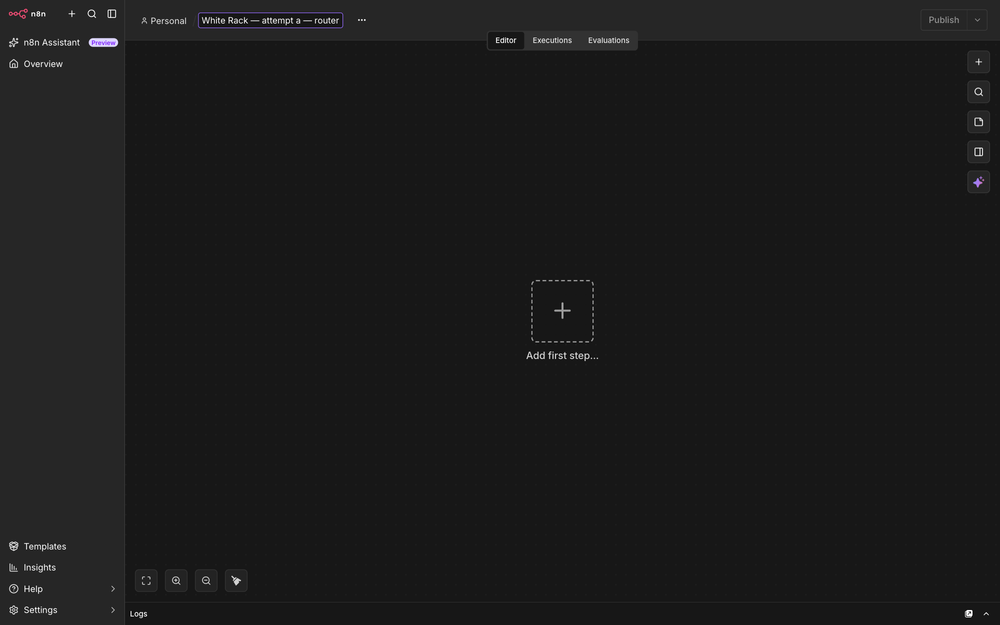

**Expected:** The named canvas has no nodes. **Stop:** An existing graph is visible. **Recovery:** Return to Overview and create a new workflow; don't clear someone else's canvas.

### 2. Add the upload form

Click **Add first step**, search **n8n Form**, and choose **On new n8n Form event**. Rename it `Upload wave`. Set **Form Title** to `White Rack — upload one wave` and **Form Description** to `Use the test form. Upload one unchanged source CSV.` Under **Form Elements**, select **Add Form Element**. Set **Field Label** to `wave` and **Element Type** to `File`. Use **Add Attributes** to expose **Multiple Files**, **Accepted File Types**, and **Required Field**. Turn Multiple Files off, enter `.csv` for Accepted File Types, and turn Required Field on. Keep authentication at **None** for this local test form. Do not execute yet.

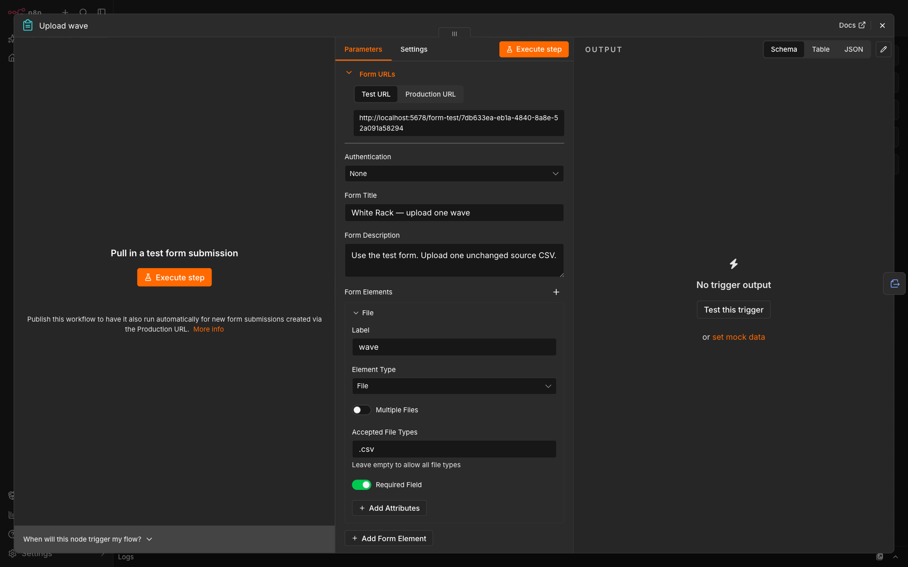

**Expected:** There is exactly one upload field named `wave`. **Stop:** The field allows multiple files or uses a different label. **Recovery:** Correct the field before adding downstream nodes; its label is also the binary file key.

### 3. Extract the CSV without dropping empty cells

From Upload wave, add **Extract from File** and rename it `Read CSV`. Select **Extract From CSV**. Set **Input Binary Field** to `wave`. Under **Options**, use **Add option** to expose **Header Row**, **Include Empty Cells**, and **Skip Records with Errors**. Turn Header Row and Include Empty Cells on. Keep Skip Records with Errors → **Enabled** off. Open **Settings** and turn **Always Output Data** on. Return to Parameters and confirm the input key.

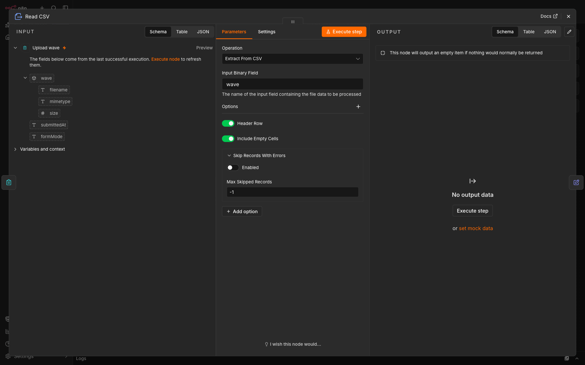

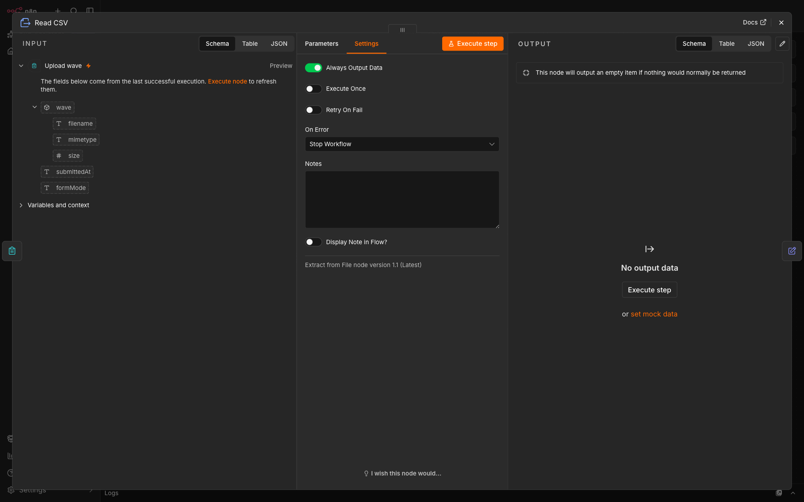

**Expected:** Upload wave connects to Read CSV. Empty or header-only extraction still reaches validation instead of silently ending the path. **Stop:** Errors are skipped or empty cells are omitted. **Recovery:** Correct these settings; don't compensate by changing the source file.

### 4. Add the single saved policy value

From Read CSV, add **Edit Fields (Set)** and rename it `Pending rule`. Select **Manual Mapping**. Add one String field named `pending_status`, with Fixed value `OPEN`. Turn **Include Other Input Fields** on, retaining all input fields.

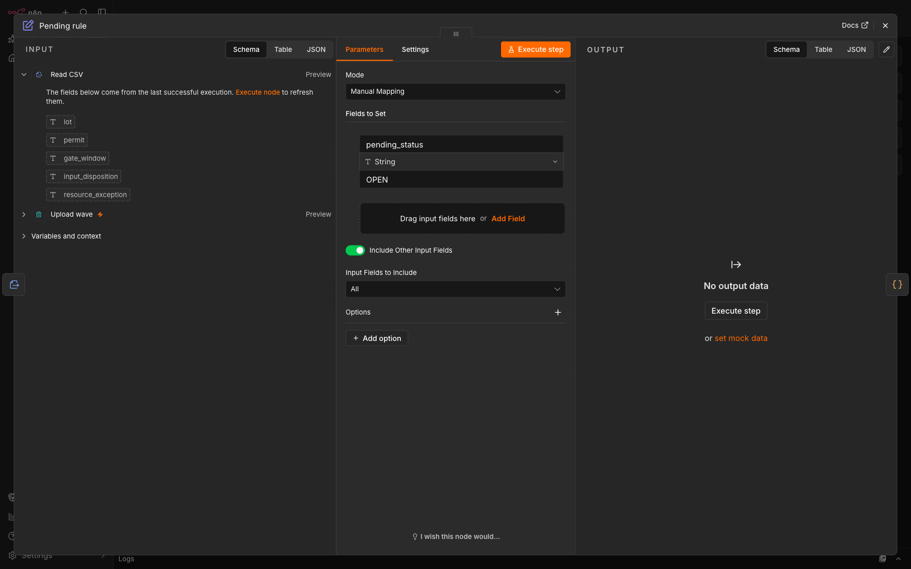

**Expected:** This node adds one value without replacing the source columns. **Stop:** Include Other Input Fields is off or the value is an expression. **Recovery:** Restore the setting and the literal `OPEN`.

### 5. Install the supplied batch validation

From Pending rule, add **Code** and rename it `Check batch`. Choose **JavaScript** and **Run Once for All Items**. Open the downloaded `validate-batch.js` in your plain text editor, select its entire contents, and copy them. Select all placeholder code in the node and paste the supplied contents unchanged.

The validator reads the original output of `Read CSV` as well as the policy-augmented rows. Keep that node's exact name. It requires the five ordered source columns, unchanged source values and row order, string values, unique nonblank lot IDs without commas, quotes, or ASCII controls, valid dispositions and exceptions, cancelled/withdrawn consistency, and a uniform saved policy value. A source-supplied `pending_status` is invalid even if Pending rule overwrites it. The validator adds `_row`, the source row's position, without changing source strings. Invalid input stops before routing. Unknown permit strings remain valid input for the fallback.

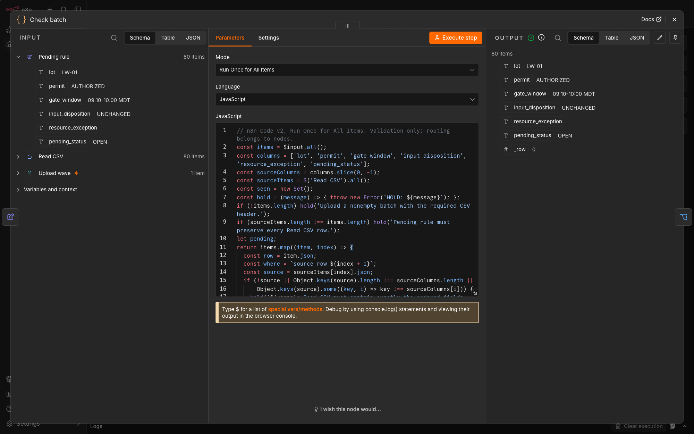

**Expected:** The wire is Pending rule → Check batch, and no placeholder code remains. **Stop:** The code was shortened, rewritten, or put in per-item mode. **Recovery:** Replace the entire body from the supplied file and restore the mode. Don't add routing code here.

### 6. Set ordered, case-sensitive routing

From Check batch, add **Switch** and rename it `Route lots`. Select **Rules** mode. Add exactly three routing rules in this order. Each uses **String → is equal to**, an Expression on the left, and a Fixed value on the right:

| Output | Left expression | Right fixed value |
| --- | --- | --- |
| 0, first rule | `{{$json.resource_exception}}` | `RACK_CONFLICT` |
| 1, second rule | `{{$json.permit}}` | `AUTHORIZED` |
| 2, third rule | `{{$json.permit}}` | `PENDING` |

Under **Options**, use **Add option** to expose **Fallback Output**, **Ignore Case**, and **Send data to all matching outputs**. Set Fallback Output to **Extra Output**, Ignore Case off, and Send data to all matching outputs off. Leave **Convert types where required** off. Keep one condition per rule. The first matching rule wins, so rack conflicts cannot also enter the permit branches.

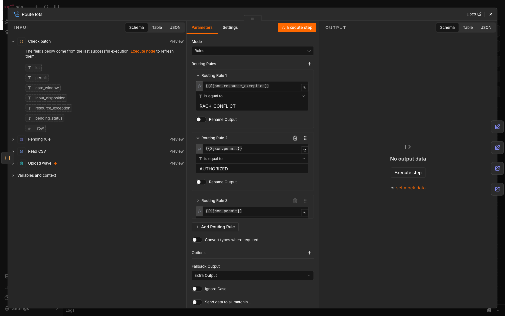

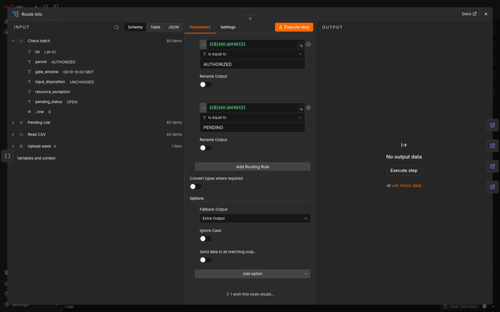

**Expected:** Four output connectors appear: three rules and the fallback. **Stop:** Rules use contains, ignore case, or send to all matches. **Recovery:** Restore exact equality and the options above before wiring branches.

### 7. Wire the rack hold branch

Click the **+** on Route lots output **0**, the first rule. Add **Edit Fields (Set)** and rename it `Rack hold`. Use Manual Mapping. Add String fields `route` = Fixed `hold` and `status` = Fixed `RESOURCE_CONFLICT`. Turn **Include Other Input Fields** on. Leave **Settings → Always Output Data** off.

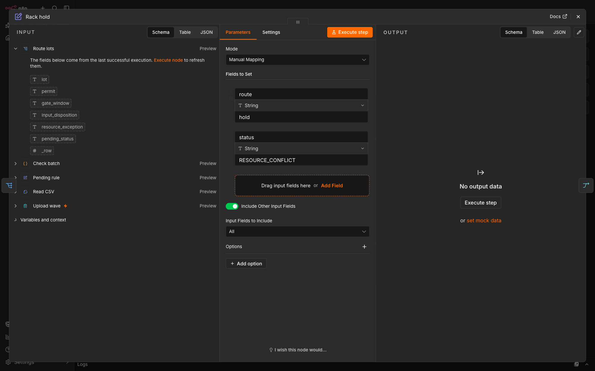

**Expected:** Only the first Switch output feeds Rack hold, and `_row` will be retained. **Stop:** The node is attached after another branch or drops inputs. **Recovery:** Remove the incorrect wire and reconnect output 0 directly to Rack hold.

### 8. Wire the authorized branch

From Route lots output **1**, add **Edit Fields (Set)** named `Ready`. Use Manual Mapping with String fields `route` = Fixed `pass` and `status` = Fixed `READY`. Turn **Include Other Input Fields** on. Leave **Always Output Data** off.

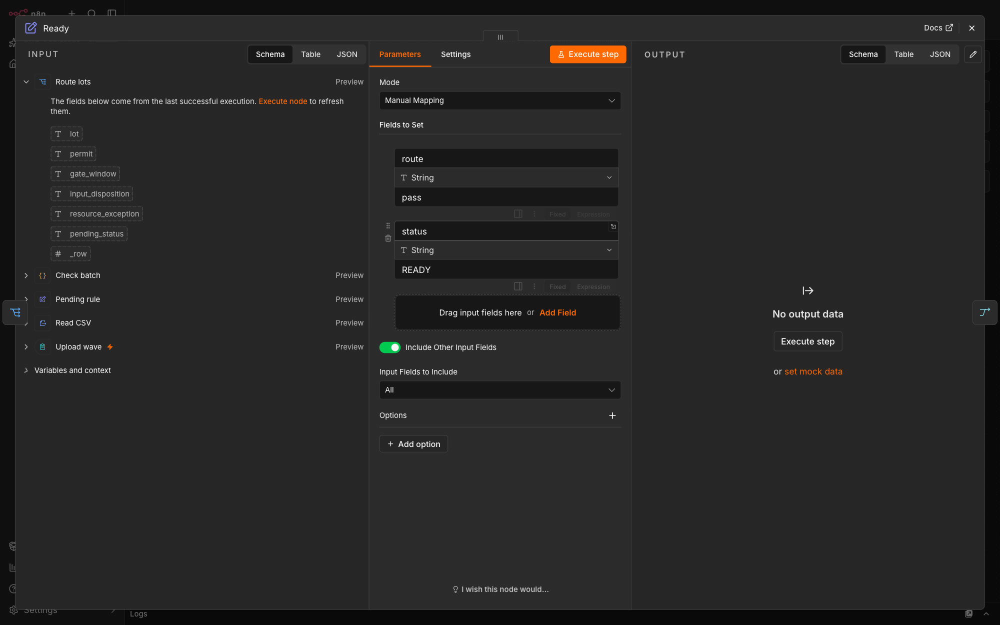

**Expected:** Output 1 feeds Ready directly. **Stop:** Ready receives rack or pending output. **Recovery:** Reconnect the correct Switch output; don't change the branch values to hide a wiring error.

### 9. Wire the pending branch

From Route lots output **2**, add **Edit Fields (Set)** named `Pending decision`. Use Manual Mapping. Add String `route` in Expression mode with `{{$json.pending_status === 'NOT_AUTHORIZED' ? 'reject' : 'hold'}}`. Add String `status` in Expression mode with `{{$json.pending_status}}`. Turn **Include Other Input Fields** on. Leave **Always Output Data** off.

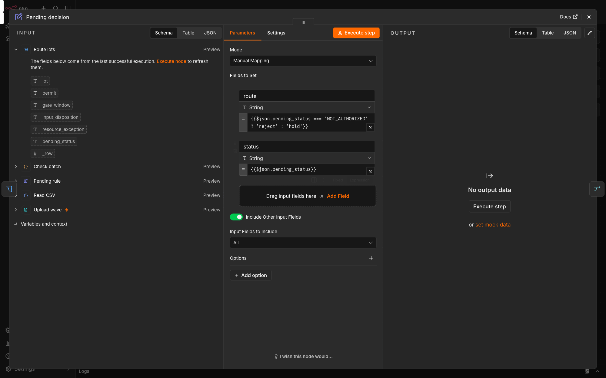

**Expected:** Both values are expressions and output 2 feeds this node. **Stop:** The expression appears as literal text or status is fixed to OPEN. **Recovery:** Select Expression mode and paste the exact expressions.

### 10. Wire the fallback

From Route lots' **Fallback** output, add **Edit Fields (Set)** named `Other permit`. Use Manual Mapping with String fields `route` = Fixed `hold` and `status` = Fixed `OPEN`. Turn **Include Other Input Fields** on. Leave **Always Output Data** off.

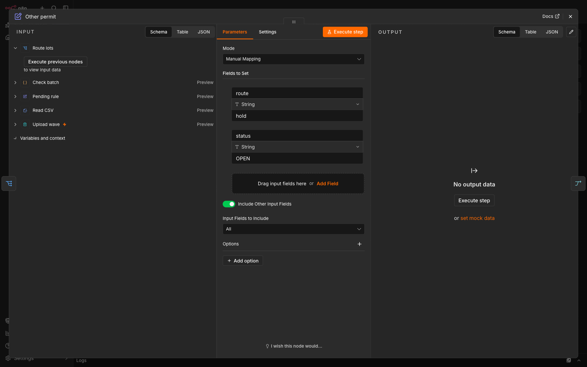

**Expected:** All unmatched permit strings have a path to a receipt. **Stop:** The fallback is unconnected or points to Pending decision. **Recovery:** Connect it to Other permit and retain the fixed values.

### 11. Collect all four branches

From Rack hold, add **Merge** named `Collect routes`. Set **Mode** to **Append** and **Number of Inputs** to `4`. Connect the branches to its inputs in this order: Rack hold → **Input 1** (index 0); Ready → **Input 2** (index 1); Pending decision → **Input 3** (index 2); Other permit → **Input 4** (index 3). Drag the remaining three wires on the canvas. Check that each branch has exactly one connection to its own Merge input.

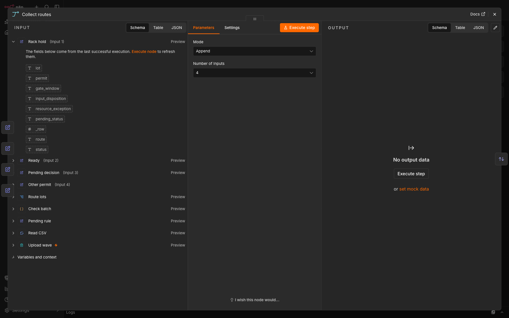

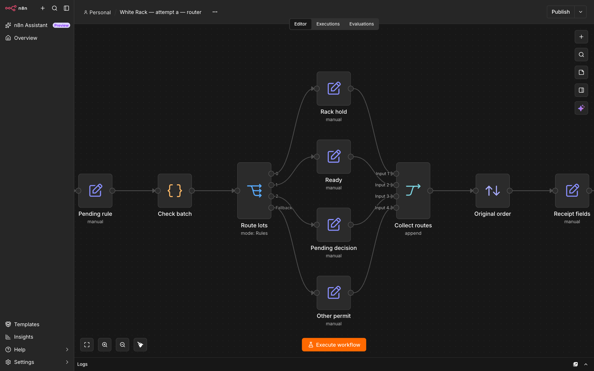

**Expected:** Four distinct branch wires enter Merge. **Stop:** Mode is Combine, an input is missing, or a branch has Always Output Data on. **Recovery:** Restore Append and the four wires; disable branch Always Output Data so empty branches cannot fabricate rows.

### 12. Restore source order

From Collect routes, add **Sort** named `Original order`. Select **Simple** sorting. Add a sort field named `_row` with **Ascending** order. Keep `_row` through this node: Merge groups branches, and this sort puts their rows back into source order.

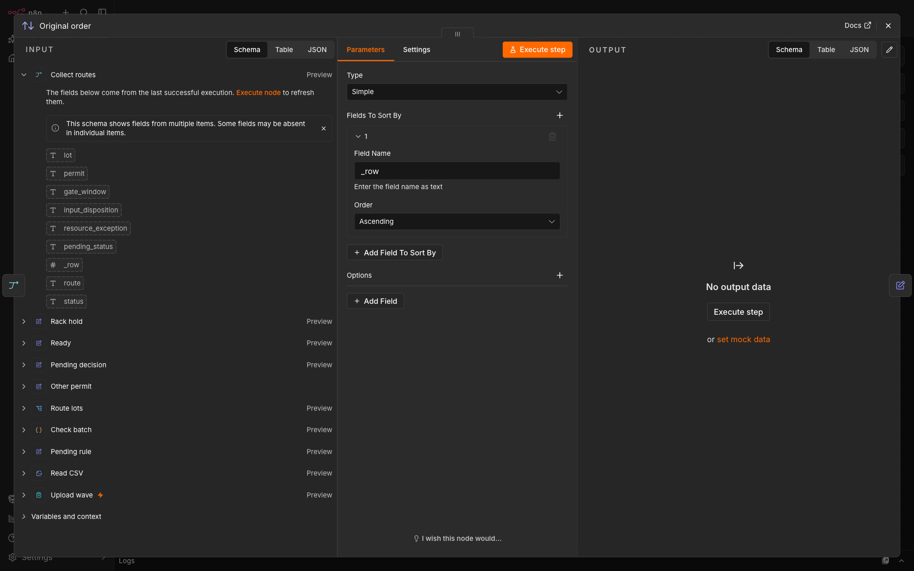

**Expected:** Collect routes connects to Original order, sorting only `_row`. **Stop:** Sorting uses lot, route, or status. **Recovery:** Replace that sort field with `_row`; don't reorder the input file.

### 13. Keep only the receipt columns

From Original order, add **Edit Fields (Set)** named `Receipt fields`. Use Manual Mapping. Add these String fields in this exact order, each in Expression mode: `lot` = `{{$json.lot}}`, `route` = `{{$json.route}}`, `status` = `{{$json.status}}`. Turn **Include Other Input Fields** off. This is the first point where `_row` and source-only fields are removed.

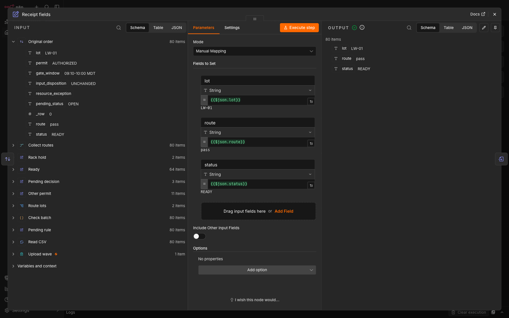

**Expected:** Exactly three fields remain in the stated order. **Stop:** A source field or pending_status is included. **Recovery:** Disable Include Other Input Fields and remove extra assignments.

### 14. Make a downloadable CSV

From Receipt fields, add **Convert to File** named `Make receipt`. Choose **Convert to CSV**. Set **Put Output File in Field** to `data`. Under **Options**, turn **Header Row** on and set **File Name** in Expression mode to `white-rack-{{$execution.id}}.csv`. Keep the remaining CSV options at their defaults. Return to the canvas and trace the complete path from Upload wave through all four branches to Make receipt.

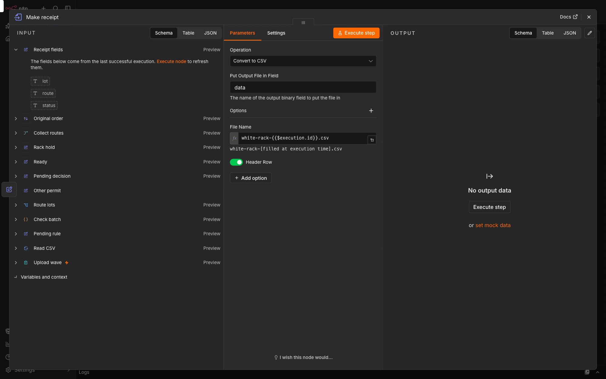

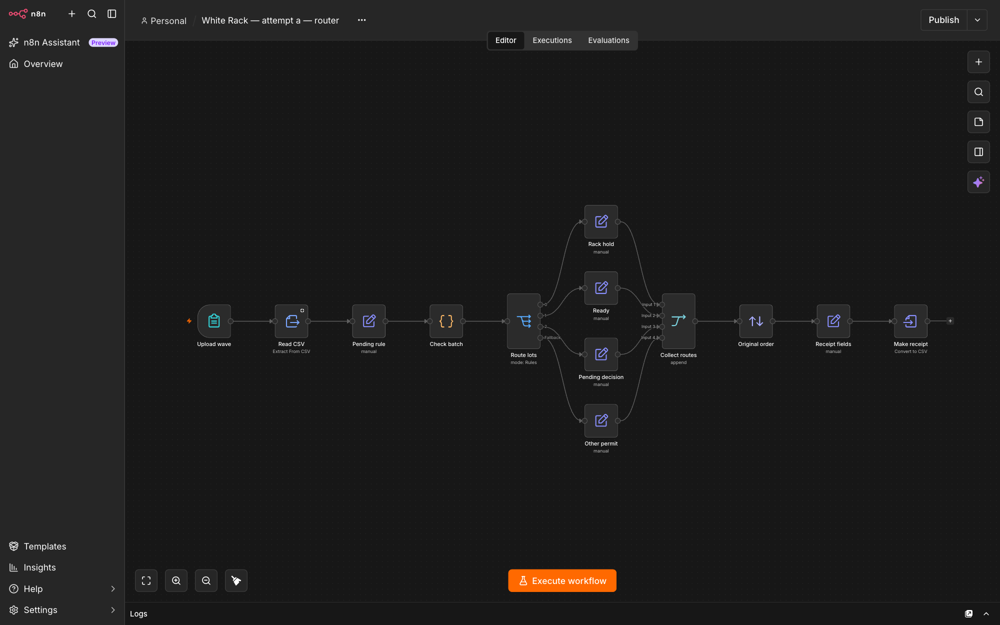

**Expected:** The graph has 13 nodes, with validation before Switch and Sort after Merge. **Stop:** There is an extra path around validation, a missing branch, or a disconnected final node. **Recovery:** Correct the wires before execution. Do not use a completed router import to replace construction.

## Preserve the baseline and prepare the independent checker

Save the untouched router as a file you can restore from, and set up a separate checker that compares receipts without trusting the router.

### 15. Export the original router

Return to Overview, reopen your named router, and inspect Pending rule: `pending_status` must still be Fixed `OPEN`. Return to the canvas. Open the **three-dot menu beside the workflow name** and choose **Export JSON**. Copy the download into `exports/router-baseline.json`. Record the router's name and browser URL in `observations.md`. Keep this exact file unchanged; later exports receive different names.

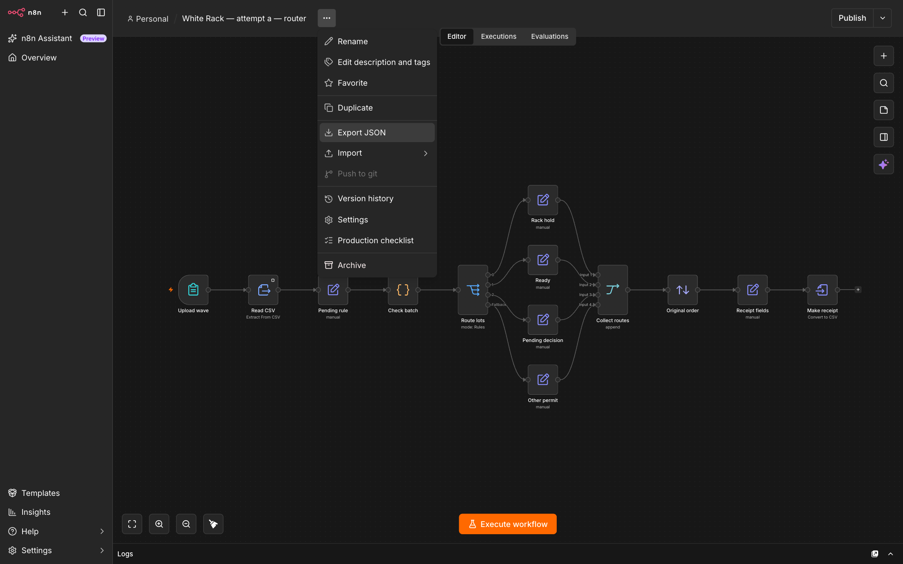

**Expected:** A nonempty baseline JSON export exists before any policy edit. **Stop:** The policy already changed or the file would replace an earlier export. **Recovery:** Preserve what exists and start a separate baseline attempt; don't relabel a changed export as original.

### 16. Import the checker into a new blank workflow

Choose **Overview → Create workflow**. Confirm there are no nodes. Open the **three-dot menu beside the workflow name**, choose **Import → From file**, and select `receipt-checker.json`. Import adds nodes to the open canvas, so never do this on your router. Rename this workflow `White Rack — attempt a — checker` and press Enter. Keep it unpublished.

Confirm the supplied graph: Upload comparison feeds Keep files and hashes input 1 directly, Hash baseline feeds input 2, and Hash actual feeds input 3. The two hash nodes each receive Upload comparison directly. Keep files and hashes combines by position, then feeds Compare complete files → Download report. Keep this supplied graph unchanged. The parallel paths preserve uploaded files while Crypto produces hashes.

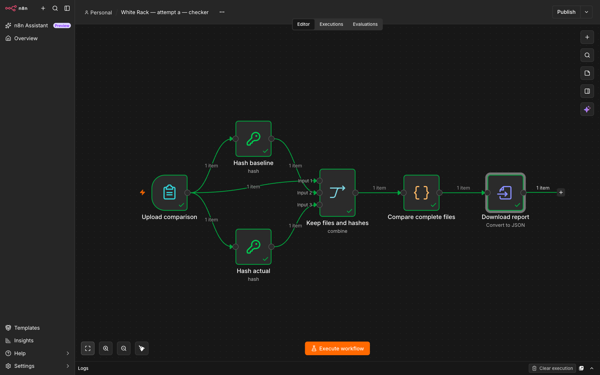

**Expected:** Six nodes appear, with no router nodes. **Stop:** The import created a mixed graph or the hash nodes are chained sequentially. **Recovery:** Leave that workflow unused and import the supplied checker into another new blank workflow.

### 17. Record the original export's digest separately

Open **Upload comparison** and copy its **Test URL**. Return to the canvas and click **Execute workflow**. Wait for the form listener, then open that Test URL in another browser tab. In `baseline`, choose `exports/router-baseline.json`; in `actual`, choose the same file. Set `mode` to `file-identity`. Leave `delta` and `expected_sha256` empty. Click **Submit** once.

Return to the checker editor. Open **Compare complete files → Output → Schema** or **JSON**. Require `result: PASS`, `raw_byte_equal: true`, and `identity_check: initial_record_only`. Double-click the **Download report** node. In the right-hand **OUTPUT** panel, select the **Binary** tab and click **Download** under the file card. Copy it to `reports/baseline-original-identity.json`. This report stores the original SHA256 digest, an identifier for the file's bytes. Keep it outside the export, and record its path in `observations.md`.

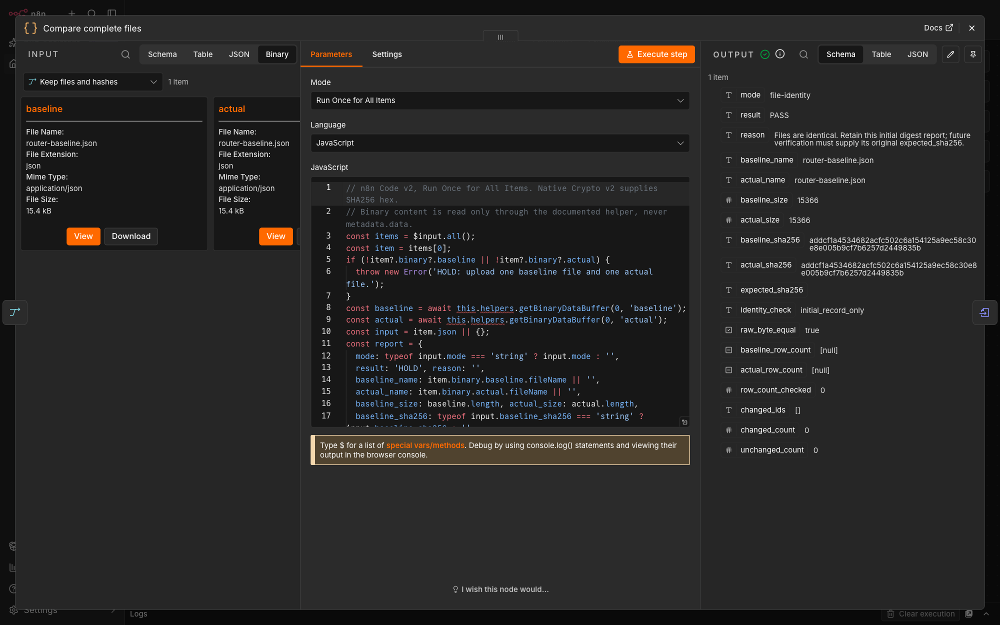

**Expected:** The retained report has equal baseline and actual SHA256 values. **Stop:** The report says HOLD, the files differ, or an expected digest was entered on this initial record. **Recovery:** Preserve the report, select the original export in both fields, and repeat to a new report name. Initial recording establishes a reference; it does not yet prove restoration.

## Run and compare the two baseline waves

Produce the two reference receipts under the unchanged policy and prove they agree with each other before any change is made.

For every form run, re-arm its own workflow with **Execute workflow**, wait for the listener, and use the **Test URL from that workflow**. A form tab from another workflow or an earlier restored copy is not interchangeable. If the form says it is not listening, return to the intended editor, re-arm it, and reopen its Test URL. Submit once per execution. Use the current execution's output, not an older node preview.

### 18. Run and download wave 1 under OPEN

Open your router from Overview. Confirm Pending rule is `OPEN` and your predictions are already saved. Open Upload wave and copy its Test URL. Return to the canvas, click **Execute workflow**, wait for the listener, then open the Test URL. Click **Choose file**, select the unchanged `inputs/wave1.csv`, and click **Submit** once. Return to the editor. Inspect Check batch and Receipt fields outputs: each must contain 80 items. Double-click the **Make receipt** node. In the right-hand **OUTPUT** panel, select the **Binary** tab. Under the `data` file card, click **Download**. Copy the downloaded file to `receipts/wave1-baseline.csv`. Record the execution ID, source name, and retained filename.


**Expected:** All 80 source lots reach the three-column receipt. **Stop:** Validation throws HOLD, a node fails, or the count differs. **Recovery:** Retain the execution error and inspect the first failing node's settings against the construction steps. Don't trim inputs, bypass validation, or manufacture a receipt.

### 19. Run and download wave 2 under OPEN

On the same unchanged router, click **Execute workflow** again. Open its current Test URL, choose `inputs/wave2.csv`, and Submit once. Inspect Check batch and Receipt fields for 80 items. Download Make receipt's Binary file the same way and retain it as `receipts/wave2-baseline.csv`. Record this execution separately. Inspect both baseline receipts against the source decisions in your frozen note without resaving the files.


**Expected:** Both receipts reflect OPEN and rack precedence. **Stop:** A source-based baseline decision is wrong or wave 1 was uploaded again. **Recovery:** Preserve the mistaken run and diagnose the source selection or graph; repeat under a new filename. A byte match cannot by itself prove the routing rule was constructed correctly.

### 20. Prove the two baseline files match exactly

Open the checker, click **Execute workflow**, and open its Test URL after the listener starts. Choose `wave1-baseline.csv` for `baseline` and `wave2-baseline.csv` for `actual`. Select `mode` = `exact`. Leave `delta` and `expected_sha256` empty. Submit once. Inspect Compare complete files, then download the report from Download report's Binary output to `reports/baseline-waves-exact.json`.

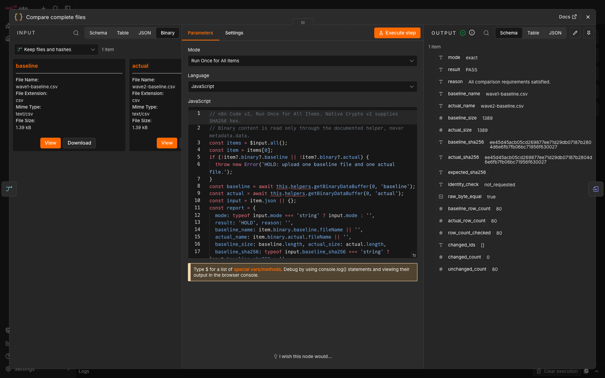

**Expected:** `result` is `PASS`, `raw_byte_equal` is `true`, both row counts and `row_count_checked` are `80`, `changed_count` is `0`, and `unchanged_count` is `80`. **Stop:** Any field disagrees, even if the workflow is green. **Recovery:** Preserve the HOLD report and both receipts. Check uploaded filenames, branch wires, sorting, and receipt columns before a new run. Don't normalize files to make them match.

## Change one saved value and prove both deltas

Change the single policy value, rerun both waves, and prove the checker sees exactly your predicted changes and nothing else.

### 21. Save only the intended policy change

Return to your router. Recheck that the original export, original identity report, both baselines, baseline exact report, and frozen predictions are retained. Open Pending rule. Change only its Fixed String value from `OPEN` to `NOT_AUTHORIZED`. Return to Overview and reopen the same router; confirm the new value persisted. Leave the workflow name, every other setting, every wire, and every input unchanged. Record the node, field, old value, and new value in `observations.md`.

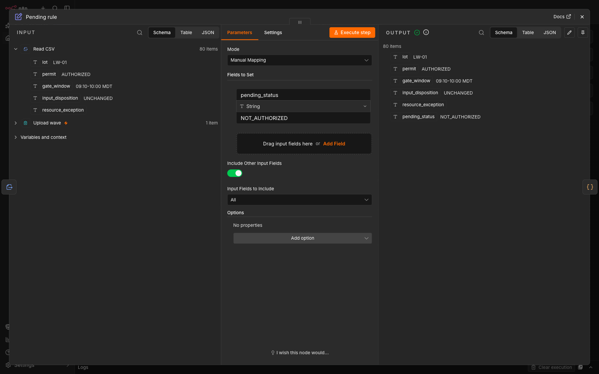

**Expected:** One saved parameter changed: Pending rule's `pending_status`. **Stop:** Another parameter, expression, wire, or input changed. **Recovery:** Preserve the attempt and exports. Use a new baseline attempt if you cannot establish the single change; don't rewrite evidence to conceal extra edits.

### 22. Run and retain both changed receipts

Click Execute workflow on the changed router, wait, open its Test URL, upload `wave1.csv`, and Submit once. Check for 80 receipt items and download the Binary CSV as `receipts/wave1-changed.csv`. Re-arm the same router and repeat with `wave2.csv`, retaining `receipts/wave2-changed.csv`. Record both execution IDs and filenames. Do not change the policy between runs.


**Expected:** Each run produces 80 receipt rows under the same changed policy. **Stop:** A run fails, a count differs, or the source is uncertain. **Recovery:** Keep the failed run and inspect the first error or upload selection. Repeat only to new filenames after resolving the cause.

### 23. Prove wave 1's predicted change

Re-arm the checker and open its Test URL. Set `baseline` to `wave1-baseline.csv`, `actual` to `wave1-changed.csv`, `delta` to the frozen `wave1-delta.csv`, and `mode` to `predicted-change`. Leave `expected_sha256` empty. Submit, inspect Compare complete files, and download the report as `reports/wave1-predicted-change.json`.

The checker compares every row. It requires declared before and after values to match, each declared change to occur, and every undeclared row to remain byte-identical. It also checks count, order, header, byte-order mark, quotes, and line endings. It does not infer your prediction from the output.

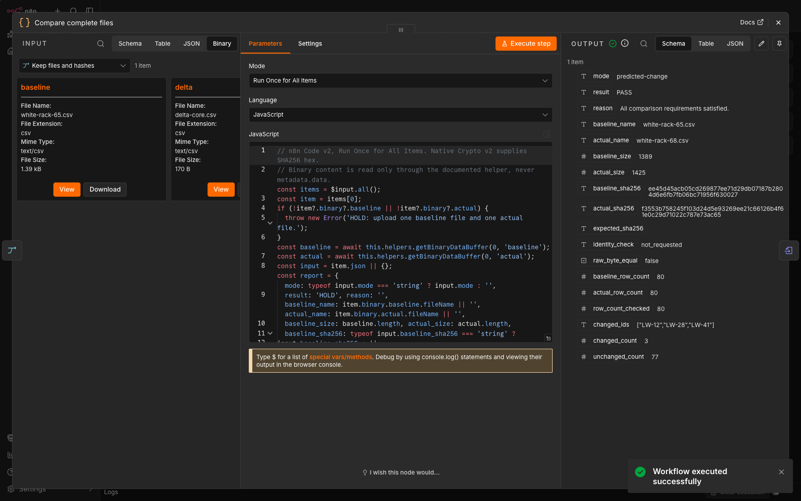

**Expected:** `PASS`, both row counts and `row_count_checked` equal `80`, and changed plus unchanged counts total `80`. `changed_ids` must exactly match your frozen wave 1 list; rack claimants must be absent. **Stop:** A prediction is missing, extra, or incorrect, or any undeclared bytes differ. **Recovery:** Keep the HOLD report and original prediction. Explain the mismatch in observations; don't revise the prediction after seeing output and call that the original proof.

### 24. Prove wave 2's predicted change

Re-arm the checker. Upload `wave2-baseline.csv`, `wave2-changed.csv`, and the frozen `wave2-delta.csv` in their matching fields. Select `predicted-change`, leave expected_sha256 empty, and Submit. Download the report as `reports/wave2-predicted-change.json`.

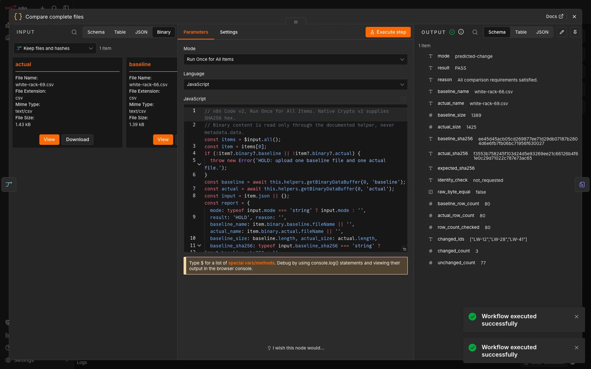

**Expected:** `PASS`, 80 baseline rows, 80 actual rows, and 80 rows checked. The changed IDs match only wave 2's frozen prediction, and all remaining rows are byte-identical. **Stop:** The report uses wave 1 files, moves a rack claimant, or returns HOLD. **Recovery:** Preserve it and inspect the exact filenames and source cells. Use a new report name for a corrected file selection; preserve any mistaken prediction as written.

### 25. Export the changed workflow separately

Open the changed router's **three-dot menu beside the workflow name** and choose **Export JSON**. Retain the download as `exports/router-changed.json`. Keep the baseline export and original digest report untouched. Record the changed router's name, URL, export path, and the two changed execution IDs in `observations.md`.

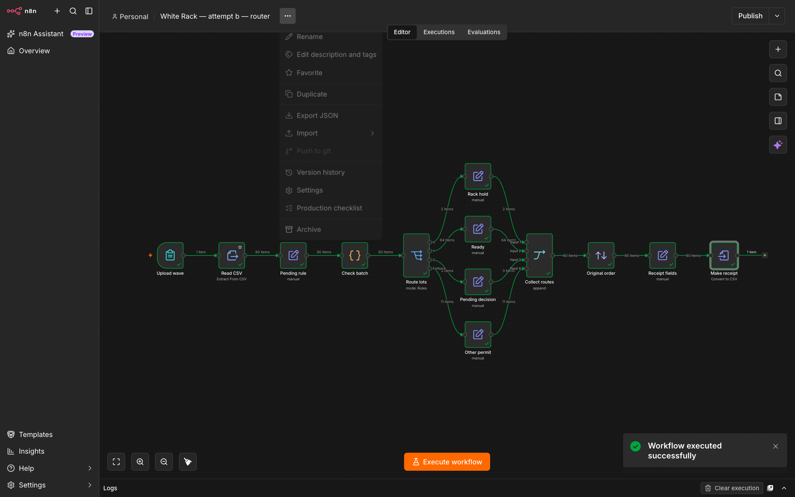

**Expected:** Both baseline and changed exports exist as distinct files. **Stop:** The destination would replace router-baseline.json. **Recovery:** Cancel the replacement and use the changed filename. If the original was overwritten, stop; a new hash cannot recover the old reference.

## Restore the preserved baseline and prove both reruns

Put the original router back from the saved export, then prove the restored copy produces the baseline receipts byte for byte.

### 26. Recheck the original export against its retained digest

Open `reports/baseline-original-identity.json` read-only and copy its original `baseline_sha256` value. Re-arm the checker. Upload the preserved `router-baseline.json` in both file fields, select `file-identity`, leave delta empty, and paste the original value into `expected_sha256`. Submit and download `reports/baseline-identity-recheck.json`.

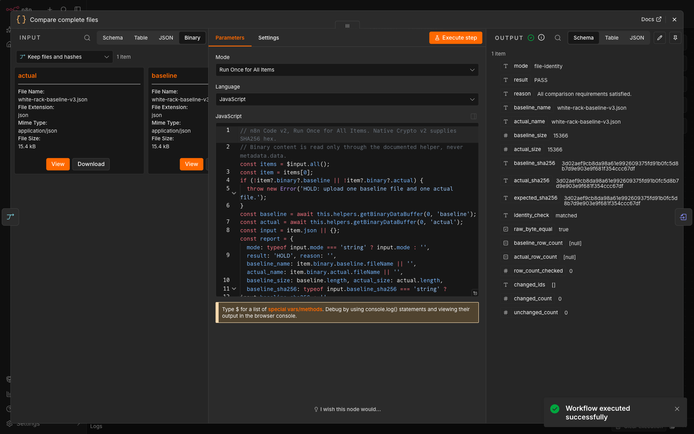

**Expected:** `PASS`, `identity_check: matched`, `raw_byte_equal: true`, and expected_sha256 equals the original retained digest. **Stop:** The result is mismatch or initial_record_only, or the original report is missing. **Recovery:** Preserve the failure and locate the original file and report. Never calculate a replacement expected digest from the file you are trying to verify.

### 27. Restore into a NEW BLANK workflow

Choose **Overview → Create workflow**. Confirm the canvas is completely empty. Only then open the **three-dot menu beside the workflow name**, choose **Import → From file**, and select the exact `router-baseline.json` that passed the digest recheck. Import adds nodes; it does not replace a populated canvas. Rename the new workflow `White Rack — attempt a — restored` and press Enter. Keep it unpublished. Open Pending rule and confirm `OPEN`. Trace the 13-node graph and all four Merge inputs. Leave the changed router intact.

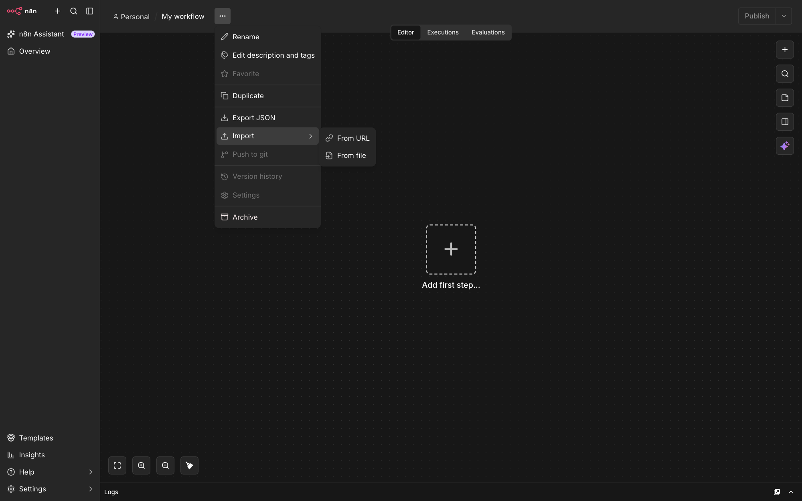

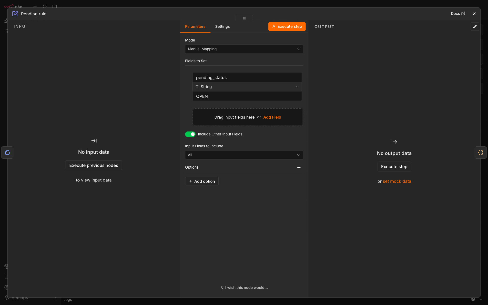

**Expected:** A distinct restored workflow contains one router graph with OPEN. **Stop:** There are duplicate nodes, checker nodes, or NOT_AUTHORIZED remains. **Recovery:** Leave that mixed workflow unused. Create another new blank workflow and import the verified original export. Don't turn the changed value back by hand and call that an import restore.

### 28. Run restored wave 1

Open Upload wave in the restored workflow and copy its own Test URL. Click Execute workflow, wait for the listener, open that URL, upload unchanged `wave1.csv`, and Submit once. Check for 80 receipt items. Download the new Binary CSV as `receipts/wave1-restored.csv`. Record the restored workflow URL and execution ID.


**Expected:** The execution belongs to the restored workflow, not the old router. **Stop:** An old form tab submits to the changed workflow or a row count differs. **Recovery:** Preserve the mistaken run, copy the restored workflow's own Test URL, and repeat to a new receipt name.

### 29. Prove restored wave 1 is exact

Re-arm the checker. Upload `wave1-baseline.csv` as baseline and `wave1-restored.csv` as actual. Select `exact`; leave delta and expected_sha256 empty. Submit and download `reports/wave1-restored-exact.json`.

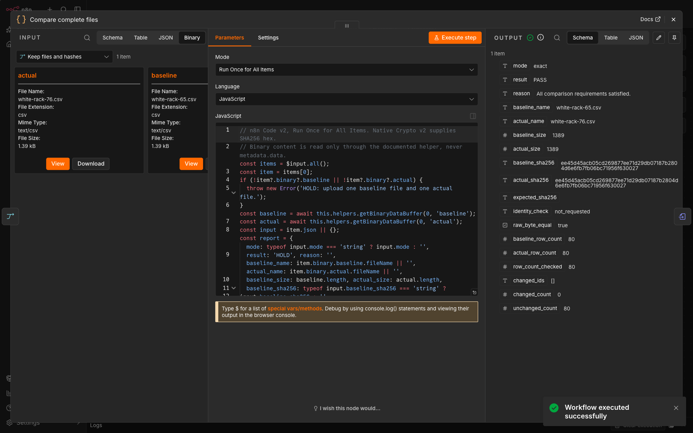

**Expected:** `PASS`, raw byte equality true, both row counts and checked count `80`, changed count `0`, unchanged count `80`. **Stop:** Any byte differs or the report checks different files. **Recovery:** Keep the report. Check workflow identity, the imported export's digest, and upload selection; don't edit receipt bytes.

### 30. Run restored wave 2

Re-arm the restored router, open its own Test URL, upload unchanged `wave2.csv`, and Submit once. Inspect the 80 receipt items and download `receipts/wave2-restored.csv`. Record the execution ID and source filename.

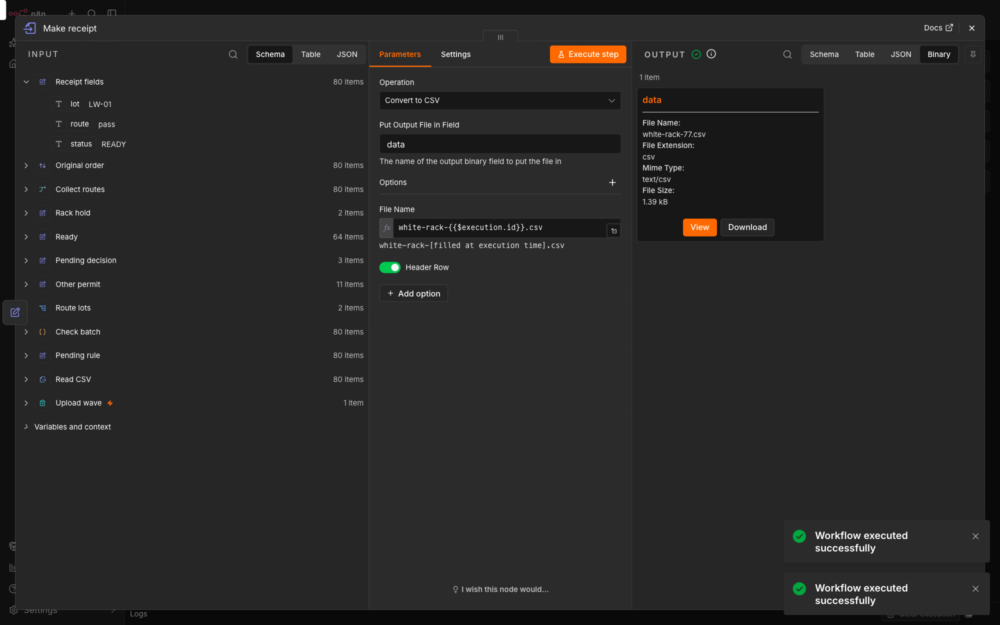

**Expected:** The restored OPEN graph produces the second retained restored receipt. **Stop:** The workflow, policy, source, or item count is wrong. **Recovery:** Preserve the execution and resolve the specific mismatch before downloading a new attempt.

### 31. Prove restored wave 2 is exact

Re-arm the checker. Upload `wave2-baseline.csv` as baseline and `wave2-restored.csv` as actual. Select `exact`, leave delta and expected_sha256 empty, and Submit. Download `reports/wave2-restored-exact.json`.

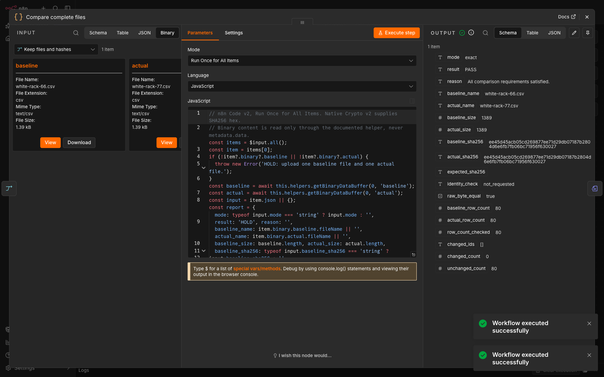

**Expected:** `PASS`, raw byte equality true, 80 rows on both sides and checked, zero changed, and 80 unchanged. **Stop:** The report holds or only wave 1 has a restored proof. **Recovery:** Preserve the evidence and resolve wave 2 independently. One matching wave does not establish the other.

## Keep a usable operating record

In `observations.md`, retain the attempt path; all three workflow names and URLs; input filenames; execution IDs; baseline and changed export paths; original and rechecked digest reports; six receipt paths; and the five receipt comparison reports. State the one saved change and whether each comparison passed or held. Keep the original frozen predictions separately. Reports contain receipt sizes and hashes; refer to the actual retained values rather than copying a screenshot's digest.

Explain any mismatch using the source cells, node settings, or selected files. State that input disposition never chose a route and rack precedence held. Screenshots show settings and execution context; the downloaded checker reports establish file comparison results. Leave a held attempt intact, and label any later attempt separately.

<details class="rf-stretch" markdown="1">
<summary>Optional stretch: separate an input revision from the policy change</summary>

Download [wave2-revised.csv](batch/wave2-revised.csv) into inputs. Before running it, compare its source cells with wave2.csv. Freeze two new delta CSVs using the same five-column prediction header: `revised-input-delta.csv` predicts wave 2 baseline → revised wave baseline with OPEN fixed; `revised-policy-delta.csv` predicts revised wave baseline → revised wave changed with the revised input fixed. Create a separate note naming each source-cell change, every unchanged row requirement, and rack precedence. Use a header-only delta when no output changes are predicted. Do not use a comparison that changes both input and policy at once to explain either effect.

**Expected:** Both predictions exist before either revised run. **Stop:** A prediction depends on results already seen. **Recovery:** Preserve the observation and label a new attempt honestly.

### 32. Produce the revised baseline with policy fixed

Open the restored router and confirm OPEN. Re-arm it, open its Test URL, upload wave2-revised.csv, and Submit. Check for 80 receipt items and download `receipts/wave2-revised-baseline.csv`. Keep the restored policy unchanged.


**Expected:** Only the input differs from the retained wave 2 baseline condition. **Stop:** Policy is NOT_AUTHORIZED or the wrong input was uploaded. **Recovery:** Keep that run and repeat on the correct restored graph with a new filename.

### 33. Prove the input-only effect

Re-arm the checker. Upload `wave2-baseline.csv` as baseline, `wave2-revised-baseline.csv` as actual, and frozen `revised-input-delta.csv` as delta. Select predicted-change, leave expected_sha256 empty, and Submit. Download `reports/revised-input-delta.json`.

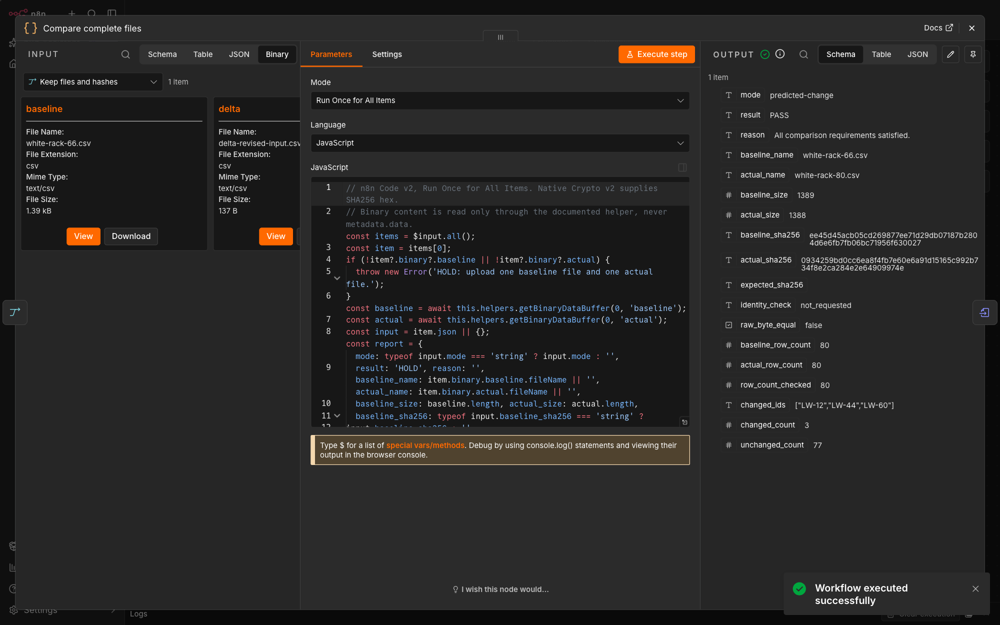

**Expected:** PASS with all 80 rows checked and exactly the frozen input changes. **Stop:** Any other row differs or a rack hold changes unexpectedly. **Recovery:** Preserve the report and inspect the two source files and original prediction; don't rewrite the delta to fit the result.

### 34. Produce the revised changed receipt on the retained changed router

Open the original changed router, not the restored one. Confirm Pending rule is still NOT_AUTHORIZED. Re-arm it, open its own Test URL, upload the same wave2-revised.csv, and Submit. Check for 80 receipt items and download `receipts/wave2-revised-changed.csv`. No additional policy edit is needed.

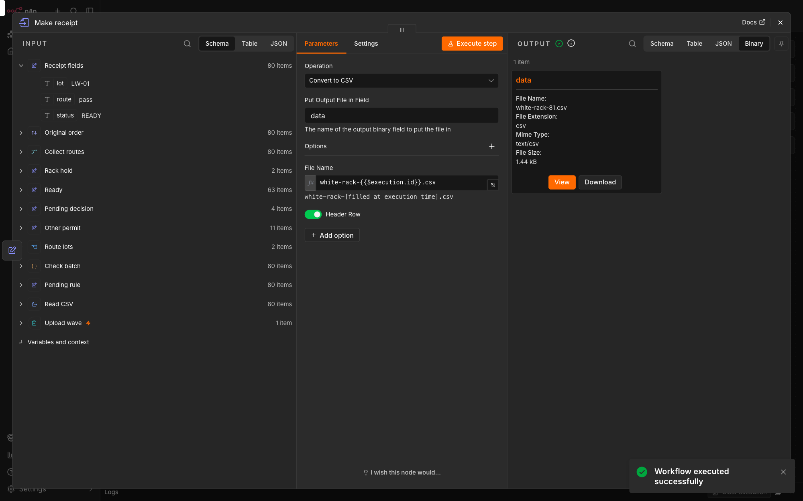

**Expected:** The revised input stays fixed and only the saved policy differs between the two revised conditions. **Stop:** A source file or another setting changed. **Recovery:** Preserve the run and select the retained changed workflow and unchanged revised input.

### 35. Prove the policy-only effect

Re-arm the checker. Choose `wave2-revised-baseline.csv` for baseline, `wave2-revised-changed.csv` for actual, and frozen `revised-policy-delta.csv` for delta. Select predicted-change, leave expected_sha256 empty, and Submit. Download `reports/revised-policy-delta.json`. Append the two separate observed effects to observations without changing either frozen prediction.

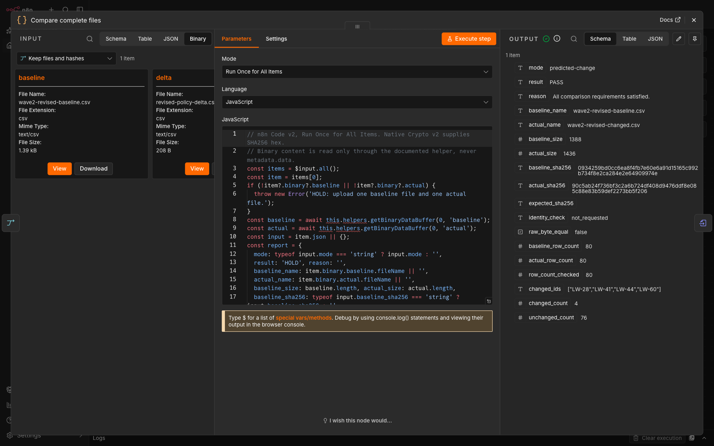

**Expected:** PASS with 80 rows checked, only predicted policy changes, and every other serialized row byte-identical. **Stop:** The comparison mixes original input with revised input, or returns HOLD. **Recovery:** Preserve the report and correct a mistaken selection in a separately named run. A prediction mismatch remains recorded. Keep the restored workflow at OPEN and the retained changed workflow at NOT_AUTHORIZED.

</details>
