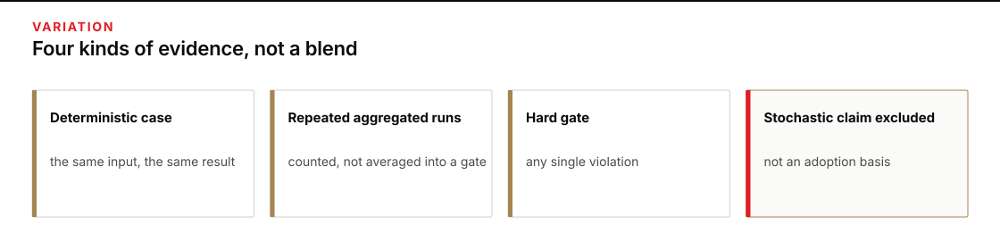

# Module 7 · Evaluate a change with variation controls

Decide whether a proposed change produces desk briefs that meet every required condition. Freeze the cases, configurations, and rejection rule before opening results. Compare each candidate with its baseline on the same 40 cases, retain every failure, and verify restoration of the original controls.

The Slope Brief case concerns heater-fuel cans from Ridge Depot to Clinic T-8 on vehicle SB-4. The core comparison uses authored practice briefs. It cannot establish live model improvement. The optional live comparison uses repeated attempts to distinguish an instruction's effect from ordinary differences between runs.

Plan for 2 hours 15 minutes on Thursday, including 2 hours of practice. This is a planning allowance, not a measured completion guarantee.

## Start here
1. [Evaluate the paired cases](shared/MODULE_07_LAB.md) using a decision rule saved before results.

## The hard gates
A **hard gate** is a required condition that a better result elsewhere cannot offset. Any single violation defeats a candidate, even if its average looks better.

- The brief must follow the required three-row form; a malformed brief fails the format gate.
- Payload mass must be the exact number that appears in the authoritative `#payload` record, and the Source cell must name that record. A **locator**, such as `#payload`, identifies the exact source record that supports a value.
- Gate times must name both the UTC value and the MDT value exactly as they appear in the authoritative `#gate` record, and the Source cells must name that locator.

Each time value must carry its required zone label in the correct cell. A UTC label elsewhere does not fix a missing label. A clock value without its zone fails the gate.

A malformed source packet or one belonging to a different case stops the whole comparison before results are written. It is not a candidate failure or a repair-cost observation. A malformed candidate brief under valid sources is a format-gate failure and remains in the comparison.

*Keep exact file-check results, repeated live observations, hard-gate violations, and differences between model runs in separate columns.*

## Class-only boundary
All names, hours, and masses used as defects are fictional course fixtures. Do not use this packet to plan, authorize, dispatch, or describe a real movement. A module result permits only class review.
