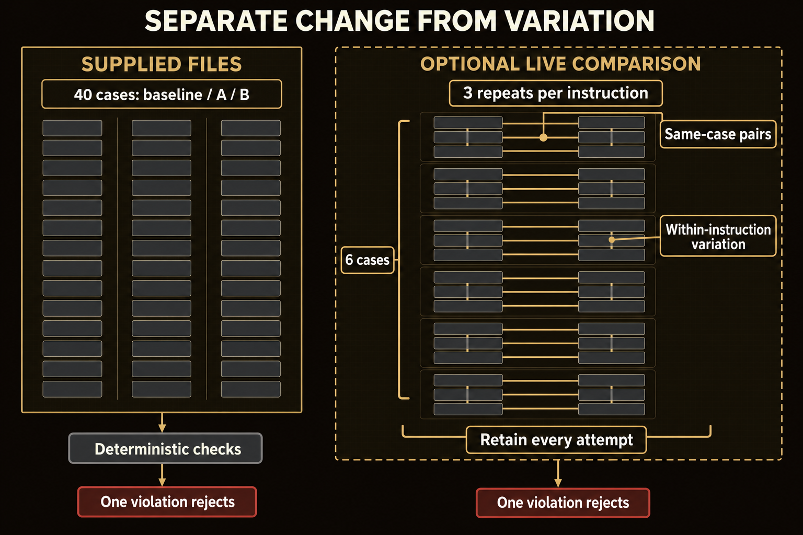

# Module 8 · Evaluate a change with variation controls

Decide whether a proposed change produces desk briefs that meet every required condition. Freeze the cases, configurations, and rejection rule before opening results. Compare each candidate with its baseline on the same 40 cases, keep every failure, and restore the original controls.

The Slope Brief case covers heater-fuel cans moving from Ridge Depot to Clinic T-8 on vehicle SB-4. The core comparison uses practice briefs written in advance, so it can't show that a live model improved. The optional live comparison repeats attempts to separate an instruction's effect from ordinary differences between runs.

Plan for a little over two hours on Thursday (a rough estimate).

## Start here
1. [Evaluate the paired cases](shared/MODULE_08_LAB.md). Save your decision rule before you see results.

## The hard gates
A **hard gate** is a required condition that a better result elsewhere can't make up for. One violation rejects a candidate, even if its average looks better.

- The brief must use the required three-row form; a malformed brief fails the format gate.
- Payload mass must match the exact number in the authoritative `#payload` record. The Source cell must name that record. A **locator**, such as `#payload`, identifies the source record for a value.
- Gate times must give both the UTC and MDT values exactly as they appear in the authoritative `#gate` record. The Source cells must name that locator.

Each time value needs its zone label in the correct cell. A UTC label elsewhere can't fix a missing one. A clock value without its zone fails the gate.

A malformed source packet, or one from another case, stops the comparison before results are written. It isn't a candidate failure and doesn't count toward repair cost. A malformed candidate brief with valid sources fails the format gate and stays in the comparison.

*Supplied-file checks do not measure model variation; repeated live pairs separate observed between-instruction disagreements from within-instruction variation.*

Figure text

Separate change from variation. There are two evidence lanes, and their results are never pooled.

- **Supplied files.** The same 40 cases each have a baseline, A, and B brief. Deterministic checks read these fixed files. Repeating those checks gives the same answer, so they do not measure model variation. One violation rejects a candidate.
- **Optional live comparison.** Six cases (PC-01 to PC-06) are planned. Each case has three repeat slots for the baseline instruction and three for the checked instruction. Same-case pairs join a baseline attempt to a checked attempt on the same case. Within-instruction variation compares the repeats of one instruction on one case. Every attempt is retained. One violation rejects adoption.

The live lane follows a sequence recorded before any call runs. Calls alternate the order of baseline and checked instructions. Within each pair, the model, source/form pair, prompt, and permissions stay fixed. That makes 36 comparison calls. After them, the baseline is restored and two restored controls run on PC-01 and PC-02. These are planned observations, not results. A finished sequence does not prove that either instruction is better.

## Class-only boundary
The Slope Brief case is fictional: heater-fuel cans move from Ridge Depot to Clinic T-8 on vehicle SB-4. Names, hours, and masses used as defects are fictional course fixtures. Don't use this packet to plan, authorize, dispatch, or describe a real movement. Results are for class review only.
