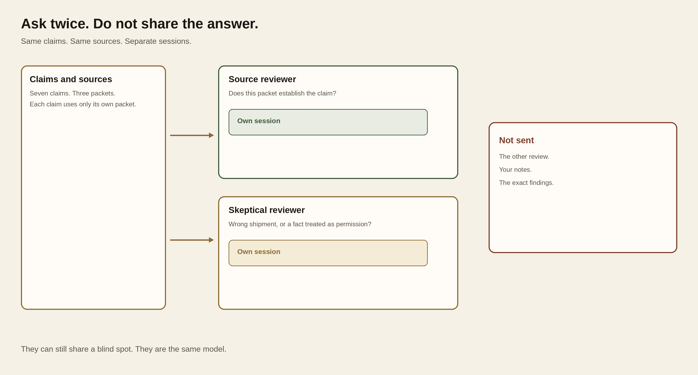
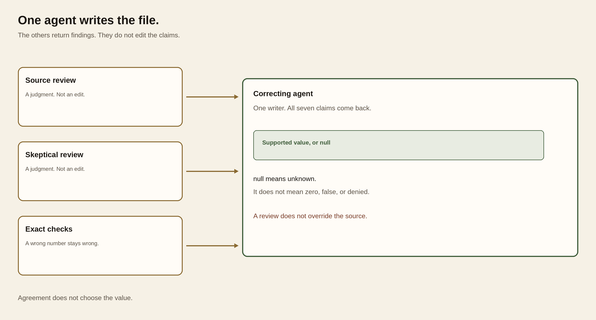
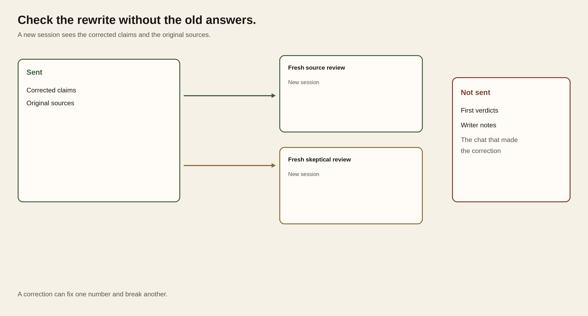

# Module 8 · Control hallucinations

Run five sessions on one brief. Code checks the numbers and the quotes. Two reviewers judge whether each claim's own packet supports it. A third rewrites the claims. You read the sources and decide. Agreement is not support. Plan for a little over two hours.

## How the check works

```text
claims.json                         PC-01  PC-02  PC-03
7 claims                            each claim uses only its own packet
        |
        v
   freeze  →  exact checks
        |
        +-- source reviewer      fresh session
        +-- skeptical reviewer   fresh session
        |
        v
   you read both against the sources
        |
        v
   correcting agent
   all 7 claims; null means unknown
        |
        +-- source reviewer      fresh session, no old verdicts
        +-- skeptical reviewer   fresh session, no old verdicts
        |
        v
   you decide
   dispatch stays HOLD
```

The draft is planted practice data. It is not a live model failure. An exact check catches a wrong number, unit, zone, or a quote that is not in the record. It does not decide whether a real quote supports the sentence.

Both reviewers are the same model, `openrouter/anthropic/claude-sonnet-4.6`, in separate sessions. They can share a blind spot. Neither sees the other review. After correction they start again and do not see their old answers.

`null` means unknown. It does not mean zero, false, or permission denied. A `PASS` line means the files were saved. It does not mean the brief is true, and it does not dispatch the vehicle.

PC-01 has two mass records. `SB-PC-01#payload` is 2211 kg for SB-4 to Clinic T-8. `SB-PC-01#payload-s14` is 2255 kg for a different shipment. Two reviewers can quote the yard note and agree on 2255 kg. The quote is real. The shipment is not.

## Slope Brief

Heater-fuel cans, Ridge Depot to Clinic T-8, vehicle `SB-4`. Seven claims, `C01` through `C07`. The packets are PC-01, PC-02, and PC-03. Do not combine clocks or masses across packets. The brief does not authorize departure.

## Three patterns

Three patterns cover the useful multi-agent work. Fan-out gets a second look that cannot copy the first. One writer turns those looks into one artifact. Fresh review checks that artifact without the old answers. A vote is not a fourth pattern. Agreement is not support.

### Fan-out

Two agents get the same claims and the same sources. Each has its own session. Neither sees the other answer. Use it when you need a second judgment and the second agent does not need the first result. Do not use it when the second job cannot start until the first one finishes.



*Same claims go to two sessions. Neither session sees the other answer.*

On this brief, the source reviewer and the skeptical reviewer are a fan-out. The terminal runs one command, then the next. That order does not share their answers.

### One writer

The findings join. One agent writes the corrected claims. The others do not edit that file. Use it when the product is one claim set, one brief, or one spreadsheet. Do not let two agents write the same rows.



*Reviews and exact checks go to one writer. A review is not an edit.*

The correcting agent is the writer. It sees both reviews and the exact findings. It returns all seven claims. A review is a suggestion. It does not override the source.

### Fresh review

A new session reads the writer's output and the original sources. It does not read the first verdicts or the writer's notes. Use it after a correction. The session that wrote the claims will defend them.



*The corrected claims and the sources go to new sessions. The first verdicts stay out.*

The after reviews are a fresh review. A correction can fix one number and break another. The first reviewers do not grade their own earlier answers.


## Start

Use the Python, Oh My Pi, and OpenRouter key you already checked in [setup](../../module-00-setup/README.md). These commands make a new attempt. They do not touch an earlier one.

**Terminal: Bash or zsh, ordinary user.**

```bash
R="$HOME/Documents/AIHB_OCT_2026"
PY="$(for candidate in python3.12 python3 python; do "$candidate" -c 'import sys; sys.exit(1) if sys.version_info < (3, 12) else print(sys.executable)' 2>/dev/null && break; done)"
[ -n "$PY" ] || echo 'HOLD: Python 3.12 or newer is required.' >&2
M="$R/AI_Harness_Bootcamp_2/module-08-change-eval"
RUN="$(date -u +%Y%m%dT%H%M%SZ)-$$"
mkdir -p "$HOME/course-evidence" && printf '%s\n' "$RUN" > "$HOME/course-evidence/module-08-run" && printf 'RUN=%s\n' "$RUN"
W="$HOME/course-evidence/module-08-$RUN/work"
E="$HOME/course-evidence/module-08-$RUN/evidence"
"$PY" "$R/shared/prepare_work.py" 08 "$W"
```

**Terminal: PowerShell, ordinary user.**

```powershell
$R = "$HOME\Documents\AIHB_OCT_2026"
$PY = $(foreach ($candidate in 'python3.12','python3','python') { try { $resolved = & $candidate -c 'import sys; sys.exit(1) if sys.version_info < (3,12) else print(sys.executable)' 2>$null; if ($LASTEXITCODE -eq 0 -and $resolved) { $resolved.Trim(); break } } catch {} })
if (-not $PY) { throw 'HOLD: Python 3.12 or newer is required.' }
$M = "$R\AI_Harness_Bootcamp_2\module-08-change-eval"
$RUN = [guid]::NewGuid().ToString('N')
New-Item -ItemType Directory -Force -Path "$HOME\course-evidence" | Out-Null; Set-Content -LiteralPath "$HOME\course-evidence\module-08-run" -Value $RUN; "RUN=$RUN"
$W = "$HOME\course-evidence\module-08-$RUN\work"
$E = "$HOME\course-evidence\module-08-$RUN\evidence"
& $PY "$R\shared\prepare_work.py" 08 "$W"
if ($LASTEXITCODE -ne 0) { throw 'Preparation stopped; preserve this attempt.' }
```

**Expected:** `RUN=` and an identifier, then `PASS: created`. Record the identifier. The work folder contains the claims and the three packets.

**Stop:** Stop if preparation fails, the destination already exists, or Python is older than 3.12.

**Recovery:** Keep the attempt. Fix the missing piece through setup, then prepare again with a new `RUN`. Do not delete an earlier attempt.

A new terminal forgets `RUN`, `W`, and `E`. Reload them. Do not prepare a second copy.

**Terminal: Bash or zsh, ordinary user.**

```bash
R="$HOME/Documents/AIHB_OCT_2026"
PY="$(for candidate in python3.12 python3 python; do "$candidate" -c 'import sys; sys.exit(1) if sys.version_info < (3, 12) else print(sys.executable)' 2>/dev/null && break; done)"
[ -n "$PY" ] || echo 'HOLD: Python 3.12 or newer is required.' >&2
RUN="$(cat "$HOME/course-evidence/module-08-run")"
M="$R/AI_Harness_Bootcamp_2/module-08-change-eval"
W="$HOME/course-evidence/module-08-$RUN/work"
E="$HOME/course-evidence/module-08-$RUN/evidence"
printf '%s\n' "RUN=$RUN" "W=$W"
```

**Terminal: PowerShell, ordinary user.**

```powershell
$R = "$HOME\Documents\AIHB_OCT_2026"
$PY = $(foreach ($candidate in 'python3.12','python3','python') { try { $resolved = & $candidate -c 'import sys; sys.exit(1) if sys.version_info < (3,12) else print(sys.executable)' 2>$null; if ($LASTEXITCODE -eq 0 -and $resolved) { $resolved.Trim(); break } } catch {} })
if (-not $PY) { throw 'HOLD: Python 3.12 or newer is required.' }
$RUN = (Get-Content -LiteralPath "$HOME\course-evidence\module-08-run" -Raw).Trim()
$M = "$R\AI_Harness_Bootcamp_2\module-08-change-eval"
$W = "$HOME\course-evidence\module-08-$RUN\work"
$E = "$HOME\course-evidence\module-08-$RUN\evidence"
"RUN=$RUN"; "W=$W"
```

**Expected:** `RUN=` matches the identifier you recorded, and `W=` names the existing work folder.

**Stop:** Stop if the identifier differs or the work folder is missing.

**Recovery:** Set `RUN` to the identifier you wrote down, then set `W` and `E` from it. A new terminal also needs the key again before a paid call.

Paste the first command by itself and press Enter. Type the key at the hidden prompt and press Enter again. Then paste the second block. Do not put the key in a note, a file, or the chat.

**Terminal: Bash or zsh, ordinary user.**

```bash
IFS= read -r -s OPENROUTER_API_KEY
```

**Terminal: PowerShell, ordinary user.**

```powershell
$secret = Read-Host 'OpenRouter key' -AsSecureString
```

**Expected:** The terminal waits for the key without showing it, then returns to the prompt.

**Stop:** Stop if the key appears on screen.

**Recovery:** Cancel with Ctrl+C and close the terminal. If the key was exposed, revoke it at OpenRouter and use a replacement.

**Terminal: Bash or zsh, ordinary user.**

```bash
export OPENROUTER_API_KEY
if [ -n "${OPENROUTER_API_KEY:-}" ]; then printf 'SET\n'; else printf 'MISSING\n'; fi
```

**Terminal: PowerShell, ordinary user.**

```powershell
$bstr = [IntPtr]::Zero
try {
  $bstr = [Runtime.InteropServices.Marshal]::SecureStringToBSTR($secret)
  $env:OPENROUTER_API_KEY = [Runtime.InteropServices.Marshal]::PtrToStringBSTR($bstr)
} finally {
  if ($bstr -ne [IntPtr]::Zero) { [Runtime.InteropServices.Marshal]::ZeroFreeBSTR($bstr) }
  if ($secret) { $secret.Dispose() }
  Remove-Variable secret,bstr -ErrorAction SilentlyContinue
}
if ([string]::IsNullOrWhiteSpace($env:OPENROUTER_API_KEY)) { 'MISSING' } else { 'SET' }
```

**Expected:** `SET`. That shows the key is in this terminal. It does not show that the key is valid or has credit.

**Stop:** Stop if you see `MISSING`, or if any part of the key appears.

**Recovery:** Repeat the hidden prompt. Do not print the environment to find the key.

## 1. Read the claims

Open `W/shared/case/claims.json` and the three `PC-*/sources.json` files. Read the text of a record, not only its fields. `authoritative: true` means the record is the source for its own fact. It does not release the vehicle.

Create `W/notes.md`. Name one claim you would use, one you would stop, and the PC-01 pair: `SB-PC-01#payload` and `SB-PC-01#payload-s14`. For each, write the claim ID, the source locator, and why. A missing permission is not proof that permission was denied.

**Expected:** Your notes name a usable claim, a claim to stop, and which PC-01 record belongs to SB-4.

**Stop:** Stop if you cannot tell which source belongs to the claim.

**Recovery:** Keep that claim unknown and name the packet you checked. Do not fill the gap from memory or a web search.

## 2. Freeze

Freeze the claims and sources before any review. This command makes no model call.

**Terminal: Bash or zsh, ordinary user.**

```bash
"$PY" "$M/scripts/hallucination.py" freeze --work "$W" --out "$E"
```

**Terminal: PowerShell, ordinary user.**

```powershell
& $PY "$M\scripts\hallucination.py" freeze --work "$W" --out "$E"
if ($LASTEXITCODE -ne 0) { throw 'Freeze stopped; preserve this attempt.' }
```

**Expected:** `PASS: frozen 7 claims`. Open `E/initial-checks.json` and compare it with your notes. The saved `frozen` folder keeps the draft and the sources.

**Stop:** Stop if you see `HOLD:`, the evidence folder already exists, or an input is missing.

**Recovery:** Keep the error. Prepare a fresh attempt. Do not edit a frozen source to make a check pass.

## 3. Two first reviews

Run the source reviewer, then the skeptical reviewer. Each gets the frozen claims and sources. Neither gets the other review, your notes, or the exact findings. Do not rerun a finished review to get a nicer answer.

**Terminal: Bash or zsh, ordinary user.**

```bash
"$PY" "$M/scripts/hallucination.py" review --attempt "$E" --reviewer source --phase before &&
"$PY" "$M/scripts/hallucination.py" review --attempt "$E" --reviewer skeptic --phase before
```

**Terminal: PowerShell, ordinary user.**

```powershell
& $PY "$M\scripts\hallucination.py" review --attempt "$E" --reviewer source --phase before
if ($LASTEXITCODE -ne 0) { throw 'Source review stopped; preserve this attempt.' }
& $PY "$M\scripts\hallucination.py" review --attempt "$E" --reviewer skeptic --phase before
if ($LASTEXITCODE -ne 0) { throw 'Skeptical review stopped; preserve this attempt.' }
```

**Expected:** `PASS: before source review` and `PASS: before skeptic review`. The reviews are `E/reviews/before-source.json` and `before-skeptic.json`. A review that passes can still be wrong.

**Stop:** Stop if either command holds, a claim is missing, or a quotation is not in the cited record.

**Recovery:** Keep the whole attempt, including the raw response. Do not rerun a finished review under the same name or edit its response. Start a new attempt only after the named problem is fixed. Do not mix reviews from different attempts.

## 4. Read both reviews

Open both reviews beside `initial-checks.json` and the sources. For each disagreement or shared mistake, write in `notes.md`:

- Which claim.
- What the cited record actually says, and for which shipment.
- Whether an exact check already settled it.
- What must stay unknown.

If they agree on every row, still open `SB-PC-01#payload` and `SB-PC-01#payload-s14`. Write why agreement on 2255 kg would not have been enough.

**Expected:** You can name the evidence behind each change you would allow, and the claims that should stay as they are. The original reviews are unchanged.

**Stop:** Stop if a repair depends on a guess, or if you would need a vote to choose.

**Recovery:** Record the unresolved claim and the missing evidence. The correcting agent can keep an unknown. It cannot invent the missing permission.

## 5. Correct

The correcting agent sees the original packet, both reviews, and the exact findings. Reviews are suggestions. They do not override the sources. It must return all seven claims. A fact the packet cannot establish is `null`.

**Terminal: Bash or zsh, ordinary user.**

```bash
"$PY" "$M/scripts/hallucination.py" correct --attempt "$E"
```

**Terminal: PowerShell, ordinary user.**

```powershell
& $PY "$M\scripts\hallucination.py" correct --attempt "$E"
if ($LASTEXITCODE -ne 0) { throw 'Correction stopped; preserve this attempt.' }
```

**Expected:** `PASS: correction of 7 claims`. Open `E/correction.json`. The original draft remains in `E/frozen`. This `PASS` means the correction is complete and well formed. It does not mean the values are right.

**Stop:** Stop if the command holds, or if the correction drops a claim, adds a claim, or invents a source.

**Recovery:** Keep the failed correction. Do not hand-edit a model output into a passing file. If a well-formed correction has a bad value, keep it for the next check. Do not ask again until you like the answer.

## 6. Two fresh reviews

Run both reviewers again. Each sees the corrected claims and the original sources. Neither sees the first reviews. A correction can fix one number and break another.

**Terminal: Bash or zsh, ordinary user.**

```bash
"$PY" "$M/scripts/hallucination.py" review --attempt "$E" --reviewer source --phase after &&
"$PY" "$M/scripts/hallucination.py" review --attempt "$E" --reviewer skeptic --phase after
```

**Terminal: PowerShell, ordinary user.**

```powershell
& $PY "$M\scripts\hallucination.py" review --attempt "$E" --reviewer source --phase after
if ($LASTEXITCODE -ne 0) { throw 'Fresh source review stopped; preserve this attempt.' }
& $PY "$M\scripts\hallucination.py" review --attempt "$E" --reviewer skeptic --phase after
if ($LASTEXITCODE -ne 0) { throw 'Fresh skeptical review stopped; preserve this attempt.' }
```

**Expected:** `PASS: after source review` and `PASS: after skeptic review`. The new files are `E/reviews/after-source.json` and `after-skeptic.json`.

**Stop:** Stop if either command holds, a claim is missing, or the reviewed input is not the saved correction.

**Recovery:** Keep the failure. A wrong judgment in a valid review belongs in the evidence. Do not discard that review to get a cleaner pair.

## 7. Decide

The report joins the five runs, reruns the exact checks, and compares the original claims with the correction. It does not count votes.

**Terminal: Bash or zsh, ordinary user.**

```bash
"$PY" "$M/scripts/hallucination.py" report --attempt "$E"
```

**Terminal: PowerShell, ordinary user.**

```powershell
& $PY "$M\scripts\hallucination.py" report --attempt "$E"
if ($LASTEXITCODE -ne 0) { throw 'Report holds; retain all findings and inspect the reason.' }
```

**Expected:** `PASS: report written; operational dispatch HOLD`. The command writes `E/report.json`, `report.md`, and `human-decision.json`. The `PASS` means the report was assembled. Dispatch stays `HOLD`.

**Stop:** Stop if a source changed, a receipt is missing, or the command prints `HOLD:`.

**Recovery:** Keep the attempt. If the report already exists, read it. Do not run the command again. If it was not created, write the blocked stage in `notes.md`. Do not invent a decision file.

Open `report.json` and `report.md` beside the sources. Fill `human-decision.json` in your editor. Do not edit the report.

For each claim, set `disposition` to `USE`, `KEEP_UNKNOWN`, or `HOLD`, and put the source locator and your reason in `reason`. `USE` means the corrected claim is supported by its own packet. `KEEP_UNKNOWN` means the claim is now an explicit unknown. `HOLD` means it is still wrong or unresolved. A missing fact names the packet you checked. Do not invent a locator.

Fill `internal_summary_decision` and `unresolved_evidence_and_owner`. If the packet does not name an owner, write that the owner is not identified. Leave `operational_dispatch` at `HOLD`.

A claim that still fails an exact check stays `HOLD`, even if both reviewers approved it. A claim the correction damaged also stays `HOLD`. A disagreement is settled by the source, not by a vote.

**Expected:** Every claim has a disposition and a reason. Dispatch is `HOLD`. The model files are unchanged.

Keep `E` and `W/notes.md` together. Someone else should be able to see the original claims, both first reviews, the correction, both second reviews, and your decision without the chat.
