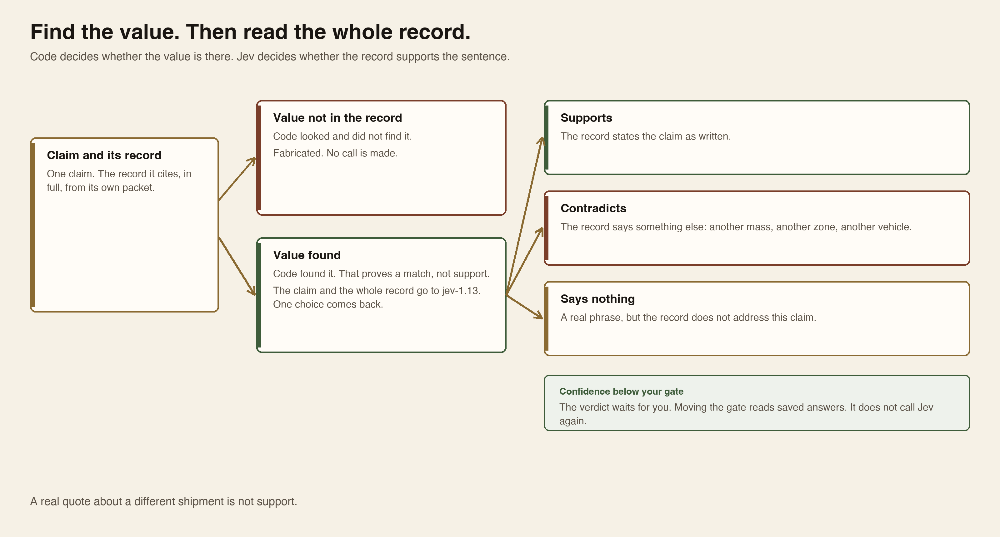
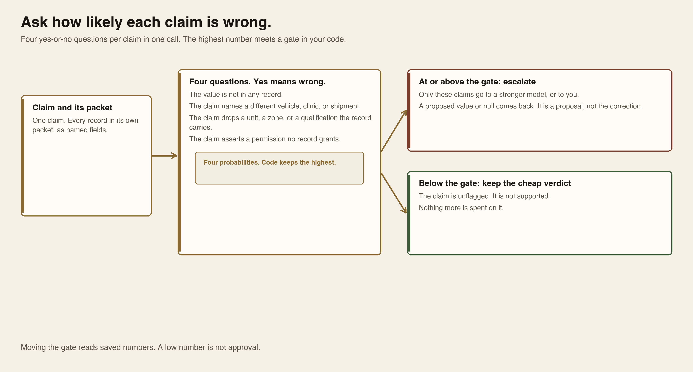

# Module 8 · Control hallucinations

Check one brief two ways. First, code and Jev test each claim against its own packet: is the value in the record, does the record support the sentence, how likely is the claim wrong, and does the packet hold the answer at all. Then five sessions review and correct the same claims. Two reviewers judge. A third rewrites. You read the sources and decide. A typed answer is a check. A review is a judgment. Neither is support until you have read the record. Agreement is not support. Plan for about three hours.

You copy each step's prompt into your ordinary Oh My Pi (OMP) conversation. That conversation is the **coordinator**: it writes and runs the check code, runs the supplied helper, and shows you the actual output and files. The Jev calls are code the coordinator runs; they are not audited child calls. Each review and the correction run as a separate **child** session. A child sees only its own frozen inputs, never your notes, your check files, or this chat. You do not paste programs into a terminal, and OMP does not make your decisions.

## How the check works

```text
claims.json                         PC-01  PC-02  PC-03
7 claims                            each claim uses only its own packet
        |
        v
   typed checks         code finds the value, Jev reads the record
   claim check          supports, contradicts, or says nothing
   wrongness gate       four yes-or-no questions; the highest decides
   answer in packet     which record, and whether any record answers
        |
        v
   freeze  →  exact checks
        |
        +-- source reviewer      fresh session
        +-- skeptical reviewer   fresh session
        |
        v
   you read both against the sources
        |
        v
   correcting agent
   all 7 claims; null means unknown
        |
        +-- source reviewer      fresh session, no old verdicts
        +-- skeptical reviewer   fresh session, no old verdicts
        |
        v
   you decide
   dispatch stays HOLD
```

The draft is planted practice data. It is not a live model failure. An exact check catches a wrong number, unit, zone, or a quote that is not in the record. It does not decide whether a real quote supports the sentence.

A typed check runs before the sessions. It is fast, it is cheap, and it is not a review. It tells you where to look. It does not tell you the brief is true. The checks never enter a child session.

Both reviewers are the same model, `openrouter/anthropic/claude-sonnet-4.6`, in separate sessions. They can share a blind spot. Neither sees the other review. After correction they start again and do not see their old answers.

`null` means unknown. It does not mean zero, false, or permission denied. A `PASS` line means the files were saved. It does not mean the brief is true, and it does not dispatch the vehicle.

PC-01 has two mass records. `SB-PC-01#payload` is 2211 kg for SB-4 to Clinic T-8. `SB-PC-01#payload-s14` is 2255 kg for a different shipment. Two reviewers can quote the yard note and agree on 2255 kg. The quote is real. The shipment is not.

## Slope Brief

Heater-fuel cans, Ridge Depot to Clinic T-8, vehicle `SB-4`. Seven claims, `C01` through `C07`. The packets are PC-01, PC-02, and PC-03. Do not combine clocks or masses across packets. The brief does not authorize departure.

## Three Jev checks

Jev returns typed answers, not prose. In Module 6 you asked it whether one passage supports one claim. Here that call runs across a whole brief, with two more checks beside it. Code splits the brief into claims and finds the record each claim cites. Jev answers one narrow question at a time. The answers are numbers you save. Gates in code decide what stands, what escalates, and what must stay `null`. Keep the questions and the gates in one file so you can read them. A check is not a review, and no check releases cargo. The [Module 6 hallucination check](../../module-06-decision-model/shared/MODULE_06_LAB.md#5-hallucination-check) is the starting shape.

### Claim check

Code finds the claimed value in the record. A value that is not there is fabricated, and no model is called for it. A value that is there goes to Jev beside the whole record, not the matching phrase alone. Jev returns one choice: the record supports the claim, contradicts it, or says nothing about it. A confidence below your gate waits for you.



*Code looks for the value in the record. A missing value is fabricated without a call. A found value goes to Jev with the whole record. A low confidence waits for a person.*

On this brief, a mass can be real and belong to a different shipment. A clock can be real and carry the wrong zone. A sentence can quote the inventory record and name the wrong vehicle. The string match catches none of that. The whole record beside the claim is what Jev reads.

### Verify, then escalate

Ask four yes-or-no questions about each claim, each one phrased so that yes means wrong: the value is not in the record; the claim names a different vehicle, clinic, or shipment than the record; the claim drops a unit, a zone, or a qualification the record carries; the claim asserts a permission the record does not grant. Each answer is a probability. Code takes the highest. At or above the gate, the claim goes up: to a stronger model for a proposed fix, or to you. Below the gate, the claim keeps its cheap verdict. Only the flagged claims pay for the stronger model.



*One claim and its packet go to Jev with four yes-means-wrong questions. Code keeps the highest. At or above the gate the claim escalates. Below it the claim keeps its cheap verdict.*

Use it when a stronger model costs more than the check, and most claims do not need it. Do not use a low wrongness number as approval. A claim below the gate is unflagged. It is not supported.

### Answer in the packet

Before anyone writes a sentence, ask whether the packet can answer the question the sentence makes. Every record in the packet is an option. One question asks which record most likely holds the answer; it always names one. A separate yes-or-no question asks whether any record states or directly implies the answer; it can fall near zero while the first question still names a record. That pair is the check. A named record with a low second answer means the packet has no source for the claim. The right value is `null`.


*A question and every record in its packet go to Jev. One answer always names a record. The other says whether any record answers at all. Together they show where the packet has no source.*

An invented fact begins where the evidence runs out. A writer that was handed the wrong record, or no record, fills the gap with fluent text. This check finds the gap before the draft, and it finds the near-miss record that ranks first for the wrong reason.

## Start

Use the Python, Oh My Pi, and OpenRouter key you already checked in [setup](../../module-00-setup/README.md). Start OMP from a terminal where your key is already loaded; the child sessions use that same key. If it is missing, load it with the [credential guide](../../module-00-setup/shared/CREDENTIALS.md#enter-the-key-through-a-hidden-prompt) before you start OMP. Never paste the key into the chat or a file.

The TypeSafe skill you installed in Module 6 should still be available to Oh My Pi. If the session does not recognize it, repeat the [install step](../../module-06-decision-model/shared/MODULE_06_LAB.md#install-the-typesafe-skill) from that lab, including the OpenRouter paragraph. Jev is `jev-1.13` through OpenRouter with the key already loaded. Do not create a TypeSafe key. Do not use `jev-latest`.

This prompt makes a new attempt. It does not touch an earlier one. `W` is the work folder. `E` is the evidence folder that freeze creates later. The check code and its saved answers go under `W/checks`, a folder the check steps create. Nothing goes under `W/shared` or into the checkout.

**In Oh My Pi:**

```text
Help me prepare Module 8 using the supplied tools. Locate this course checkout and AI_Harness_Bootcamp_2/module-08-change-eval, and resolve an existing Python 3.12-or-newer executable. Show their absolute paths. Choose a fresh attempt under the external course-evidence convention: a new work path W and a separate unused evidence path E. Show both absolute paths before acting. Reject existing, linked, overlapping, or checkout-contained targets; ask me for a path only if you cannot determine one safely. With an explicit working directory and absolute executable and script paths, run the checkout's shared/prepare_work.py for module 08 into W. Locate the checkout's module-08-change-eval/scripts/hallucination.py, which stays in the checkout. Check whether the fixed child runtime and OPENROUTER_API_KEY are available without printing any secret and without launching a child or making a helper/provider test call. If setup is missing, point me to Module 00 setup and its credential guide; never ask me to enter a key in chat or a file, switch providers, or install or replace tools without owner approval. Execute only preparation. Show the actual exit status, prepared paths, and files you can see, then stop for my inspection. Do not ask me to paste a program into a terminal, invent an observation, overwrite an attempt, or proceed to freeze.
```

**Expected:** `PASS: created`, with `W` and an unused `E` shown as full paths. The work folder holds the claims and the three packets. The key check says only whether a key is present. It does not show that the key is valid or has credit.

**Stop:** Stop if preparation fails, a folder already exists or overlaps another, Python is older than 3.12, or the key is missing.

**Recovery:** Keep the attempt. Fix the missing piece through setup, then ask for a new attempt. Do not delete an earlier attempt.

### Pick up where you left off

A new OMP conversation does not remember `W` and `E`. This prompt finds them from the files. It does not prepare a second copy or run a paid step.

**In Oh My Pi:**

```text
Help me resume my existing Module 8 attempt, not create or select another one. Locate the course checkout and resolve the existing Python 3.12-or-newer executable. Identify the attempt from its work and evidence files under the external course-evidence convention; if more than one fits, ask me which one I mean. Display absolute W and E paths, the W/checks files that exist, and the frozen manifest, initial checks, stage input, prompt, receipt, parsed-review, correction, report, and human-decision identities that actually exist. Compare completed, entirely unstarted, and started-but-held stages; audit the prerequisites before proposing the first actionable step. A failed started paid stage must stay intact and cannot be retried in this attempt. Never overwrite evidence, combine stages across attempts, or auto-select a different attempt. Check runtime and credential availability without printing secrets; refer missing setup to Module 00. Show actual findings and evidence locations, then wait for my decision. Do not run a paid stage, create a new attempt, or count this coordinator conversation among the five audited child calls.
```

**Expected:** The same `W` and `E`, which check files exist, and which steps are done, not started, or held. Nothing runs.

**Stop:** Stop if two attempts fit and you cannot tell which one is yours, or a started step has no complete record.

**Recovery:** Keep every file. Tell OMP which attempt is yours. A started step that failed needs a new attempt; do not run it again in the old one.

## 1. Find each value in its record

Code does this step. No model is called. Each claim is searched only in its own packet, after whitespace is normalized. A value that appears nowhere in the packet is fabricated. A value that appears can still sit in a non-authoritative record, or in a record other than the one the claim cites. Both facts are saved.

**In Oh My Pi:**

```text
Using the TypeSafe skill, read W/shared/case/LEGEND.txt, W/shared/case/claims.json, and the three W/shared/case/PC-0*/sources.json files, resolving W's absolute path. Create W/checks and write the check code there, with the questions and gates we will add later kept in one file. For this step make no Jev call and no chat completion. For each of C01–C07, search only the records in the claim's own case_id packet: after normalizing whitespace, does the claim's value appear verbatim in any record's text? Mark a value found nowhere in the packet as fabricated. For a found value, record every locator whose text contains it, whether that locator is authoritative, and whether it equals the claim's own locator. Save the table as W/checks/found.json and show it to me. Do not search another packet, do not answer the table from reading instead of running the code, and do not write under W/shared or inside the checkout.
```

**Expected:** `W/checks/found.json` has seven rows. Some values are found, some are not. A found value can sit in a non-authoritative record, or in a record the claim does not cite. No model has been called.

**Stop:** Stop if a claim was searched in another packet, if the chat wrote the table from memory, or if anything was written under `W/shared`.

**Recovery:** Keep the file. Ask for the search to be run as code on the named packet only, and compare the new table with the old one.

## 2. Ask Jev whether the record supports the claim

Only found values go to Jev. The state is the claim as written and the full text and fields of the cited record, not the matching phrase. Jev returns one choice. The gate is yours, and it reads saved answers.

**In Oh My Pi:**

```text
Using the TypeSafe skill, read the citation-check cookbook at https://docs.typesafe.ai/cookbooks/citation_check. Call jev-1.13 through OpenRouter, POST https://openrouter.ai/api/v1/systemone, with the key already in OPENROUTER_API_KEY. Do not ask for a TypeSafe key. Do not use jev-latest. Do not print the key. For each claim that W/checks/found.json marks as found, send one request whose state names the claim (id, kind, value, and the vehicle, clinic, and route it concerns) and the full text and structured fields of the record the claim cites, or of the authoritative record of that kind in its packet when the claim cites none. Ask one choice question: does this record support the claim as written, contradict it, or say nothing about it. Make no call for a fabricated claim. Save each answer with its probabilities, confidence, served model, and usage to W/checks/claim-check.json. In code, at or above a gate of 0.8 the verdict stands; below it, mark the claim "for you". Then show the same answers at a gate of 0.6 without any new call. Show one request as sent and all saved answers.
```

**Expected:** One answer per found claim, each with one choice, its probabilities, and a confidence. Fabricated claims have no call. The second gate changes which claims wait for you and makes no new call. A `supports` answer is a check result. It is not release.

**Stop:** Stop if a fabricated claim was sent to Jev, if the chat model wrote a verdict, if the gate comparison called Jev again, or if a `supports` answer is described as clearance.

**Recovery:** Keep the saved answers. Paste the OpenRouter paragraph from the Module 6 install step again if the call went elsewhere. Do not call again to get a nicer verdict.

## 3. Ask how likely each claim is wrong

All seven claims go to Jev this time, one request each, four yes-or-no questions together. Each question is phrased so that a high number means wrong. The state is the claim and every record in its packet, as named fields.

**In Oh My Pi:**

```text
Using the TypeSafe skill, read the Noul primitive page at https://docs.typesafe.ai/primitives/noul and the fan-out pattern. Call jev-1.13 through OpenRouter as before; do not print the key, do not ask for a TypeSafe key, do not use jev-latest. For each of C01–C07, send one request. State: the claim as written and every record in its own packet as a named field with its locator, text, authoritative flag, and structured values. Ask four yes-or-no questions in that one request, each phrased so that yes means the claim is wrong: the claim's value does not appear in any record of this packet; the claim names a different vehicle, clinic, or shipment than the record it rests on; the claim drops a unit, a clock zone, or a qualification that the record carries; the claim asserts a permission that no record in this packet grants. Save all probabilities with usage to W/checks/wrongness.json. Show one request as sent and the seven rows of four numbers. Do not combine the questions into one, and do not let the chat model estimate the numbers.
```

**Expected:** Seven rows of four probabilities. A number near 0.5 means Jev finds yes and no about equally likely; it is not a medium amount of wrong. Each row came from one request.

**Stop:** Stop if the four questions were sent one at a time, if a question was phrased so that yes means right, or if the chat model filled in a number.

**Recovery:** Keep the file. Ask for the question wording to be shown, fix the one that is reversed, and run only the affected claims again.

## 4. Set the escalation gate

Code takes the highest of the four numbers for each claim. At or above the gate, the claim escalates. Below it, the claim keeps its cheap verdict. Moving the gate reads saved numbers.

**In Oh My Pi:**

```text
In code, using W/checks/wrongness.json, take the highest of the four probabilities for each claim. With a gate of 0.7, list the claims at or above the gate as flagged and name the question that raised each one. List the rest as unflagged, not as supported. Then show the same saved numbers at a gate of 0.5. Make no Jev call and no chat completion for either gate. Save both views to W/checks/gate.json and show them. Keep the gate value in the same file as the questions.
```

**Expected:** The flagged set includes the mass with no record behind it and the dispatch claim. The two claims that quote their authoritative record are below the gate, or you can see which question raised them. Moving the gate changes the set and makes no call.

**Stop:** Stop if the comparison called Jev again, or if an unflagged claim is described as supported.

**Recovery:** Keep both views. If the gate was computed from one question instead of the highest, fix the code and show the views again from the saved file.

## 5. Escalate only the flagged claims

The flagged claims go to the chat model, each with its own packet, for a proposed value or `null` with a locator. It is a proposal, saved in `W/checks`. The unflagged claims never enter the chat. Later in this module a separate correcting agent, which never sees these proposals, returns its own set.

**In Oh My Pi:**

```text
Read the verified-cascade cookbook at https://openrouter.ai/docs/cookbook/evaluate-and-optimize/jev-verified-cascade. For only the claims flagged at the 0.7 gate in W/checks/gate.json, call the chat model you already use through OpenRouter chat completions at POST https://openrouter.ai/api/v1/chat/completions; if the session does not name that model, use openrouter/anthropic/claude-sonnet-4.6. Send each flagged claim with the complete records of its own packet and ask for a proposed value or null, a locator from that packet or null, and one sentence of reason, as JSON. Cap each completion at 256 tokens. Record prompt tokens, completion tokens, and cost from each response; label a missing cost "not recorded". Save the proposals and usage to W/checks/proposals.json and show them. Do not send an unflagged claim. Do not write a proposal into W/shared/case/claims.json or any frozen file. Do not describe a proposal as the correction.
```

**Expected:** Proposals only for the flagged claims, each with a locator from its own packet or `null`. The usage lines show chat prompt and completion tokens beside the Jev input tokens from the earlier files. A claim with no record behind it is proposed as `null`, or you can see that the proposal invented one.

**Stop:** Stop if an unflagged claim was sent, if a proposal was written into the case, if a missing cost was written as zero, or if the proposal is called the correction.

**Recovery:** Keep the proposals, including a wrong one. A proposal that invents a locator is evidence for later, not something to fix by asking again.

## 6. Ask whether the packet holds the answer

Each claim answers a question. Write the question, then give Jev every record in the packet as an option. One answer names the most likely record. A separate yes-or-no answer says whether any record answers at all.

**In Oh My Pi:**

```text
Using the TypeSafe skill, read the line-by-line search cookbook at https://docs.typesafe.ai/cookbooks/semantic_find. Call jev-1.13 through OpenRouter as before; do not print the key, do not ask for a TypeSafe key, do not use jev-latest. For each of C01–C07, write the question that claim answers for vehicle SB-4 to Clinic T-8: for a mass claim, what the staged heater-fuel cans weigh; for a time or gate claim, when the Ridge Depot gate is open and in what zone; for the citation claim, what the inventory record says; for the authority claim, whether this shipment is released for dispatch. Send one request per claim. State: the question and every record in the claim's own packet as a named field with its locator and text. Ask one choice question whose options are the packet's locators: which record most likely holds the answer. Ask one separate yes-or-no question: at least one record states or directly implies the answer. Save both answers with probabilities, confidence, and usage to W/checks/grounding.json. Show one request as sent and all seven results. Do not assign a value to any claim in this step.
```

**Expected:** For the mass and gate questions, the authoritative record is the most likely choice and the yes-or-no answer is high. For the dispatch question, the choice still names a record and the yes-or-no answer is low. The near-miss mass record ranks below the authoritative one, or you can see its probability beside it.

**Stop:** Stop if a record was called the source because it ranked first, if a low yes-or-no answer was given a value anyway, or if the chat model wrote the ranking.

**Recovery:** Keep the file. If a packet was sent without one of its records, send that claim again with every record and keep both results.

## 7. Decide what the evidence can answer

Code joins the three check files. Nothing here is a disposition. The summary says where to look when you read the claims yourself in the next step.

**In Oh My Pi:**

```text
In code, from W/checks/grounding.json, mark each claim answered when the yes-or-no probability is at or above 0.7, not in the packet when it is below 0.35, and partial between them. For an answered claim, name the record that would go to a writer. For a claim not in the packet, write "no source: null". For a partial claim, write "for you". Make no Jev call and no chat completion. Then write W/checks/summary.md with one row per claim: found or fabricated from found.json; the support choice and confidence from claim-check.json, or "no call"; the highest wrongness number and whether it was flagged from gate.json; the grounding result and record; and the proposal from proposals.json if one exists. Head the file with the line "These are checks, not dispositions." Show the file. Do not write a disposition, and do not touch W/shared or the checkout.
```

**Expected:** The dispatch claim has no answering record. The two claims that quote their authoritative record have an answering authoritative record. The near-miss record is not the chosen source, or the summary shows why it ranked where it did. Every row is a check result, and the first line says so.

**Stop:** Stop if a row is written as a disposition, if a yes-or-no number is treated as release, or if the summary made a new call.

**Recovery:** Keep the summary. A wrong check result stays in the file with the numbers that produced it; you will read the sources yourself next.

## Three patterns

Three patterns cover the useful multi-agent work that follows the checks. Fan-out gets a second look that cannot copy the first. One writer turns those looks into one artifact. Fresh review checks that artifact without the old answers. A vote is not a fourth pattern. Agreement is not support.

### Fan-out

Two agents get the same claims and the same sources. Each has its own session. Neither sees the other answer. Use it when you need a second judgment and the second agent does not need the first result. Do not use it when the second job cannot start until the first one finishes.


*Same claims go to two sessions. Neither session sees the other answer.*

On this brief, the source reviewer and the skeptical reviewer are a fan-out. The coordinator launches one, then the other. That order does not share their answers.

### One writer

The findings join. One agent writes the corrected claims. The others do not edit that file. Use it when the product is one claim set, one brief, or one spreadsheet. Do not let two agents write the same rows.


*Reviews and exact checks go to one writer. A review is not an edit.*

The correcting agent is the writer. It sees both reviews and the exact findings. It returns all seven claims. A review is a suggestion. It does not override the source.

### Fresh review

A new session reads the writer's output and the original sources. It does not read the first verdicts or the writer's notes. Use it after a correction. The session that wrote the claims will defend them.


*The corrected claims and the sources go to new sessions. The first verdicts stay out.*

The after reviews are a fresh review. A correction can fix one number and break another. The first reviewers do not grade their own earlier answers.

## 8. Read the claims

Read the claims and the three packets before any review. Read the text of a record, not only its fields. `authoritative: true` means the record is the source for its own fact. It does not release the vehicle. A missing permission is not proof that permission was denied. You make these calls yourself. The check files in `W/checks` say where to look; they are not your notes. OMP only shows the records and writes down what you confirm.

**In Oh My Pi:**

```text
Using the already prepared Module 8 W, resolve its absolute path and show me LEGEND.txt, all seven original C01–C07 claims with their PC-01/02/03 identities, and the relevant source passages from all three packet sources.json files, including the exact text and structured fields of SB-PC-01#payload and SB-PC-01#payload-s14. Also display the supplied schema.json, review-source.txt, and review-skeptic.txt so I can inspect the typed review question and roles. Ask me to name one claim I would use and one I would stop, each with its claim ID, source locator and reason, and which PC-01 record belongs to SB-4 and why. Wait for my answers; show proposed notes for my confirmation, then write only what I confirm into a new W/notes.md without altering the case or controls. Use real file tools and explicit absolute paths and working directories. Show the actual write result and notes path, then stop. Do not answer for me or launch a child.
```

**Expected:** `W/notes.md` names a usable claim, a claim to stop, and which PC-01 record belongs to SB-4, in your words. No review has started.

**Stop:** Stop if you cannot tell which source belongs to the claim.

**Recovery:** Keep that claim unknown and name the packet you checked. Do not fill the gap from memory or a web search.

## 9. Freeze

Freeze the claims and sources before any review. This step makes no model call.

**In Oh My Pi:**

```text
Using the confirmed fresh Module 8 W and unused separate E, show their absolute paths and check that they are external, non-overlapping and not linked. Use the existing Python 3.12-or-newer executable, explicit working directory, and checkout's absolute module-08-change-eval/scripts/hallucination.py path to run freeze with --work W and --out E exactly once. Show the actual exit status, the frozen manifest and files, and E/initial-checks.json beside my W/notes.md observations. Do not edit a supplied input, control, manifest, fingerprint or notes; do not start a child or advance to review. Stop for my comparison.
```

**Expected:** `PASS: frozen 7 claims`. Compare `E/initial-checks.json` with your notes. The saved `frozen` folder keeps the draft and the sources.

**Stop:** Stop if you see `HOLD:`, the evidence folder already exists, or an input is missing.

**Recovery:** Keep the error. Prepare a fresh attempt. Do not edit a frozen source to make a check pass.

## 10. Two first reviews

Run the source reviewer, then the skeptical reviewer, one prompt each. Each gets the frozen claims and sources. Neither gets the other review, your notes, or the exact findings. Do not rerun a finished review to get a nicer answer.

**In Oh My Pi:**

```text
After confirming the Module 8 freeze and that before-source is entirely unstarted, use the checkout's existing Python 3.12-or-newer executable and absolute scripts/hallucination.py path to invoke review with --attempt E, --reviewer source and --phase before exactly once. Use an explicit working directory and E's absolute path. Keep the helper's frozen role instruction, pinned model, read-only course_read profile and isolated input set unchanged. Do not send W/notes.md, coordinator conversation, initial-checks.json, or another review to the child. Show actual exit status, E/reviews/before-source.json if created, and E/runs/before-source receipts, instruction/input identities, successful source-read proof and run ID. Stop before any other child call.
```

**Expected:** `PASS: before source review`, the review in `E/reviews/before-source.json`, and its own run record in `E/runs/before-source`. A review that passes can still be wrong.

**Stop:** Stop if the step had already started, the command holds, a claim is missing, or a quotation is not in the cited record.

**Recovery:** Keep the whole attempt, including the raw response. If the key was missing, no attempt was made; fix the key and check that this step is still unstarted. Otherwise start a new attempt only after the named problem is fixed.

**In Oh My Pi:**

```text
Confirm E's frozen identities and that before-skeptic is entirely unstarted. Using the existing absolute Python executable and checkout's absolute hallucination.py path with an explicit working directory, invoke review with --attempt E, --reviewer skeptic and --phase before exactly once. Preserve the helper's frozen skeptical instruction, pinned model, read-only course_read profile and blind original claims and sources. Do not pass the before-source review, W/notes.md, initial checks or coordinator discussion into the child. Show actual exit status, E/reviews/before-skeptic.json, E/runs/before-skeptic receipts, successful source reads, and its run ID beside the separate source run ID. Stop before comparing or correcting.
```

**Expected:** `PASS: before skeptic review`, the review in `E/reviews/before-skeptic.json`, and a run ID different from the source review's.

**Stop:** Stop if the command holds, a claim is missing, or either review's inputs changed after freeze.

**Recovery:** Keep both runs. Do not rerun a finished review under the same name or edit its response. Do not mix reviews from different attempts.

## 11. Read both reviews

Read both reviews beside `initial-checks.json` and the sources. For each disagreement or shared mistake, decide which claim it is, what the cited record actually says and for which shipment, whether an exact check already settled it, and what must stay unknown. If the reviewers agree on every row, still open `SB-PC-01#payload` and `SB-PC-01#payload-s14`, and say why agreement on 2255 kg would not have been enough.

**In Oh My Pi:**

```text
Read both saved before reviews, E/initial-checks.json, my W/notes.md, and their cited passages from the original PC-01/02/03 sources. Show C01–C07 side by side with verdicts, locators, quotations, reasons and any disagreement, without editing reviews or declaring an answer for me. For each disagreement or shared mistake, ask me which claim it concerns, what the cited record actually says and for which shipment, whether an exact check already settled it, and what must stay unknown. Show my step 1 note on the PC-01 records and, even if the reviewers agree everywhere, ask me why agreement on 2255 kg would not have been enough. Wait for my answers; show proposed notes for confirmation, then append only confirmed reasoning to W/notes.md without overwriting existing notes. Show the actual write status and location, then stop before correction.
```

**Expected:** Your notes name the evidence behind each change you would allow, and the claims that should stay as they are. The original reviews are unchanged.

**Stop:** Stop if a repair depends on a guess, or if you would need a vote to choose.

**Recovery:** Record the unresolved claim and the missing evidence. The correcting agent can keep an unknown. It cannot invent the missing permission.

## 12. Correct

The correcting agent sees the original packet, both reviews, and the exact findings. Reviews are suggestions. They do not override the sources. It must return all seven claims. A fact the packet cannot establish is `null`.

**In Oh My Pi:**

```text
Audit the frozen Module 8 attempt and both complete before-review prerequisites. If correct is entirely unstarted, use the existing absolute Python executable and checkout's absolute hallucination.py path, with explicit working directory, to invoke correct with --attempt E exactly once. Let the helper build only its prescribed isolated correction inputs and use its frozen correcting instruction, pinned model and read-only course_read profile; do not send my notes or this coordinator conversation. Show the actual exit status, E/correction.json and E/runs/correct receipts, source-read and input identities, and complete C01–C07 coverage. Stop without requesting another correction or starting an after review.
```

**Expected:** `PASS: correction of 7 claims` and `E/correction.json`. The original draft remains in `E/frozen`. This `PASS` means the correction is complete and well formed. It does not mean the values are right.

**Stop:** Stop if the command holds, or if the correction drops a claim, adds a claim, or invents a source.

**Recovery:** Keep the failed correction. Do not hand-edit a model output into a passing file. If a well-formed correction has a bad value, keep it for the next check. Do not ask again until you like the answer.

## 13. Two fresh reviews

Run both reviewers again, one prompt each. Each sees the corrected claims and the original sources. Neither sees the first reviews. A correction can fix one number and break another.

**In Oh My Pi:**

```text
Audit the complete correction and frozen identities. Only if after-source is entirely unstarted, invoke the checkout's absolute hallucination.py with the resolved absolute Python executable, explicit working directory and E path: review with --attempt E, --reviewer source and --phase after exactly once. Preserve the frozen source instruction, pinned model, read-only course_read profile and helper-built corrected claims plus original sources. Do not pass earlier reviews, W/notes.md or coordinator discussion to this child. Show actual exit status, E/reviews/after-source.json, E/runs/after-source input and read proof, and a new run ID. Stop before the next review.
```

**Expected:** `PASS: after source review` and `E/reviews/after-source.json`, from a new run.

**Stop:** Stop if the command holds, a claim is missing, or the reviewed input is not the saved correction.

**Recovery:** Keep the failure. A wrong judgment in a valid review belongs in the evidence. Do not discard that review to get a cleaner pair.

**In Oh My Pi:**

```text
Audit the frozen attempt and completed correction. Only if after-skeptic is entirely unstarted, use the resolved absolute Python executable, checkout's absolute hallucination.py, explicit working directory and E path to invoke review with --attempt E, --reviewer skeptic and --phase after exactly once. Keep the helper's frozen skeptical role instruction, pinned model, read-only course_read profile and blind corrected claims and original sources. Do not show this child the source after review, either before review, my notes or coordinator messages. Show actual exit status, E/reviews/after-skeptic.json, E/runs/after-skeptic inputs and source reads, and its distinct run ID. Stop before report.
```

**Expected:** `PASS: after skeptic review` and `E/reviews/after-skeptic.json`, from another new run.

**Stop:** Stop if the command holds, the child saw an earlier verdict, or a claim is missing.

**Recovery:** Keep the failure and every receipt. Do not replace a judgment to improve the result.

## 14. Decide

The report joins the five runs, reruns the exact checks, and compares the original claims with the correction. It does not count votes.

**In Oh My Pi:**

```text
Check whether E/report.json, report.md or human-decision.json already exist. If any exists, inspect and report its status without running report again or overwriting it. Only if all three are absent and all five child stages have complete audited prerequisites, use the existing absolute Python executable and checkout's absolute hallucination.py with explicit working directory to invoke report with --attempt E once. Show actual exit status and E/report.json, E/report.md and generated E/human-decision.json if created. Show five distinct run IDs, required source-read proof and no child writes; explain technical_complete separately from content_holds, reviewer disagreements, unknowns, exact failures and correction regressions. Show operational_dispatch as recorded, then stop for my source review. Do not treat PASS, reviewer agreement or a generated template as my decision.
```

**Expected:** `PASS: report written; operational dispatch HOLD`, with `E/report.json`, `report.md`, and `human-decision.json`. The `PASS` means the report was assembled. Dispatch stays `HOLD`.

**Stop:** Stop if a source changed, a receipt is missing, or the report prints `HOLD:`.

**Recovery:** Keep the attempt. If the report already exists, read it; do not run the report again. If it was not created, write the blocked stage in `notes.md`. Do not invent a decision file.

Read `report.json` and `report.md` beside the sources, then decide each claim. `USE` means the corrected claim is supported by its own packet. `KEEP_UNKNOWN` means the claim is now an explicit unknown. `HOLD` means it is still wrong or unresolved. A missing fact names the packet you checked; do not invent a locator. A claim that still fails an exact check stays `HOLD`, even if both reviewers approved it. A claim the correction damaged also stays `HOLD`. A disagreement is settled by the source, not by a vote. If the packet does not name an owner, say that the owner is not identified.

**In Oh My Pi:**

```text
Show me the complete E/report.json and generated E/human-decision.json template beside the original PC-01/02/03 records. Interview me for each C01–C07 disposition, USE, KEEP_UNKNOWN or HOLD, and its source-backed reason. Ask which reviewer judgments I reject or leave unresolved, whether the corrected set is usable as a bounded internal summary, what unknowns travel with it, what prevents dispatch, and what evidence and responsible owner would resolve each gap. If the packet does not identify an owner, record that the owner is not identified. Show every proposed entry, internal_summary_decision and unresolved_evidence_and_owner for my confirmation before writing. Only after I confirm, fill the existing fields of E/human-decision.json, leaving its schema, seven IDs, and operational_dispatch HOLD unchanged; do not create a different decision file or edit report.json, report.md, provider outputs, inputs or receipts. Show the actual write result and decision path, then stop. Do not choose my judgments for me.
```

**Expected:** Every claim has your disposition and reason. Dispatch is `HOLD`. The report and the model files are unchanged.

**Stop:** Stop if an entry lacks your confirmation or a source basis, or if anything would change a report, a receipt, or the dispatch status.

**Recovery:** Keep the template and every file. Finish the interview when you can decide from the sources; otherwise record `HOLD` or an explicit unknown with the missing owner.

Keep `E`, `W/notes.md`, and `W/checks` together. Someone else should be able to see the original claims, the typed checks, both first reviews, the correction, both second reviews, and your decision without the chat.
