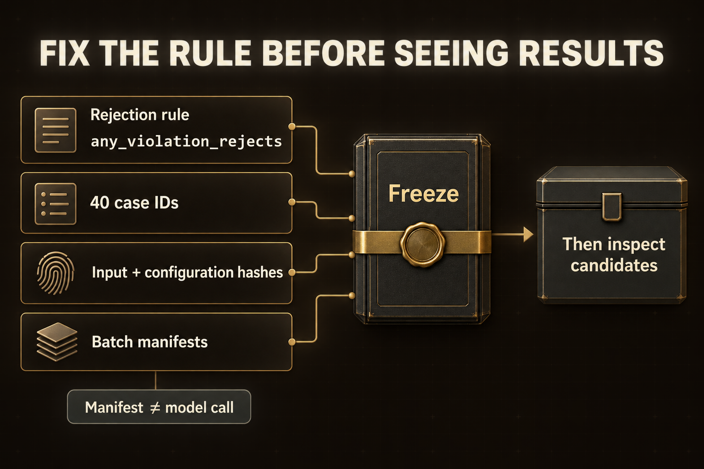
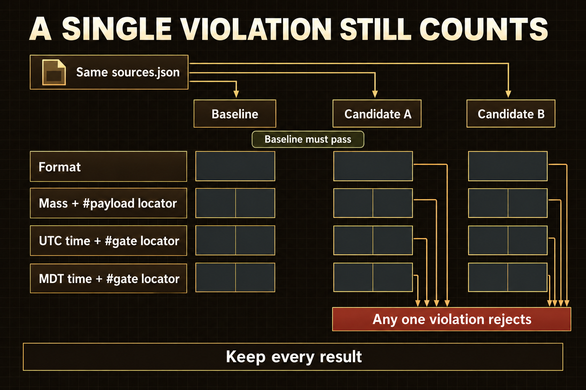
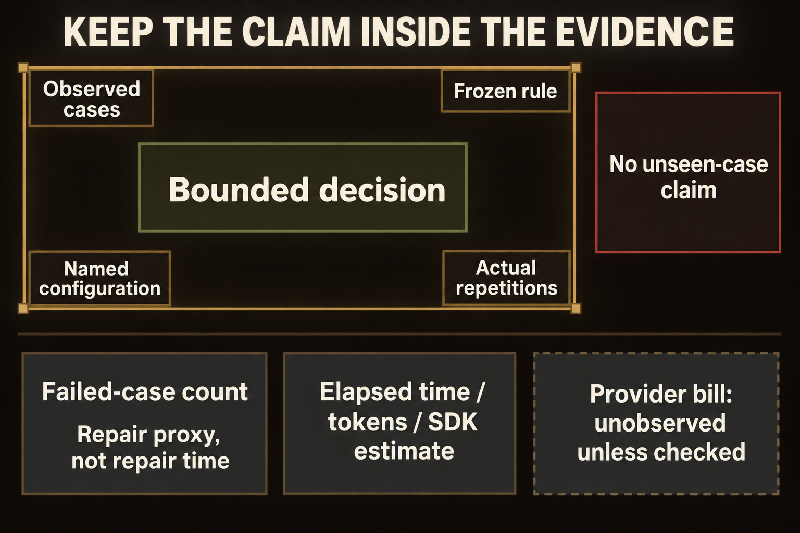
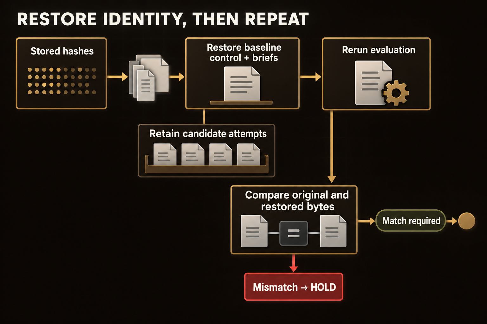

# Module 8 · Evaluate a change with variation controls

Decide whether a proposed change to Slope Brief can be used without losing a required source check. Use your existing comparison and restoration skills to freeze the cases, configurations, and decision rule before inspecting outcomes. Compare every candidate with its baseline on the same cases. One hard-gate violation rejects a candidate even when its other results look better.

The fictional movement carries heater-fuel cans from Ridge Depot to Clinic T-8 on vehicle SB-4. The forty case packets and their three briefs are authored practice data, not records of OpenRouter calls. Nothing here authorizes a real load sheet or movement.

A **hard gate** is a condition that every result must meet. Keep the format check, mass gate, and time-zone gate separate: malformed output, an unsourced mass, or a missing time-zone label can each defeat a candidate. A **paired comparison** uses the same source packet for the baseline and candidate.

The core comparison checks fixed authored outputs. Repeating that file check does not measure model variation. In the optional live comparison, repeated model calls show how outputs differ under the same conditions, so you can judge whether an apparent improvement holds across those attempts.

Plan for a little over two hours on Thursday. That is a rough estimate, not a measured time.

## Prepare a separate attempt

Create a fresh work folder and a separate evidence folder so that this attempt cannot overwrite an earlier one. Use the verified Python and checkout from [setup](../../module-00-setup/README.md). Open an ordinary terminal. These commands work from any directory and leave earlier attempts intact. `W` is your work folder; `E` holds your records outside it. Do not open candidate briefs yet.

**Terminal: Bash or zsh, ordinary user.**

```bash
R="$HOME/Documents/AIHB_OCT_2026"
PY="$(for candidate in python3.12 python3 python; do "$candidate" -c 'import sys; sys.exit(1) if sys.version_info < (3, 12) else print(sys.executable)' 2>/dev/null && break; done)"
[ -n "$PY" ] || echo 'HOLD: Python 3.12 or newer is required.' >&2
M="$R/AI_Harness_Bootcamp_2/module-08-change-eval"
RUN="$(date -u +%Y%m%dT%H%M%SZ)-$$"
mkdir -p "$HOME/course-evidence" && printf '%s\n' "$RUN" > "$HOME/course-evidence/module-08-run" && printf 'RUN=%s\n' "$RUN"
W="$HOME/course-evidence/module-08-$RUN/work"
E="$HOME/course-evidence/module-08-$RUN/evidence"
"$PY" "$R/shared/prepare_work.py" 08 "$W" &&
"$PY" -c "from pathlib import Path; import sys; Path(sys.argv[1]).mkdir(parents=True, exist_ok=False)" "$E"
```

**Terminal: PowerShell, ordinary user.**

```powershell
$R = "$HOME\Documents\AIHB_OCT_2026"
$PY = $(foreach ($candidate in 'python3.12','python3','python') { try { $resolved = & $candidate -c 'import sys; sys.exit(1) if sys.version_info < (3,12) else print(sys.executable)' 2>$null; if ($LASTEXITCODE -eq 0 -and $resolved) { $resolved.Trim(); break } } catch {} })
if (-not $PY) { throw 'HOLD: Python 3.12 or newer is required.' }
$M = "$R\AI_Harness_Bootcamp_2\module-08-change-eval"
$RUN = [guid]::NewGuid().ToString('N')
New-Item -ItemType Directory -Force -Path "$HOME\course-evidence" | Out-Null; Set-Content -LiteralPath "$HOME\course-evidence\module-08-run" -Value $RUN; "RUN=$RUN"
$W = "$HOME\course-evidence\module-08-$RUN\work"
$E = "$HOME\course-evidence\module-08-$RUN\evidence"
& $PY "$R\shared\prepare_work.py" 08 "$W"
if ($LASTEXITCODE -ne 0) { throw 'Preparation stopped; preserve this attempt.' }
& $PY -c "from pathlib import Path; import sys; Path(sys.argv[1]).mkdir(parents=True, exist_ok=False)" "$E"
```

**Expected:** `RUN=` and this attempt's identifier, then `PASS: created` followed by your work path, then two `Next` commands that display the policy file; you may skip them, because the next step opens that file in your editor. The work folder contains `shared/cases`, `shared/controls`, `shared/baseline`, and the two operational scripts. Your evidence folder is separate.

**Stop:** A command fails, a destination already exists, or Python is not the verified 3.12-or-newer interpreter.

**Recovery:** Keep the existing attempt. Correct the prerequisite through setup, then repeat this block with a new `RUN`; do not reset the checkout or delete an old work folder.

### If you open a new terminal

Every command on this page uses the variables from the block above, and a terminal forgets them when it closes. Run this block in any new terminal to return to the same attempt instead of preparing a second one. It reads the attempt identifier that the first block saved.

**Terminal: Bash or zsh, ordinary user.**

```bash
R="$HOME/Documents/AIHB_OCT_2026"
PY="$(for candidate in python3.12 python3 python; do "$candidate" -c 'import sys; sys.exit(1) if sys.version_info < (3, 12) else print(sys.executable)' 2>/dev/null && break; done)"
[ -n "$PY" ] || echo 'HOLD: Python 3.12 or newer is required.' >&2
RUN="$(cat "$HOME/course-evidence/module-08-run")"
M="$R/AI_Harness_Bootcamp_2/module-08-change-eval"
W="$HOME/course-evidence/module-08-$RUN/work"
E="$HOME/course-evidence/module-08-$RUN/evidence"
printf '%s\n' "RUN=$RUN" "W=$W"
```

**Terminal: PowerShell, ordinary user.**

```powershell
$R = "$HOME\Documents\AIHB_OCT_2026"
$PY = $(foreach ($candidate in 'python3.12','python3','python') { try { $resolved = & $candidate -c 'import sys; sys.exit(1) if sys.version_info < (3,12) else print(sys.executable)' 2>$null; if ($LASTEXITCODE -eq 0 -and $resolved) { $resolved.Trim(); break } } catch {} })
if (-not $PY) { throw 'HOLD: Python 3.12 or newer is required.' }
$RUN = (Get-Content -LiteralPath "$HOME\course-evidence\module-08-run" -Raw).Trim()
$M = "$R\AI_Harness_Bootcamp_2\module-08-change-eval"
$W = "$HOME\course-evidence\module-08-$RUN\work"
$E = "$HOME\course-evidence\module-08-$RUN\evidence"
"RUN=$RUN"; "W=$W"
```

**Expected:** The terminal prints `RUN=` followed by the identifier you saw when you prepared this attempt, then `W=` followed by the existing work folder.

**Stop:** The identifier differs from the one you recorded, or the folder named after `W=` does not exist.

**Recovery:** A different identifier means a later attempt overwrote the saved marker; set `RUN` by hand to the value you recorded and run the block again. A missing folder means the attempt was never prepared, so prepare it with the first block.

## Freeze your rule and input identities

In your editor, open `W/shared/controls/policy.json` and the three adjacent batch manifests. A manifest names which existing brief the evaluator will read; it is not evidence that a model generated that brief. The policy lists the forty case IDs, the three form rows whose values must be sourced (mass, gate time UTC, gate time MDT), the format, mass, and time-zone gates, no exclusions, and `any_violation_rejects`.

Create `W/decision.md` in your editor. Before opening any candidate, state what would reject either candidate, what counts as a failed case, and why a faster result cannot excuse an unsupported material claim. Do not enter an adoption decision yet.

Freeze the bytes without displaying the candidate contents. The record includes the policy, manifests, cases, gates, instructions, and restore copies.



*Freeze the rule, cases, and input identities before opening candidates; a manifest identifies supplied files, not a model execution.*

<details markdown="1">
<summary>Figure text</summary>

Fix the rule before seeing results.

1. Four inputs go into one frozen record:
   - the rejection rule, `any_violation_rejects`
   - the 40 case IDs
   - the input and configuration hashes
   - the batch manifests. A manifest is not a model call. It names a supplied file, and it is no evidence that a model produced that file.
2. Freeze: the record is sealed.
3. Only then are the candidates inspected.

Nothing goes back from the candidates or their results to change the rule or the record.

</details>

**Terminal: Bash or zsh, ordinary user.**

```bash
"$PY" -c "import hashlib,json,sys; from pathlib import Path; w=Path(sys.argv[1]); files=sorted(p for p in (w/'shared').rglob('*') if p.is_file() and p.suffix in ('.json','.md','.py')); hashes={p.relative_to(w).as_posix():hashlib.sha256(p.read_bytes()).hexdigest() for p in files}; f=Path(sys.argv[2]).open('x',encoding='utf-8'); json.dump({'rule':'any_violation_rejects','sha256':hashes},f,indent=2); f.close(); print('FROZEN',len(hashes),'input/control files')" "$W" "$E/pre-result.json"
```

**Terminal: PowerShell, ordinary user.**

```powershell
& $PY -c "import hashlib,json,sys; from pathlib import Path; w=Path(sys.argv[1]); files=sorted(p for p in (w/'shared').rglob('*') if p.is_file() and p.suffix in ('.json','.md','.py')); hashes={p.relative_to(w).as_posix():hashlib.sha256(p.read_bytes()).hexdigest() for p in files}; f=Path(sys.argv[2]).open('x',encoding='utf-8'); json.dump({'rule':'any_violation_rejects','sha256':hashes},f,indent=2); f.close(); print('FROZEN',len(hashes),'input/control files')" "$W" "$E\pre-result.json"
```

**Expected:** `E/pre-result.json` contains the identities of the files you are about to compare. Your decision rule was recorded before outcomes.

**Stop:** The record already exists, an input is missing, or you have already selected cases based on their results.

**Recovery:** Preserve the first attempt and begin a new one. A new filename does not turn a post-result decision rule into a pre-result rule.

## Check the baseline, then evaluate every pair

Confirm all forty baseline briefs pass, then score every baseline, A, and B brief on the same cases. Each case has `sources.json`, a three-row form, and baseline/A/B briefs. A **locator** identifies the exact source record supporting a value. The mass and time-zone gates check each value and its own locator; the format check records whether the brief follows the required form. A zone word elsewhere cannot repair an unlabeled clock value. Judge a number by its source support, not by whether you have seen that number in a previous failure.

A malformed source packet or one for the wrong case stops the comparison. Do not count it as a candidate failure. A malformed candidate under valid sources remains in the comparison as a format failure.

Run every baseline first. Both shell versions retain a failure even if a later case passes.



*Compare each candidate against its own same-case baseline and check each material value and locator; an average cannot erase a failed gate.*

<details markdown="1">
<summary>Figure text</summary>

A single violation still counts.

- One case's `sources.json` feeds three briefs: the baseline, candidate A, and candidate B.
- Each brief faces four separate checks:
  - format
  - mass with its `#payload` locator
  - UTC time with its `#gate` locator
  - MDT time with its `#gate` locator
- Each value is checked together with its own locator.
- The baseline must pass every check. If any baseline fails, the comparison is on HOLD: do not evaluate adoption. A baseline failure is not a candidate rejection.
- For candidates A and B, any one failed check rejects that candidate. A failed check is never averaged with other checks or other cases.
- Every result is kept.

</details>

**Terminal: Bash or zsh, ordinary user.**

```bash
baseline_failed=0
for case_dir in "$W"/shared/cases/PC-*; do
  "$PY" "$W/shared/controls/hard_gates.py" "$case_dir/baseline.md" || baseline_failed=1
done
if [ "$baseline_failed" -eq 0 ]; then echo 'BASELINE PASS'; else echo 'HOLD: a baseline failed; do not evaluate adoption.'; fi
```

**Terminal: PowerShell, ordinary user.**

```powershell
$baselineFailed = $false
foreach ($caseDir in Get-ChildItem "$W\shared\cases" -Directory -Filter 'PC-*') {
  & $PY "$W\shared\controls\hard_gates.py" "$($caseDir.FullName)\baseline.md"
  if ($LASTEXITCODE -ne 0) { $baselineFailed = $true }
}
if ($baselineFailed) { throw 'HOLD: a baseline failed; do not evaluate adoption.' } else { 'BASELINE PASS' }
```

**Expected:** Forty `PASS` lines, then `BASELINE PASS`. This establishes a usable reference, not a claim that either candidate is good.

**Stop:** Any line starting `HOLD:`, or fewer than forty `PASS` lines.

**Recovery:** Save the failed output. Check the named input against your frozen record; do not hand-repair a brief to force a passing baseline.

Now run the supplied evaluator from any directory.

**Terminal: Bash or zsh, ordinary user.**

```bash
"$PY" "$W/scripts/evaluate_pairs.py" "$W/shared/cases" "$W/shared/controls/policy.json" "$W/out/results.csv"
```

**Terminal: PowerShell, ordinary user.**

```powershell
& $PY "$W\scripts\evaluate_pairs.py" "$W\shared\cases" "$W\shared\controls\policy.json" "$W\out\results.csv"
```

**Expected:** `EVALUATED 120` means all forty cases have a baseline, A, and B row. It does not mean the candidates passed. Open `W/out/results.csv` in your editor or a spreadsheet. Inspect `format_ok`, `mass_gate`, `zone_gate`, `passed`, `reason`, and the three identity columns.

**Stop:** A case is missing, an identity differs, the evaluator holds, or the output destination already exists.

**Recovery:** Preserve the output and error. Resolve the input problem before starting a fresh attempt. Do not drop the difficult case or replace a previous result.

## Make the bounded adoption decision

For each failed row, open that brief and its adjacent `sources.json`. Trace the material value to its exact authoritative locator. Record the case, candidate, gate, and source evidence in `decision.md`. Apply your original rule even if most cases pass.

For each candidate, report the number of distinct cases requiring repair. This **cost proxy** is a count of failed cases used to indicate possible repair work; it is not measured repair time or expense. Keep it separate from observed time, tokens, and money. These authored outputs provide no observed API cost or evidence that one live model is better than another.

Check that your frozen inputs still match before accepting the comparison.



*State only what the observed comparison supports, and keep the failed-case repair proxy separate from measured time, token usage, and cost estimates.*

<details markdown="1">
<summary>Figure text</summary>

Keep the claim inside the evidence.

Four things set the limit of the bounded decision: the observed cases, the frozen rule, the named configuration, and the actual repetitions. Anything about unseen cases, including general superiority, is outside that limit: make no unseen-case claim.

Three measurements stay separate:

- The failed-case count is a repair proxy, not repair time.
- Elapsed time, tokens, and the SDK estimate are recorded on their own.
- The provider bill is unobserved unless you check it in your account.

</details>

**Terminal: Bash or zsh, ordinary user.**

```bash
"$PY" -c "import hashlib,json,sys; from pathlib import Path; w=Path(sys.argv[1]); record=json.loads(Path(sys.argv[2]).read_text()); changed=[name for name,digest in record['sha256'].items() if hashlib.sha256((w/name).read_bytes()).hexdigest()!=digest]; print('FROZEN IDENTITY PASS' if not changed else 'HOLD: '+', '.join(changed)); sys.exit(bool(changed))" "$W" "$E/pre-result.json"
```

**Terminal: PowerShell, ordinary user.**

```powershell
& $PY -c "import hashlib,json,sys; from pathlib import Path; w=Path(sys.argv[1]); record=json.loads(Path(sys.argv[2]).read_text()); changed=[name for name,digest in record['sha256'].items() if hashlib.sha256((w/name).read_bytes()).hexdigest()!=digest]; print('FROZEN IDENTITY PASS' if not changed else 'HOLD: '+', '.join(changed)); sys.exit(bool(changed))" "$W" "$E\pre-result.json"
```

**Expected:** `FROZEN IDENTITY PASS` supports comparison under the recorded inputs and rule. Your decision cites the actual failures without averaging them away.

**Stop:** The identity check fails or the decision depends on a rule changed after inspection.

**Recovery:** Hold adoption and retain the mismatch. Repair the process in a new attempt, not the already observed result.

## Demonstrate restoration

Swap in the candidate instruction, restore the baseline from its stored fingerprints, and prove the rerun is byte-identical. Select the checked instruction as the active condition, retaining the previous active file, then invoke the supplied restore. This deliberately changes a control; it does not edit a candidate brief.



*Restore the hash-identified baseline, retain candidate attempts, and prove the rerun matches the original result bytes.*

<details markdown="1">
<summary>Figure text</summary>

Restore identity, then repeat.

1. The stored hashes identify the frozen copies.
2. Restore the baseline control and briefs from those copies. The candidate attempts are retained, not deleted.
3. Rerun the evaluation.
4. Compare the original and restored result bytes.
   - Match: required before the restoration counts as complete.
   - Mismatch: HOLD.

</details>

**Terminal: Bash or zsh, ordinary user.**

```bash
"$PY" -c "from pathlib import Path; import sys; w=Path(sys.argv[1]); active=w/'shared/controls/active-instruction.md'; backup=Path(sys.argv[2]).open('xb'); backup.write(active.read_bytes()); backup.close(); active.write_bytes((w/'shared/controls/candidate-checked-instruction.md').read_bytes())" "$W" "$E/active-before-selection.md" &&
"$PY" "$W/scripts/restore_baseline.py" "$W" &&
"$PY" "$W/scripts/evaluate_pairs.py" "$W/shared/cases" "$W/shared/controls/policy.json" "$W/out/restored-results.csv" &&
"$PY" -c "from pathlib import Path; import sys; w=Path(sys.argv[1]); same=(w/'out/results.csv').read_bytes()==(w/'out/restored-results.csv').read_bytes(); print('RESTORED RESULTS MATCH' if same else 'HOLD: results differ'); sys.exit(not same)" "$W"
```

**Terminal: PowerShell, ordinary user.**

```powershell
& $PY -c "from pathlib import Path; import sys; w=Path(sys.argv[1]); active=w/'shared/controls/active-instruction.md'; backup=Path(sys.argv[2]).open('xb'); backup.write(active.read_bytes()); backup.close(); active.write_bytes((w/'shared/controls/candidate-checked-instruction.md').read_bytes())" "$W" "$E\active-before-selection.md"
if ($LASTEXITCODE -ne 0) { throw 'Selection stopped; preserve the attempt.' }
& $PY "$W\scripts\restore_baseline.py" "$W"
if ($LASTEXITCODE -ne 0) { throw 'Restore held; do not continue.' }
& $PY "$W\scripts\evaluate_pairs.py" "$W\shared\cases" "$W\shared\controls\policy.json" "$W\out\restored-results.csv"
if ($LASTEXITCODE -ne 0) { throw 'Restored evaluation held.' }
& $PY -c "from pathlib import Path; import sys; w=Path(sys.argv[1]); same=(w/'out/results.csv').read_bytes()==(w/'out/restored-results.csv').read_bytes(); print('RESTORED RESULTS MATCH' if same else 'HOLD: results differ'); sys.exit(not same)" "$W"
```

**Expected:** Three lines in order: `RESTORE OK`, `EVALUATED 120`, `RESTORED RESULTS MATCH`. The restore checked the active instruction and all forty baseline briefs by hash and bytes; the second evaluation matches the first byte for byte; candidate attempts remain intact.

**Stop:** The frozen restore source changed, any restore check holds, or comparison bytes differ.

**Recovery:** Preserve both results and the control backup. Do not reconstruct a baseline from memory or patch a candidate. Start a fresh prepared copy only after recording what broke.

## Write the handoff

Give the next owner everything needed to repeat or reverse your decision. In `W/handoff.md`, name the frozen policy record, comparison results, your adoption decision, the repair proxy, and restore evidence. State the limit: a deterministic comparison of supplied briefs does not measure how a live instruction behaves over repeated runs.

Before you stop, check that `handoff.md` names `pre-result.json`, `results.csv`, `restored-results.csv`, your decision, the failed-case counts for A and B, and the stated limit.

<details class="rf-stretch" markdown="1">
<summary>Optional stretch: separate an instruction effect from ordinary variation</summary>

## Preregister and run the live comparison

Compare the supplied baseline and checked instructions on PC-01–PC-06. Use three fresh repeats per instruction and case, alternating order. After those 36 calls, restore the baseline and run two fresh controls on PC-01 and PC-02. Do not choose replacements after seeing results.

Open both instruction files in your editor. Explain the single added check and predict where it might help, do nothing, or add work. Record that prediction in `decision.md` before running. Keep the model, source/form pair, prompt, and permissions fixed within each pair.

This is paid work. Use only your process-local OpenRouter key and the pinned Sonnet model from setup. The runner runs one call at a time, never retries a failed call, and never changes the provider or model. Missing key, credit, or model availability leaves this lane blocked; it is not a reason to substitute a provider.

Run this in the same window that holds `PY`, `W`, `E`, and `M`; if you opened a new terminal, use the re-entry block at the top of the page first.

### Enter your key in this terminal

The launcher reads your OpenRouter key from this terminal's environment, and only from there: a new terminal starts without it. Enter the key through a hidden prompt, then make it available to the commands you run here. Paste the first command by itself and press Enter; type or paste the key at the prompt, which shows nothing, and press Enter again. Then paste the second block.

**Terminal: Bash or zsh, ordinary user.**

```bash
IFS= read -r -s OPENROUTER_API_KEY
```

**Terminal: PowerShell, ordinary user.**

```powershell
$secret = Read-Host 'OpenRouter key' -AsSecureString
```

**Expected:** The terminal waits silently for the key, then returns to its ordinary prompt without showing the value.

**Stop:** Characters appear as you type, or you are not sure which program is reading the input.

**Recovery:** Cancel with Ctrl+C and close that terminal. If the value was shown, revoke the key at OpenRouter and use a replacement.

**Terminal: Bash or zsh, ordinary user.**

```bash
export OPENROUTER_API_KEY
if [ -n "${OPENROUTER_API_KEY:-}" ]; then printf 'SET\n'; else printf 'MISSING\n'; fi
```

**Terminal: PowerShell, ordinary user.**

```powershell
$bstr = [IntPtr]::Zero
try {
  $bstr = [Runtime.InteropServices.Marshal]::SecureStringToBSTR($secret)
  $env:OPENROUTER_API_KEY = [Runtime.InteropServices.Marshal]::PtrToStringBSTR($bstr)
} finally {
  if ($bstr -ne [IntPtr]::Zero) { [Runtime.InteropServices.Marshal]::ZeroFreeBSTR($bstr) }
  if ($secret) { $secret.Dispose() }
  Remove-Variable secret,bstr -ErrorAction SilentlyContinue
}
if ([string]::IsNullOrWhiteSpace($env:OPENROUTER_API_KEY)) { 'MISSING' } else { 'SET' }
```

**Expected:** `SET`. That proves the key is present in this terminal; it does not prove the key is valid or has credit.

**Stop:** `MISSING`, or any part of the key appears in the output.

**Recovery:** Repeat the hidden prompt in this terminal. Never print the environment to troubleshoot a key, and never save the key in a file or a shell profile.

The source-only runner freezes the schedule and identities before the first call. Each model attempt receives only `sources.json` and `form.md`, with permission to create `brief.md`. The launcher, not the batch runner, creates each receipt directory.

**Terminal: Bash or zsh, ordinary user.**

```bash
"$PY" "$M/scripts/stretch_runner.py" "$W" "$E/live-comparison"
```

**Terminal: PowerShell, ordinary user.**

```powershell
& $PY "$M\scripts\stretch_runner.py" "$W" "$E\live-comparison"
```

**Expected:** With all prerequisites available, 38 independently checked attempts produce `comparison.json`, `attempts.csv`, raw receipts, tool-written briefs, and `restore.json`. `COMPLETE` means all planned observations exist, not that the checked instruction won. Without the key, the runner exits 2 before creating comparison attempts or contacting a provider.

**Stop:** Any call is incomplete, a frozen identity changes, restoration fails, the provider rejects a request, or the runner stops on its own cost estimate. A content-gate failure is an observation to retain, not an instruction to retry until the answer passes.

**Recovery:** Preserve the entire comparison, including its first failure. Restore the missing prerequisite before considering a new preregistered attempt. Do not merge favorable rows from different attempts, exclude failures, or change the runner's stop to finish.

## Interpret the paired observations

Open `comparison.json` and `attempts.csv`. For each case, compare the three baseline outcomes with the three checked outcomes. Report each paired disagreement, where a baseline and checked attempt have different outcomes, and the differences among repeats of the same instruction. Keep all preregistered attempts visible. A single better answer cannot separate an instruction's effect from ordinary variation. Any single checked-instruction violation rejects adoption under the frozen rule. You may find no observed improvement.

Report the failed-case repair count separately from elapsed time, raw token usage, and the software library's cost estimate, labeled as an SDK estimate in the receipts. Provider-billed cost remains unknown unless you independently observe it in your account; do not rename an estimate as a bill. Inspect the two restored controls and the actual restored instruction hash.

Your stretch conclusion should explain what these six cases support, what they do not establish, and what uncertainty remains. A completed model comparison does not certify a human operator or establish general superiority.

</details>
