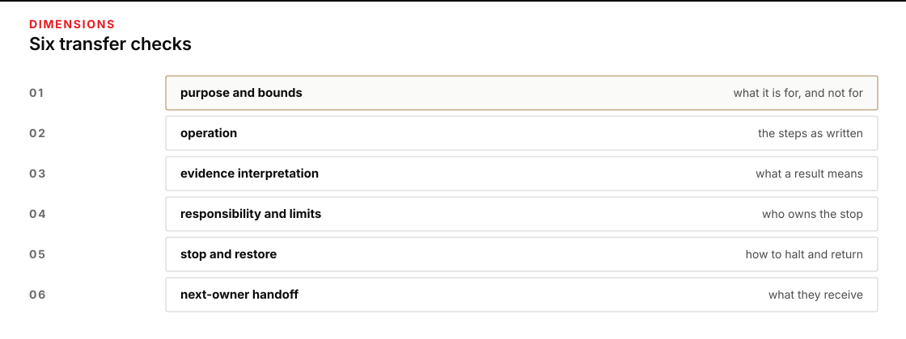

# Module 9 · Transfer a runnable package

Plan for one three-hour session. You will assemble a runnable package for the Last Count closing desk on movement W-9 and prove that a clean session can operate from that package alone.

South Store to Clinic R-12 on W-9. The requirement names 120 sachets at decision time 2026-10-16T18:00:00Z. All times UTC. Class-only.

## Start here

1. Open [the Module 9 lab](shared/MODULE_09_LAB.md).
2. Read the [public desk rules](shared/case/DESK_RULES.md).

*Check purpose and bounds, operation, evidence, responsibility and limits, stop and restore, and next-owner handoff.*

Figure text

Check purpose and bounds, operation, evidence interpretation, responsibility and limits, stop and restore, and next-owner handoff. Each check is a transfer surface.

## Class-only boundary

All names, gates, and hours are fictional course fixtures. Do not use this packet to plan, authorize, dispatch, or describe a real movement. A module result permits only class review.
