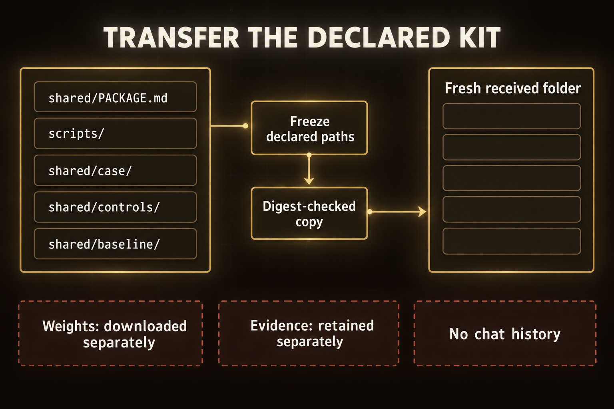

# Module 10 · Stand up a local uncensored AI and hand it off

Stand up the pinned uncensored model on your own laptop as a loopback-only service, prove one live interaction through it, stop and restore it, then hand the complete kit to a colleague who repeats the run without you. OMP does the heavy lifting: it drafts the launch line, drives the bring-up steps, and produces the package fields, while the adapter scripts verify every claim the package makes.

The model is `orcarouter/OrcaSAQ-2-Cyber-27B-Uncensored-GGUF`, a 15.7 GB uncensored build. Its refusal direction was removed, so it will answer bluntly and apply no judgment of its own. Every boundary in this lab is yours to hold, not the model's.

Plan for 3 hours on Thursday. This is a planning allowance, not a measured completion guarantee. The recipient's attempt takes place outside the facilitated hours. If no recipient is available, record independent-person operation as unobserved, not passed.

## Start here

1. [Stand the service up and transfer it](shared/MODULE_10_LAB.md) end to end.
2. Read the [service rules](shared/case/SERVICE_RULES.md) before the first launch.
3. Transfer the [runnable package](shared/PACKAGE.md) only after your own run is complete.

*Transfer only the declared, digest-checked files; the recipient downloads weights separately, and evidence and conversation history stay outside the kit.*

Figure text

The declared kit contains `shared/PACKAGE.md` (instructions), `scripts/` (adapters), `shared/case/` (case and rules), `shared/controls/` (active control), and `shared/baseline/` (baseline). Freeze the declared paths, then make a digest-checked copy into a fresh received folder. Only those declared members travel along the copy path. The recipient downloads the weights separately; local run evidence is retained separately, and chat history does not travel with the kit. The stop receipt is not a copied package member.

## Bounded use

The service binds `127.0.0.1` only. The weights stay on this laptop under your own account: no re-upload, no sharing the endpoint, no serving another person's traffic. Prompts and replies are recorded by the harness in your evidence directory. This kit is a bounded local service, not a deployment, and a completed run authorizes nothing beyond its own evidence bundle.
