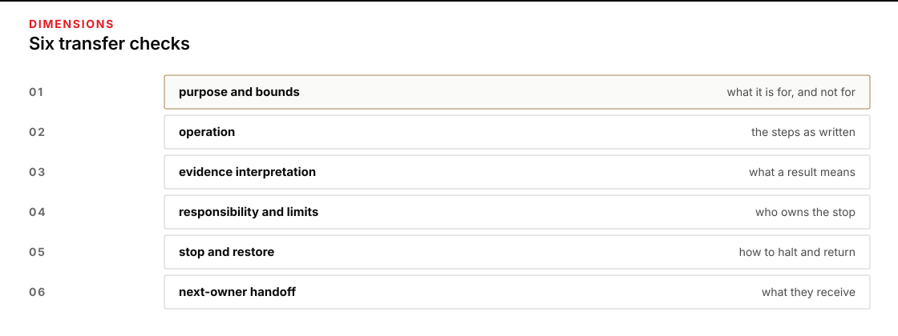

# Module 10 · Transfer a runnable package

Give the Last Count closing desk a package another person can run, stop, and restore without your chat history. First check that the saved files work from a fresh terminal and location. Then observe another person using them, keeping their questions and any assistance separate from your own rerun.

Last Count carries oral rehydration salts from South Store to Clinic R-12 on movement W-9. The requirement names 120 sachets at decision time 2026-10-16T18:00:00Z. All times are UTC. The work is class-only.

Plan for about two and a half hours on Thursday to prepare and check the package. That is a rough estimate, not a measured time. The recipient's attempt takes place outside the four course days. If no recipient is available, record independent-person operation as unobserved, not passed.

## Start here

1. [Prepare and transfer the runnable package](shared/MODULE_10_LAB.md) for the closing desk.
2. Use the [public desk rules](shared/case/DESK_RULES.md) to distinguish destination custody from usable quantity.

*Check purpose and bounds, operation, evidence, responsibility and limits, stop and restore, and next-owner handoff.*

Figure text

Check that the recipient can recover the purpose and bounds, operate the package, interpret its evidence, explain responsibility and limits, stop and restore, and identify the next owner.

## Class-only boundary

All names, gates, and hours are fictional course fixtures. Do not use this packet to plan, authorize, dispatch, or describe a real movement. A module result permits only class review.
