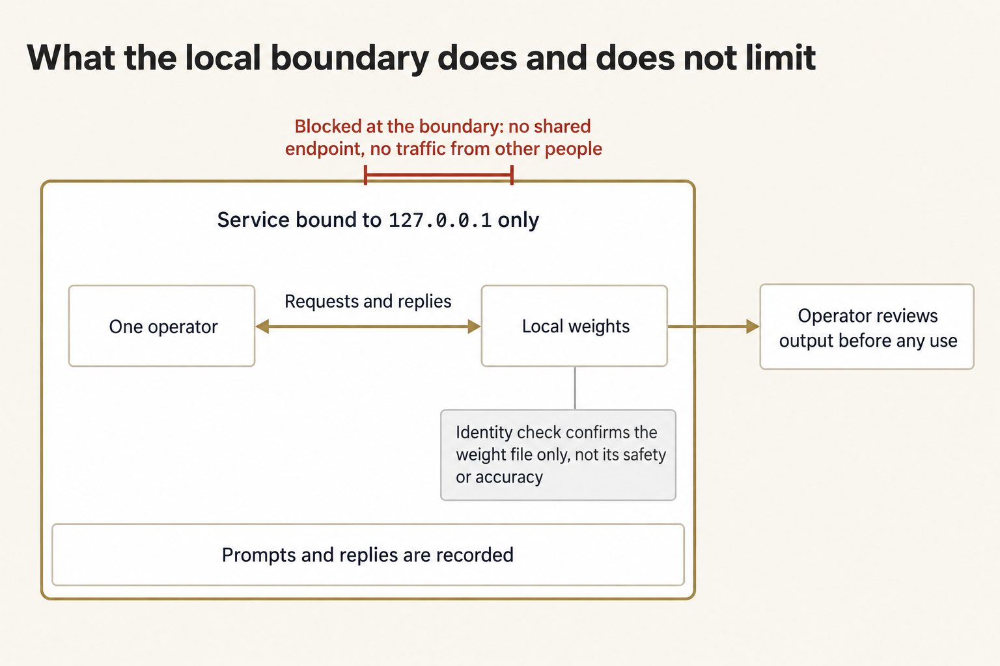
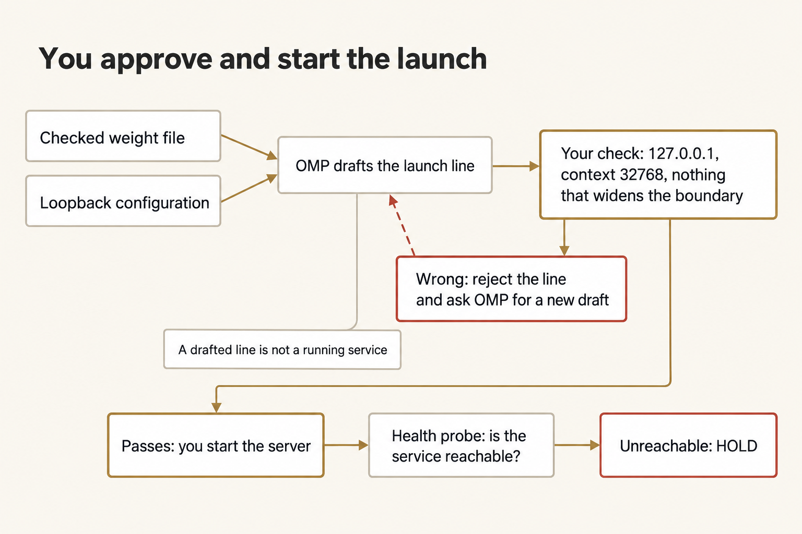
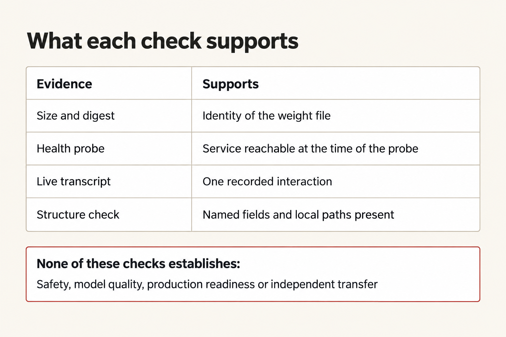
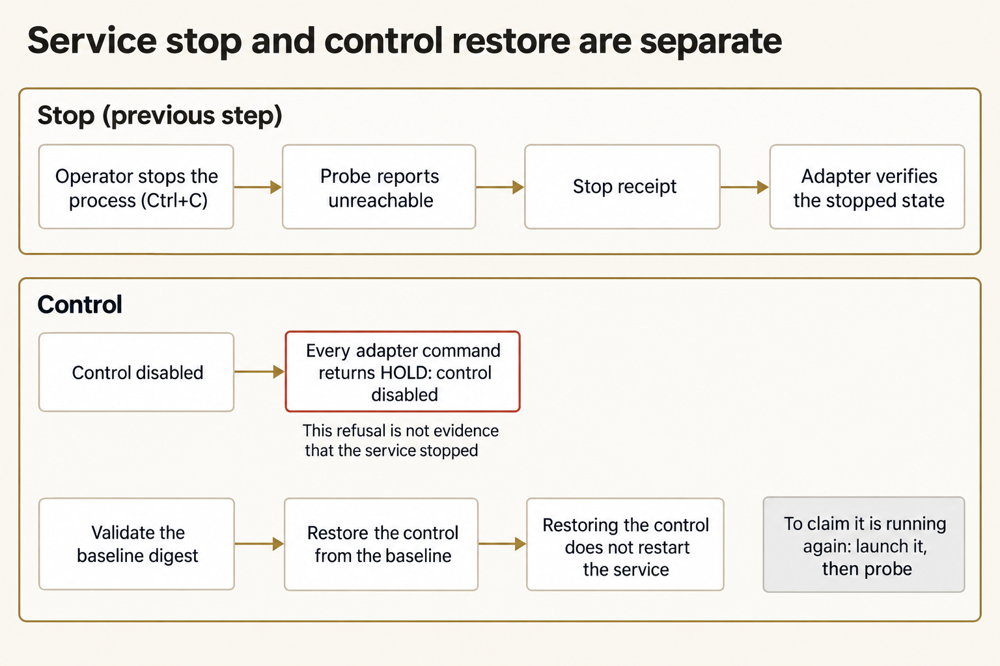
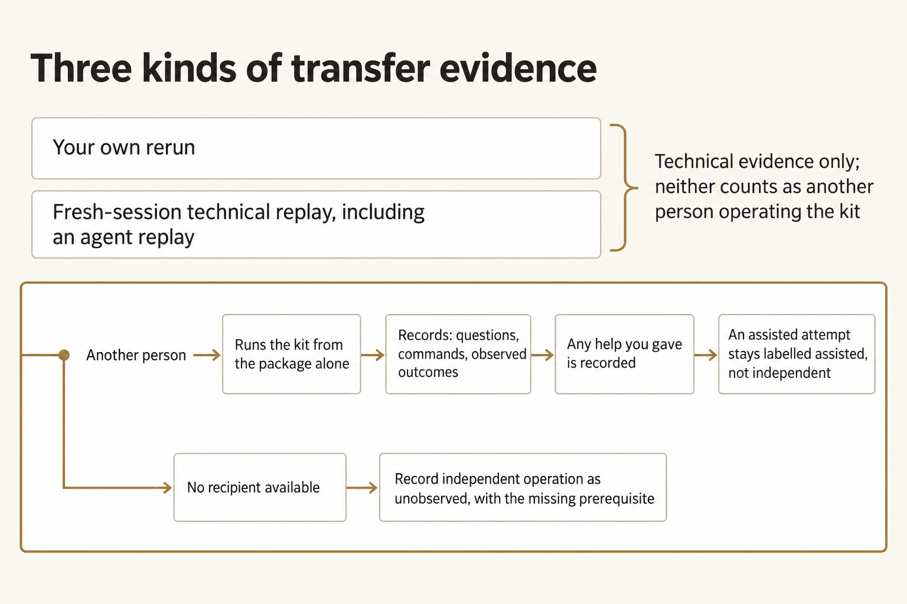

# Module 10 · Stand up a local uncensored AI and hand it off

Build the smallest kit of files and instructions that lets a colleague bring the pinned uncensored model up as a loopback-only service, prove one live interaction, stop it, and restore it, all without your chat history. Freeze only the declared bundle, copy it to a new location, and run from a new terminal. Keep your own rerun separate from watching another person use the kit.

The pinned model is `orcarouter/OrcaSAQ-2-Cyber-27B-Uncensored-GGUF`, one 15.7 GB weight file. Its refusal direction was removed: it answers bluntly and doesn't apply its own judgment. The service binds only to `127.0.0.1`, the weights stay on this laptop, and the harness records your prompts.

Plan for about three hours on Thursday (a rough estimate). Your recipient's attempt happens outside class hours.
## Prepare separate work and transfer locations

Use the checkout and Python you verified in [setup](../../module-00-setup/README.md). `W` is your work copy for the kit; `E` is the evidence folder; `F` is the received package location. Commands work from any directory. Don't create `F` until the transfer step.

**Terminal: Bash or zsh, ordinary user.**

```bash
R="$HOME/Documents/AIHB_OCT_2026"
PY="$(for candidate in python3.12 python3 python; do "$candidate" -c 'import sys; sys.exit(1) if sys.version_info < (3, 12) else print(sys.executable)' 2>/dev/null && break; done)"
[ -n "$PY" ] || echo 'HOLD: Python 3.12 or newer is required.' >&2
M="$R/AI_Harness_Bootcamp_2/module-10-capstone"
RUN="$(date -u +%Y%m%dT%H%M%SZ)-$$"
mkdir -p "$HOME/course-evidence" && printf '%s\n' "$RUN" > "$HOME/course-evidence/module-10-run" && printf 'RUN=%s\n' "$RUN"
BASE="$HOME/course-evidence/module-10-$RUN"
W="$BASE/work"
E="$BASE/evidence"
F="$BASE/received package"
"$PY" "$R/shared/prepare_work.py" 10 "$W" &&
"$PY" -c "from pathlib import Path; import sys; e,f=map(Path,sys.argv[1:]); (f.exists() or f.is_symlink()) and sys.exit('HOLD: received destination exists'); e.mkdir(); print('EVIDENCE',e); print('FRESH DESTINATION',f)" "$E" "$F"
```

**Terminal: PowerShell, ordinary user.**

```powershell
$R = "$HOME\Documents\AIHB_OCT_2026"
$PY = $(foreach ($candidate in 'python3.12','python3','python') { try { $resolved = & $candidate -c 'import sys; sys.exit(1) if sys.version_info < (3,12) else print(sys.executable)' 2>$null; if ($LASTEXITCODE -eq 0 -and $resolved) { $resolved.Trim(); break } } catch {} })
if (-not $PY) { throw 'HOLD: Python 3.12 or newer is required.' }
$M = "$R/AI_Harness_Bootcamp_2/module-10-capstone"
$RUN = [guid]::NewGuid().ToString('N')
New-Item -ItemType Directory -Force -Path "$HOME/course-evidence" | Out-Null; Set-Content -LiteralPath "$HOME/course-evidence/module-10-run" -Value $RUN; "RUN=$RUN"
$BASE = "$HOME/course-evidence/module-10-$RUN"
$W = "$BASE/work"
$E = "$BASE/evidence"
$F = "$BASE/received package"
& $PY "$R/shared/prepare_work.py" 10 "$W"
if ($LASTEXITCODE -ne 0) { throw 'Preparation held; preserve this attempt.' }
& $PY -c "from pathlib import Path; import sys; e,f=map(Path,sys.argv[1:]); (f.exists() or f.is_symlink()) and sys.exit('HOLD: received destination exists'); e.mkdir(); print('EVIDENCE',e); print('FRESH DESTINATION',f)" "$E" "$F"
```

**Expected:** `RUN=` and this attempt's identifier (note it down), then `PASS: created` followed by the work path. The block prints `EVIDENCE` and `FRESH DESTINATION` with their paths. `W` holds the case, control, baseline, package, and script files. `E` exists beside it, and the received-package folder printed after `FRESH DESTINATION` doesn't exist yet.

**Stop:** A destination exists, a prerequisite is missing, or preparation fails.

**Recovery:** Keep the first attempt, fix the prerequisite, and use a new `RUN`. Don't reset the checkout or reuse a half-prepared received folder.

### If you open a new terminal

A closed terminal forgets these variables. In a new terminal, run this block to reload them for the same attempt instead of preparing another one.

**Terminal: Bash or zsh, ordinary user.**

```bash
R="$HOME/Documents/AIHB_OCT_2026"
PY="$(for candidate in python3.12 python3 python; do "$candidate" -c 'import sys; sys.exit(1) if sys.version_info < (3, 12) else print(sys.executable)' 2>/dev/null && break; done)"
[ -n "$PY" ] || echo 'HOLD: Python 3.12 or newer is required.' >&2
RUN="$(cat "$HOME/course-evidence/module-10-run")"
M="$R/AI_Harness_Bootcamp_2/module-10-capstone"
BASE="$HOME/course-evidence/module-10-$RUN"
W="$BASE/work"
E="$BASE/evidence"
F="$BASE/received package"
printf '%s\n' "RUN=$RUN" "W=$W"
```

**Terminal: PowerShell, ordinary user.**

```powershell
$R = "$HOME\Documents\AIHB_OCT_2026"
$PY = $(foreach ($candidate in 'python3.12','python3','python') { try { $resolved = & $candidate -c 'import sys; sys.exit(1) if sys.version_info < (3,12) else print(sys.executable)' 2>$null; if ($LASTEXITCODE -eq 0 -and $resolved) { $resolved.Trim(); break } } catch {} })
if (-not $PY) { throw 'HOLD: Python 3.12 or newer is required.' }
$RUN = (Get-Content -LiteralPath "$HOME/course-evidence/module-10-run" -Raw).Trim()
$M = "$R/AI_Harness_Bootcamp_2/module-10-capstone"
$BASE = "$HOME/course-evidence/module-10-$RUN"
$W = "$BASE/work"
$E = "$BASE/evidence"
$F = "$BASE/received package"
"RUN=$RUN"; "W=$W"
```

**Expected:** The terminal prints `RUN=` followed by the identifier you saw when you prepared this attempt, then `W=` followed by the existing work folder.

**Stop:** The identifier differs from the one you recorded, or the folder named after `W=` does not exist.

**Recovery:** A different identifier means a later attempt overwrote the saved marker; set `RUN` by hand to the value you recorded and run the block again. A missing folder means the attempt was never prepared, so prepare it with the first block.

## Read the boundary before the first launch

Open these files in your editor: `W/shared/case/SERVICE_RULES.md`, `W/shared/case/model-card.json`, `W/shared/case/task.json`, `W/shared/case/hostile-note.md`, and `W/shared/PACKAGE.md`.

In `E/pre-run.md`, record the pinned model identity, the byte size, the license, the base model, and the loopback bind. Explain what the identity check proves and what it doesn't. Quote the community note's two suggestions, the `0.0.0.0` bind and the skipped digest check, and say why neither carries any authority here. Name what the uncensored model won't do for you: refuse, warn, or apply judgment.



*Loopback limits network reach, and the identity check identifies the checked weight file; neither establishes the model's safety, accuracy, or fitness for publication.*

<details markdown="1">
<summary>Figure text</summary>

The service boundary is `127.0.0.1` only. Inside it, one operator exchanges requests and replies with the local weights, and prompts and replies are recorded. Output from the local weights goes to the operator, who reviews output before any use; it does not go straight to publishing. Two things are blocked at the boundary: no shared endpoint, and no traffic from other people. A separate note attached to the local weights says that the identity check confirms the weight file only, not its safety or accuracy.

</details>

**Expected:** Every material statement in your notes points to a file and line. The only facts you operate from are the loopback bind and the pinned identity.

**Stop:** A rule is unclear, you're treating the note as guidance, or the boundary feels optional.

**Recovery:** Reopen `SERVICE_RULES.md` and the note. The boundary doesn't bend for anyone, including you.

## Gain account access and download the pinned weights

Log in to Hugging Face, open the pinned repository page, and accept its conditions. The download is 15.7 GB and resumes if interrupted.

**Terminal: Bash or zsh, ordinary user.**

```bash
hf auth login
hf download orcarouter/OrcaSAQ-2-Cyber-27B-Uncensored-GGUF --include "OrcaSAQ-2-27B-Uncensored.gguf" --local-dir "$W/weights"
```

**Terminal: PowerShell, ordinary user.**

```powershell
hf auth login
hf download orcarouter/OrcaSAQ-2-Cyber-27B-Uncensored-GGUF --include "OrcaSAQ-2-27B-Uncensored.gguf" --local-dir "$W/weights"
```

**Expected:** One file, `OrcaSAQ-2-27B-Uncensored.gguf`, at exactly 15,676,553,472 bytes when complete. Record the account name in `E/pre-run.md`; never record a token.

**Stop:** You haven't accepted the conditions, the download is interrupted, or the byte size differs.

**Recovery:** Run `hf download` again; it picks up where it stopped. Never accept a file of the wrong size, and don't continue until you've accepted the conditions.

## Verify the pinned identity

**Terminal: Bash or zsh, ordinary user.**

```bash
cd "$W" && "$PY" scripts/local_ai.py verify --model weights/OrcaSAQ-2-27B-Uncensored.gguf --control shared/controls/run.json
```

**Terminal: PowerShell, ordinary user.**

```powershell
Set-Location -LiteralPath $W
& $PY scripts/local_ai.py verify --model weights/OrcaSAQ-2-27B-Uncensored.gguf --control shared/controls/run.json
```

**Expected:** `PASS: pinned weight identity verified` with the identity card: model id, weight file, exact size, digest, license, and base model.

**Stop:** The adapter names a size or digest mismatch.

**Recovery:** Download the file again and re-verify. Never edit `model-card.json` or force a pass. After this step, return to the attempt folder with `cd "$BASE"`.

## Wire OMP to the loopback service

**Terminal: Bash or zsh, ordinary user.**

```bash
cd "$W" && "$PY" scripts/local_ai.py wire --port 8080 --control shared/controls/run.json --work-dir . && cd "$BASE"
```

**Terminal: PowerShell, ordinary user.**

```powershell
Set-Location -LiteralPath $W
& $PY scripts/local_ai.py wire --port 8080 --control shared/controls/run.json --work-dir .
Set-Location -LiteralPath $BASE
```

**Expected:** `WIRED loopback service at 127.0.0.1:8080` and the two outputs `omp-local.yml` and `omp-launch.json`. The overlay names no address other than `127.0.0.1`. Read `omp-launch.json`; it records the exact OMP command line (argv) for the live interaction.

**Stop:** The adapter refuses the port, the outputs already exist, or the control is disabled.

**Recovery:** The refusal gives the reason. Keep the existing outputs; never overwrite them.

## Bring the service up under OMP orchestration

Open OMP in `W` and give it the brief below. Check the line it proposes against the pinned boundary before you run it.



*OMP drafts the launch line, but you check it against the pinned boundary and start the server; reachability is a separate probe.*

<details markdown="1">
<summary>Figure text</summary>

1. Checked weight file and loopback configuration feed OMP drafts the launch line.
2. Your check: 127.0.0.1, context 32768, nothing that widens the boundary.
3. Wrong: reject the line and ask OMP for a new draft. A drafted line is not a running service.
4. Passes: you start the server.
5. Health probe: is the service reachable? Unreachable: HOLD.

</details>

```text
Read shared/case/SERVICE_RULES.md, shared/case/model-card.json, and shared/case/task.json.
Draft the exact llama-server launch line for the pinned weight file: loopback bind on port 8080, context 32768, no other flags that widen the boundary. Print the line and each flag's purpose. Do not run it yourself; I approve and run it.
```

Check the proposed line against `SERVICE_RULES.md`: the host must be `127.0.0.1`, the context must be 32768, and nothing else may widen the boundary. Run the approved line in a terminal you keep just for the server (if it's a new terminal, run the block under "If you open a new terminal" there first):


**Terminal: Bash or zsh, ordinary user.**

```bash
llama-server -m "$W/weights/OrcaSAQ-2-27B-Uncensored.gguf" --host 127.0.0.1 --port 8080 -c 32768
```


**Terminal: PowerShell, ordinary user.**
```powershell
llama-server -m "$W\weights\OrcaSAQ-2-27B-Uncensored.gguf" --host 127.0.0.1 --port 8080 -c 32768
```

Loading takes a few minutes on most laptops. When the server says loading is complete, check that it's reachable from a second terminal (run the block under "If you open a new terminal" there first):


**Terminal: Bash or zsh, ordinary user.**

```bash
cd "$W" && "$PY" scripts/local_ai.py probe --port 8080 --control shared/controls/run.json && cd "$BASE"
```


**Terminal: PowerShell, ordinary user.**
```powershell
Set-Location -LiteralPath $W
& $PY scripts/local_ai.py probe --port 8080 --control shared/controls/run.json
Set-Location -LiteralPath $BASE
```

**Expected:** The probe prints `PASS: local service reachable on loopback`. Record the load time and the probe result in `E/pre-run.md`.

**Stop:** The proposed line binds anything except `127.0.0.1`, loading fails, or the probe reports the service unreachable.

**Recovery:** If the bind is wrong, reject the drafted line and ask again. If loading failed, free some memory and probe again. Don't change the bind address or the context.

## Prove one live interaction



*Each check supports a narrow claim; neither a health probe nor a package-structure pass proves model quality or another person's operation.*

<details markdown="1">
<summary>Figure text</summary>

Each kind of evidence supports one narrow claim. None ranks above the others:

- Size + digest → weight identity.
- Health probe → reachable at probe time.
- Live transcript → recorded interaction.
- Structure check → named fields + local paths.

None of these checks establishes any of the following: not safety, not model quality, not production readiness, and not independent transfer.

</details>

Run the exact command recorded in `omp-launch.json`:

**Terminal: Bash or zsh, ordinary user.**

```bash
cd "$W" && omp --model llama.cpp/OrcaSAQ-2-27B-Uncensored --config omp-local.yml --no-session --no-title --no-skills --no-rules --no-extensions --no-lsp --no-prewalk --mode json -p "Answer in one sentence: what are you?" > "$E/live-interaction.jsonl"; cd "$BASE"
```

**Terminal: PowerShell, ordinary user.**

```powershell
Set-Location -LiteralPath $W
omp --model llama.cpp/OrcaSAQ-2-27B-Uncensored --config omp-local.yml --no-session --no-title --no-skills --no-rules --no-extensions --no-lsp --no-prewalk --mode json -p "Answer in one sentence: what are you?" > "$E/live-interaction.jsonl"
Set-Location -LiteralPath $BASE
```

**Expected:** The saved stream contains a real assistant reply, names `llama.cpp` as the provider, and reports zero cost. A refusal would be surprising from this model; the failure to watch for is a connection failure.

**Stop:** A context-size refusal or connection failure appears.

**Recovery:** Probe again, then retry once. If the context is exceeded, leave the server context at the pinned value; don't widen it.

## Observe the uncensored behaviour

Ask the model for one deliberately blunt answer and save the exchange to `E/observations.md`. The model won't refuse or warn you; the guardrail is you. Record what you wouldn't put your name on, and why.

**Expected:** A saved exchange where the model answers without refusing, and the boundary you've set on using its output.

**Stop:** The exchange isn't saved, or your note reads like an endorsement of unlimited use.

**Recovery:** Save the transcript first, then write the boundary.

## Stop the service and prove the stopped state

Stop the server with Ctrl+C in its terminal. Then prove it's stopped and record that:


**Terminal: Bash or zsh, ordinary user.**

```bash
cd "$W" && "$PY" scripts/local_ai.py probe --port 8080 --control shared/controls/run.json && cd "$BASE"
```


**Terminal: PowerShell, ordinary user.**
```powershell
Set-Location -LiteralPath $W
& $PY scripts/local_ai.py probe --port 8080 --control shared/controls/run.json
Set-Location -LiteralPath $BASE
```

**Expected:** The probe exits 1 with `HOLD: service is not reachable`; the service is down.

Write a stop receipt in `W` that names the port and the action:


**Terminal: Bash or zsh, ordinary user.**

```bash
"$PY" -c "import json; print(json.dumps({'action':'stop','port':8080,'stopped_by':'operator Ctrl+C at the server terminal'}))" > "$W/stop-receipt.json" && cat "$W/stop-receipt.json"
```


**Terminal: PowerShell, ordinary user.**
```powershell
"$PY" -c "import json; print(json.dumps({'action':'stop','port':8080,'stopped_by':'operator Ctrl+C at the server terminal'}))" > "$W/stop-receipt.json"; Get-Content "$W/stop-receipt.json"
```

Then confirm it:


**Terminal: Bash or zsh, ordinary user.**

```bash
cd "$W" && "$PY" scripts/local_ai.py stop --port 8080 --control shared/controls/run.json --receipt stop-receipt.json && cd "$BASE"
```


**Terminal: PowerShell, ordinary user.**
```powershell
Set-Location -LiteralPath $W
& $PY scripts/local_ai.py stop --port 8080 --control shared/controls/run.json --receipt stop-receipt.json
Set-Location -LiteralPath $BASE
```

**Expected:** `PASS: service is stopped and unreachable on loopback`. Copy the receipt to `E/`.

**Stop:** The probe still reports the service reachable, or the receipt doesn't name this port.

**Recovery:** Stop the server process and probe again. Never record a stop that didn't happen.

## Disable the control and prove the refusal

Turn off the active control, try each adapter command, then restore the control from the validated baseline:



*The operator stops the process; the adapter verifies the stopped state. Restoring an enabled control does not itself restart the service.*

<details markdown="1">
<summary>Figure text</summary>

Stopping the service and the control are separate.

Stopping, from the step before: the operator stops the process → the probe reports unreachable → stop receipt → the adapter verifies the stopped state. The operator ends the process; the adapter only verifies that it stopped.

Control: control disabled → every adapter command returns `HOLD: control disabled`. The disabled-control check runs before anything else, so this refusal is not a health observation and cannot prove the service stopped. Only the stop evidence shows that. Separately: validate the baseline digest → restore the control from that baseline.

Restoring the control does not restart the service automatically, and a restored control is not evidence of a running service. To claim the service is running again, launch it and probe it again.

</details>


**Terminal: Bash or zsh, ordinary user.**

```bash
"$PY" -c "from pathlib import Path; import json; Path('$W/shared/controls/run.json').write_text(json.dumps({'enabled': False})+'\n')" && cd "$W" && "$PY" scripts/local_ai.py probe --port 8080 --control shared/controls/run.json; cd "$BASE"
```


**Terminal: PowerShell, ordinary user.**
```powershell
& $PY -c "from pathlib import Path; import json; Path('$W/shared/controls/run.json').write_text(json.dumps({'enabled': False})+'\n')"
Set-Location -LiteralPath $W
& $PY scripts/local_ai.py probe --port 8080 --control shared/controls/run.json
Set-Location -LiteralPath $BASE
```

**Expected:** `HOLD: control disabled` and exit 1 for every adapter command; no command acts while the control is off.

Restore the control from the baseline by running the package's own restore commands again, then confirm the wire outputs are unchanged before you go on.

**Stop:** Any adapter command acts while the control is disabled, or the baseline digest fails.

**Recovery:** Keep the refusal as evidence. Restore only from the validated baseline.

## Freeze the declared bundle before copying

Keep only the ten files the package declares. Don't add the weights, evidence, repository, private material, or chat history. Record each file's digest in `E` outside `W`:

**Terminal: Bash or zsh, ordinary user.**

```bash
"$PY" - "$W" "$E" <<'PY'
from pathlib import Path
import hashlib, json, sys
w,e = map(Path,sys.argv[1:])
names = ['shared/PACKAGE.md','scripts/local_ai.py','scripts/check_package.py','shared/case/model-card.json','shared/case/SERVICE_RULES.md','shared/case/task.json','shared/case/hostile-note.md','shared/controls/run.json','shared/baseline/run.json','shared/baseline/run.json.sha256']
files = {name:hashlib.sha256((w/name).read_bytes()).hexdigest() for name in names}
record = {'files':files,'stop_receipt_sha256':hashlib.sha256((w/'stop-receipt.json').read_bytes()).hexdigest()}
with (e/'bundle-before.json').open('x',encoding='utf-8') as output:
    json.dump(record,output,indent=2,sort_keys=True)
print('FROZEN BUNDLE',len(files),'files')
PY
```

**Terminal: PowerShell, ordinary user.**

```powershell
@'
from pathlib import Path
import hashlib, json, sys
w,e = map(Path,sys.argv[1:])
names = ['shared/PACKAGE.md','scripts/local_ai.py','scripts/check_package.py','shared/case/model-card.json','shared/case/SERVICE_RULES.md','shared/case/task.json','shared/case/hostile-note.md','shared/controls/run.json','shared/baseline/run.json','shared/baseline/run.json.sha256']
files = {name:hashlib.sha256((w/name).read_bytes()).hexdigest() for name in names}
record = {'files':files,'stop_receipt_sha256':hashlib.sha256((w/'stop-receipt.json').read_bytes()).hexdigest()}
with (e/'bundle-before.json').open('x',encoding='utf-8') as output:
    json.dump(record,output,indent=2,sort_keys=True)
print('FROZEN BUNDLE',len(files),'files')
'@ | & $PY - "$W" "$E"
```

**Expected:** `FROZEN BUNDLE 10 files`, and a new record, `E/bundle-before.json`, with ten path/digest pairs and the stop receipt's digest.

**Stop:** A file is missing, a record already exists, or the set differs from the package's declared inputs.

**Recovery:** Correct the bundle and freeze again into a new record; never overwrite the old one.

## Copy only the frozen members

Leave the weights out; your colleague downloads them under their own account and checks them against the pinned identity. Copy the files with digest checks against the record in `E/bundle-before.json`:


**Terminal: Bash or zsh, ordinary user.**

```bash
"$PY" - "$W" "$F" "$E/bundle-before.json" <<'PY'
from pathlib import Path
import hashlib, json, shutil, sys
w,f,record_path = map(Path,sys.argv[1:])
w = w.resolve()
record = json.loads(record_path.read_text())
if f.exists() or f.is_symlink() or f.resolve().is_relative_to(w):
    raise SystemExit('HOLD: received destination exists or overlaps work')
for name,digest in record['files'].items():
    source = w/Path(name)
    if not source.resolve().is_relative_to(w):
        raise SystemExit('HOLD: escaping bundle path: '+name)
    if hashlib.sha256(source.read_bytes()).hexdigest()!=digest:
        raise SystemExit('HOLD: frozen source changed: '+name)
f.mkdir(parents=True,exist_ok=False)
for name,digest in record['files'].items():
    target = f/name
    target.parent.mkdir(parents=True,exist_ok=True)
    shutil.copyfile(w/name,target)
    if hashlib.sha256(target.read_bytes()).hexdigest()!=digest:
        raise SystemExit('HOLD: copied bytes differ: '+name)
print('FRESH PACKAGE',f.resolve())
print('NO WEIGHTS COPIED')
PY
```

**Terminal: PowerShell, ordinary user.**

```powershell
@'
from pathlib import Path
import hashlib, json, shutil, sys
w,f,record_path = map(Path,sys.argv[1:])
w = w.resolve()
record = json.loads(record_path.read_text())
if f.exists() or f.is_symlink() or f.resolve().is_relative_to(w):
    raise SystemExit('HOLD: received destination exists or overlaps work')
for name,digest in record['files'].items():
    source = w/Path(name)
    if not source.resolve().is_relative_to(w):
        raise SystemExit('HOLD: escaping bundle path: '+name)
    if hashlib.sha256(source.read_bytes()).hexdigest()!=digest:
        raise SystemExit('HOLD: frozen source changed: '+name)
f.mkdir(parents=True,exist_ok=False)
for name,digest in record['files'].items():
    target = f/name
    target.parent.mkdir(parents=True,exist_ok=True)
    shutil.copyfile(w/name,target)
    if hashlib.sha256(target.read_bytes()).hexdigest()!=digest:
        raise SystemExit('HOLD: copied bytes differ: '+name)
print('FRESH PACKAGE',f.resolve())
print('NO WEIGHTS COPIED')
'@ | & $PY - "$W" "$F" "$E/bundle-before.json"
```

**Expected:** `FRESH PACKAGE` followed by the destination path, then `NO WEIGHTS COPIED`. The destination holds only the declared bundle; the weights are left out on purpose.

**Stop:** The destination exists, a frozen source changed, or the weights were copied.

**Recovery:** Keep the failed folder, and use a new destination for the corrected transfer.

## Hand the package to another person

Give your colleague the fresh folder, the pinned identity, and the boundary. Let them run from the package alone: account access, download, verify, wire, serve, probe, interact, stop, restore. Record their questions, commands, outcomes, and any help in `E/transfer-status.md`. A technical replay doesn't count as watching another person operate the kit. If no one is available, record independent-person operation as **unobserved**, along with what was missing. That isn't a pass.

If your colleague needs help, record what they did before and after it; don't relabel an assisted attempt as independent. Use their questions to improve a new version of the package, and keep the observed attempt as it was.



*Keep technical replay separate from another person's attempt, record every intervention, and mark human transfer unobserved when no recipient has operated the kit.*

<details markdown="1">
<summary>Figure text</summary>

Three separate kinds of evidence:

- Author rerun.
- Fresh-session technical replay. It is not passed by substitution: it does not count as another person's operation.
- Different person → package alone → questions / actions / outcomes → record any help → assisted stays assisted.

If there is no recipient, the different person's operation is UNOBSERVED. No agent or checker result counts as a different person's operation.

</details>

## Close the session

In `E/close-out.md`, record the verified identity, the live interaction, the stop receipt, the restore comparison, and the transfer status. State plainly which parts ran and which didn't. Then shut the service down if it's still running, and keep the evidence bundle for staff review.
