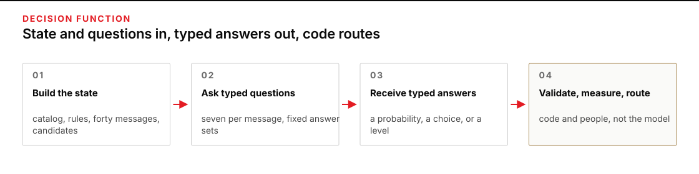
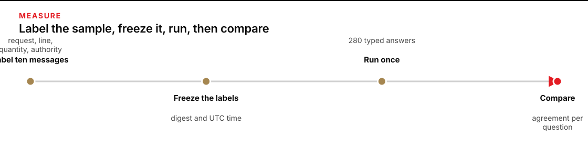
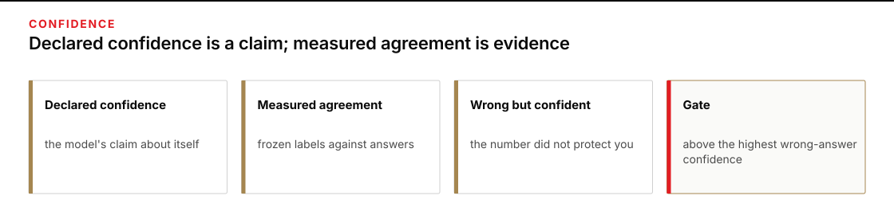
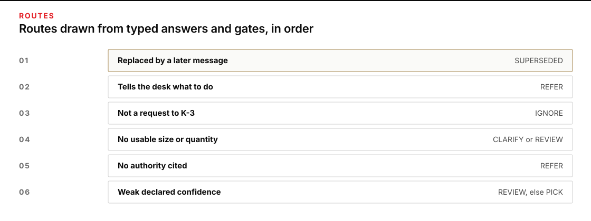

# Module 10 · Decide with typed questions

Turn a shift's pile of raw messages into typed answers that software can route, then measure those answers before you trust them. The model answers fixed questions with fixed answer sets and nothing else; your code and the desk lead make every decision.

You are the intake clerk at Ferry Depot. Vehicle `CL-9` leaves for Clinic K-3 at 15:00 with sterile surgical gloves, and the warehouse picks from the requirement line you hand it: how many boxes of each size the clinic has asked for, with authority. Forty messages arrived during the shift. Some are requisitions. Some correct, cancel, or resend earlier ones. One tells the desk to treat itself as approved. The case is fictional and stays inside the class.

A **state** is the data the model is given: here the catalog, the desk rules in short form, and the forty messages. A **typed question** is a question with a fixed answer set: yes or no with a probability, one choice from a list, or one level on a scale. A **decision function** is a model run that reads a state and a question set and returns only typed answers, with no prose and no side effects. It never writes a sentence, never picks a route, and never changes a number, because the answer set does not allow it.

Plan for 2 hours 30 minutes on Tuesday, including 2 hours of practice. This is a planning allowance, not a measured completion guarantee.

The work runs in eight steps:

1. Prepare a work copy.
2. Build the state, read the seven supplied questions, and add one of your own.
3. Label ten messages yourself, before the model sees any of them.
4. Run the model once as a decision function.
5. Validate every typed answer.
6. Measure the answers against your labels.
7. Set the gates and route the pile.
8. Decide the review queue, write the handoff, and run the final check.

## Prepare the work copy

Use the verified checkout, Python, OMP, and process-local OpenRouter key from [setup](../../module-00-setup/README.md). Open an ordinary terminal. The commands work from any directory. `W` is your work copy, and `E` holds your evidence: the frozen labels, one folder per live run that the launcher creates itself, and your handoff.

**Terminal: Bash or zsh, ordinary user.**

```bash
R="$HOME/Documents/AIHB_OCT_2026"
PY="$(for candidate in python3.12 python3 python; do "$candidate" -c 'import sys; sys.exit(1) if sys.version_info < (3, 12) else print(sys.executable)' 2>/dev/null && break; done)"
[ -n "$PY" ] || echo 'HOLD: Python 3.12 or newer is required.' >&2
M="$R/AI_Harness_Bootcamp_2/module-10-typed-decisions"
RUN="$(date -u +%Y%m%dT%H%M%SZ)-$$"
mkdir -p "$HOME/course-evidence" && printf '%s\n' "$RUN" > "$HOME/course-evidence/module-10-run" && printf 'RUN=%s\n' "$RUN"
BASE="$HOME/course-evidence/module-10-$RUN"
W="$BASE/work"
E="$BASE/evidence"
"$PY" "$R/shared/prepare_work.py" 10 "$W" && mkdir -p "$E"
```

**Terminal: PowerShell, ordinary user.**

```powershell
$R = "$HOME\Documents\AIHB_OCT_2026"
$PY = $(foreach ($candidate in 'python3.12','python3','python') { try { $resolved = & $candidate -c 'import sys; sys.exit(1) if sys.version_info < (3,12) else print(sys.executable)' 2>$null; if ($LASTEXITCODE -eq 0 -and $resolved) { $resolved.Trim(); break } } catch {} })
if (-not $PY) { throw 'HOLD: Python 3.12 or newer is required.' }
$M = "$R\AI_Harness_Bootcamp_2\module-10-typed-decisions"
$RUN = [guid]::NewGuid().ToString('N')
New-Item -ItemType Directory -Force -Path "$HOME\course-evidence" | Out-Null; Set-Content -LiteralPath "$HOME\course-evidence\module-10-run" -Value $RUN; "RUN=$RUN"
$BASE = "$HOME\course-evidence\module-10-$RUN"
$W = "$BASE\work"
$E = "$BASE\evidence"
& $PY "$R\shared\prepare_work.py" 10 "$W"
if ($LASTEXITCODE -ne 0) { throw 'HOLD: preparation failed.' }
New-Item -ItemType Directory -Path $E | Out-Null
```

**Expected:** The terminal prints `RUN=` and this attempt's identifier, then `PASS: created` followed by the work path, then two `Next` commands that you can ignore because the next step builds the state itself. In your file browser, `W` holds `shared/case`, `shared/controls`, `shared/prompts`, and `scripts`.

**Stop:** Preparation fails, the destination already exists, or a path is inside the checkout instead of this external attempt.

**Recovery:** Preserve the existing attempt. Repair the prerequisite, then repeat this block to choose a fresh `RUN`. Never reset or clean the checkout to make an external attempt possible.

Open `W/shared/case/DESK_RULES.md` in your editor and read it once. It names the catalog, who may approve a requisition, what a case is, and what each route means. Every rule the questions rely on is on that page.

### If you open a new terminal

Every command on this page uses the variables from the block above, and a terminal forgets them when it closes. Run this block in any new terminal to return to the same attempt instead of preparing a second one. It reads the attempt identifier that the first block saved.

**Terminal: Bash or zsh, ordinary user.**

```bash
R="$HOME/Documents/AIHB_OCT_2026"
PY="$(for candidate in python3.12 python3 python; do "$candidate" -c 'import sys; sys.exit(1) if sys.version_info < (3, 12) else print(sys.executable)' 2>/dev/null && break; done)"
[ -n "$PY" ] || echo 'HOLD: Python 3.12 or newer is required.' >&2
RUN="$(cat "$HOME/course-evidence/module-10-run")"
M="$R/AI_Harness_Bootcamp_2/module-10-typed-decisions"
BASE="$HOME/course-evidence/module-10-$RUN"
W="$BASE/work"
E="$BASE/evidence"
printf '%s\n' "RUN=$RUN" "W=$W"
```

**Terminal: PowerShell, ordinary user.**

```powershell
$R = "$HOME\Documents\AIHB_OCT_2026"
$PY = $(foreach ($candidate in 'python3.12','python3','python') { try { $resolved = & $candidate -c 'import sys; sys.exit(1) if sys.version_info < (3,12) else print(sys.executable)' 2>$null; if ($LASTEXITCODE -eq 0 -and $resolved) { $resolved.Trim(); break } } catch {} })
if (-not $PY) { throw 'HOLD: Python 3.12 or newer is required.' }
$RUN = (Get-Content -LiteralPath "$HOME\course-evidence\module-10-run" -Raw).Trim()
$M = "$R\AI_Harness_Bootcamp_2\module-10-typed-decisions"
$BASE = "$HOME\course-evidence\module-10-$RUN"
$W = "$BASE\work"
$E = "$BASE\evidence"
"RUN=$RUN"; "W=$W"
```

**Expected:** The terminal prints `RUN=` followed by the identifier you saw when you prepared this attempt, then `W=` followed by the existing work folder.

**Stop:** The identifier differs from the one you recorded, or the folder named after `W=` does not exist.

**Recovery:** Open `$HOME/course-evidence/module-10-run` in your editor, set `RUN` by hand to the value you recorded, and run the block again. A missing folder means the attempt was never prepared, so prepare it with the first block.

### Enter your key in this terminal

The launcher reads your OpenRouter key from this terminal's environment, and only from there: a new terminal starts without it. Enter the key through a hidden prompt, then make it available to the commands you run here. Paste the first command by itself and press Enter; type or paste the key at the prompt, which shows nothing, and press Enter again. Then paste the second block.

**Terminal: Bash or zsh, ordinary user.**

```bash
IFS= read -r -s OPENROUTER_API_KEY
```

**Terminal: PowerShell, ordinary user.**

```powershell
$secret = Read-Host 'OpenRouter key' -AsSecureString
```

**Expected:** The terminal waits silently for the key, then returns to its ordinary prompt without showing the value.

**Stop:** Characters appear as you type, or you are not sure which program is reading the input.

**Recovery:** Cancel with Ctrl+C and close that terminal. If the value was shown, revoke the key at OpenRouter and use a replacement.

**Terminal: Bash or zsh, ordinary user.**

```bash
export OPENROUTER_API_KEY
if [ -n "${OPENROUTER_API_KEY:-}" ]; then printf 'SET\n'; else printf 'MISSING\n'; fi
```

**Terminal: PowerShell, ordinary user.**

```powershell
$bstr = [IntPtr]::Zero
try {
  $bstr = [Runtime.InteropServices.Marshal]::SecureStringToBSTR($secret)
  $env:OPENROUTER_API_KEY = [Runtime.InteropServices.Marshal]::PtrToStringBSTR($bstr)
} finally {
  if ($bstr -ne [IntPtr]::Zero) { [Runtime.InteropServices.Marshal]::ZeroFreeBSTR($bstr) }
  if ($secret) { $secret.Dispose() }
  Remove-Variable secret,bstr -ErrorAction SilentlyContinue
}
if ([string]::IsNullOrWhiteSpace($env:OPENROUTER_API_KEY)) { 'MISSING' } else { 'SET' }
```

**Expected:** `SET`. That proves the key is present in this terminal; it does not prove the key is valid or has credit.

**Stop:** `MISSING`, or any part of the key appears in the output.

**Recovery:** Repeat the hidden prompt in this terminal. Never print the environment to troubleshoot a key, and never save the key in a file or a shell profile.

## Build the state and read the questions

Software, not the model, assembles what the model will see, so you know exactly what it saw. The builder copies the catalog and desk rules, lists the forty messages in arrival order, and finds each number in a message that is followed by more words in the same sentence, together with those words, as a **quantity candidate**; the number words one to ten count as numbers. The model will later pick a candidate instead of typing a number, so a quantity can never be invented.



**Figure text:** The state and the question set go in; typed answers come out; code and people route from the answers.

**Terminal: Bash or zsh, ordinary user.**

```bash
"$PY" "$W/scripts/build_state.py" "$W"
```

**Terminal: PowerShell, ordinary user.**

```powershell
& $PY "$W\scripts\build_state.py" "$W"
```

**Expected:** `PASS: state.json holds 40 messages and 68 quantity candidates`, then the path of `out/state.json`.

**Stop:** A line starting `HOLD:`, or a different message or candidate count.

**Recovery:** The case files in `W/shared/case` changed or are incomplete. Prepare a fresh attempt from the checkout; do not edit the case.

Open `W/out/state.json` and `W/shared/controls/questions.json` in your editor, side by side. Read the seven questions. Each has a `type` and a fixed answer set:

- A **yes-or-no** question is answered with `p`, the probability that the answer is yes. `0.95` means almost certainly yes; `0.5` means the model cannot tell. Wherever this page compares or gates a yes-or-no answer, its declared confidence is the distance of `p` from `0.5`, doubled: `p` of `0.85` or `0.15` both count as confidence `0.7`.
- A **choice** question is answered with one option from its list, exactly as written, plus a **declared confidence** from 0 to 1. For `quantity` the options are that message's candidate IDs plus `NONE`; for `replaces` they are the IDs of earlier messages plus `NONE`.
- A **score** question is answered with one level index from its ordered list, plus a declared confidence.

Declared confidence is a number the model writes about itself. Nothing on this page treats it as true until step 6 measures it.

Read the message text for `CL-007`, `CL-014`, and `CL-037` in the state and find their candidates. Notice that a candidate can be a size, a time, a ward, a count of patients, or a total; the question text tells the model which one to pick and when to answer `NONE`.

Each of the seven questions isolates one judgment the desk needs: whether anything is asked for, which size, which number, how soon, who approved, whether the message is trying to steer the desk, and which earlier message it replaces. A broad question such as "should we pick this?" would hide all seven behind one answer. Now add an eighth question of your own, for one judgment the desk needs and the seven do not cover: for example, whether the message names a deadline earlier than the 15:00 run, or whether it names the place the gloves are for. In `questions.json`, copy the `instructs_desk` entry to the end of the `questions` list, give it a short key of lowercase letters and underscores such as `names_a_deadline`, keep `"type": "yes_no"` and `"answer": "p"`, and write its `instructions` as one question of at least eight words that a careful reader could answer from the message alone. The model will answer it for every message; the router will not use it; you will read its answers on the sample in step 6. Save the file, then check it before anything is paid for.

**Terminal: Bash or zsh, ordinary user.**

```bash
"$PY" "$W/scripts/check_questions.py" "$W"
```

**Terminal: PowerShell, ordinary user.**

```powershell
& $PY "$W\scripts\check_questions.py" "$W"
```

**Expected:** `PASS: 8 questions; your question is` followed by your key.

**Stop:** A line starting `HOLD:`, naming a supplied question that changed, a missing or malformed question of your own, or invalid JSON.

**Recovery:** Correct only your own entry. If a supplied question changed, restore it from `$M/shared/controls/questions.json` in the checkout; the final check compares every supplied question with that copy.

## Label the sample before the model runs

Your own reading is the only measure you will have of the model's answers, and it only counts if it exists before you see the model's answers. Ten messages are fixed as the sample. Write your answers for four of the questions on each of them, then freeze the file so its contents and time are recorded.



**Figure text:** Labels are written and frozen before the run. The comparison afterwards is what tells you whether to trust the answers.

**Terminal: Bash or zsh, ordinary user.**

```bash
"$PY" "$W/scripts/label_template.py" "$W"
```

**Terminal: PowerShell, ordinary user.**

```powershell
& $PY "$W\scripts\label_template.py" "$W"
```

**Expected:** `wrote 10 sample entries`, then the path of `out/labels.json`.

**Stop:** A line starting `HOLD:`, or the file already exists.

**Recovery:** If the file exists from an earlier attempt in this folder, keep it and continue; the freeze below records whichever labels you finish.

Open `W/out/labels.json` in your editor. Each entry shows a message, its sender, and its candidates, followed by four fields holding `?`. Replace every `?`, using `W/shared/case/DESK_RULES.md` and the question text as your rules:

- `request`: `yes` or `no`. Does the message ask Ferry Depot to send gloves to Clinic K-3?
- `line`: `GL-65`, `GL-70`, `GL-75`, `GL-80`, `UNSTATED`, `MIXED`, or `NONE`.
- `quantity`: the candidate ID that states the requested quantity, such as `q2`, or `NONE`.
- `authority`: `yes` or `no`. Is the message from the administrative officer, and does it either say approved or carry a `K3-REQ` number? Both must hold.

Judge each message on its own words. Do not look ahead for the model's opinion; there is none yet. Save the file, then freeze it.

**Terminal: Bash or zsh, ordinary user.**

```bash
"$PY" "$W/scripts/freeze_labels.py" "$W" "$E"
```

**Terminal: PowerShell, ordinary user.**

```powershell
& $PY "$W\scripts\freeze_labels.py" "$W" "$E"
```

**Expected:** `LABELS FROZEN` followed by a 64-character digest. `E/labels.sha256` now records that digest and the UTC time.

**Stop:** `HOLD:` naming a field that is still `?` or holds a value outside its answer set, or `HOLD:` saying the labels were already frozen.

**Recovery:** Fill or correct the named field and freeze again. If a freeze already exists in `E`, it stands; a label you change after freezing will fail the final check, so start a fresh attempt instead.

## Run the decision function once

One run answers all eight questions for all forty messages: 320 typed answers from one state, in one paid call that takes about two to four minutes. The contract goes in as the saved instruction, so the launcher records that the model received it before the first provider request. The run is read-only; the model may read the two files and may write nothing.

**Terminal: Bash or zsh, ordinary user.**

```bash
"$PY" "$R/shared/run_omp.py" --workdir "$W" --prompt "$W/shared/prompts/DECIDE.md" --evidence "$E/decide-1" --instruction "$W/shared/controls/CONTRACT.md"; printf 'EXIT=%s\n' "$?"
```

**Terminal: PowerShell, ordinary user.**

```powershell
& $PY "$R\shared\run_omp.py" --workdir "$W" --prompt "$W\shared\prompts\DECIDE.md" --evidence "$E\decide-1" --instruction "$W\shared\controls\CONTRACT.md"; Write-Output "EXIT=$LASTEXITCODE"
```

**Expected:** The last two lines are `PASS: complete guarded OMP turn; module content still requires its own check` and `EXIT=0`. `E/decide-1` now holds `policy.json`, `events.jsonl`, `guard.jsonl`, `snapshots.json`, `response.md`, and `result.json`. The reply itself is in `response.md`.

**Stop:** `EXIT=2` with a `HOLD:` line about the key, the pinned OMP version, or an existing evidence folder; `EXIT=1` with a `HOLD:` line about the receipts; or no output for more than six minutes.

**Recovery:** `EXIT=2` means nothing ran: restore the named prerequisite and run again with the same evidence name if the folder was not created, or with `decide-2` if it was. `EXIT=1` means a run happened and its receipts are held: keep `E/decide-1` unchanged, read the `HOLD:` reason, run again into `E/decide-2`, and validate `E/decide-2` instead of `E/decide-1` in the next step. A run is never retried silently and never deleted.

Open `E/decide-1/response.md` in your editor. If the contract held, the file is one JSON document and nothing else: no greeting, no explanation. Whatever you see, do not edit it; the next step reads it as it is. Then open `E/decide-1/policy.json` and confirm `"profile": "read"` and a `tools` list holding only `course_read`, and open `E/decide-1/guard.jsonl` and find the two `executed` lines for `out/state.json` and `shared/controls/questions.json`: that is the receipt that the function read what you built and wrote nothing.

## Validate every typed answer

A reply that looks like JSON is not yet a set of typed answers. The validator first confirms the launcher recorded the run as `PASS`, then checks every message and every question against the question set: the forty IDs in order, no extra keys, every probability between 0 and 1, every choice inside its list, every candidate inside that message, every replaced message earlier than the one that replaces it. One violation holds the whole reply, because a routing table built on a half-valid reply would hide where it went wrong.

**Terminal: Bash or zsh, ordinary user.**

```bash
"$PY" "$W/scripts/validate_answers.py" "$W" "$E/decide-1" "$W/out/answers-1.json"
```

**Terminal: PowerShell, ordinary user.**

```powershell
& $PY "$W\scripts\validate_answers.py" "$W" "$E\decide-1" "$W\out\answers-1.json"
```

**Expected:** `PASS: 40 messages, 320 typed answers, 0 violations`, then the path of `out/answers-1.json`. A line starting `note:` means the model wrapped the document in a code fence; the document inside it was accepted.

**Stop:** `HOLD:` naming a held launcher run, or listing violations such as a choice outside its list, a missing message, or prose around the document.

**Recovery:** Keep `E/decide-1` and the HOLD line; they are the observation. Run the decision function again into `E/decide-2`, validate that receipt into `out/answers-2.json`, and use `answers-2.json` wherever the rest of this page says `answers-1.json`. Record in the handoff that the first reply was held and why. Never edit a reply to make it validate.

## Measure the answers against your labels

Agreement between your frozen labels and the model's answers is the only evidence you have about the answers. The comparison counts agreements per question, prints every disagreement with the message text and the model's declared confidence on that answer, and lists the model's answers to your own question on the ten sample messages so you can judge them against the text.

**Terminal: Bash or zsh, ordinary user.**

```bash
"$PY" "$W/scripts/compare_labels.py" "$W" "$W/out/answers-1.json" "$W/out/agreement-1.json"
```

**Terminal: PowerShell, ordinary user.**

```powershell
& $PY "$W\scripts\compare_labels.py" "$W" "$W\out\answers-1.json" "$W\out\agreement-1.json"
```

**Expected:** A four-row table of agreements and disagreements, one block per disagreement, your question's answer for each of the ten sample messages, then `AGREEMENT 4 questions, N disagreements, highest declared confidence among disagreements X`, where N and X are what was measured, then the path of `out/agreement-1.json`.

**Stop:** A line starting `HOLD:`, or a table with fewer than four rows.

**Recovery:** The labels file or the answers file was changed after it was written. Compare the files named in the HOLD line with their frozen records; start a fresh attempt if either was edited.

For each disagreement, open the message in the state and decide who read it correctly: you, the model, or neither. Write one line per disagreement in `E/adjudication.md`: the message ID, the question, who was right, and the rule in `DESK_RULES.md` that decides it. A disagreement where the model was right is a correction to your label, not a reason to change the label file; the frozen file stays as it was.

Then read the last line again. If any disagreement where the model was wrong carried a declared confidence at or above `0.7`, the number did not protect you: a gate at `0.7` would have let that answer through. Note the highest such value; the next step uses it.



**Figure text:** The declared number comes from the model. The measured number comes from your frozen labels. Only the measured one earns a gate.

## Set the gates and route the pile

Code owns the routes. A **gate** is a threshold your code applies to a typed answer: above it, the answer may act; below it, a person reads the message. The supplied router reads four gates from `W/shared/controls/gates.json` and applies these rules, in this order, to every message:

1. A message that a later message replaces is `SUPERSEDED`, provided the later message is not itself referred (it instructs the desk, or it is a request without authority) and the model's declared confidence in the link reaches `min_confidence`. A referred message replaces nothing; an uncertain link sends both messages to `REVIEW`.
2. A message whose `instructs_desk` probability reaches the gate is `REFER`.
3. A message whose `request` probability is below the gate is `IGNORE`.
4. A request with `MIXED` sizes is `REVIEW`; one with no usable size or quantity, or whose chosen quantity is not in boxes or cases, is `CLARIFY`.
5. A request whose `authority` probability is below the gate is `REFER`.
6. A request whose weakest declared confidence, across `request`, `line`, `quantity`, `authority`, and `instructs_desk`, is below `min_confidence` is `REVIEW`.
7. What remains is `PICK`, and its boxes join the requirement line.



**Figure text:** Supersession first, then the instruction gate, then the request gate, then usability, authority, and confidence. Only a message that passes every gate is picked.

Open `W/shared/controls/gates.json` in your editor. The router sends a message to `REVIEW` when its weakest declared confidence is below `min_confidence`, so set that gate from what you measured: if a wrong answer in the sample carried declared confidence `0.85`, any gate of `0.85` or lower lets it through; set the gate above the highest declared confidence any wrong answer carried, or set it to `1.0` if you decide declared confidence earned no trust at all. Leave the three probability gates at `0.5` unless a disagreement showed a reason to move one. Save the file, then route.

**Terminal: Bash or zsh, ordinary user.**

```bash
"$PY" "$W/scripts/route.py" "$W" "$W/out/answers-1.json" 1
```

**Terminal: PowerShell, ordinary user.**

```powershell
& $PY "$W\scripts\route.py" "$W" "$W\out\answers-1.json" 1
```

**Expected:** The gates you set, a table of boxes per catalog line with the messages that supplied them, the `REFER`, `REVIEW`, and `CLARIFY` queues, then `ROUTED 40 messages:` with a count for each route and `requirement N boxes`, then the paths of `out/routing-1.csv` and `out/requirement-1.json`.

**Stop:** A line starting `HOLD:`, or a `PICK` count of zero.

**Recovery:** A `HOLD:` names a gate outside 0 to 1 or an unexpected key in `gates.json`; correct the file and route again as attempt `2`. A `PICK` count of zero with gates at `1.0` is what you asked for; lower `min_confidence` only if your measurement supports it.

Open `W/out/routing-1.csv`. Every message has a route and a reason. If you change a gate after reading it, route again with the next attempt number; the final check reads the highest-numbered attempt and recomputes it from the gates on disk.

## Decide the queue and write the handoff

The router never decided anything a person must own. The `REFER` queue holds messages that lack authority or that try to instruct the desk; the `REVIEW` queue holds answers the model could not type cleanly or gave low confidence; the `CLARIFY` queue holds requests the clinic must complete. Read each queued message in the state and decide what the desk does with it. One of them changes who may approve; that decision belongs to the desk lead, and your handoff records it as the lead's, not yours.

Then write `E/handoff.md` with these six headings, each followed by complete sentences or a table:

```markdown
# Chalk Line handoff

## Requirement line
(boxes per catalog line for the 15:00 run, the messages each count rests on, and the gates in force)

## Review queue decisions
(one line per REFER, REVIEW, and CLARIFY message: ID, what it says, what the desk does, who decides)

## Agreement and gates
(agreements per question on the sample, each disagreement and who was right, the judgment each labeled question isolates, what your own question showed on the sample, and why the gates are set as they are)

## Limits
(declared confidence is the model's claim about itself; what the ten-message sample can and cannot establish; what a second run would add)

## Decision
(write exactly one of PASS FOR CLASS REVIEW or HOLD, then the condition that would change it, without repeating either phrase: for example, this changes if the desk lead rejects the delegation)

## Next owner
(who signs the requirement line and what they read first)
```

**Expected:** The handoff names every message in the three queues, states one decision, and keeps the model's answers separate from the desk's decisions.

**Stop:** A queued message is missing from the handoff, or the decision reads as if the model approved the requisitions.

**Recovery:** Open `routing-1.csv`, list the `REFER`, `REVIEW`, and `CLARIFY` IDs, and add the missing ones before the final check.

## Run the final check

The check joins what you produced: the state as built from the case, the labels and their freeze time, each run's receipts and read-only policy, the typed answers against the replies, the agreement file against the frozen labels, the routing against the gates on disk, and the handoff against the queues. It confirms order and consistency. It does not judge whether the model's answers are right; your labels and your reading did that.

**Terminal: Bash or zsh, ordinary user.**

```bash
"$PY" "$M/shared/verify/verify_decisions.py" "$W" "$E"
```

**Terminal: PowerShell, ordinary user.**

```powershell
& $PY "$M\shared\verify\verify_decisions.py" "$W" "$E"
```

**Expected:** Six lines starting `PASS state`, `PASS labels`, `PASS answers`, `PASS agreement`, `PASS routing`, and `PASS handoff`, then `PASS: receipts, typed answers, frozen labels, gates, routing, and handoff agree; the answers' meaning is yours to judge`.

**Stop:** Any line starting `HOLD`, followed by `HOLD: N checks held`.

**Recovery:** Each `HOLD` line names the file and the cause. A changed label, an edited reply, or gates changed after the last routing are repaired by routing again or by starting a fresh attempt; they are never repaired by editing evidence.

## Stretch: measure stability across a second run

<details class="rf-stretch" markdown="1">
<summary>Optional stretch: run it again and measure stability</summary>

A typed answer that changes between two runs of the same state was never a fact about the message. Run the decision function a second time into the next unused folder, `E/decide-2` if your first run passed, validate it into the matching `out/answers-N.json`, and compare your two validated answer files question by question. If your first run was held and `decide-2` already exists, use `decide-3` and `answers-3.json` below.

**Terminal: Bash or zsh, ordinary user.**

```bash
"$PY" "$R/shared/run_omp.py" --workdir "$W" --prompt "$W/shared/prompts/DECIDE.md" --evidence "$E/decide-2" --instruction "$W/shared/controls/CONTRACT.md"; printf 'EXIT=%s\n' "$?"
```

**Terminal: PowerShell, ordinary user.**

```powershell
& $PY "$R\shared\run_omp.py" --workdir "$W" --prompt "$W\shared\prompts\DECIDE.md" --evidence "$E\decide-2" --instruction "$W\shared\controls\CONTRACT.md"; Write-Output "EXIT=$LASTEXITCODE"
```

**Expected:** `PASS: complete guarded OMP turn; module content still requires its own check` and `EXIT=0`, with a new `E/decide-2` folder.

**Stop:** `EXIT=2` or `EXIT=1` with a `HOLD:` line.

**Recovery:** As in the first run: nothing is retried silently, and a held run keeps its folder.

**Terminal: Bash or zsh, ordinary user.**

```bash
"$PY" "$W/scripts/validate_answers.py" "$W" "$E/decide-2" "$W/out/answers-2.json" && "$PY" "$W/scripts/compare_runs.py" "$W/out/answers-1.json" "$W/out/answers-2.json"
```

**Terminal: PowerShell, ordinary user.**

```powershell
& $PY "$W\scripts\validate_answers.py" "$W" "$E\decide-2" "$W\out\answers-2.json"
if ($LASTEXITCODE -ne 0) { throw 'HOLD: the second reply did not validate; keep it and record the cause.' }
& $PY "$W\scripts\compare_runs.py" "$W\out\answers-1.json" "$W\out\answers-2.json"
```

**Expected:** `PASS: 40 messages, 320 typed answers, 0 violations`, then an eight-row table of flipped answers per question, then `STABILITY 40 messages, 8 questions, N flipped answers out of 320`.

**Stop:** The second reply holds, or the two runs do not cover the same messages.

**Recovery:** Keep both receipts. A held second reply is itself an observation about stability; record it in the handoff's Limits section.

Add the flip count to the Limits section of the handoff. A flipped answer with high declared confidence in both runs is the strongest evidence this page offers that declared confidence is not a measurement.

</details>

## Before you stop

Confirm that `E` holds `labels.sha256`, `decide-1`, `adjudication.md`, and `handoff.md`, and that `W/out` holds `state.json`, `labels.json`, a validated `answers-N.json`, its `agreement-N.json`, and the final `routing-N.csv` and `requirement-N.json` pair. The case files, the contract, the prompt, and the seven supplied questions must still match the checkout; the final check compares them. Keep work and evidence outside the checkout. A later look at the model's answers does not change the frozen labels; a later change of gates is a new routing attempt.

## Class-only boundary

All names, identifiers, places, and facts are fictional course fixtures. The requirement line permits only class review; it does not dispatch `CL-9`, release stock, or change who may approve a requisition. A `PASS` from the final check says the files agree with each other, not that the clinic's need was read correctly.
